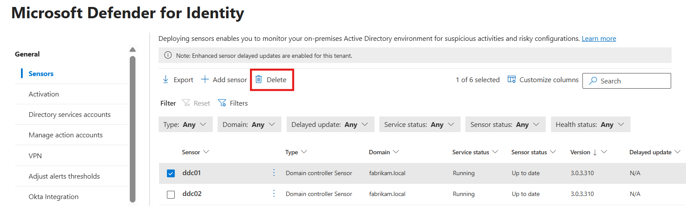
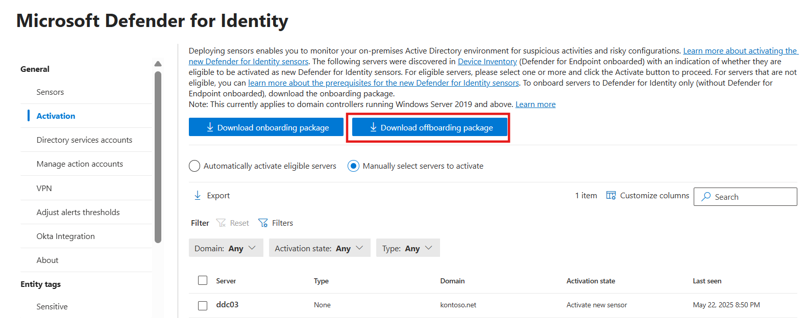

# Activate Microsoft Defender for Identity capabilities on a domain controller (Preview)


Microsoft Defender for Endpoint customers who have already onboarded their domain controllers can now activate Defender for Identity capabilities directly on a domain controller instead of the [deploying a separate Defender for Identity sensor](deploy-defender-identity.md).

We recommend activating this sensor, built in to the Windows Server 2019 and later, for customers who want to deploy core identity protections to new domain controllers running Windows Server 2019 or later. For all other identity infrastructures, or for customers looking to deploy the most robust identity protections available from Microsoft Defender for Identity today, we recommend [deploying the separate Defender for Identity sensor](quick-installation-guide.md).

> [!IMPORTANT]
> The sensor described in this article cannot be installed with an existing Defender for Identity sensor.

The sensor activated on domain controllers supports the following Defender for Identity functionalities, and is not intended to be a replacement as for the classic sensor deployed on Windows Server 2016 and earlier and Microsoft AD FS, AD CS, and Entra Connect.:

- Investigation features on the [ITDR dashboard](test-sensor.md#check-the-itdr-dashboard)
- [Identity inventory](test-sensor.md#confirm-entity-page-details)
- [Identity advanced hunting data](test-sensor.md#test-advanced-hunting-tables)
- [Security posture recommendations](test-sensor.md#test-identity-security-posture-management-ispm-recommendations)
- [Alert detections](test-sensor.md#test-alert-functionality)
- [Remediation actions](test-sensor.md#test-remediation-actions)
- [Automatic attack disruption](/microsoft-365/security/defender/automatic-attack-disruption)


> [!NOTE]
> The capabilities described in this article are currently available as Preview features. Preview features are features that aren't complete, but are made available on a "preview" basis so customers can get early access and provide feedback.
> Preview features are still in development, have limited or restricted functionality and may be available only in selected geographic areas.
> For more information, see the [Microsoft Defender XDR preview features](/defender-xdr/preview)


## Prerequisites

- Before activating the Defender for Identity capabilities on your domain controller make sure that the domain controller where you're planning to activate Defender for Identity capabilities doesn't have a [Defender for Identity sensor](deploy-defender-identity.md) already deployed.
- The domain controller must use one of the following operating systems:
   - Windows Server 2019 or above
   - [March 2024 Cumulative Update](https://support.microsoft.com/topic/march-12-2024-kb5035857-os-build-20348-2340-a7953024-bae2-4b1a-8fc1-74a17c68203c) or later

       > [!IMPORTANT]
       >
       > After the March 2024 Cumulative Update is installed, LSASS might experience a memory leak on domain controllers during on-premises and cloud-based Active Directory Domain Controllers service Kerberos authentication requests.
       >
       > This [out-of-band update: KB5037422](https://support.microsoft.com/en-gb/topic/march-22-2024-kb5037422-os-build-20348-2342-out-of-band-e8f5bf56-c7cb-4051-bd5c-cc35963b18f3) addresses this issue.

- Your domain controller must be onboarded to Microsoft Defender for Endpoint. For more information, see [Onboard a Windows server](/microsoft-365/security/defender-endpoint/onboard-windows-server).
- To access the Defender for Identity **Activation** page, you must either be a [Security Administrator](/entra/identity/role-based-access-control/permissions-reference), or have the following Unified RBAC permissions:
    - `Authorization and settings / System settings (Read and manage)`
    - `Authorization and settings / Security setting (All permissions)`
    For more information, see:
    - [Unified role-based access control RBAC](../role-groups.md#unified-role-based-access-control-rbac)
    - [Create a role to access and manage roles and permissions](/microsoft-365/security/defender/create-custom-rbac-roles#create-a-role-to-access-and-manage-roles-and-permissions)

## Configure Windows auditing

Defender for Identity detections rely on specific Windows Event Log entries to enhance detections and provide extra information about the users performing specific actions, such as NTLM sign-ins and security group modifications.

Configure Windows event collection on your domain controller to support Defender for Identity detections. For more information, see [Event collection with Microsoft Defender for Identity](event-collection-overview.md) and [Configure audit policies for Windows event logs](configure-windows-event-collection.md).

You might want to use the Defender for Identity PowerShell module to configure the required settings. For more information, see:
- [DefenderForIdentity Module](/powershell/module/defenderforidentity/)
- [Defender for Identity in the PowerShell Gallery](https://www.powershellgallery.com/packages/DefenderForIdentity/)

For example, the following command defines all settings for the domain, creates group policy objects, and links them.

```powershell
Set-MDIConfiguration -Mode Domain -Configuration All
```

## Onboarding for customers with domain controllers already onboarded to Defender for Endpoint 

After you complete the configuration, activate the Microsoft Defender for Identity capabilities on your domain controller.

Microsoft Defender for Endpoint customers, who have already onboarded their domain controllers to Defender for Endpoint, can activate Microsoft Defender for Identity capabilities directly on a domain controller instead of using [Microsoft Defender for Identity classic sensor](deploy-defender-identity.md).

### Activate the Defender for Identity sensor


Activate Defender for Identity from the [Microsoft Defender portal](https://security.microsoft.com).

1. Navigate to **System** > **Settings** > **Identities** > **Activation**.

   The **Activation Page** displays all servers from your device inventory, including those not currently eligible for the activation of the Defender for Identity sensor. For each server, you can find its activation state.

1. Select the domain controller where you want to activate Defender for Identity, and then select **Activate**. Confirm your selection when prompted. 

   [](media/activate-capabilities/1.jpg#lightbox)

> [!NOTE]
> You can choose to activate eligible domain controllers either automatically, where Defender for Identity activates them as soon as they're discovered, or manually, by selecting specific domain controllers from the list of eligible servers.

1. When the activation is complete, a green success banner shows. In the banner, select **Click here to see the onboarded servers** to go to the **Settings > Identities > Sensors** page, where you can check your sensor health.  

    
    [](media/activate-capabilities/2.jpg#lightbox)
   
## Onboarding for customers without domain controllers onboarded to Defender for Endpoint 

This solution uses Defender for Endpoint URL endpoints for communication, including streamlined URLs. For more information, see:
 - [Configure your network environment to ensure connectivity with Defender for Endpoint](/microsoft-365/security/defender-endpoint/configure-environment##enable-access-to-microsoft-defender-for-endpoint-service-urls-in-the-proxy-server)
 - [Configure connectivity using streamlined connection](/microsoft-365/security/defender-endpoint/configure-device-connectivity#option-1-configure-connectivity-using-the-simplified-domain).

### Download the Defender for Identity onboarding package

You can download the Defender for Identity onboarding package from the [Microsoft Defender portal](https://security.microsoft.com)

1. Navigate to **System** > **Settings** > **Identities** > **Activation**.

2. Select Download onboarding package and save the file in a location you can access from your domain controller.
1. 
   [](media/activate-capabilities/screenshot-that-shows-how-to-onboard-the-new-sensor.png#lightbox)
   
3. From the domain controller, extract the zip file you downloaded from the Microsoft Defender portal, and run the `DefenderForIdentityOnlyOnboardingScript.cmd` script as an Administrator.

   [](media/activate-capabilities/screenshot-2025-06-04-170500.png#lightbox)

## Confirm onboarding 

To confirm the sensor has been onboarded: 

1. Navigate to **System** > **Settings** > **Identities** > **Sensors**.

2. Check that the onboarded domain controller is listed. 

> [!NOTE]
> The activation doesn't require a restart/reboot. The first time you activate Defender for Identity capabilities on your domain controller, it might take up to an hour for the first sensor to show as **Running** on the **Sensors** page. Subsequent activations are shown within five minutes.

## Deactivating the Defender for Identity Sensor

### Customers with domain controllers already onboarded to Defender for Endpoint 

If you want to deactivate the Defender for Identity sensor, delete it from the **Sensors** page:

1. Navigate to **Settings** > **Identities** > **Sensors**.
1. Select the domain controller where you want to deactivate Defender for Identity capabilities, select **Delete**, and confirm your selection.

    
   
Deactivating Defender for Identity capabilities from your domain controller doesn't remove the domain controller from Defender for Endpoint. For more information, see [Defender for Endpoint documentation](/microsoft-365/security/defender-endpoint/).

### Customers without domain controllers onboarded to Defender for Endpoint 

Download the Defender for Identity offboarding package from the [Microsoft Defender portal](https://security.microsoft.com).

1. Navigate to **Settings** > **Identities** > **Activation**

1. Select Download offboarding package and save the file in a location you can access from your domain controller.  

1. From the domain controller, extract the zip file you downloaded from the Microsoft Defender portal, and run the `DefenderForIdentityOnlyOffboardingScript_valid_until_YYYY-MM-DD.cmd` script as an Administrator.
1. To fully remove the sensor, navigate to **Settings** > **Identities** > **Sensors**, select the server, and click **Delete**.

:::image type="content" source="media/activate-capabilities/screenshot-that-shows-how-to-delete-a-sensor.png" alt-text="Screenshot that shows how to delete a sensor" lightbox="media/activate-capabilities/screenshot-that-shows-how-to-delete-a-sensor.png":::


## Next steps

For more information, see [Manage and update Microsoft Defender for Identity sensors](../sensor-settings.md).
