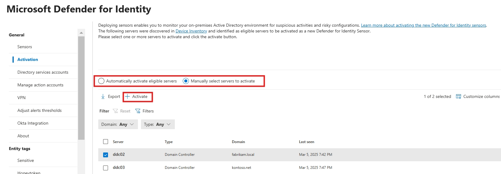
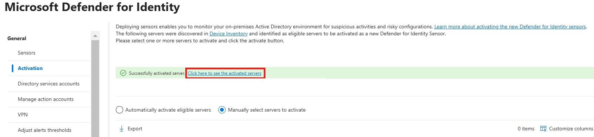
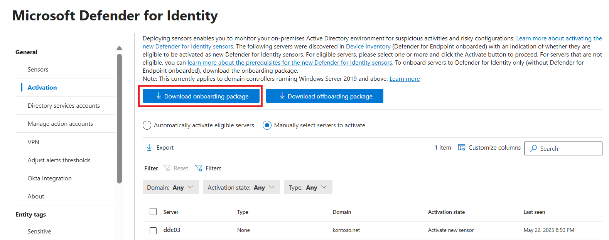

# Activate the Windows Server sensor on a domain controller (Preview)

For complete protection of your on-premises deployment, we recommend activating the Defender for Identity sensor on all applicable servers.

This article describes onboarding for new domain controllers running Windows Server 2019 or later. For domain controllers running older operating systems, we recommend [deploying the classic Defender for Identity sensor](install-sensor.md).

## Prerequisites

 - You must either be a [Security Administrator](/entra/identity/role-based-access-control/permissions-reference), or have the following [Unified RBAC](../role-groups.md#unified-role-based-access-control-rbac) permissions:
    - `System settings (Read and manage)`
    - `Security setting (All permissions)`
 - Before activating the sensor on your domain controller, make sure that the domain controller doesn't have another Defender for Identity sensor already deployed.
 - The domain controller must have both:
    - Windows Server 2019 or later
    - [March 2024 Cumulative Update](https://support.microsoft.com/topic/march-12-2024-kb5035857-os-build-20348-2340-a7953024-bae2-4b1a-8fc1-74a17c68203c) or later.

   > [!NOTE]
   > After the March 2024 Cumulative Update is installed, LSASS might experience a memory leak on domain controllers during on-premises and cloud-based Active Directory Domain Controllers service Kerberos authentication requests. [This out-of-band update: KB5037422](https://support.microsoft.com/en-gb/topic/march-22-2024-kb5037422-os-build-20348-2342-out-of-band-e8f5bf56-c7cb-4051-bd5c-cc35963b18f3) addresses this issue.
_ Your environment doesn't use Azure ExpressRoute. If your environment uses ExpressRoute,  we recommend [deploying the classic Defender for Identity sensor](install-sensor.md).

## Configure Windows auditing

Defender for Identity detections rely on specific Windows Event Log entries to enhance detections and provide extra information about the users performing specific actions, such as NTLM sign-ins and security group modifications.

Configure Windows event collection on your domain controller to support Defender for Identity detections. For more information, see [Event collection with Microsoft Defender for Identity](event-collection-overview.md) and [Configure audit policies for Windows event logs](configure-windows-event-collection.md).

You might want to use the Defender for Identity PowerShell module to configure the required settings. For example, the following command defines all settings for the domain, creates group policy objects, and links them.

```powershell
Set-MDIConfiguration -Mode Domain -Configuration All
```
For more information, see:
- [DefenderForIdentity Module](/powershell/module/defenderforidentity/)
- [Defender for Identity in the PowerShell Gallery](https://www.powershellgallery.com/packages/DefenderForIdentity/)
 
## Check the Activation State

1. In the [Microsoft Defender portal](https://security.microsoft.com), go to **System** > **Settings** > **Identities** > **Activation**.
1. The **Activation** page contains an **activation state** for each domain controller. See the **activation state** to let you know what you need to do to onboard the domain controller to Defender for Identity.

|Activation State  |Next steps  |
|---------|---------|
|Install classic sensor|[Deploy the classic Defender for Identity sensor](install-sensor.md) from the **Sensors page**.|
|Needs OS update     |This domain controller is running an unsupported operating system version for the new sensor. Update the server to Windows Server 2019 or later to use the new sensor. |
|Activate new sensor |The domain controller is already onboarded to Defender for Endpoint, and the sensor can be activated.   |
|Download the onboarding package     |Either:<br> - Onboarded the domain controller to Defender for Endpoint, and then activate the sensor, or<br>- use the Defender for Identity onboarding package to onboard. |
 

## Domain controllers onboarded to Defender for Endpoint 

Microsoft Defender for Endpoint customers who have onboarded the domain controller to Defender for Endpoint, can activate the Windows Server Defender for Identity sensor.

### Activate the Defender for Identity sensor

1. In the [Microsoft Defender portal](https://security.microsoft.com), go to **System** > **Settings** > **Identities** > **Activation**.

   The **Activation Page** displays all servers from your device inventory, and the server's activation state. You can choose to activate eligible domain controllers either automatically, where Defender for Identity activates them as soon as they're discovered, or manually, by selecting specific domain controllers from the list of eligible servers.

1. Select the domain controller where you want to activate Defender for Identity, and select **Activate**. Confirm your selection when prompted. 

   [](media/activate-capabilities/1.jpg#lightbox)

1. When the activation is complete, a green success banner shows. In the banner, select **Click here to see the onboarded servers**. This takes you to the **Sensors** page, where you can check your sensor health.

    [](media/activate-capabilities/2.jpg#lightbox)
 
## Domain controllers not onboarded to Defender for Endpoint 
The Defender for Identity sensor uses Defender for Endpoint URL endpoints for communication, including streamlined URLs. If the domain controller has not been onboarded to Defender for Endpoint, follow these steps to activate the sensor.

### Configure Defender for Endpoint streamlined URLs

1. [Configure your network environment to ensure connectivity with Defender for Endpoint](/microsoft-365/security/defender-endpoint/configure-environment##enable-access-to-microsoft-defender-for-endpoint-service-urls-in-the-proxy-server)
1. [Configure connectivity using streamlined connection](/microsoft-365/security/defender-endpoint/configure-device-connectivity#option-1-configure-connectivity-using-the-simplified-domain).

### Download the Defender for Identity onboarding package

1. In the [Microsoft Defender portal](https://security.microsoft.com), go to **System** > **Settings** > **Identities** > **Activation**.

2. Select **Download onboarding package**, and save the file in a location you can access from your domain controller.

   [](media/activate-capabilities/screenshot-that-shows-how-to-onboard-the-new-sensor.png#lightbox)
   
3. From the domain controller, extract the zip file you downloaded from the Microsoft Defender portal, and run the `DefenderForIdentityOnlyOnboardingScript.cmd` script as an administrator.

   [](media/activate-capabilities/screenshot-2025-06-04-170500.png#lightbox)

## Confirm onboarding 

To confirm the sensor is working: 

1. In the [Microsoft Defender portal](https://security.microsoft.com), go to **System** > **Settings** > **Identities** > **Sensors**.
1. Check that the onboarded domain controller is listed. 

> [!NOTE]
> The first time you activate Defender for Identity capabilities on your domain controller, it might take up to an hour for the first sensor to show as **Running** on the **Sensors** page. Subsequent activations are shown within five minutes. The activation doesn't require a restart/reboot. 

## Next steps
- [Manage and update Microsoft Defender for Identity sensors](../sensor-settings.md).
