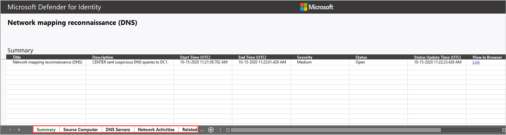
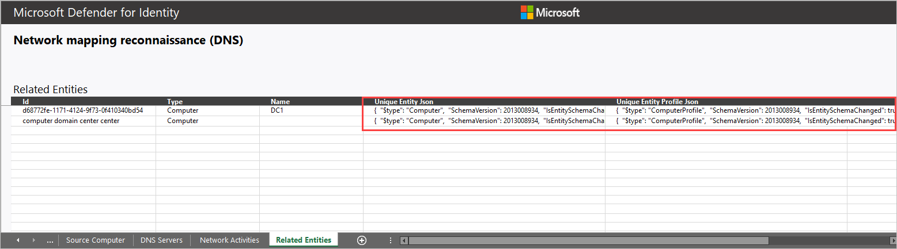

# Investigate alerts in Microsoft Defender for Identity

Investigate alerts that are affecting your environment, understand what they mean, and how to resolve them. Select an alert from the alerts queue to go to alert page. This view contains the alert title, the affected assets, the details side pane, and the alert story.

## Investigate using the alert story

Each Defender for Identity security alert includes an **Alert story**. This is the chain of events related to this alert in chronological order, and other important information related to the alert.

The alert story details why the alert was triggered and related events that happened before and after. 

## Take action from the details pane
Once you've selected an alert of interest, the details pane changes to display information about the selected alert, historic information when it's available, and offer recommended actions to take action on this alert.

Once you're done investigating, go back to the alert you started with, mark the alert's status as Resolved and classify it as either False alert or True alert. Classifying alerts helps tune this capability to provide more true alerts and less false alerts.

### How can I use Defender for Identity information in an investigation?

Investigations can be as detailed as needed. Here are some ideas of ways to investigate using the data provided by Defender for Identity.

- Check if all related users belong to the same group or department.
- Do related users share resources, applications, or computers?
- Is an account active even though its PasswordExpiryTime already passed?

## Advanced security alert investigation

To get more details on a security alert, select **Export** on an alert details page to download the detailed Excel alert report.

> [!NOTE]
> Exporting individual alerts is only supported in the classic Defender for Identity alert structure. To compare alert structures in Defender for Identity and Microsoft Defender XDR, see: [View and Manage security alerts](understanding-security-alerts.md)

The downloaded file includes summary details about the alert on the first tab, including:

- Title
- Description
- Start Time (UTC)
- End Time (UTC)
- Severity – Low/Medium/High
- Status – Open/Closed
- Status Update Time (UTC)
- View in browser

All involved entities, including accounts, computers, and resources are listed, separated by their role. Details are provided for the source, destination, or attacked entity, depending on the alert.

Most of the tabs include the following data per entity:

- Name
- Details
- Type
- SamName
- Source Computer
- Source User (if available)
- Domain Controllers
- Accessed Resource: Time, Computer, Name, Details, Type, Service.
- Related entities: ID, Type, Name, Unique Entity Json, Unique Entity Profile Json
- All raw activities captured by Defender for Identity Sensors related to the alert (network or event activities) including:

  - Network Activities
  - Event Activities

Some alerts have extra tabs, such as details about:

- Attacked accounts when the suspected attack used Brute Force.
- Domain Name System (DNS) servers when the suspected attacked involved network mapping reconnaissance (DNS).

For example:

### Related entities

In each alert, the last tab provides the **Related Entities**. Related entities are all entities involved in a suspicious activity, without the separation of the "role" they played in the alert. Each entity has two Json files, the Unique Entity Json and Unique Entity Profile Json. Use these two Json files to learn more about the entity and to help you investigate the alert.

#### Unique Entity Json file

Includes the data Defender for Identity learned from Active Directory about the account. This includes all attributes such as *Distinguished Name*, *SID*, *LockoutTime*, and *PasswordExpiryTime*. For user accounts, includes data such as *Department*, *Mail*, and *PhoneNumber*. For computer accounts, includes data such as *OperatingSystem*, *IsDomainController*, and *DnsName*.

#### Unique Entity Profile Json file

Includes all data Defender for Identity profiled on the entity. Defender for Identity uses the network and event activities captured to learn about the environment's users and computers. Defender for Identity profiles relevant information per entity. This information contributes Defender for Identity's threat identification capabilities.

For more information about how to work with Defender for Identity security alerts, see [Working with security alerts](/defender-for-identity/understanding-security-alerts).

## Related content

- [Network Name Resolution in Microsoft Defender for Identity](nnr-policy.md)
- [Reconnaissance and discovery alerts](reconnaissance-discovery-alerts.md)
- [Persistence and privilege escalation alerts](persistence-privilege-escalation-alerts.md)
