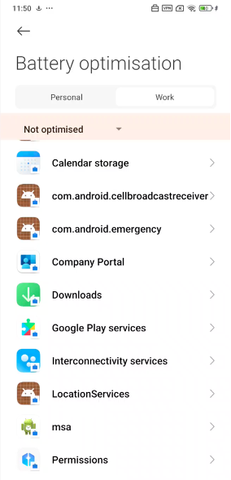
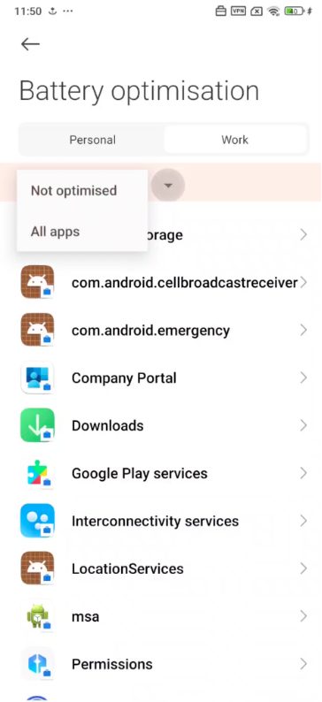
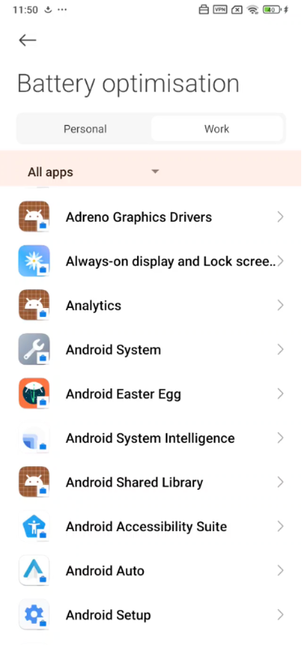
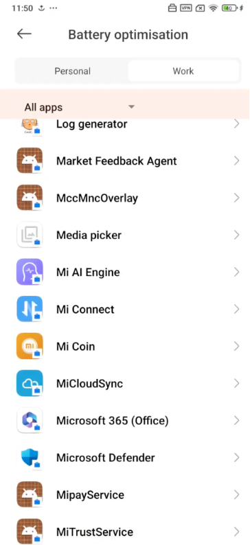
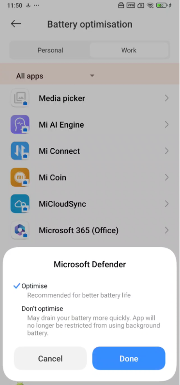

# Troubleshooting issues on Microsoft Defender for Endpoint on Android

When onboarding a device, you might see sign in issues after the app is installed.

During onboarding, you might encounter sign in issues after the app is installed on your device.

This article provides solutions to help address the sign-on issues.

## Sign in failed - unexpected error

**Sign in failed:** *Unexpected error, try later*

:::image type="content" source="media/f9c3bad127d636c1f150d79814f35d4c.png" alt-text="A screenshot showing a sign-in failed error Unexpected error in the sign-in page of the Microsoft Defender 365 portal." lightbox="media/f9c3bad127d636c1f150d79814f35d4c.png":::

**Message:**

Unexpected error, try later

**Cause:**

You have an older version of "Microsoft Authenticator" app installed on your device.

**Solution:**

Install latest version and of [Microsoft Authenticator](https://play.google.com/store/apps/details?id=com.azure.authenticator)
from Google Play Store and try again.

## Sign in failed - invalid license

**Sign in failed:** *Invalid license, contact administrator*

:::image type="content" source="media/920e433f440fa1d3d298e6a2a43d4811.png" alt-text="The directive contact details in the sign-in page of the Microsoft Defender 365 portal" lightbox="media/920e433f440fa1d3d298e6a2a43d4811.png":::

**Message:** *Invalid license, contact administrator*

**Cause:**

You don't have Microsoft 365 license assigned, or your organization doesn't have a license for Microsoft 365 Enterprise subscription.

**Solution:**

Contact your administrator for help.

## Report unsafe site

Phishing websites impersonate trustworthy websites for obtaining your personal or financial information. Visit the [Provide feedback about network protection](https://www.microsoft.com/wdsi/filesubmission/exploitguard/networkprotection) page if you want to report a website that could be a phishing site.

## Phishing pages aren't blocked on some OEM devices

**Applies to:** Specific OEMs only

- **Xiaomi**

Phishing and harmful web threats detected by Defender for Endpoint
for Android aren't blocked on some Xiaomi devices. The following functionality doesn't work on these devices.

:::image type="content" source="media/0c04975c74746a5cdb085e1d9386e713.png" alt-text="A site-unsafe notification message" lightbox="media/0c04975c74746a5cdb085e1d9386e713.png":::

**Cause:**

Xiaomi devices include a new permission model. This permission model prevents Defender for Endpoint for Android from displaying pop-up windows while it runs in the background.

Xiaomi devices permission: "Display pop-up windows while running in the background."

:::image type="content" source="media/6e48e7b29daf50afddcc6c8c7d59fd64.png" alt-text="The pop-up setting pane in the Microsoft Defender 365 portal" lightbox="media/6e48e7b29daf50afddcc6c8c7d59fd64.png":::

**Solution:**

Enable the required permission on Xiaomi devices.

- Display pop-up windows while running in the background.

## Unable to allow permission for 'Permanent protection' during onboarding on some OEM devices

**Applies to:** Specific OEM devices only.

- **Xiaomi**

Defender App asks for Battery Optimization/Permanent Protection permission on devices as part of app onboarding, and selecting **Allow** returns an error that the permission couldn't be set. It only affects the last permission called "Permanent Protection."

**Cause:**

Xiaomi changed the battery optimization permissions from Android 11 onwards. Defender for Endpoint isn't allowed to configure this setting to ignore battery optimizations.

**Solution 1:**

The Android devices Battery Optimization screen opens automatically as part of the onboarding flow where the user needs to give the permissions. The user must then follow these steps to get on-boarded:

1. Select Work Profile to see all of the work profile apps

   

1. Tap on **Not optimized** and select **All Apps**

   

   

1. Scroll down to find **Microsoft Defender** and tap on it

   

1. Select **Don't Optimize** option and tap on **Done**
   

1. Navigate back to Defender

**Solution 2** (needed in case the Solution 1 doesn't work):

1. Install the Microsoft Defender for Endpoint app in personal profile. (Sign-in isn't required.)
1. Open the Company Portal and tap on Settings.
1. Go to the Battery Optimization section, tap on the **Turn Off** button, and then select on **Allow** to turn off Battery Optimization for the Company Portal.
1. Again, go to the Battery Optimization section and tap on the **Turn On** button. The battery saver section opens.
1. Find the Defender app and tap on it.
1. Select **No Restriction**. Go back to the Defender app in work profile and tap on **Allow** button.  
1. The application shouldn't be uninstalled from personal profile for this to work.

## Unable to use certain third party applications along with the Microsoft Defender for Endpoint app (VPN)

**Applies to:** (Not limited) Apps handling banking, government services, or handling sensitive personal information

**Cause:** Some applications, such as those used for banking, government services, or handling sensitive personal information, may restrict access if a VPN is detected on your device. These restrictions are determined by the app developer as part of their implementation and even applies all VPNs *including third party on the device. Microsoft Defender doesn't control or enforce this behavior through its settings or policies.

**Workaround:**
If an app doesn't function while a VPN is enabled or present in the work profile, you might need to disable the VPN or work profile when you use the app. 
Users should enable VPN when they're no longer using the app to ensure that their devices are protected.

## Send in-app feedback

If a user faces an issue, which isn't already addressed in the above sections or is unable to resolve using the listed steps, the user can provide **in-app feedback** along with **diagnostic data**. Our team can then investigate the logs to provide the right solution. Users can follow these steps to do the same:

1. Open the **Microsoft Defender for Endpoint application** on your device and select the **profile icon** in the top-left corner.

1. Select **Help & feedback** > **Send feedback**.

    :::image type="content" source="./media/android-new-ux/bottom-experience-android.png" alt-text="Screenshots showing how to send feedback and logs from the Microsoft Defender mobile app options menu." border="false":::

1. Provide details of the issue that you're facing and check **Include diagnostic data**. We recommend selecting **Include your email address** so that the team can reach back to you with a solution or a follow-up.

1. Select on **Submit** to successfully send the feedback.