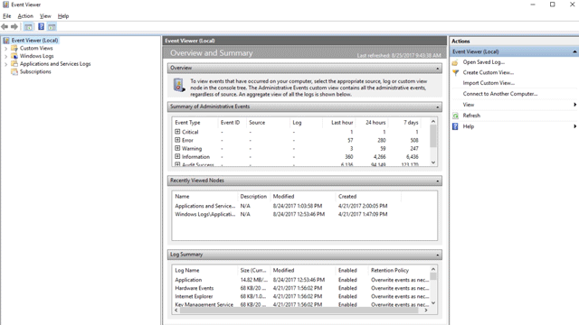

---
title: Understand attack surface reduction
ms.reviewer: niwelton, joshbregman
description: Admins can learn about the attack surface reduction capabilities of Microsoft Defender for Endpoint.
ms.service: defender-endpoint
author: chrisda
ms.author: chrisda
ms.localizationpriority: medium
audience: ITPro
ms.custom: asr
ms.topic: conceptual
ms.subservice: asr
ms.collection:
- m365-security
- tier2
- mde-asr
ms.date: 01/16/2026
search.appverid: met150
appliesto:
  - Microsoft Defender for Endpoint Plan 1
  - Microsoft Defender for Endpoint Plan 2
  - Microsoft Defender Antivirus
---

# Understand attack surface reduction in Microsoft Defender for Endpoint

_Attack surfaces_ are places where your organization is vulnerable to threats and attacks. Microsoft Defender for Endpoint includes several capabilities to help reduce your attack surface:

- [Attack surface reduction (ASR) rules for Windows](attack-surface-reduction-rules-overview.md): Configure and deploy ASR rules to block risky app behavior in supported versions of Windows.
  - [Controlled folder access](controlled-folders.md): Allow only specified trusted apps to access specified protected folders on Windows devices. In Defender for Endpoint, you configure controlled folder access in ASR rule policies.

- [Device control](device-control-overview.md): Allow or prevent connection by specified types of devices to Windows and macOS devices.

- [Network protection](network-protection.md): Prevents access to known dangerous sites.

- [Web protection](web-protection-overview.md): Secure devices against web threats and regulate unwanted content.

- [Exploit protection](exploit-protection.md): Apply exploit mitigation techniques to processes and apps in supported versions of Windows.

- [Microsoft Defender Application Guard for Microsoft Edge](/windows/security/application-security/application-isolation/microsoft-defender-application-guard/md-app-guard-overview): Admins specify trusted web sites, cloud resources, and internal networks. When a user opens an untrusted site in Microsoft Edge, the browser opens the site in an isolated Hyper-V-enabled container.


only allowing trusted apps to access protected folders. Protected folders are specified when controlled folder access is configured. Typically, commonly used folders, such as those used for documents, pictures, downloads, and so on, are included in the list of controlled folders.

Controlled folder access works with a list of trusted apps. Apps that are included in the list of trusted software work as expected. Apps that aren't included in the list are prevented from making any changes to files inside protected folders.

## Prerequisites

### Supported operating systems

- Windows

## Configure attack surface reduction capabilities

To configure attack surface reduction in your environment, do the following steps:

1. Install [Microsoft Defender Application Guard](/windows/security/threat-protection/microsoft-defender-application-guard/install-md-app-guard).

2. [Deploy attack surface reduction rules](attack-surface-reduction-rules-deployment.md).

3. Enable application control:
   1. Review base policies in Windows. For more information, see [Example Base Policies](/windows/security/threat-protection/windows-defender-application-control/example-wdac-base-policies).
   2. Consult the [Windows Defender Application Control design guide](/windows/security/threat-protection/windows-defender-application-control/windows-defender-application-control-design-guide).
   3. Refer to [Deploying Windows Defender Application Control (WDAC) policies](/windows/security/threat-protection/windows-defender-application-control/windows-defender-application-control-deployment-guide).

4. [Enable controlled folder access](enable-controlled-folders.md).

5. Enable [device control](device-control-overview.md).

6. [Turn on network protection](enable-network-protection.md).

7. Enable [Web protection](web-protection-overview.md).

8. [Enable exploit protection](enable-exploit-protection.md).

9. Set up your network firewall:
   1. Get an overview of [Windows Firewall with advanced security](/windows/security/threat-protection/windows-firewall/windows-firewall-with-advanced-security).
   2. Use the [Windows Firewall design guide](/windows/security/threat-protection/windows-firewall/windows-firewall-with-advanced-security-design-guide) to decide how you want to design your firewall policies.
   3. Use the [Windows Firewall deployment guide](/windows/security/threat-protection/windows-firewall/windows-firewall-with-advanced-security-deployment-guide) to set up your organization's firewall with advanced security.

> [!TIP]
> Typically, you can choose several methods to configure attack surface reduction capabilities:
>
> - Microsoft Intune
> - Microsoft Configuration Manager
> - Group Policy
> - PowerShell cmdlets

## Test attack surface reduction in Microsoft Defender for Endpoint

Audit mode lets you see a record of what *would* happen if the feature was enabled. Audit mode is available in the following attack surface reduction features:

- Attack surface reduction rules
- Exploit protection
- Network protection
- Controlled folder access
- Device control

Audit mode for testing helps prevent attack surface reduction from affecting your line-of-business apps. You can also track suspicious file modification attempts over a specific time period.

In audit mode, the features don't block or prevent apps, scripts, or files from being modified. But the Windows Event Log records events as if the features were fully enabled. These events are available at **Applications and Services** \> **Microsoft** \> **Windows** \> **Windows Defender** \> **Operational**.

Use Defender for Endpoint to get greater details for each event. These details are especially helpful for investigating attack surface reduction rules. Using the Defender for Endpoint console lets you [investigate issues as part of the alert timeline and investigation scenarios](investigate-alerts.md).

You can enable audit mode using Group Policy, PowerShell, and configuration service providers (CSPs).

The following table summarizes the audit options for attack surface reduction and where to view the events.

|Feature|Audit options|How to enable audit mode|How to view events|
|---|---|---|---|
|Controlled folder access|Audit applies to all events|[Enable controlled folder access](enable-controlled-folders.md)|[Controlled folder access events in Windows Event Viewer](evaluate-controlled-folder-access.md#review-controlled-folder-access-events-in-windows-event-viewer)|
|ASR rules|Audit applies to individual rules|[Test attack surface reduction rules using Audit mode](attack-surface-reduction-rules-deployment-test.md#step-1-test-attack-surface-reduction-rules-using-audit)|[Attack surface reduction rules report in the Microsoft Defender portal](attack-surface-reduction-rules-report.md)|
|Network protection|Audit applies to all events|[Enable network protection](enable-network-protection.md)|[Network protection events in Windows Event Viewer](evaluate-network-protection.md#review-network-protection-events-in-windows-event-viewer)|
|Exploit protection|Audit applies to individual mitigations|[Enable exploit protection](enable-exploit-protection.md)|[Exploit protection events in Windows Event Viewer](exploit-protection.md#review-exploit-protection-events-in-windows-event-viewer)|

For example, you can test attack surface reduction rules in audit mode before you enable them in block mode. Attack surface reduction rules are predefined to harden common, known attack surfaces. There are several methods you can use to implement attack surface reduction rules. The preferred method is documented in the following attack surface reduction rules deployment articles:

- [Attack surface reduction rules deployment overview](attack-surface-reduction-rules-deployment.md)
- [Plan attack surface reduction rules deployment](attack-surface-reduction-rules-deployment-plan.md)
- [Test attack surface reduction rules](attack-surface-reduction-rules-deployment-test.md)
- [Enable attack surface reduction rules](attack-surface-reduction-rules-deployment-implement.md)
- [Operationalize attack surface reduction rules](attack-surface-reduction-rules-deployment-operationalize.md)

## View attack surface reduction events

Review attack surface reduction events in Event Viewer to monitor what rules or settings are working. You can also determine if any settings are too "noisy" or impacting your day to day workflow.

Reviewing events is handy when you're evaluating the features. You can enable audit mode for features or settings, and then review what would have happened if they were fully enabled.

This section lists all the events, their associated feature or setting, and describes how to create custom views to filter to specific events.

Get detailed reporting into events, blocks, and warnings as part of Windows Security if you have an E5 subscription and use [Microsoft Defender for Endpoint](microsoft-defender-endpoint.md).

### Use custom views to review attack surface reduction capabilities

Create custom views in the Windows Event Viewer to only see events for specific capabilities and settings. The easiest way is to import a custom view as an XML file. You can copy the XML directly from this page.

You can also manually navigate to the event area that corresponds to the feature.

#### Import an existing XML custom view

1. Create an empty .txt file and copy the XML for the custom view you want to use into the .txt file. Do this for each of the custom views you want to use. Rename the files as follows (ensure you change the type from .txt to .xml):

   - Controlled folder access events custom view: *cfa-events.xml*
   - Exploit protection events custom view: *ep-events.xml*
   - Attack surface reduction events custom view: *asr-events.xml*
   - Network protection events custom view: *np-events.xml*

1. Type **event viewer** in the Start menu and open **Event Viewer**.

1. Select **Action** \> **Import Custom View...**

      > [!div class="mx-imgBorder"]
   > 

1. Navigate to where you extracted the XML file for the custom view you want and select it.

1. Select **Open**.

1. It creates a custom view that filters to only show the events related to that feature.

#### Copy the XML directly

1. Type **event viewer** in the Start menu and open the Windows **Event Viewer**.

1. On the left panel, under **Actions**, select **Create Custom View...**

      > [!div class="mx-imgBorder"]
   > 

1. Go to the XML tab and select **Edit query manually**. You see a warning that you can't edit the query using the **Filter** tab if you use the XML option. Select **Yes**.

1. Paste the XML code for the feature you want to filter events from into the XML section.

1. Select **OK**. Specify a name for your filter. This action creates a custom view that filters to only show the events related to that feature.

### List of attack surface reduction events

All attack surface reduction events are located under **Applications and Services Logs** \> **Microsoft** \> **Windows** and then the folder or provider as listed in the following table.

You can access these events in Windows Event viewer:

1. Open the **Start** menu and type **event viewer**, and then select the **Event Viewer** result.

1. Expand **Applications and Services Logs > Microsoft > Windows** and then go to the folder listed under **Provider/source** in the table below.

1. Double-click on the sub item to see events. Scroll through the events to find the one you're looking.

   

|Feature|Provider/source|Event ID|Description|
|---|---|:---:|---|
|Exploit protection|Security-Mitigations (Kernel Mode/User Mode)|1|ACG audit|
|Exploit protection|Security-Mitigations (Kernel Mode/User Mode)|2|ACG enforce|
|Exploit protection|Security-Mitigations (Kernel Mode/User Mode)|3|Don't allow child processes audit|
|Exploit protection|Security-Mitigations (Kernel Mode/User Mode)|4|Don't allow child processes block|
|Exploit protection|Security-Mitigations (Kernel Mode/User Mode)|5|Block low integrity images audit|
|Exploit protection|Security-Mitigations (Kernel Mode/User Mode)|6|Block low integrity images block|
|Exploit protection|Security-Mitigations (Kernel Mode/User Mode)|7|Block remote images audit|
|Exploit protection|Security-Mitigations (Kernel Mode/User Mode)|8|Block remote images block|
|Exploit protection|Security-Mitigations (Kernel Mode/User Mode)|9|Disable win32k system calls audit|
|Exploit protection|Security-Mitigations (Kernel Mode/User Mode)|10|Disable win32k system calls block|
|Exploit protection|Security-Mitigations (Kernel Mode/User Mode)|11|Code integrity guard audit|
|Exploit protection|Security-Mitigations (Kernel Mode/User Mode)|12|Code integrity guard block|
|Exploit protection|Security-Mitigations (Kernel Mode/User Mode)|13|EAF audit|
|Exploit protection|Security-Mitigations (Kernel Mode/User Mode)|14|EAF enforce|
|Exploit protection|Security-Mitigations (Kernel Mode/User Mode)|15|EAF+ audit|
|Exploit protection|Security-Mitigations (Kernel Mode/User Mode)|16|EAF+ enforce|
|Exploit protection|Security-Mitigations (Kernel Mode/User Mode)|17|IAF audit|
|Exploit protection|Security-Mitigations (Kernel Mode/User Mode)|18|IAF enforce|
|Exploit protection|Security-Mitigations (Kernel Mode/User Mode)|19|ROP StackPivot audit|
|Exploit protection|Security-Mitigations (Kernel Mode/User Mode)|20|ROP StackPivot enforce|
|Exploit protection|Security-Mitigations (Kernel Mode/User Mode)|21|ROP CallerCheck audit|
|Exploit protection|Security-Mitigations (Kernel Mode/User Mode)|22|ROP CallerCheck enforce|
|Exploit protection|Security-Mitigations (Kernel Mode/User Mode)|23|ROP SimExec audit|
|Exploit protection|Security-Mitigations (Kernel Mode/User Mode)|24|ROP SimExec enforce|
|Exploit protection|WER-Diagnostics|5|CFG Block|
|Exploit protection|Win32K (Operational)|260|Untrusted Font|
|Network protection|Windows Defender (Operational)|5007|Event when settings are changed|
|Network protection|Windows Defender (Operational)|1125|Event when Network protection fires in Audit-mode|
|Network protection|Windows Defender (Operational)|1126|Event when Network protection fires in Block-mode|
|Controlled folder access|Windows Defender (Operational)|5007|Event when settings are changed|
|Controlled folder access|Windows Defender (Operational)|1124|Audited Controlled folder access event|
|Controlled folder access|Windows Defender (Operational)|1123|Blocked Controlled folder access event|
|Controlled folder access|Windows Defender (Operational)|1127|Blocked Controlled folder access sector write block event|
|Controlled folder access|Windows Defender (Operational)|1128|Audited Controlled folder access sector write block event|
|Attack surface reduction|Windows Defender (Operational)|5007|Event when settings are changed|
|Attack surface reduction|Windows Defender (Operational)|1122|Event when rule fires in Audit-mode|
|Attack surface reduction|Windows Defender (Operational)|1121|Event when rule fires in Block-mode|

> [!NOTE]
> From the user's perspective, attack surface reduction Warn mode notifications are made as a Windows Toast Notification for attack surface reduction rules.
>
> In attack surface reduction, Network Protection provides only Audit and Block modes.

## Resources to learn more about attack surface reduction

As mentioned in the video, Defender for Endpoint includes several attack surface reduction capabilities. Use the following resources to learn more:

|Article|Description|
|---|---|
|[Application control](/windows/security/threat-protection/windows-defender-application-control/windows-defender-application-control)|Use application control so that your applications must earn trust in order to run.|
|[Attack surface reduction rules reference](attack-surface-reduction-rules-reference.md)|Provides details about each attack surface reduction rule.|
|[Attack surface reduction rules deployment guide](attack-surface-reduction-rules-deployment.md)|Presents overview information and prerequisites for deploying attack surface reduction rules, followed by step-by-step guidance for testing (audit mode), enabling (block mode) and monitoring.|
|[Controlled folder access](controlled-folders.md)|Help prevent malicious or suspicious apps (including file-encrypting ransomware malware) from making changes to files in your key system folders (Requires Microsoft Defender Antivirus).|
|[Device control](device-control-report.md)|Protects against data loss by monitoring and controlling media used on devices, such as removable storage and USB drives, in your organization.|
|[Exploit protection](exploit-protection.md)|Help protect the operating systems and apps your organization uses from being exploited. Exploit protection also works with third-party antivirus solutions.|
|[Hardware-based isolation](/windows/security/threat-protection/microsoft-defender-application-guard/md-app-guard-overview)|Protect and maintain the integrity of a system as it starts and while it's running. Validate system integrity through local and remote attestation. Use container isolation for Microsoft Edge to help guard against malicious websites.|
|[Network protection](network-protection.md)|Extend protection to your network traffic and connectivity on your organization's devices. (Requires Microsoft Defender Antivirus).|
|[Test attack surface reduction rules](attack-surface-reduction-rules-deployment-test.md)|Provides steps to use audit mode to test attack surface reduction rules.|
|[Web protection](web-protection-overview.md)|Web protection lets you secure your devices against web threats and helps you regulate unwanted content.|

## Appendix

## Custom XML templates for attack surface reduction events

### XML for attack surface reduction rule events

```xml
<QueryList>
  <Query Id="0" Path="Microsoft-Windows-Windows Defender/Operational">
   <Select Path="Microsoft-Windows-Windows Defender/Operational">*[System[(EventID=1121 or EventID=1122 or EventID=5007)]]</Select>
   <Select Path="Microsoft-Windows-Windows Defender/WHC">*[System[(EventID=1121 or EventID=1122 or EventID=5007)]]</Select>
  </Query>
</QueryList>
```

### XML for controlled folder access events

```xml
<QueryList>
  <Query Id="0" Path="Microsoft-Windows-Windows Defender/Operational">
   <Select Path="Microsoft-Windows-Windows Defender/Operational">*[System[(EventID=1123 or EventID=1124 or EventID=5007)]]</Select>
   <Select Path="Microsoft-Windows-Windows Defender/WHC">*[System[(EventID=1123 or EventID=1124 or EventID=5007)]]</Select>
  </Query>
</QueryList>
```

### XML for exploit protection events

```xml
<QueryList>
  <Query Id="0" Path="Microsoft-Windows-Security-Mitigations/KernelMode">
   <Select Path="Microsoft-Windows-Security-Mitigations/KernelMode">*[System[Provider[@Name='Microsoft-Windows-Security-Mitigations' or @Name='Microsoft-Windows-WER-Diag' or @Name='Microsoft-Windows-Win32k' or @Name='Win32k'] and ( (EventID &gt;= 1 and EventID &lt;= 24)  or EventID=5 or EventID=260)]]</Select>
   <Select Path="Microsoft-Windows-Win32k/Concurrency">*[System[Provider[@Name='Microsoft-Windows-Security-Mitigations' or @Name='Microsoft-Windows-WER-Diag' or @Name='Microsoft-Windows-Win32k' or @Name='Win32k'] and ( (EventID &gt;= 1 and EventID &lt;= 24)  or EventID=5 or EventID=260)]]</Select>
   <Select Path="Microsoft-Windows-Win32k/Contention">*[System[Provider[@Name='Microsoft-Windows-Security-Mitigations' or @Name='Microsoft-Windows-WER-Diag' or @Name='Microsoft-Windows-Win32k' or @Name='Win32k'] and ( (EventID &gt;= 1 and EventID &lt;= 24)  or EventID=5 or EventID=260)]]</Select>
   <Select Path="Microsoft-Windows-Win32k/Messages">*[System[Provider[@Name='Microsoft-Windows-Security-Mitigations' or @Name='Microsoft-Windows-WER-Diag' or @Name='Microsoft-Windows-Win32k' or @Name='Win32k'] and ( (EventID &gt;= 1 and EventID &lt;= 24)  or EventID=5 or EventID=260)]]</Select>
   <Select Path="Microsoft-Windows-Win32k/Operational">*[System[Provider[@Name='Microsoft-Windows-Security-Mitigations' or @Name='Microsoft-Windows-WER-Diag' or @Name='Microsoft-Windows-Win32k' or @Name='Win32k'] and ( (EventID &gt;= 1 and EventID &lt;= 24)  or EventID=5 or EventID=260)]]</Select>
   <Select Path="Microsoft-Windows-Win32k/Power">*[System[Provider[@Name='Microsoft-Windows-Security-Mitigations' or @Name='Microsoft-Windows-WER-Diag' or @Name='Microsoft-Windows-Win32k' or @Name='Win32k'] and ( (EventID &gt;= 1 and EventID &lt;= 24)  or EventID=5 or EventID=260)]]</Select>
   <Select Path="Microsoft-Windows-Win32k/Render">*[System[Provider[@Name='Microsoft-Windows-Security-Mitigations' or @Name='Microsoft-Windows-WER-Diag' or @Name='Microsoft-Windows-Win32k' or @Name='Win32k'] and ( (EventID &gt;= 1 and EventID &lt;= 24)  or EventID=5 or EventID=260)]]</Select>
   <Select Path="Microsoft-Windows-Win32k/Tracing">*[System[Provider[@Name='Microsoft-Windows-Security-Mitigations' or @Name='Microsoft-Windows-WER-Diag' or @Name='Microsoft-Windows-Win32k' or @Name='Win32k'] and ( (EventID &gt;= 1 and EventID &lt;= 24)  or EventID=5 or EventID=260)]]</Select>
   <Select Path="Microsoft-Windows-Win32k/UIPI">*[System[Provider[@Name='Microsoft-Windows-Security-Mitigations' or @Name='Microsoft-Windows-WER-Diag' or @Name='Microsoft-Windows-Win32k' or @Name='Win32k'] and ( (EventID &gt;= 1 and EventID &lt;= 24)  or EventID=5 or EventID=260)]]</Select>
   <Select Path="System">*[System[Provider[@Name='Microsoft-Windows-Security-Mitigations' or @Name='Microsoft-Windows-WER-Diag' or @Name='Microsoft-Windows-Win32k' or @Name='Win32k'] and ( (EventID &gt;= 1 and EventID &lt;= 24)  or EventID=5 or EventID=260)]]</Select>
   <Select Path="Microsoft-Windows-Security-Mitigations/UserMode">*[System[Provider[@Name='Microsoft-Windows-Security-Mitigations' or @Name='Microsoft-Windows-WER-Diag' or @Name='Microsoft-Windows-Win32k' or @Name='Win32k'] and ( (EventID &gt;= 1 and EventID &lt;= 24)  or EventID=5 or EventID=260)]]</Select>
  </Query>
</QueryList>
```

### XML for network protection events

```xml
<QueryList>
 <Query Id="0" Path="Microsoft-Windows-Windows Defender/Operational">
  <Select Path="Microsoft-Windows-Windows Defender/Operational">*[System[(EventID=1125 or EventID=1126 or EventID=5007)]]</Select>
  <Select Path="Microsoft-Windows-Windows Defender/WHC">*[System[(EventID=1125 or EventID=1126 or EventID=5007)]]</Select>
 </Query>
</QueryList>
```
