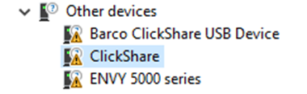
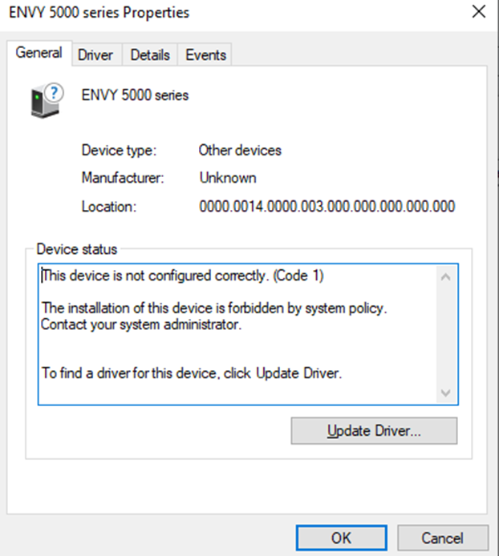
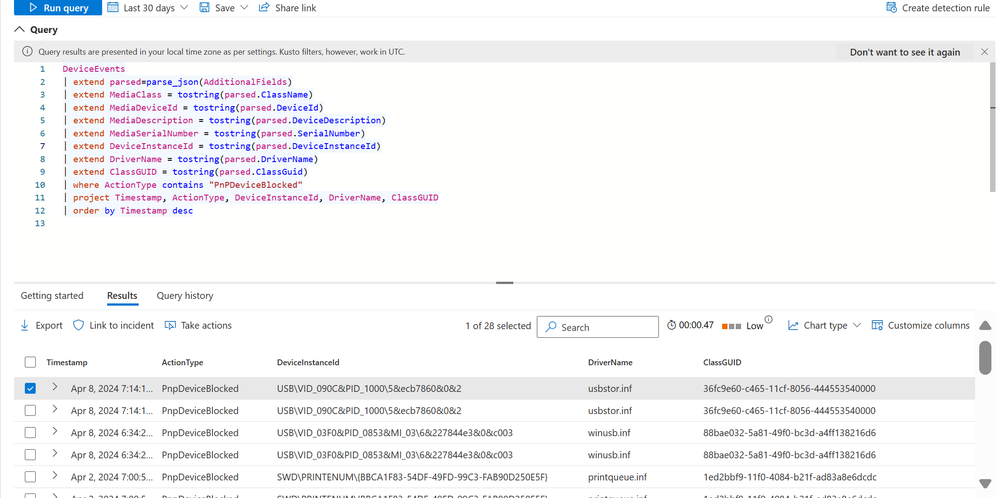
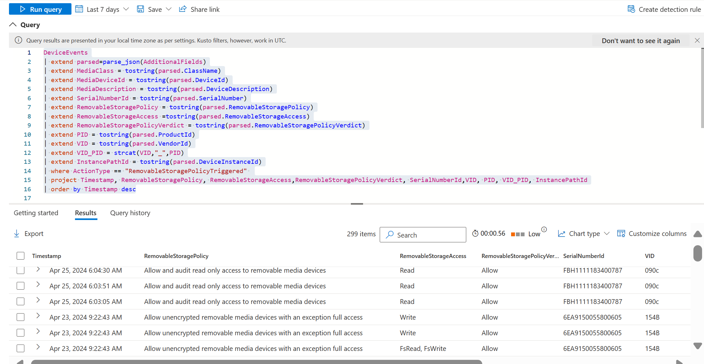

# Device control in Microsoft Defender for Endpoint

**Applies to:**

- [Microsoft Defender for Endpoint Plan 1](microsoft-defender-endpoint.md)
- [Microsoft Defender for Endpoint Plan 2](microsoft-defender-endpoint.md)
- [Microsoft Defender for Business](/defender-business)

Device control capabilities in Microsoft Defender for Endpoint enable your security team to control whether users can install and use peripheral devices, like removable storage (USB thumb drives, CDs, disks, etc.), printers, Bluetooth devices, or other devices with their computers. Your security team can configure device control policies to configure rules like these:

- Prevent users from installing and using certain devices (like USB drives)
- Prevent users from installing and using *any* external devices with specific exceptions
- Allow users to install and use specific devices
- Allow users to install and use only [BitLocker](/windows/security/operating-system-security/data-protection/bitlocker/)-encrypted devices with Windows computers

This list is intended to provide some examples. It's not an exhaustive list; there are other examples to consider.

Device control helps protect your organization from potential data loss, malware, or other cyberthreats by allowing or preventing certain devices to be connected to users' computers. With device control, your security team can determine whether and what peripheral devices users can install and use on their computers.

[!Include [defender-endpoint-setup-guide.md](../includes/mde-automated-setup-guide.md)]

## Microsoft device control capabilities

Device control capabilities from Microsoft can be organized into three main categories: device control in Windows, device control in Defender for Endpoint, and Endpoint Data Loss Prevention (Endpoint DLP).

- **Device control in Windows**. The Windows operating system has built-in device control capabilities. Your security team can configure device installation settings to prevent (or allow) users from installing certain devices on their computers. Policies are applied at the device level, and use various device properties to determine whether or not a user can install/use a device. 

   Device control in Windows works with BitLocker and ADMX templates, and can be managed using Intune.

  **BitLocker**. [BitLocker](/windows/security/operating-system-security/data-protection/encrypted-hard-drive) is a Windows security feature that provides encryption for entire volumes. BitLocker encryption can be required for writing to removable media. Together with [Intune](/mem/intune/fundamentals/what-is-intune), policies can be configured to enforce encryption on devices using BitLocker for Windows. For more information, see [Disk encryption policy settings for endpoint security in Intune](/mem/intune/protect/endpoint-security-disk-encryption-profile-settings).

  **Device Installation**. Windows provides the capability to prevent the installation of specific types of USB devices.

     For more information on how to configure device installation with Intune, see [Restrict USB devices and allow specific USB devices using ADMX templates in Intune](/mem/intune/configuration/administrative-templates-restrict-usb).

     For more information on how to configure device installation with Group Policy, see [Manage Device Installation with Group Policy](/windows/client-management/client-tools/manage-device-installation-with-group-policy).

- **Device control in Defender for Endpoint**. Device control in Defender for Endpoint provides more advanced capabilities and is cross platform.
  - Granular access control - create policies to control access by device, device type, operation (read, write, execute), user group, network location, or file type.
  - Reporting and advanced hunting - complete visibility into add device related activities.
  - Device control in Microsoft Defender can be managed using Intune or [Group Policy](device-control-deploy-manage-gpo.md).

- **Device control in Microsoft Defender and Intune**. Intune provides a rich experience for managing complex device control policies for organizations. You can configure and deploy device restriction settings in Defender for Endpoint, for example. See [Deploy and manage device control with Microsoft Intune](device-control-deploy-manage-intune.md).

- **Endpoint data loss prevention** (Endpoint DLP). Endpoint DLP monitors sensitive information on devices that are onboarded to Microsoft Purview solutions. DLP policies can enforce protective actions on sensitive information and where it's stored or used.  Endpoint DLP can capture file evidence. [Learn about Endpoint DLP](/purview/endpoint-dlp-learn-about).

## Common device control scenarios

In the following sections, review the scenarios, and then identify which Microsoft capability to use.

- [Control access to USB devices](#control-access-to-usb-devices)
- [Control access to BitLocker encrypted removable media (Preview)](#control-access-to-bitlocker-encrypted-removable-media-preview)
- [Control access to printers](#control-access-to-printers)
- [Control access to Bluetooth devices](#control-access-to-bluetooth-devices)

## Control access to USB devices

You can control access to USB devices by using device installation restrictions, removable media device control, or Endpoint DLP.

### Configure device installation restrictions

The device installation restrictions available in Windows allow or deny the installation of drivers based on the device ID, device instance ID or set-up class. This can block *any* device in the device manager including all removable devices. When device installation restrictions are applied, the device is blocked in the device manager, as shown in the following screenshot:



There are more details available by clicking on the device.



There is also a record in Advanced Hunting. To view it, use the following query:

```kusto
DeviceEvents
| extend parsed=parse_json(AdditionalFields)
| extend MediaClass = tostring(parsed.ClassName)
| extend MediaDeviceId = tostring(parsed.DeviceId)
| extend MediaDescription = tostring(parsed.DeviceDescription)
| extend MediaSerialNumber = tostring(parsed.SerialNumber)
| extend DeviceInstanceId = tostring(parsed.DeviceInstanceId)
| extend DriverName = tostring(parsed.DriverName)
| extend ClassGUID = tostring(parsed.ClassGuid)
| where ActionType contains "PnPDeviceBlocked"
| project Timestamp, ActionType, DeviceInstanceId, DriverName, ClassGUID
| order by Timestamp desc
```



When a device installation restrictions are configured and a device is installed, an event with *ActionType* of `PnPDeviceAllowed` is created.

**Learn more:**:

- [Manage Device Installation with Group Policy - Windows Client Management](/windows/client-management/client-tools/manage-device-installation-with-group-policy)

- [Restrict USB devices and allow specific USB devices using ADMX templates in Intune](/mem/intune/configuration/administrative-templates-restrict-usb).

### Control access to removable media using device control

Device control for Defender for Endpoint provides finer grain access control to a subset of USB devices. Device control can only restrict access to Windows Portal Devices, Removable Media, CD/DVDs and Printers.

> [!NOTE]
> On Windows, the term *removable media devices* does not mean any USB device. Not **all** USB devices are *removable media devices*. In order to be considered a *removable media device* and therefore in scope of MDE device control, the device **must** create a disk (such as `E:` ) in Windows. Device control can restrict access to the device and files on that device by defining policies.

> [!IMPORTANT]
> Some devices create multiple entries in the Windows device manager (for example a removable media device and a Windows portable device). In order for the device to function properly make sure to grant access for **all entries** associated with the physical device. If a policy is configured with an audit entry, then an event will appear in Advanced Hunting with an `ActionType` of `RemovableStoragePolicyTriggered`.

```kusto
DeviceEvents
| extend parsed=parse_json(AdditionalFields)
| extend MediaClass = tostring(parsed.ClassName)
| extend MediaDeviceId = tostring(parsed.DeviceId)
| extend MediaDescription = tostring(parsed.DeviceDescription)
| extend SerialNumberId = tostring(parsed.SerialNumber)
| extend RemovableStoragePolicy = tostring(parsed.RemovableStoragePolicy)
| extend RemovableStorageAccess =tostring(parsed.RemovableStorageAccess)
| extend RemovableStoragePolicyVerdict = tostring(parsed.RemovableStoragePolicyVerdict)
| extend PID = tostring(parsed.ProductId)
| extend VID = tostring(parsed.VendorId)
| extend VID_PID = strcat(VID,"_",PID)
| extend InstancePathId = tostring(parsed.DeviceInstanceId)
| where ActionType == "RemovableStoragePolicyTriggered"
| project Timestamp, RemovableStoragePolicy, RemovableStorageAccess,RemovableStoragePolicyVerdict, SerialNumberId,VID, PID, VID_PID, InstancePathId
| order by Timestamp desc
```

This query returns the name of the policy, the access requested, and the verdict (allow, deny), as shown in the following screenshot:



> [!TIP]
> Device control for Microsoft Defender for Endpoint on macOS can control access to iOS devices, portable devices such as cameras, and removable media such as USB devices. See [Device Control for macOS](mac-device-control-overview.md).

### Use Endpoint DLP to prevent file copying to USB

To prevent copying of files to USB based on file sensitivity use [Endpoint DLP](/purview/endpoint-dlp-learn-about).

## Control access to BitLocker encrypted removable media (Preview)

You use BitLocker to control access to removable media or to ensure that devices are encrypted.

### Use BitLocker to deny access to removable media

Windows provides the ability to deny write to all removable media or deny write access unless a device is BitLocker encrypted. For more information, see [Configure BitLocker - Windows Security](/windows/security/operating-system-security/data-protection/bitlocker/configure).

### Configure device control policies for BitLocker (Preview)

Device control for Microsoft Defender for Endpoint controls access to a device based on its BitLocker encrypted state (encrypted or plain). This allows for exceptions to be created to allow and audit access to non-BitLocker encrypted devices.

> [!TIP]
> If you're using Mac, device control can control access to removable media based on the APFS encryption state. See **[Device Control for macOS](mac-device-control-overview.md)**.

## Control access to printers

You can control access to printers by using printer installation restrictions, device control policies for printing, or Endpoint DLP.

### Set up printer installation restrictions

The device installation restrictions of Windows can be applied to printers.

### Configure device control policies for printing

Device control for Microsoft Defender for Endpoint controls access to the printer based on the properties of the printer (VID/PID), the type of printer (Network, USB, Corporate etc.).

Device control can also restrict the types of files that are printed. Device control can also restrict printing on non-corporate environments.

### Use Endpoint DLP to prevent classified document printing

To block printing of documents based on information classification use [Endpoint DLP](/purview/endpoint-dlp-learn-about).

### Use Endpoint DLP to capture file evidence of printed files

To capture evidence of a file being printed, use [Endpoint DLP](/purview/dlp-copy-matched-items-get-started?tabs=purview-portal%2Cpurview)

## Control access to Bluetooth devices

You can use device control to control access to Bluetooth services on Windows devices or by using Endpoint DLP.

> [!TIP]
> If you're using Mac, device control can control access to Bluetooth. See **[Device Control for macOS](mac-device-control-overview.md)**.

### Control access to Bluetooth services on Windows

Administrators can control the behavior of the Bluetooth service (Allowing advertising, discovery, preparing and prompting) as well as the Bluetooth services that are allowed. For more information, see [Windows Bluetooth](/windows/client-management/mdm/policy-csp-bluetooth).

### Use Endpoint DLP to prevent document copying to devices

To block copying of sensitive document to any Bluetooth Device use [Endpoint DLP](/purview/endpoint-dlp-learn-about).

### Use Endpoint DLP to capture file evidence of files copied to USB

To capture evidence of a file being copied to a USB, use [Endpoint DLP](/purview/dlp-copy-matched-items-get-started?tabs=purview-portal%2Cpurview)

## Device control policy samples and scenarios

Device control in Defender for Endpoint provides your security team with a robust access control model that enables a wide range of scenarios (see [Device control policies](device-control-policies.md)). We have put together a GitHub repository that contains samples and scenarios you can explore. See the following resources:

- [Device control samples README](https://github.com/microsoft/mdatp-devicecontrol/blob/main/README.md)
- [Getting started with device control samples on Windows devices](https://github.com/microsoft/mdatp-devicecontrol/blob/main/windows/Getting%20Started/readme.md)
- [Device control for macOS samples](https://github.com/microsoft/mdatp-devicecontrol/blob/main/macOS/README.md)

If you're new to device control, see [Device control walkthroughs](device-control-walkthroughs.md).

## Prerequisites for device control

Device control in Defender for Endpoint can be applied to devices running Windows 10 or Windows 11 that have the anti-malware client version `4.18.2103.3` or later. (Currently, servers are not supported.)

- `4.18.2104` or later: Add `SerialNumberId`, `VID_PID`, filepath-based GPO support, and `ComputerSid`.
- `4.18.2105` or later: Add Wildcard support for `HardwareId/DeviceId/InstancePathId/FriendlyNameId/SerialNumberId`; the combination of specific users on specific machines, removable SSD (a SanDisk Extreme SSD)/USB Attached SCSI (UAS) support.
- `4.18.2107` or later: Add Windows Portable Device (WPD) support (for mobile devices, such as tablets); add `AccountName` into advanced hunting.
- `4.18.2205` or later: Expand the default enforcement to Printer. If you set it to Deny, it blocks Printer as well, so if you only want to manage storage, make sure to create a custom policy to allow Printer.
- `4.18.2207` or later: Add File support; the common use case can be, "block people from Read/Write/Execute access specific file on removable storage." Add Network and VPN Connection support; the common use case can be, "block people from access removable storage when the machine isn't connecting corporate network."

For Mac, see [Device Control for macOS](mac-device-control-overview.md).

Currently, device control is not supported on servers.

## Next steps

- [Device control walkthroughs](device-control-walkthroughs.md)
- [Learn about Device control policies](device-control-policies.md)
- [View device control reports](device-control-report.md)
