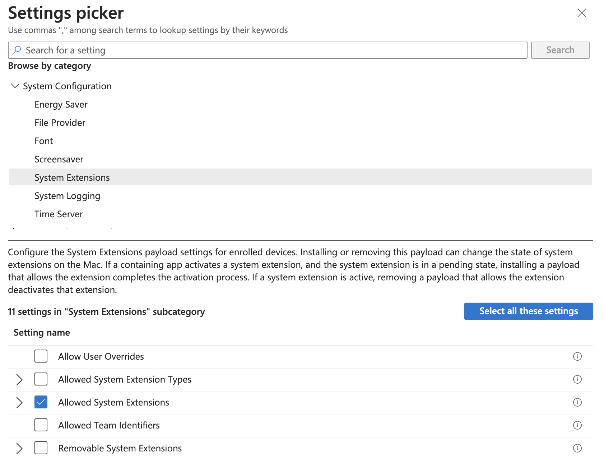
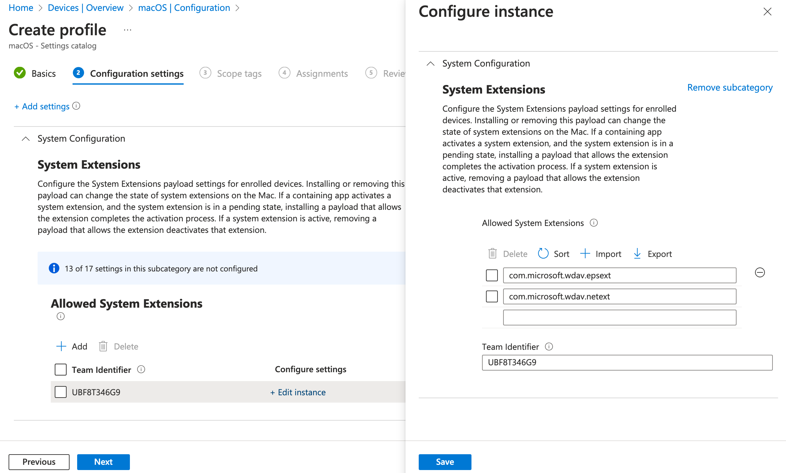

# Deploy Microsoft Defender for Endpoint on macOS with Microsoft Intune

**Applies to:**

- [Microsoft Defender for Endpoint on macOS](microsoft-defender-endpoint-mac.md)
- [Microsoft Defender for Endpoint Plan 1](https://go.microsoft.com/fwlink/p/?linkid=2154037)
- [Microsoft Defender for Endpoint Plan 2](https://go.microsoft.com/fwlink/p/?linkid=2154037)
- [Microsoft Defender for business](https://www.microsoft.com/security/business/endpoint-security/microsoft-defender-business)

This article describes how to deploy Microsoft Defender for Endpoint on macOS through Microsoft Intune. 

## Prerequisites and system requirements

Before you get started, see [the main Microsoft Defender for Endpoint on macOS page](microsoft-defender-endpoint-mac.md) for a description of prerequisites and system requirements for the current software version.

## Overview

The following table summarizes the steps to deploy and manage Microsoft Defender for Endpoint on Macs via Microsoft Intune. See the following table for more detailed steps:

|Step |Sample file name  |Bundle identifier  |
|---------|---------|---------|
|Approve system extension|`sysext.mobileconfig`|N/A|
|Network extension policy|`netfilter.mobileconfig`|N/A|
|Full Disk Access|`fulldisk.mobileconfig`|`com.microsoft.wdav.epsext`|
|Microsoft Defender for Endpoint configuration settings <br/><br/>If you're planning to run non-Microsoft antivirus on Mac, set `passiveMode` to `true`.|`MDE_MDAV_and_exclusion_settings_Preferences.xml`|`com.microsoft.wdav`|
|Background services|`background_services.mobileconfig`|N/A|
|Configure Microsoft Defender for Endpoint notifications|`notif.mobileconfig`|`com.microsoft.wdav.tray`|
|Accessibility settings|`accessibility.mobileconfig`|`com.microsoft.dlp.daemon`|
|Bluetooth|`bluetooth.mobileconfig`|`com.microsoft.dlp.agent`|
|Configure Microsoft AutoUpdate (MAU)|`com.microsoft.autoupdate2.mobileconfig`|`com.microsoft.autoupdate2`|
|Device Control|`DeviceControl.mobileconfig`|N/A|
|Data Loss Prevention|`DataLossPrevention.mobileconfig`|N/A|
|Download the onboarding package|`WindowsDefenderATPOnboarding__MDATP_wdav.atp.xml`|`com.microsoft.wdav.atp`|
|Deploy the Microsoft Defender for Endpoint on macOS application|`Wdav.pkg`|N/A|

## Create system configuration profiles

The next step is to create system configuration profiles that Microsoft Defender for Endpoint needs.
In the [Microsoft Intune admin center](https://go.microsoft.com/fwlink/?linkid=2109431), open **Devices** \> **Configuration profiles**.

### Step 1: Approve system extensions

1. In the [Intune admin center](https://intune.microsoft.com/#home), go to **Devices**, and under **Manage Devices**, select **Configuration**.

1. Under **Configuration profiles**, select **Create Profile**.

1. On the **Policies** tab, select **Create** > **New Policy**. 

1. Under **Platform**, select **macOS**.

1. Under **Profile type**, select **Settings catalog**.

1. Select **Create**.

1. On the **Basics** tab, **Name** the profile and enter a **Description.** Then select **Next**.

1. On the **Configuration settings tab,** select **+ Add settings.**

1. Under **Template name**, select **Extensions**.

1. In the **Settings picker**, expand the **System Configuration** category, and then select **System Extensions** > **Allowed System Extensions:**

   

1. Close the Settings picker, and then select **+ Edit instance**. 

1. Configure the following entries in the **Allowed system extensions** section, and then select **Next**.

   |Allowed System Extensions|Team Identifier|
   |---|---|
   |`com.microsoft.wdav.epsext`|`UBF8T346G9`|
   |`com.microsoft.wdav.netext`|`UBF8T346G9`|

   

1. On the **Assignments** tab, assign the profile to a group where the macOS devices or users are located.

1. Review the configuration profile. Select **Create**.

### Step 2: Network filter

As part of the Endpoint Detection and Response capabilities, Microsoft Defender for Endpoint on macOS inspects socket traffic and reports this information to the Microsoft 365 Defender portal. The following policy allows the network extension to perform this functionality.

Download [netfilter.mobileconfig](https://raw.githubusercontent.com/microsoft/mdatp-xplat/master/macos/mobileconfig/profiles/netfilter.mobileconfig) from [GitHub repository](https://github.com/microsoft/mdatp-xplat/tree/master/macos/mobileconfig/profiles).

> [!IMPORTANT]
> Only one `.mobileconfig` (plist) for Network Filter is supported.  Adding multiple Network Filters leads to network connectivity issues on Mac. This issue is not specific to Defender for Endpoint on macOS.

To configure your network filter:

1. Under **Configuration profiles**, select **Create Profile**.

1. Under **Platform**, select **macOS**.

1. Under **Profile type**, select **Templates**.

1. Under **Template name**, select **Custom**.

1. Select **Create**.

1. On the **Basics** tab, **Name** the profile. For example, `NetFilter-prod-macOS-Default-MDE`. Then, select **Next**.

1. On the **Configuration settings** tab, enter a **Custom configuration profile** name. For example, `NetFilter-prod-macOS-Default-MDE`.

1. Choose a **Deployment channel** and select **Next**.

1. Select a **Configuration profile file**, and then select **Next**.

1. On the **Assignments** tab, assign the profile to a group where the macOS devices and/or users are located, or **All Users** and **All devices**.

1. Review the configuration profile. Select **Create**.

### Step 3: Full Disk Access

> [!NOTE]
> Starting with macOS Catalina (10.15) or newer, in order to provide privacy for the end-users, it created the **FDA** (Full Disk Access). Enabling **TCC** (Transparency, Consent & Control) through a Mobile Device Management solution such as [Intune](mac-install-with-intune.md), will eliminate the risk of Defender for Endpoint losing **Full Disk Access** Authorization to function properly.
>
> This configuration profile grants Full Disk Access to Microsoft Defender for Endpoint. If you previously configured Microsoft Defender for Endpoint through Intune, we recommend you update the deployment with this configuration profile.

Download [**fulldisk.mobileconfig**](https://raw.githubusercontent.com/microsoft/mdatp-xplat/master/macos/mobileconfig/profiles/fulldisk.mobileconfig) from [GitHub repository](https://github.com/microsoft/mdatp-xplat/tree/master/macos/mobileconfig/profiles).

To configure Full Disk Access:

1. In the Intune admin center, under **Configuration profiles**, select **Create Profile**.

1. Under **Platform**, select **macOS**.

1. Under **Profile type**, select **Templates**.

1. Under **Template name**, select **Custom**, and then select **Create**.

1. On the **Basics** tab, **Name** the profile. For example, `FullDiskAccess-prod-macOS-Default-MDE`. Then select **Next**.

1. On the **Configuration settings** tab, enter a **Custom configuration profile** name. For example, `FullDiskAccess-prod-macOS-Default-MDE`.

1. Choose a **Deployment channel** and then select **Next**.

1. Select a **Configuration profile file**.

1. On the **Assignments** tab, assign the profile to a group where the macOS devices and/or users are located, or **All Users** and **All devices**.

1. Review the configuration profile. Select **Create**.

> [!NOTE]
> Full Disk Access granted through Apple MDM Configuration Profile is not reflected in **System Settings > Privacy & Security > Full Disk Access**.

### Step 4: Background services

> [!CAUTION]
> macOS 13 (Ventura) contains new privacy enhancements. Beginning with this version, by default, applications cannot run in background without explicit consent. Microsoft Defender for Endpoint must run its daemon process in background. This configuration profile grants Background Service permissions to Microsoft Defender for Endpoint. If you previously configured Microsoft Defender for Endpoint through Microsoft Intune, we recommend you update the deployment with this configuration profile.

Download [background_services.mobileconfig](https://raw.githubusercontent.com/microsoft/mdatp-xplat/master/macos/mobileconfig/profiles/background_services.mobileconfig) from [GitHub repository](https://github.com/microsoft/mdatp-xplat/tree/master/macos/mobileconfig/profiles).

To configure background services:

1. Under **Configuration profiles**, select **Create Profile**.

1. Under **Platform**, select **macOS**.

1. Under **Profile type**, select **Templates**.

1. Under **Template name**, select **Custom**.

1. Select **Create**.

1. On the **Basics** tab, **Name** the profile. For example, `BackgroundServices-prod-macOS-Default-MDE`. Then select **Next**.

1. On the **Configuration settings** tab, enter a **Custom configuration profile** name. For example, `backgroundServices-prod-macOS-Default-MDE`.

1. Choose a **Deployment channel** and select **Next**.

1. Select a **Configuration profile file**.

1. On the **Assignments** tab, assign the profile to a group where the macOS devices and/or users are located, or **All Users** and **All devices**.

1. Review the configuration profile. Select **Create**.

### Step 5: Notifications

This profile is used to allow Microsoft Defender for Endpoint on macOS and Microsoft AutoUpdate to display notifications in UI.

Download [notif.mobileconfig](https://raw.githubusercontent.com/microsoft/mdatp-xplat/master/macos/mobileconfig/profiles/notif.mobileconfig) from [GitHub repository](https://github.com/microsoft/mdatp-xplat/tree/master/macos/mobileconfig/profiles).

To turn off notifications for the end users, you can change **Show NotificationCenter** from `true` to `false` in [notif.mobileconfig](https://raw.githubusercontent.com/microsoft/mdatp-xplat/master/macos/mobileconfig/profiles/notif.mobileconfig).

:::image type="content" source="../defender-endpoint/media/image.png" alt-text="Screenshot showing notif.mobileconfig with ShowNotificationCenter set to True." lightbox="../defender-endpoint/media//image.png":::

To configure notifications:

1. Under **Configuration profiles**, select **Create Profile**.

1. Under **Platform**, select **macOS**.

1. Under **Profile type**, select **Templates**.

1. Under **Template name**, select **Custom**.

1. Select **Create**.

1. On the **Basics** tab, **Name** the profile. For example, `BackgroundServices-prod-macOS-Default-MDE`. Then select **Next**.

1. On the **Configuration settings** tab, enter a **Custom configuration profile** name. For example, `Notif.mobileconfig`.

1. Choose a **Deployment channel** and then select **Next**.

1. Select a **Configuration profile file**.

1. On the **Assignments** tab, assign the profile to a group where the macOS devices and/or users are located, or **All Users** and **All devices**.

1. Review the configuration profile. Select **Create**.

### Step 6: Accessibility settings

This profile is used to allow Microsoft Defender for Endpoint on macOS to access the accessibility settings on Apple macOS High Sierra (10.13.6) and newer.

Download [accessibility.mobileconfig](https://github.com/microsoft/mdatp-xplat/blob/master/macos/mobileconfig/profiles/accessibility.mobileconfig) from [GitHub repository](https://github.com/microsoft/mdatp-xplat/tree/master/macos/mobileconfig/profiles).

1. Under **Configuration profiles**, select **Create Profile**.

1. Under **Platform**, select **macOS**.

1. Under **Profile type**, select **Templates**.

1. Under **Template name**, select **Custom**.

1. Select **Create**.

1. On the **Basics** tab, **Name** the profile. For example, `Accessibility-prod-macOS-Default-MDE`. Then select **Next**.

1. On the **Configuration settings** tab, enter a **Custom configuration profile** name. For example, `Accessibility.mobileconfig`.

1. Choose a **Deployment channel** and select **Next**.

1. Select a **Configuration profile file**.

1. On the **Assignments** tab, assign the profile to a group where the macOS devices and/or users are located, or **All Users** and **All devices**.

1. Review the configuration profile. Select **Create**.

### Step 7: Bluetooth permissions

> [!CAUTION]
> macOS 14 (Sonoma) contains new privacy enhancements. Beginning with this version, by default, applications cannot access Bluetooth without explicit consent. Microsoft Defender for Endpoint uses it if you configure Bluetooth policies for Device Control.

Download [bluetooth.mobileconfig](https://github.com/microsoft/mdatp-xplat/blob/master/macos/mobileconfig/profiles/bluetooth.mobileconfig) from [GitHub repository](https://github.com/microsoft/mdatp-xplat/tree/master/macos/mobileconfig/profiles) and use the same workflow as in [Step 6: Accessibility settings](#step-6-accessibility-settings) to enable Bluetooth access.

> [!NOTE]
> Bluetooth granted through Apple MDM Configuration Profile is not reflected in System Settings => Privacy & Security => Bluetooth.

### Step 8: Microsoft AutoUpdate

This profile is used to update the Microsoft Defender for Endpoint on macOS via Microsoft AutoUpdate (MAU). If you're deploying Microsoft Defender for Endpoint on macOS, you have the options to get an updated version of the application (Platform Update) that are in the different channels mentioned here:

- Beta (Insiders-Fast)
- Current channel (Preview, Insiders-Slow)
- Current channel (Production)

For more information, see [Deploy updates for Microsoft Defender for Endpoint on macOS](mac-updates.md).

Download [AutoUpdate2.mobileconfig](https://github.com/microsoft/mdatp-xplat/blob/master/macos/settings/microsoft_auto_update/com.microsoft.autoupdate2.mobileconfig) from [GitHub repository](https://github.com/microsoft/mdatp-xplat/tree/master/macos/mobileconfig/profiles).

> [!NOTE]
> The sample `AutoUpdate2.mobileconfig` from the GitHub repository has it set to Current Channel (Production).

1. Under **Configuration profiles**, select **Create Profile**.

1. Under **Platform**, select **macOS**.

1. Under **Profile type**, select **Templates**.

1. Under **Template name**, select **Custom**.

1. Select **Create**.

1. On the **Basics** tab, **Name** the profile. For example, `Autoupdate-prod-macOS-Default-MDE`. Then select **Next**.

1. On the **Configuration settings** tab, enter a **Custom configuration profile** name. For example, `Autoupdate.mobileconfig`.

1. Choose a **Deployment channel** and select **Next**.

1. Select a **Configuration profile file**.

1. On the **Assignments** tab, assign the profile to a group where the macOS devices and/or users are located, or **All Users** and **All devices**.

1. Review the configuration profile. Select **Create**.

### Step 9: Microsoft Defender for Endpoint configuration settings

In this step, we go over *Preferences* that enables you to configure anti-malware and EDR policies using Microsoft Intune ([https://intune.microsoft.com](https://intune.microsoft.com)).

#### 9a. Set policies using Microsoft Defender portal

Set policies using Microsoft Defender Portal by implementing the following instructions, or by using [Microsoft Intune](#set-policies-using-microsoft-intune):

1. Go through [Configure Microsoft Defender for Endpoint in Intune](/mem/intune/protect/advanced-threat-protection-configure) before setting the security policies using Microsoft Defender for Endpoint Security Settings Management.

2. In the [Microsoft Defender portal](https://sip.security.microsoft.com/homepage), go to **Configuration management** > **Endpoint security policies** > **Mac policies** > **Create new policy**.

3. Under **Select Platform**, select **macOS**.

4. Under **Select Template**, choose a template and select **Create Policy**.

5. Specify a name and description for the policy, and then select **Next**.

6. On the **Assignments** tab, assign the profile to a group where the macOS devices and/or users are located, or **All Users** and **All devices**.

For more information about managing security settings, see:

- [Manage Microsoft Defender for Endpoint on devices with Microsoft Intune](/mem/intune/protect/mde-security-integration?pivots=mdssc-ga)
- [Manage security settings for Windows, macOS, and Linux natively in Defender for Endpoint](https://techcommunity.microsoft.com/t5/microsoft-defender-for-endpoint/manage-security-settings-for-windows-macos-and-linux-natively-in/ba-p/3870617)

> [!NOTE]
> If the device is managed via Intune, the device won't register via Defender for Endpoint Security Settings Management in the [Microsoft Defender portal](https://security.microsoft.com). Only the policies set via Intune take effect.

#### **Set policies using Microsoft Intune**

You can manage the security settings for Microsoft Defender for Endpoint on macOS under **Setting Preferences** in Microsoft Intune.

For more information, see [Set preferences for Microsoft Defender for Endpoint on Mac](mac-preferences.md).

### Step 10: Network protection for Microsoft Defender for Endpoint on macOS

In the [Microsoft Defender portal](https://sip.security.microsoft.com/homepage?tid=72f988bf-86f1-41af-91ab-2d7cd011db47):

1. Go to **Configuration management** > **Endpoint security policies** > **Mac policies** > **Create new policy**.

1. Under **Select Platform**, select **macOS**.

1. Under **Select Template**, select **Microsoft Defender Antivirus** and select **Create Policy**.

   :::image type="content" source="../defender-endpoint/media/network-protection1.png" alt-text="Screenshot that shows the page on which you create a policy." lightbox="../defender-endpoint/media/network-protection1.png":::

1. On the **Basics** tab, enter the **Name** and **Description** of the policy. Select **Next**.

   :::image type="content" source="../defender-endpoint/media/networkprotection2.png" alt-text="Screenshot that shows the Basics tab." lightbox="../defender-endpoint/media/networkprotection2.png":::

1. On the **Configuration Settings** tab, under Network Protection, select an **Enforcement level**. Select **Next**.

   :::image type="content" source="../defender-endpoint/media/networkprotection3.png" alt-text="Screenshot that shows the Create a new policy page." lightbox="../defender-endpoint/media/networkprotection3.png":::
   
1. On the **Assignments** tab, assign the profile to a group where the macOS devices and/or users are located, or **All Users** and **All devices**.

   :::image type="content" source="../defender-endpoint/media/networkprotection4.png" alt-text="Screenshot that shows the page on which you configure the settings for the Assignments option." lightbox="../defender-endpoint/media/networkprotection4.png":::

1. Review the policy in **Review+Create** and select **Save**. 

> [!TIP]
> You can also configure network protection by appending the information from [**Network protection to help prevent macOS connections to bad sites**](network-protection-macos.md) to the `.mobileconfig` from step 8.

### Step 11: Device Control for Microsoft Defender for Endpoint on macOS

To set Device Control for Microsoft Defender for Endpoint on macOS, follow the steps in:

- [Device Control for macOS](mac-device-control-overview.md)
- [Deploy and manage Device Control using Intune](mac-device-control-intune.md)

### Step 12: Data Loss Prevention (DLP) for Endpoint

To set Purview's Data Loss Prevention (DLP) for endpoint on macOS, follow the steps in [Onboard and offboard macOS devices into Compliance solutions using Microsoft Intune](/purview/device-onboarding-offboarding-macos-intune-mde).

### Step 13: Check status of PList (.mobileconfig)

After completing the profile configuration, you'll be able to review the status of the policies.

#### View Status

Once the Intune changes are propagated to the enrolled devices, you can see them listed under **Monitor** \> **Device status**:

:::image type="content" source="../defender-endpoint/media/mdatp-7-devicestatusblade.png" alt-text="Screenshot that shows the view of the device status." lightbox="../defender-endpoint/media/mdatp-7-devicestatusblade.png":::

#### Client device setup

A standard [Company Portal installation](/mem/intune/user-help/enroll-your-device-in-intune-macos-cp) is sufficient for a mac device.

1. Confirm device management.

   :::image type="content" source="../defender-endpoint/media/mdatp-3-confirmdevicemgmt.png" alt-text="Screenshot that shows the Confirm device management page." lightbox="../defender-endpoint/media/mdatp-3-confirmdevicemgmt.png":::

   Select **Open System Preferences**, locate **Management Profile** on the list, and select **Approve...**. Your Management Profile would be displayed as **Verified**:

   :::image type="content" source="../defender-endpoint/media/mdatp-4-managementprofile.png" alt-text="Screenshot that shows the Management profile page." lightbox="../defender-endpoint/media/mdatp-4-managementprofile.png":::

2. Select **Continue** and complete the enrollment.

   You may now enroll more devices. You can also enroll them later, after finishing the provisioning system configuration and application packages.

3. In Intune, open **Manage** \> **Devices** \> **All devices**. Here you can see your device among the listed:

   :::image type="content" source="../defender-endpoint/media/mdatp-5-alldevices.png" alt-text="Screenshot that shows the All Devices page." lightbox="../defender-endpoint/media/mdatp-5-alldevices.png":::

#### Verify client device state

1. After the configuration profiles are deployed to your devices, open **System Preferences** > **Profiles** on your Mac device.

   :::image type="content" source="../defender-endpoint/media/mdatp-13-systempreferences.png" alt-text="Screenshot that shows the System preferences page." lightbox="../defender-endpoint/media/mdatp-13-systempreferences.png":::
    
   :::image type="content" source="../defender-endpoint/media/mdatp-14-systempreferencesprofiles.png" alt-text="Screenshot that shows the System Preferences Profiles page." lightbox="../defender-endpoint/media/mdatp-14-systempreferencesprofiles.png":::

2. Verify that the following configuration profiles are present and installed. The **Management Profile** should be the Intune system profile. _Wdav-config_ and _wdav-kext_ are system configuration profiles that were added in Intune:

   :::image type="content" source="../defender-endpoint/media/mdatp-15-managementprofileconfig.png" alt-text="Screenshot that shows the Profiles page." lightbox="../defender-endpoint/media/mdatp-15-managementprofileconfig.png":::

3. You should also see the Microsoft Defender for Endpoint icon in the top-right corner.

   :::image type="content" source="../defender-endpoint/media/mdatp-icon-bar.png" alt-text="Screenshot that shows the icon for Microsoft Defender for Endpoint in the status bar." lightbox="../defender-endpoint/media/mdatp-icon-bar.png":::

### Step 14: Publish application

This step enables deploying Microsoft Defender for Endpoint to enrolled machines.

1. In the [Microsoft Intune admin center](https://go.microsoft.com/fwlink/?linkid=2109431), open **Apps**.

   :::image type="content" source="../defender-endpoint/media/mdatp-8-app-before.png" alt-text="Screenshot that shows the application's overview page." lightbox="../defender-endpoint/media/mdatp-8-app-before.png":::

1. Select **By platform** > **macOS** > **Add**.

1. Under **App type**, select **macOS**. Select **Select**.

   :::image type="content" source="../defender-endpoint/media/mdatp-9-app-type.png" alt-text="Screenshot that shows the specific application type." lightbox="../defender-endpoint/media/mdatp-9-app-type.png":::

1. On the **App information**, keep the default values and select **Next**.

   :::image type="content" source="../defender-endpoint/media/mdatp-10-properties.png" alt-text="Screenshot that shows the application properties page." lightbox="../defender-endpoint/media/mdatp-10-properties.png":::

1. On the **Assignments** tab, select **Next**.

   :::image type="content" source="../defender-endpoint/media/mdatp-11-assignments.png" alt-text="Screenshot that shows the Intune assignments information page." lightbox="../defender-endpoint/media/mdatp-11-assignments.png":::

1. Review and **Create**. You can visit **Apps** > **By platform** > **macOS** to see it on the list of all applications.

   :::image type="content" source="../defender-endpoint/media/mdatp-12-applications.png" alt-text="Screenshot that shows the application lists page." lightbox="../defender-endpoint/media/mdatp-12-applications.png":::

For more information, see [Add Microsoft Defender for Endpoint to macOS devices using Microsoft Intune](/mem/intune/apps/apps-advanced-threat-protection-macos).

> [!IMPORTANT]
> You should create and deploy the configuration profiles in the order specified (steps 1-13) for a successful system configuration.

### Step 15: Download the onboarding package

To download the onboarding packages from Microsoft 365 Defender portal:

1. In the Microsoft 365 Defender portal, go to **System** > **Settings** > **Endpoints** > **Device management** > **Onboarding**.

2. Set the operating system to **macOS** and the deployment method to **Mobile Device Management / Microsoft Intune**.

   :::image type="content" source="../defender-endpoint/media/macos-install-with-intune.png" alt-text="Screenshot that shows the Onboarding settings page." lightbox="../defender-endpoint/media/macos-install-with-intune.png":::

3. Select **Download onboarding package**. Save it as _WindowsDefenderATPOnboardingPackage.zip_ to the same directory.

4. Extract the contents of the .zip file:

   ```bash
   unzip WindowsDefenderATPOnboardingPackage.zip
   ```

   ```console
   Archive:  WindowsDefenderATPOnboardingPackage.zip
   warning:  WindowsDefenderATPOnboardingPackage.zip appears to use backslashes as path separators
    inflating: intune/kext.xml
    inflating: intune/WindowsDefenderATPOnboarding.xml
    inflating: jamf/WindowsDefenderATPOnboarding.plist
   ```

   :::image type="content" source="../defender-endpoint/media/deploy-onboarding-package.png" alt-text="Screenshot that shows the sample description."  lightbox="../defender-endpoint/media/deploy-onboarding-package.png":::

### Step 16: Deploy the onboarding package

This profile contains license information for Microsoft Defender for Endpoint. 

To deploy the onboarding package:

1. Under **Configuration profiles**, select **Create Profile**.

1. Under **Platform**, select **macOS**.

1. Under **Profile type**, select **Templates**.

1. Under **Template name**, select **Custom**.

1. Select **Create**.

   :::image type="content" source="../defender-endpoint/media/mdatp-6-systemconfigurationprofiles-1.png" alt-text="Screenshot that shows the deploy onboarding package." lightbox="../defender-endpoint/media/mdatp-6-systemconfigurationprofiles-1.png":::

1. On the **Basics** tab, **Name** the profile. For example, `Onboarding-prod-macOS-Default-MDE`. Select **Next**.

   :::image type="content" source="../defender-endpoint/media/mdatp-6-systemconfigurationprofiles-2.png" alt-text="Screenshot that shows the Custom page." lightbox="../defender-endpoint/media/mdatp-6-systemconfigurationprofiles-2.png":::

1. On the **Configuration settings** tab, enter a **Custom configuration profile** name. For example, `WindowsDefenderATPOnboarding`.

1. Choose a **Deployment channel** and select **Next**.

1. Select a **Configuration profile file**.

   :::image type="content" source="../defender-endpoint/media/mdatp-6-systemconfigurationprofiles.png" alt-text="Screenshot that shows the configuration settings." lightbox="../defender-endpoint/media/mdatp-6-systemconfigurationprofiles.png":::

1. On the **Assignments** tab, assign the profile to a group where the macOS devices and/or users are located, or **All Users** and **All devices**.

   :::image type="content" source="../defender-endpoint/media/mdatp-6-systemconfigurationprofiles-3.png" alt-text="Screenshot that shows the Assignments tab." lightbox="../defender-endpoint/media/mdatp-6-systemconfigurationprofiles-3.png":::

1. Review the configuration profile. Select **Create**.

1. Open **Devices** > **Configuration profiles** to see the created profile.

### Step 17: Verify anti-malware detection

See the following article to test for an anti-malware detection review: [Antivirus detection test for verifying device's onboarding and reporting services](validate-antimalware.md)

### Step 18: Verifying EDR detection

See the following article to test for an EDR detection review: [EDR detection test for verifying device onboarding and reporting services](edr-detection.md)

## Troubleshooting

Issue: No license found.

Solution: Follow the steps in this article to create a device profile using WindowsDefenderATPOnboarding.xml.

## Logging installation issues

See [Logging installation issues](mac-resources.md#logging-installation-issues) for information on how to find the automatically generated log created by the installer, when an error occurs.

For information on troubleshooting procedures, see:

- [Troubleshoot system extension issues in Microsoft Defender for Endpoint on macOS](mac-support-sys-ext.md)
- [Troubleshoot installation issues for Microsoft Defender for Endpoint on macOS](mac-support-install.md)
- [Troubleshoot license issues for Microsoft Defender for Endpoint on macOS](mac-support-license.md)
- [Troubleshoot cloud connectivity issues for Microsoft Defender for Endpoint on macOS](troubleshoot-cloud-connect-mdemac.md)
- [Troubleshoot performance issues for Microsoft Defender for Endpoint on macOS](mac-support-perf.md)

## Uninstallation

See [Uninstalling](mac-resources.md#uninstalling) for details on how to remove Microsoft Defender for Endpoint on macOS from client devices.

