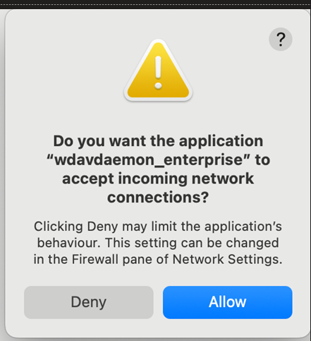

# Microsoft Defender for Endpoint release notes

This article describes releases of Microsoft Defender for Endpoint across Windows, macOS, Linux, Android, and iOS in the past six months.

To learn about Microsoft Defender for Endpoint features that aren't version-specific, see [What's new in Microsoft Defender for Endpoint](whats-new-in-microsoft-defender-endpoint.md).

[!INCLUDE [Microsoft Defender XDR rebranding](../includes/microsoft-defender.md)]

## Who should read this article

This page is intended primarily for customers with a Microsoft Defender for Endpoint license who regularly deploy, maintain, or validate Defender for Endpoint across their organization. These customers can use this page to find supported releases, component updates, and platform requirements as part of installing and operating Defender for Endpoint in their environments.

For more information on Defender for Endpoint plans and licenses, see the [Microsoft 365 licensing guidance](/office365/servicedescriptions/microsoft-365-service-descriptions/microsoft-365-tenantlevel-services-licensing-guidance/microsoft-365-security-compliance-licensing-guidance).

## All supported releases by date

This table includes supported releases for all supported platforms in the past six months. Each release includes a link to the full release details section.

|OS  |Build |Month released|Details  |Learn more  |
|---------|---------|---------|---------|---------|
|macOS |101.26012.0017  |March 2026 |- Release version: 20.126012.17.0 - Engine version: 1.1.25100.4000 - Signature version: 1.439.74.0 |[Release details and updates](#macos--march-2026--101260120017) |
|macOS |101.26012.0015  |March 2026 |- Release version: 20.126012.15.0 - Engine version: 1.1.25100.4000 - Signature version: 1.439.74.0 |[Release details and updates](#macos--march-2026--101260120015) |
|macOS |101.26012.0012  |February 2026 |- Release version: 20.126012.12.0 - Engine version: 1.1.25100.4000 - Signature version: 1.439.74.0 |[Release details and updates](#macos--february-2026--101260120012) |
|macOS |101.25122.0008  |February 2026 |- Release version: 20.125122.8.0 - Engine version: 1.1.25100.4000 - Signature version: 1.439.74.0 |[Release details and updates](#macos--february-2026--101251220008) |
|Linux  |101.25122.0004  |February 2026 |- Release version: 30.125122.0004.0 - Engine version: 1.1.25110.3002 - Signature version: 1.443.508.0 |[Release details and updates](#linux--february-2026--101251220004) |
|macOS |101.25122.0007  |January 2026 |- Release version: 20.125122.7.0 - Engine version: 1.1.25100.3000 - Signature version: 1.443.820.0 |[Release details and updates](#macos--january-2026--101251220007) |
|macOS  |101.25122.0006  |January 2026 |- Release version: 20.125122.6.0 - Engine version: 1.1.25100.4000 - Signature version: 1.439.74.0 |[Release details and updates](#macos--january-2026--101251220006) |
|Windows Antivirus |Platform 4.18.26010.5 / Engine 1.1.26010.1 |January 2026 |- Platform: 4.18.26010.5 - Engine: 1.1.26010.1 - Security intelligence: 1.443.820.0 |[Release details and updates](#windows-antivirus--january-2026--platform-418260105--engine-11260101) |
|Linux  |101.25102.0005  |January 2026 |- Release version: 30.125102.0005.0 - Engine version: 1.1.25090.6000 - Signature version: 1.439.338.0 |[Release details and updates](#linux--january-2026--101251020005) |
|Linux  |101.25092.0005  |December 2025 |- Release version: 30.125092.0005.0 - Engine version: 1.1.25090.4000 - Signature version: 1.437.18.0 |[Release details and updates](#linux--december-2025--101250920005) |
|Linux  |101.25092.0002  |December 2025 |- Release version: 30.125092.0002.0 - Engine version: 1.1.25090.4000 - Signature version: 1.437.18.0 |[Release details and updates](#linux--december-2025--101250920002) |
|Android |1.0.8412.0101  |December 2025 |- Build: 1.0.8412.0101 - Released: December 15, 2025 |[Release details and updates](#android--december-2025--1084120101) |
|Android |1.0.8321.0101  |December 2025 |- Build: 1.0.8321.0101 - Released: December 2, 2025 |[Release details and updates](#android--december-2025--1083210101) |
|macOS  |101.25102.0019  |December 2025 |- Release version: 20.125102.19.0 - Engine version: 1.1.25090.2000 - Signature version: 1.435.600.0 |[Release details and updates](#macos--december-2025--101251020019) |
|Linux  |101.25102.0003  |November 2025 |- Release version: 30.125102.0003.0 - Engine version: 1.1.25090.6000 - Signature version: 1.439.338.0 |[Release details and updates](#linux--november-2025--101251020003) |
|Windows Antivirus |4.18.25110.6  |November 2025 |- Platform: 4.18.25110.6 - Engine: 1.1.25110.1 - Security intelligence: 1.443.6.0 |[Release details and updates](#windows-antivirus--november-2025--platform-418251106--engine-11251101) |
|iOS |1.1.70290103 |November 2025 |- Build: 1.1.70290103 - Released: November 6, 2025 |[Release details and updates](#ios--november-2025--1170290103) |
|Android |1.0.8315.0101  |November 2025 |- Build: 1.0.8315.0101 - Released: November 17, 2025 |[Release details and updates](#android--november-2025--1083150101) |
|Android |1.0.8303.0101  |November 2025 |- Build: 1.0.8303.0101 - Released: November 4, 2025 |[Release details and updates](#android--november-2025--1083030101) |
|macOS  |101.25102.0016  |November 2025 |- Release version: 20.125102.16.0 - Engine version: 1.1.25090.2000 - Signature version: 1.435.600.0 |[Release details and updates](#macos--november-2025--101251020016) |
|iOS |1.1.70230101  |October 2025 |- Build: 1.1.70230101 - Released: October 26, 2025 |[Release details and updates](#ios--october-2025--1170230101-1169250104) |
|iOS |1.1.69250104  |October 2025 |- Build: 1.1.69250104 - Released: October 7, 2025 |[Release details and updates](#ios--october-2025--1170230101-1169250104) |
|Android |1.0.8217.0101  |October 2025 |- Build: 1.0.8217.0101 - Released: October 28, 2025 |[Release details and updates](#android--october-2025--1082170101) |
|Android |1.0.8201.0101  |October 2025 |- Build: 1.0.8201.0101 - Released: October 2, 2025 |[Release details and updates](#android--october-2025--1082010101) |
|macOS  |101.25082.0006  |October 2025 |- Release version: 20.125082.6.0 - Engine version: 1.1.25070.3000 - Signature version: 1.437.276.0 |[Release details and updates](#macos--october-2025--101250820006) |
|Linux  |101.25092.0001  |October 2025 |- Release version: 30.125092.0001.0 - Engine version: 1.1.25090.6000 - Signature version: 1.439.558.0 |[Release details and updates](#linux--october-2025--101250920001) |
|Windows Antivirus |4.18.25100.9008  |October 2025 |- Platform: 4.18.25100.9008 - Engine: 1.1.25100.9002 - Security intelligence: 1.441.131.0 |[Release details and updates](#windows-antivirus--october-2025--platform-418251009008--engine-11251009002) |
|iOS |1.1.68200103  |September 2025 |- Build: 1.1.68200103 - Released: September 4, 2025 |[Release details and updates](#ios--september-2025--1168200103) |
|Android |1.0.8102.0101  |September 2025 |- Build: 1.0.8102.0101 - Released: September 4, 2025 |[Release details and updates](#android--september-2025--1081020101) |
|Linux  |101.25082.0003  |September 2025 |- Release version: 30.125082.0003.0 - Engine version: 1.1.25070.4000 - Signature version: 1.435.242.0 |[Release details and updates](#linux--september-2025--101250820003-build-1) |
|Linux  |101.25072.0003  |September 2025 |- Release version: 30.125072.0003.0 - Engine version: 1.1.25060.4000 - Signature version: 1.431.4.0 |[Release details and updates](#linux--september-2025--101250720003-build-2) |
|macOS  |101.25072.0011  |September 2025 |- Release version: 20.125072.11.0 - Engine version: 1.1.25060.3000 - Signature version: 1.429.309.0 |[Release details and updates](#macos--september-2025--101250720011) |
|iOS |1.1.68140102  |August 2025 |- Build: 1.1.68140102 - Released: August 19, 2025 |[Release details and updates](#ios--august-2025--1168140102) |
|Android |1.0.8018.0103  |August 2025 |- Build: 1.0.8018.0103 - Released: August 19, 2025 |[Release details and updates](#android--august-2025--1080180103) |
|Linux  |101.25062.0003  |August 2025 |- Release version: 30.125062.0003.0 - Engine version: 1.1.25040.4000 - Signature version: 1.429.442.0 |[Release details and updates](#linux--august-2025--101250620003) |
|iOS |1.1.67040101  |July 2025 |- Build: 1.1.67040101 - Released: July 8, 2025 |[Release details and updates](#ios--july-2025--1167040101) |
|Android |1.0.7901.0101  |July 2025 |- Build: 1.0.7901.0101 - Released: July 10, 2025 |[Release details and updates](#android--july-2025--1079010101) |
|Windows |10.8797.25857.1000  |May 2025 |Supported on: Windows 11 24H2, Windows 11 23H2, Windows 10 22/H2 |[Release KBs and updates](#windows--may-2025--108797258571000) |
|Windows |10.8760.27617.1006  |July 2024 |Supported on: Windows 11 24H2, Windows 11 23H2, Windows 10 22/H2 |[Release KBs and updates](#windows--july-2024--108760276171006) |

## Windows releases

This section covers Microsoft Defender for Endpoint EDR `MsSense.exe` versions. You can also check the file information section in the monthly cumulative rollup updates in the following articles: 

- [Windows 11 release information](/windows/release-health/windows11-release-information)
- [Windows 10 updates](https://support.microsoft.com/topic/windows-10-update-history-8127c2c6-6edf-4fdf-8b9f-0f7be1ef3562)
- [Windows Server 2022 updates](https://support.microsoft.com/topic/windows-server-2022-update-history-e1caa597-00c5-4ab9-9f3e-8212fe80b2ee)
- [Windows Server 2019 updates](https://support.microsoft.com/topic/windows-10-and-windows-server-2019-update-history-725fc2e1-4443-6831-a5ca-51ff5cbcb059)
- [Windows Server 2025 updates](https://support.microsoft.com/topic/windows-server-2025-update-history-10f58da7-e57b-4a9d-9c16-9f1dcd72d7d7)

### Windows | May 2025 | 10.8797.25857.1000

#### Release details

| OS | KB |
| -------- | -------- |
| Windows 11 24H2 | [KB5058499](https://support.microsoft.com/topic/may-28-2025-kb5058499-os-build-26100-4202-preview-d4c2f1ee-8138-4038-b705-546945076f92) |
| Windows 11 23H2 | [KB5058502](https://support.microsoft.com/topic/may-27-2025-kb5058502-os-22621-5413-and-22631-5413-preview-6291789c-1eea-4227-9740-a701af6de688) |
| Windows 10 22/H2 | [KB5058481](https://support.microsoft.com/topic/may-28-2025-kb5058481-os-build-19045-5917-preview-7698d6e7-dd65-494d-b523-aa4c6aa913a2) |

#### Enhancements and features

| Feature area | Update summary |
|-------------|---------------|
| Data Loss Prevention (DLP) | Improved Cold Data Scan performance and reliability; general stability enhancements. |
| Identity | Expanded AD entity sync; more entity types and attributes for better visibility. |
| Threat protection | User contaminant improvements. |
| Network Detection & Response (NDR) | Enhanced data telemetry for better insights. |
| SOC experience | Faster, more complete data collection and detection; improved offline environment handling. |

### Windows | July 2024 | 10.8760.27617.1006

#### Release details

| OS | KB |
| -------- | -------- |
| Windows 11 24H2 | [KB5041865](https://support.microsoft.com/topic/august-27-2024-kb5041865-os-build-26100-1591-preview-5d299921-2b27-4fe0-b414-c2336371b552) |
| Windows 11 23H2, Windows 11 22H | [KB5041587](https://support.microsoft.com/topic/august-27-2024-kb5041587-os-builds-22621-4112-and-22631-4112-preview-9706ea0e-6f72-430e-b08a-878963dafe08) |
| Windows 11 21H2 | [KB5043067](https://support.microsoft.com/topic/september-10-2024-kb5043067-os-build-22000-3197-62287850-4f0d-4e4a-9fe8-b026bb1be994) |
| Windows 10 22H2 | [KB5041582](https://support.microsoft.com/topic/august-29-2024-kb5041582-os-build-19045-4842-preview-f4c4d191-5457-475c-80ac-e1d43cf9c941) |
| Windows Server 2022 and later | [KB5042881](https://support.microsoft.com/topic/september-10-2024-kb5042881-os-build-20348-2700-5b548143-9613-4e5a-9454-8ed9be8b2bd2) |
| Windows Server 2019 | [KB5043050](https://support.microsoft.com/topic/september-10-2024-kb5043050-os-build-17763-6293-66e9809a-1838-4474-a6a7-90d64f042f00) |
| Windows Server 2016, Windows Server 2012 R2 | [KB5005292](https://support.microsoft.com/topic/microsoft-defender-for-endpoint-update-for-edr-sensor-f8f69773-f17f-420f-91f4-a8e5167284ac) |

#### Enhancements and features

| Feature area | Update summary |
|-------------|---------------|
| Data Loss Prevention (DLP) | Scoped classification (Know Your Data policy) and activity events across workloads; device group discovery and scoping for custom policy; OCR URL caching for improved image classification performance. |

## macOS releases

Defender for Endpoint supports macOS version 15.0.1 or newer. macOS 11 (Big Sur) and 12 (Monterey) are no longer supported.

To share feedback, open Defender for Endpoint on macOS and go to **Help > Send feedback**.

To get latest features, configure your device for the Beta channel (formerly Insider-Fast) device.

For known issues, see [macOS known issues](#macos-known-issues).

### macOS | March-2026 | 101.26012.0017

#### Versions

| Release version | Engine version | Signature version |
|-----------------|----------------|-------------------|
| 20.126012.17.0  | 1.1.25100.4000 | 1.439.74.0        |

#### Enhancements and features

| Feature area | Update summary |
|--------------|----------------|
| General      | Bug fixes      |

### macOS | March-2026 | 101.26012.0015

#### Versions

| Release version | Engine version | Signature version |
|-----------------|----------------|-------------------|
| 20.126012.15.0  | 1.1.25100.4000 | 1.439.74.0        |

#### Enhancements and features

| Feature area | Update summary |
|--------------|----------------|
| General      | Fixed an epsext crash that could cause a black screen on some Macs. |

### macOS | February-2026 | 101.26012.0012

#### Versions

| Release version | Engine version | Signature version |
|-----------------|----------------|-------------------|
| 20.126012.12.0  | 1.1.25100.4000 | 1.439.74.0        |

#### Enhancements and features

| Feature area | Update summary |
|--------------|----------------|
| General      | CVE‑2025‑68664/5 LangGrinch (langchain vulnerability) |
| General      | Mitigation for a possible EDLP performance issue related to MDM profile behavior |
| General      | Device Control - policy conditional on secure digital card details |
| General      | Bug and performance fixes |

### macOS | February 2026 | 101.25122.0008

#### Release details

| Release version | Engine version | Signature version |
| -------- | -------- |-------- |
|20.125122.8.0 |1.1.25100.4000 |1.439.74.0 |

#### Enhancements and features

Bug and performance fixes

### macOS | January 2026 | 101.25122.0007

#### Release details

| Release version | Engine version | Signature version |
| -------- | -------- |-------- |
|20.125122.7.0 |1.1.25100.4000 |1.439.74.0 |

#### Enhancements and features

Bug and performance fixes

### macOS | January 2026 | 101.25122.0006

#### Release details

| Release version | Engine version | Signature version |
| -------- | -------- |-------- |
|20.125122.6.0 |1.1.25100.4000 |1.439.74.0 |

#### Enhancements and features

| Feature area | Update summary |
|--------------|---------------|
| General | Bug and performance fixes. |

### macOS | December 2025 | 101.25102.0019

#### Release details

| Release version | Engine version | Signature version |
| -------- | -------- |-------- |
|20.125102.19.0 |1.1.25090.2000 |1.435.600.0 |

#### Enhancements and features

| Feature area | Update summary |
|--------------|---------------|
| Vulnerability Management | [CVE-2025-55182 (React2Shell)](https://www.microsoft.com/security/blog/2025/12/15/defending-against-the-cve-2025-55182-react2shell-vulnerability-in-react-server-components/?msockid=30fe85b32a9c6d12269c90ef2e9c6f88) - Microsoft Defender Vulnerability Management (MDVM) can now surface devices that this vulnerability may affect. |

### macOS | November 2025 | 101.25102.0016

#### Release details

| Release version | Engine version | Signature version |
| -------- | -------- |-------- |
|20.125102.16.0 |1.1.25090.2000 |1.435.600.0 |

#### Enhancements and features

| Feature area | Update summary |
|--------------|---------------|
| General | Bug and performance fixes. |

### macOS | October 2025 | 101.25082.0006

#### Release details

| Release version | Engine version | Signature version |
| -------- | -------- |-------- |
|20.125082.6.0 |1.1.25070.3000 |1.437.276.0 |

#### Enhancements and features

| Feature area | Update summary |
|--------------|---------------|
| General | Bug and performance fixes. |

### macOS | September 2025 | 101.25072.0011

#### Release details

| Release version | Engine version | Signature version |
| -------- | -------- |-------- |
|20.125072.11.0 |1.1.25060.3000 |1.429.309.0 |

#### Enhancements and features

| Feature area | Update summary |
|--------------|---------------|
| Malware detection | Enhanced detection timing and archive scanning improvements. |
| Diagnostics | Improved diagnostic capabilities and error reporting. |
| Data Loss Prevention (DLP) | Performance and diagnostic improvements for endpoint DLP. |
| General | Bug fixes. |

### macOS known issues

- Microsoft Defender for Endpoint crashes on macOS (Build 101.26012.0016)
   - **Date identified**: March 16, 2026
   - **Affected version**: Build 101.26012.0016 (Production ring)
   - **Symptoms**: Microsoft Defender for Endpoint on macOS may experience repeated crashes of the wdavdaemon process. Affected devices may exhibit:
      - Performance degradation
      - Repeated Defender process crashes
      - Device not waking from sleep
   - **Resolution**: Deploy one of the following updates:
      - Hotfix (Production): Update to version 101.26012.0017
      - Insider Fast (2602): Update to version 101.26022.0015

- In version 2506 (101.25062.0005), attempts to upgrade Microsoft Defender for Endpoint on macOS consistently failed.  Other versions of Defender are not impacted. To overcome this issue, there is a supported workaround for supported macOS versions and beta versions of macOS 26.  The instructions for the workaround can be found [here](https://github.com/microsoft/mdatp-xplat/tree/master/macos/upgrade_from_2506_helper).

- Apple fixed an issue on macOS [Ventura upgrade](https://developer.apple.com/documentation/macos-release-notes/macos-13_1-release-notes) and macOS [Sonoma upgrade](https://developer.apple.com/documentation/macos-release-notes/macos-14-release-notes) with the latest OS update. The issue impacts Defender for Endpoint security extensions, and might result in losing Full Disk Access Authorization, impacting the ability of Defender for Endpoint to function properly.

- In [macOS Sonoma 14.3.1](https://developer.apple.com/documentation/macos-release-notes/macos-14_3-release-notes), Apple made a change to the handling of Bluetooth devices that impacts Defender for Endpoint device control's ability to intercept and block access to Bluetooth devices.  At this time, the recommended mitigation is to use a version of macOS earlier than 14.3.1.

- In macOS Sequoia (version 15.0), if you have Network Protection enabled, you might see crashes of the network extension (NetExt). This issue results in intermittent network connectivity issues for end users. Upgrade to macOS Sequoia version 15.1 or newer.

- On macOS Sequoia (Version 15.0 - 15.1.1), users might encounter prompts about incoming network connections from applications when the native firewall is active.  

   
  
If an end user encounters a prompt for Defender for Endpoint on macOS processes such as `wdavdaemon_enterprise` or `Microsoft Defender Helper`, the end user can safely choose the **Deny** option. This selection doesn't affect Defender for Endpoint's functionality.  Enterprises can also add *Microsoft Defender* to allow [incoming connections](https://support.apple.com/en-ca/guide/deployment/dep8d306275f/web). This issue is fixed in macOS Sequoia 15.2.

## Linux releases

Defender for Endpoint on Linux is updated regularly. While security fixes are included as part of monthly releases, the fixes aren't always listed as a separate **Security Patch** item in these notes. If a release contains security-related updates, the updates are listed in this article in the specific version section.

For detailed information on Microsoft security updates, see the [Microsoft Security Update Guide](https://msrc.microsoft.com/update-guide).

> [!IMPORTANT]
>
> Starting with version `101.24082.0004`, Defender for Endpoint on Linux no longer supports the `Auditd` event provider. We're transitioning completely to the more efficient eBPF technology. This change allows for better performance, reduced resource consumption, and overall improved stability. eBPF support is available since August 2023, and is fully integrated into all updates of Defender for Endpoint on Linux (version `101.23082.0006` and later). We strongly encourage you to adopt the eBPF build, as it provides significant enhancements over Auditd. If eBPF isn't supported on your machines, or if there are specific requirements to remain on Auditd, you have the following options:
>
> - Continue to use Defender for Endpoint on Linux build `101.24072.0000` with Auditd. This build continues to be supported for several months, so you have time to plan and execute your migration to eBPF.
> - If you are on versions later than `101.24072.0000`, Defender for Endpoint on Linux relies on `netlink` as a backup supplementary event provider. If a fallback occurs, all operations continue to flow seamlessly.
> - Review your current Defender for Endpoint on Linux deployment, and begin planning your migration to the eBPF-supported build. For more information on eBPF and how it works, see [Use eBPF-based sensor for Microsoft Defender for Endpoint on Linux](linux-support-ebpf.md).
>
> If you have any concerns or need assistance during this transition, contact support.

### Linux | February 2026 | 101.25122.0004

#### Release details

| Release version | Engine version | Signature version |
| -------- | -------- |-------- |
|30.125122.0004.0 |1.1.25110.3002 |1.443.508.0 |

#### Enhancements and features

| Feature area | Update summary |
|--------------|---------------|
| Network configuration | The following URLs must be allowed to enable Defender on Linux endpoints to receive internal configurations from the cloud:  For commercial customers: `https://config.edge.skype.com/config/v1` (default) **Note**: The "skype" string in this URL is a legacy artifact, unrelated to Skype, and retained solely for backward compatibility.  For DoD customers: `https://config.ecs.dod.teams.microsoft.us/config/v1`  For GCC High customers: `https://config.ecs.gov.teams.microsoft.us/config/v1`  For GCC Mod customers: `https://gccmod.ecs.office.com/config/v1`  For all the URLs that Linux server endpoints should be able to access, see: - [Microsoft Defender for Endpoint streamlined connectivity URLs - commercial](./streamlined-device-connectivity-urls-commercial.md) (commercial customers) - [Microsoft Defender for Endpoint streamlined connectivity URLs - US government environments](./streamlined-device-connectivity-urls-gov.md) (US Government customers).|
| Identity | Username information is now preserved for login events including nonexistent users. |
| Diagnostics | Improved validation logic for log file permissions to provide more accurate `mdatp health` status reporting. |

### Linux | January 2026 | 101.25102.0005

#### Release details

| Release version | Engine version | Signature version |
| -------- | -------- |-------- |
|30.125102.0005.0 |1.1.25090.6000 |1.439.338.0 |

#### Enhancements and features

| Feature area | Update summary |
|--------------|---------------|
| Vulnerability detection | Enhanced vulnerability detection for React components through improved telemetry. This feature includes support for identifying [(CVE-2025-55182)](https://github.com/advisories/GHSA-fv66-9v8q-g76r), providing more comprehensive security coverage for React-based applications. |
| Agent optimization | Agent process handling is now streamlined by removing the dependency on telemetryd_v2, enabling more efficient and consistent telemetry collection. This change applies to builds 101.24062.0001 and later, with no impact on functionality, data collection, or customer configurations. All features remain intact, and no customer action is required. |
| Platform support | Added support for Debian 13. |

### Linux | December 2025 | 101.25092.0005

#### Release details

| Release version | Engine version | Signature version |
| -------- | -------- |-------- |
|30.125092.0005.0 |1.1.25090.4000 |1.437.18.0 |

#### Enhancements and features

| Feature area | Update summary |
|--------------|---------------|
| Vulnerability detection | Enhanced vulnerability detection for vulnerable React components through deeper component analysis and enhanced telemetry. This includes support for identifying [(CVE-2025-55182)](https://github.com/advisories/GHSA-fv66-9v8q-g76r), providing more complete security coverage for React-based applications. |

### Linux | December 2025 | 101.25092.0002

#### Release details

| Release version | Engine version | Signature version |
| -------- | -------- |-------- |
|30.125092.0002.0 |1.1.25090.4000 |1.437.18.0 |

#### Enhancements and features

| Feature area | Update summary |
|--------------|---------------|
| Critical fix | Includes critical fix related to machine identifier ensuring every endpoint is accurately identified as a unique device. |

### Linux | November 2025 | 101.25102.0003

#### Release details

| Release version | Engine version | Signature version |
| -------- | -------- |-------- |
|30.125102.0003.0 |1.1.25090.6000 |1.439.338.0 |

#### Enhancements and features

| Feature area | Update summary |
|--------------|---------------|
| Library updates | Openssl library is upgraded to version 3.6.0 |
| Library updates | Libcurl library is upgraded to version 8.16.0 |
| Engine updates | The default engine version is now updated to 1.1.25090.6000, and the default signature version is now updated to 1.439.338.0. |

### Linux | October 2025 | 101.25092.0001

#### Release details

| Release version | Engine version | Signature version |
| -------- | -------- |-------- |
|30.125092.0001.0 |1.1.25090.6000 |1.439.558.0 |

#### Enhancements and features

| Feature area | Update summary |
|--------------|---------------|
| Platform support | Added support for RHEL 10. |
| Engine resiliency | Enhanced engine resiliency through automatic error recovery, preventing excessive logging and minimizing downtime to improve overall reliability. |
| General | Other quality and stability fixes. |

### Linux | September 2025 | 101.25082.0003 (Build 1)

#### Release details

| Release version | Engine version | Signature version |
| -------- | -------- |-------- |
|30.125082.0003.0 |1.1.25070.4000 |1.435.242.0 |

#### Enhancements and features

| Feature area | Update summary |
|--------------|---------------|
| Vulnerability detection | Vulnerability detection for Langflow, an open-source Python framework for building AI workflows and agents, is now enhanced with dynamic detection using advanced telemetry and Python package scanning. This feature includes the detection of CVE-2025-3248 with a CVSS score of 9.8. |
| Diagnostics | Client Analyzer is now bundled directly within the MDE package, eliminating the need for separate downloads. Both the binary and Python versions are included by default and can be found at /opt/microsoft/mdatp/tools/client_analyzer/. |
| General | Other quality and stability fixes. |

### Linux | September 2025 | 101.25072.0003 (Build 2)

#### Release details

| Release version | Engine version | Signature version |
| -------- | -------- |-------- |
|30.125072.0003.0 |1.1.25060.4000 |1.431.4.0 |

#### Enhancements and features

| Feature area | Update summary |
|--------------|---------------|
| Device management | Fixed issue to generate unique machine identifiers for each onboarded device—especially useful when deploying Microsoft Defender via Golden image. |
| General | Other stability enhancements and bug fixes. |

### Linux | August 2025 | 101.25062.0003

#### Release details

| Release version | Engine version | Signature version |
| -------- | -------- |-------- |
|30.125062.0003.0 |1.1.25040.4000 |1.429.442.0 |

#### Enhancements and features

| Feature area | Update summary |
|--------------|---------------|
| Installation | Defender for Endpoint on Linux now supports installation to a custom location (preview). Support for this feature is being added to the installer script. |
| Security | The `mdatp threat quarantine add` command now requires superuser (root) privileges. |
| Configuration | Custom definition path can now be updated without stopping Defender for Endpoint, improving operational efficiency and reducing downtime. |
| Compatibility | Running Defender for Endpoint on Linux alongside Fapolicyd is now supported on RHEL and Fedora-based distributions, enabling both antivirus and EDR functionality to operate without conflict. |
| General | Other stability enhancements and bug fixes. |

## Android releases

See the full list of [Android UX improvements](android-new-ux.md).

### Android | December 2025 | 1.0.8412.0101

#### Release details

| Build | Release Date |
| -------- | -------- |
|1.0.8412.0101 |December 15, 2025 |

#### Enhancements and features

| Feature area | Update summary |
|--------------|---------------|
| General | Performance improvement and bug fixes. |

### Android | December 2025 | 1.0.8321.0101

#### Release details

| Build | Release Date |
| -------- | -------- |
|1.0.8321.0101 |December 2, 2025 |

#### Enhancements and features

| Feature area | Update summary |
|--------------|---------------|
| Root detection | Native root detection for Microsoft Defender is now GA. |
| General | Performance improvement and bug fixes. |

### Android | November 2025 | 1.0.8315.0101

#### Release details

| Build | Release Date |
| -------- | -------- |
|1.0.8315.0101 |November 17, 2025 |

#### Enhancements and features

| Feature area | Update summary |
|--------------|---------------|
| Root detection | Native root detection for Microsoft Defender is now in preview. |
| General | Performance improvement and bug fixes. |

### Android | November 2025 | 1.0.8303.0101

#### Release details

| Build | Release Date |
| -------- | -------- |
|1.0.8303.0101 |November 4, 2025 |

#### Enhancements and features

| Feature area | Update summary |
|--------------|---------------|
| User experience | Improved user feedback experience and added landscape mode UI support for the Defender app. [Learn more](android-new-ux.md#november-2025) |
| Telemetry | Telemetry features to improve app performance monitoring and detect specific scenarios, such as entering landscape mode or invalid authentication attempts. |
| Configuration | Fixed the bug where feedback sending wasn't disabled in Defender app despite 'Control Feedback Sending' key being disabled (set as 0) in Intune app configuration. |

### Android | October 2025 | 1.0.8217.0101

#### Release details

| Build | Release Date |
| -------- | -------- |
|1.0.8217.0101 |October 28, 2025 |

#### Enhancements and features

| Feature area | Update summary |
|--------------|---------------|
| User interface | Refreshed the Defender app with a new icon. |

### Android | October 2025 | 1.0.8201.0101

#### Release details

| Build | Release Date |
| -------- | -------- |
|1.0.8201.0101 |October 2, 2025 |

#### Enhancements and features

| Feature area | Update summary |
|--------------|---------------|
| User experience | Improved UX experience for the onboarding screens. [Learn more](android-new-ux.md#october-2025) |
| Global Secure Access | Kerberos SSO support on Android (GA): Kerberos SSO experience for users on Android devices with Global Secure Access is now supported. Users need to install and configure a third-party SSO client. |
| General | Performance Improvement and bug fixes. |

### Android | September 2025 | 1.0.8102.0101

#### Release details

| Build | Release Date |
| -------- | -------- |
|1.0.8102.0101 |September 4, 2025 |

#### Enhancements and features

| Feature area | Update summary |
|--------------|---------------|
| Authentication | Resolved the sign-in loop issue for shared device mode. Now, if a user attempts to sign in on a shared device that doesn't support Defender for Endpoint on mobile, the user is redirected back to the sign-in page. |
| Accessibility | Other accessibility bug fixes and performance improvements. |

### Android | August 2025 | 1.0.8018.0103

#### Release details

| Build | Release Date |
| -------- | -------- |
|1.0.8018.0103 |August 19, 2025 |

#### Enhancements and features

| Feature area | Update summary |
|--------------|---------------|
| General | Performance improvements and bug fixes. |

### Android | July 2025 | 1.0.7901.0101

#### Release details

| Build | Release Date |
| -------- | -------- |
|1.0.7901.0101 |July 10, 2025 |

#### Enhancements and features

| Feature area | Update summary |
|--------------|---------------|
| User experience | UX Improvement for home page and tiles screens. [Learn more](android-new-ux.md#march-2025) |

## iOS releases

For the latest UX improvements, see [iOS UX improvements](ios-new-ux.md).

### iOS | November 2025 | 1.1.70290103

#### Release details

| Build | Release Date |
|--------|--------------|
| 1.1.70290103 | November 6, 2025 |

#### Enhancements and features

| Feature area | Update summary |
|--------------|---------------|
| User feedback & Telemetry | An improved user feedback experience: See [Key Changes - November 2025](./ios-new-ux.md#key-changes---november-2025) for details. Added Landscape mode UI support for the Defender app. Added telemetry features to improve app performance monitoring and detect specific scenarios, such as entering landscape mode or invalid authentication attempts. |

### iOS | October 2025 | 1.1.70230101, 1.1.69250104

#### Release details

| Build | Release Date |
|--------|--------------|
| 1.1.70230101 | October 26, 2025 |
| 1.1.69250104 | October 7, 2025 |

#### Enhancements and features

| Feature area | Update summary |
|--------------|---------------|
| Compliance & UX | Simplified return to compliance experience in iOS/iPadOS. See the [Blog](https://techcommunity.microsoft.com/blog/intunecustomersuccess/simplifying-compliance-remediation-with-microsoft-intune-and-defender-on-iosipad/4465293) for more information. Refreshed the Defender app with a new icon. |
| Kerberos SSO & Performance | Global Secure Access Kerberos SSO support on iOS (Preview): Kerberos SSO experience for users on iOS devices with Global Secure Access is now supported. On iOS, to create and deploy profile. See [Single sign-on app extension](/intune/intune-service/configuration/ios-device-features-settings). Performance Improvement and Bug fixes. |

### iOS | September 2025 | 1.1.68200103

#### Release details

| Build | Release Date |
|--------|--------------|
| 1.1.68200103 | September 4, 2025 |

#### Enhancements and features

| Feature area | Update summary |
|--------------|---------------|
| Secure Web Gateway | [Global Secure Access Internet Profile Support for iOS](/entra/global-secure-access/how-to-install-ios-client) (Preview) - Enables organizations to protect access to internet and SaaS apps with an identity-based Secure Web Gateway, blocking threats, unsafe content, and malicious traffic from the iPhone and iPads. |

### iOS | August 2025 | 1.1.68140102

#### Release details

| Build | Release Date |
|--------|--------------|
| 1.1.68140102 | August 19, 2025 |

#### Enhancements and features

| Feature area | Update summary |
|--------------|---------------|
| Notifications & Performance | Fixed push notification bug to ensure heartbeat signals are sent reliably. Performance improvements and bug fixes. |

### iOS | July 2025 | 1.1.67040101

#### Release details

| Build | Release Date |
|--------|--------------|
| 1.1.67040101 | July 8, 2025 |

#### Enhancements and features

| Feature area | Update summary |
|--------------|---------------|
| UX | UX Improvement. For more information, see [iOS UX Experience](ios-new-ux.md). |

## Microsoft Defender Antivirus releases

For more information about Microsoft Defender Antivirus updates, see [Microsoft Defender Antivirus security intelligence product updates and support](microsoft-defender-antivirus-updates.md).

### Windows Antivirus | January 2026 | Platform 4.18.26010.5 | Engine 1.1.26010.1

#### Release details

| Component | Version | Date |
| -------- | -------- | -------- |
| Platform | 4.18.26010.5 | February 9, 2026 |
| Engine | 1.1.26010.1 | February 3, 2026 |
| Security intelligence1 | 1.445.6.0 | February 9, 2026 |
| Support phase | Security and Critical Updates | - |

1The security intelligence version listed here is relevant to the listed engine release. Newer versions of security intelligence are released regularly. For more information, see
[Security intelligence updates for Microsoft Defender Antivirus and other Microsoft anti-malware](https://www.microsoft.com/wdsi/defenderupdates).

#### Enhancements and features

- Improved performance for Control Folder Access (CFA) when protected folders don't include network folders.
- Fixed proxy issue in the MdeNpDiag utility in the MDEClientAnalyzer support tool.
- Fixed an issue where syntax errors for contextual exclusions could lead to an engine crash.
- Fixed policy incompatibility that prevented unblocking engine updates.
- Fixed regression in the registry service path for the Core service.
- Improved detection in OLEstream objects.
- Fixed race condition during service initialization to read Tamper protection status.

### Windows Antivirus | November 2025 | Platform 4.18.25110.6 | Engine 1.1.25110.1

#### Release details

| Component | Version | Date |
| -------- | -------- | -------- |
| Platform | 4.18.25110.6 | December 17, 2025 |
| Engine | 1.1.25110.1 | December 11, 2025 |
| Security intelligence1 | 1.443.6.0 | December 17, 2025 |
| Support phase | Security and Critical Updates | - |

1The security intelligence version listed here is relevant to the listed engine release. Newer versions of security intelligence are released regularly. For more information, see
[Security intelligence updates for Microsoft Defender Antivirus and other Microsoft anti-malware](https://www.microsoft.com/wdsi/defenderupdates).

#### Enhancements and features

| Feature area | Update summary |
|--------------|---------------|
| Performance | Performance improvements when querying WMI due to Behavior Monitor detections. |
| PowerShell compatibility | Fixed potential hang in PowerShell on Server 2016 due to Defender Filter Driver. |
| Application compatibility | Resolved an application compatibility issue due to a loopback with SMB1 enabled. |
| Attack Surface Reduction | Fixed issue with ASR path exclusion requiring extra "\" characters to function appropriately. |
| Network Inspection | Resolved high I/O issue with NisSrv.exe due to high volume of network logging events. |
| Threat enumeration | Fixed error in threat enumeration causing repeated failure notifications every 15 minutes in SCCM. |
| Drive mapping | Improved drive mapping enumeration for devices with many drives, which resulted in false positive detections for ASR rules. |
| Service stability | Fixed a crash with Defender related to long scan times causing the service to hang in Windows Server 2019. |

### Windows Antivirus | October 2025 | Platform 4.18.25100.9008 | Engine 1.1.25100.9002

#### Release details

| Component | Version | Date |
| -------- | -------- | -------- |
| Platform | 4.18.25100.9008 | November 17, 2025 |
| Engine | 1.1.25100.9002 | November 6, 2025 |
| Security intelligence1 | 1.441.131.0 | November 17, 2025 |
| Support phase | Security and Critical Updates | - |

1The security intelligence version listed here is relevant to the listed engine release. Newer versions of security intelligence are released regularly. For more information, see
[Security intelligence updates for Microsoft Defender Antivirus and other Microsoft anti-malware](https://www.microsoft.com/wdsi/defenderupdates).

#### Enhancements and features

| Feature area | Update summary |
|--------------|---------------|
| Network Inspection Service | Fixed Network Inspection Service stability issue: The service now correctly restarts when memory usage exceeds the threshold, which prevents the service from getting stuck in a faulty or pending state. |
| Anti-malware Service | Reduced startup delay for Anti-malware Service: Improved Defender service startup time by removing its dependency on Core Service startup. This change improves overall system startup performance. |
| x86 compatibility | Fixed crash in Defender settings on x86 devices: Corrected an issue that caused the system to crash when applying Defender configuration settings on 32-bit machines. |
| Service startup | Fixed Defender startup issue: The platform no longer crashes when processing invalid Attack Surface Reduction rule exclusions. |
| System resources | Reduced system resource usage: Defender no longer generates excessive Data Loss Prevention (DLP) logs that caused high disk activity, improving overall performance and stability. |