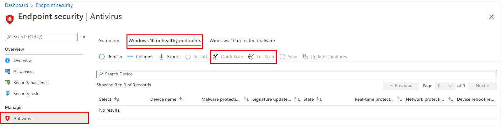

# Configure and run on-demand Microsoft Defender Antivirus scans

You can run an on-demand scan on individual endpoints. These scans will start immediately, and you can define parameters for the scan, such as the location or type. When you run a scan, you can choose from among three types: Quick scan, full scan, and custom scan. In most cases, use a quick scan. A quick scan looks at all the locations where there could be malware registered to start with the system, such as registry keys and known Windows startup folders.

Combined with always-on, real-time protection, which reviews files when they are opened and closed, and whenever a user navigates to a folder, a quick scan helps provide strong protection against malware that starts with the system and kernel-level malware. In most cases, a quick scan is sufficient and is the recommended option for scheduled or on-demand scans. [Learn more about scan types](schedule-antivirus-scans.md#comparing-the-quick-scan-full-scan-and-custom-scan).

> [!IMPORTANT]
> Microsoft Defender Antivirus runs in the context of the [LocalSystem](/windows/win32/services/localsystem-account) account when performing a local scan. For network scans, it uses the context of the device account. If the domain device account doesn't have appropriate permissions to access the share, the scan won't work. Ensure that the device has permissions to access the network share.

## Use Microsoft Defender portal to run a scan

1. Go to the Microsoft Defender portal ([https://security.microsoft.com](https://security.microsoft.com/)) and sign-in.
1. Go to the **device page** that you would like to run a remote scan.
1. Click on the ellipses **(...)**.
1. Click on **Run Antivirus Scan**.
1. Under **Select scan type**, select the radio button for **Quick Scan** or **Full Scan**.
1. Add a comment.
1. Click on **Confirm**.

To check on the status:

1. Under **Actions & submissions**, select **Action Center** and then select **History** tab.
1. Click on **Filters**.
1. Under the **Action Type**, check the box for **Start antivirus scan**.
1. Click on **Apply**.
1. Select one of the **radio button**.
1. Under **Action Status**, you'll see the status such as **Completed**.

To check on the detections, see [Review the results of Microsoft Defender Antivirus scans | Microsoft Learn](review-scan-results-microsoft-defender-antivirus.md)

## Use Microsoft Intune to run a scan

### Use endpoint security to run a scan on Windows devices

1. Go to the Microsoft Intune admin center ([https://intune.microsoft.com](https://intune.microsoft.com)) and sign-in.

1. Choose **Endpoint security** \> **Antivirus**.

1. In the list of tabs, select **Windows 10 unhealthy endpoints** or **Windows 11 unhealthy endpoints**.

1. From the list of actions provided, select **Quick Scan** (recommended) or **Full Scan**.

   [](media/mem-antivirus-scan-on-demand.png#lightbox)

> [!TIP]
> For more information about using Microsoft Configuration Manager to run a scan, see [Antimalware and firewall tasks: How to perform an on-demand scan](/intune/configmgr/protect/deploy-use/endpoint-antimalware-firewall#how-to-perform-an-on-demand-scan-of-computers).

### Use devices to run a scan on a single device

1. Go to the Microsoft Intune admin center ([https://intune.microsoft.com](https://intune.microsoft.com)) and sign-in.

1. From the sidebar, select **Devices** \> **All Devices** and choose the device you want to scan.

1. Select **...More** and select **Quick Scan** (recommended) or **Full Scan** from the options.

## Use the Windows Security app to run a scan

For instructions on running a scan on individual endpoints, see [Run a scan in the Windows Security app](microsoft-defender-security-center-antivirus.md).

<a name="use-powershell-cmdlets-to-run-a-scan"></a>

## Use PowerShell to run a scan

Run the following command:

```powershell
Start-MpScan
```

For detailed syntax and parameter information, see [Start-MpScan](/powershell/module/defender/start-mpscan).

<a name="use-powershell-cmdlets-to-run-a-quick-scan-without-excluding-antivirus-exclusions"></a>

## Use PowerShell to run a quick scan without exclusions

Run the following command:

```PowerShell
Set-MpPreference -QuickScanIncludeExclusions ScanRtpExclusions
```

The value ScanRtpExclusions or 1 includes paths that are excluded from antivirus using contextual exclusions with the following restrictions: `ScanTrigger:OnAccess`, `ScanTrigger:BM`, and `Process:`. For more information on how to set these exclusions, see [Contextual file and folder exclusions](configure-contextual-file-folder-exclusions-microsoft-defender-antivirus.md).

The default value Disabled or 0 disables the inclusion of the contextually excluded paths.

> [!IMPORTANT]
> Including very large directories in quick scans might significantly increase the time it takes for the quick scan to complete.

For more information on how to use PowerShell with Microsoft Defender Antivirus, see [Use PowerShell cmdlets to configure and run Microsoft Defender Antivirus](use-powershell-cmdlets-microsoft-defender-antivirus.md) and [Defender Antivirus cmdlets](/powershell/module/defender/).

<a name="use-the-mpcmdrunexe-command-line-utility-to-run-a-scan"></a>

## Use the MpCmdRun command-line tool to run a quick scan

In an elevated Command Prompt (a Command Prompt window you opened by selecting **Run as administrator**), run the following commands:

> [!TIP]
> The first command changes the directory to the latest version of \<antimalware platform version\> in `%ProgramData%\Microsoft\Windows Defender\Platform\<antimalware platform version>`. If that path doesn't exist, it goes to `%ProgramFiles%\Windows Defender`.

```dos
(set "_done=" & if exist "%ProgramData%\Microsoft\Windows Defender\Platform\" (for /f "delims=" %d in ('dir "%ProgramData%\Microsoft\Windows Defender\Platform" /ad /b /o:-n 2^>nul') do if not defined _done (cd /d "%ProgramData%\Microsoft\Windows Defender\Platform\%d" & set _done=1)) else (cd /d "%ProgramFiles%\Windows Defender")) >nul 2>&1

MpCmdRun.exe -Scan -ScanType 1
```

For more information about MpCmdRun and the different `-ScanType` values, see [Configure and manage Microsoft Defender Antivirus with the MpCmdRun command-line tool](command-line-arguments-microsoft-defender-antivirus.md).

## Use Windows Management Instrumentation (WMI) to run a scan

Use the [**Start** method](/previous-versions/windows/desktop/defender/start-msft-mpscan) of the **MSFT_MpScan** class.

For more information about which parameters are allowed, see [Windows Defender WMIv2 APIs](/previous-versions/windows/desktop/defender/windows-defender-wmiv2-apis-portal)

> [!TIP]
> If you're looking for Antivirus related information for other platforms, see:
>
> - [Set preferences for Microsoft Defender for Endpoint on macOS](mac-preferences.md)
> - [Microsoft Defender for Endpoint on Mac](microsoft-defender-endpoint-mac.md)
> - [macOS Antivirus policy settings for Microsoft Defender Antivirus for Intune](/intune/intune-service/protect/antivirus-microsoft-defender-settings-macos)
> - [Set preferences for Microsoft Defender for Endpoint on Linux](linux-preferences.md)
> - [Microsoft Defender for Endpoint on Linux](microsoft-defender-endpoint-linux.md)
> - [Configure Defender for Endpoint on Android features](android-configure.md)
> - [Configure Microsoft Defender for Endpoint on iOS features](ios-configure-features.md)
