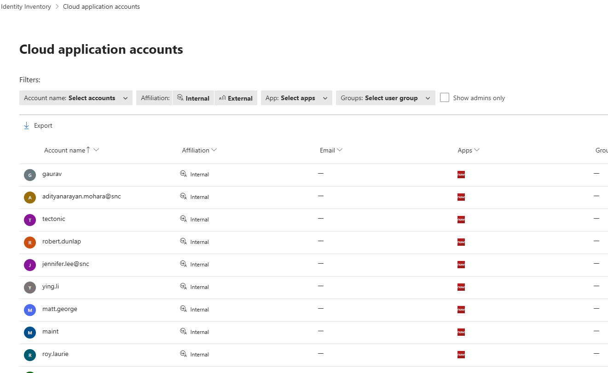
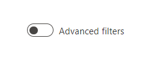
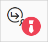

# Investigate accounts from connected apps

Microsoft Defender for Cloud Apps shows you account information from your connected applications. After you connect an app using the [App connector](/defender-cloud-apps/enable-instant-visibility-protection-and-governance-actions-for-your-apps), Defender for Cloud Apps reads account data including permissions, group memberships, aliases, and app usage.

When Defender for Cloud Apps detects a new account in a connected app, for example through activities or file sharing, it adds the account to the accounts list. This lets you see external user activity in your cloud apps.

You can view the Cloud application accounts inventory from the tile at the top of the [Identity Inventory page](/defender-for-identity/identity-inventory).

## Cloud application accounts tab

The **Cloud application accounts** tab shows details about accounts from connected cloud applications, including activity history and security alerts.

You can filter the tab to find specific accounts or narrow down to specific account types. For example, you can filter for all external accounts that haven't been accessed since last year.

Use the **Cloud application accounts** tab to:

- Check for accounts that are inactive in a particular service and consider revoking their license.
- Filter for accounts with admin permissions.
- Search for accounts that belong to people who left your organization but might still be active.
- Take actions on accounts, such as suspending an app or opening the account settings page.
- View which accounts are included in each user group.
- See which apps are accessed by each account and which apps are deleted for specific accounts.

### Accounts filters

The **Cloud application accounts** tab includes predefined filters for common scenarios. You can also turn on the **Advanced filters** toggle to filter by additional attributes or create conditions such as "does not equal."

Predefined filters include:

- **Account name**: Filter by specific accounts.
- **Affiliation**: Internal or external. Set internal accounts under **Settings** by defining the **IP address range of your organization**. Admin accounts are marked with a red tie icon.

    

- **App**: Filter by any connected app used by accounts in your organization.
- **Groups**: Filter by members of user groups in Defender for Cloud Apps, both built-in and imported user groups.
- **Show Admins only**: Filter for admin accounts only.

### Additional actions

You can take additional actions from the **Cloud application accounts** tab. Select the three dots at the end of an account's row to view options such as viewing related activities and incidents. Select the account row to see other accounts related to the same user.

## Next steps

> [!div class="nextstepaction"]
> [Best practices for protecting your organization](best-practices.md)

To get assistance or support for your product issue, [open a support ticket](/defender-xdr/contact-defender-support).
