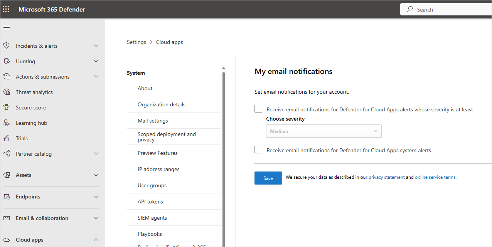

# Configure admin notifications in Microsoft Defender for Cloud Apps

Microsoft Defender for Cloud Apps allows you to customize admin email notification settings. As an administrator, you can configure which policy violation alerts trigger email notifications and set the minimum severity level for those notifications. Email notifications are sent to the email alias associated with your administrator account. Notifications aren't sent for Microsoft Entra IPC events.

## Customize admin email notification settings

Use the following steps to customize your admin email notification settings in the Microsoft Defender Portal:

1. In the Microsoft Defender Portal, select **Settings**. Then choose **Cloud Apps**.
1. Under **My account**, select **My email notifications**.

1. In the **My email notifications** page, set the email notification preferences for emails you receive from the system. You can set the severity that determines which alerts and violations you want to receive emails. The severity is set per policy. When violations are triggered, you receive email notification depending on the setting here and the Severity setting in the policy that was violated. Emails are sent to the alias associated with the administrator user account you used to sign in to Defender for Cloud Apps.

    > [!NOTE]
    >
    > - Notifications are not sent for Microsoft Entra IPC events.

    

1. When you're done, select **Save**.

## Next steps

> [!div class="nextstepaction"]
> [Set up cloud discovery](set-up-cloud-discovery.md)

If you run into any problems, we're here to help. To get assistance or support for your product issue, please [contact Microsoft Defender XDR support](/defender-xdr/contact-defender-support).
