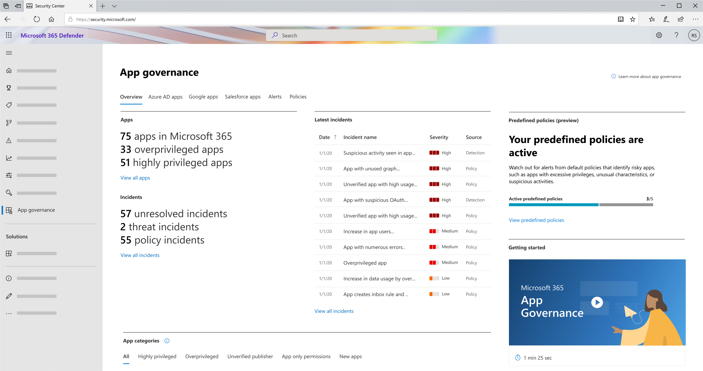
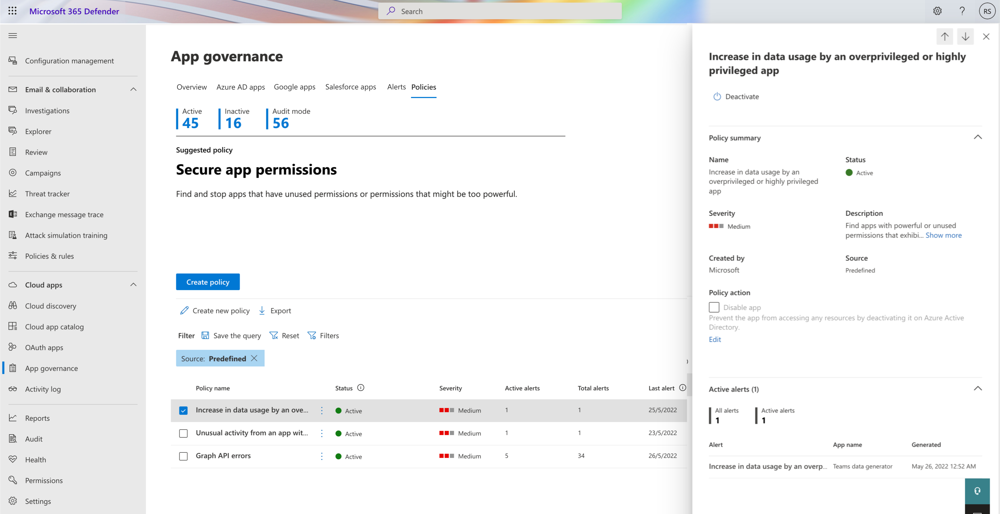

# Learn about OAuth app policies

App governance uses machine learning-based detection algorithms to detect anomalous app behavior in your organization and generates alerts that you can see, investigate, and resolve. Beyond this built-in detection capability, you can use a set of default policy templates or create your own app policies that generate other alerts.

These policies for app and user patterns and behaviors can protect your users from using noncompliant or malicious apps and limit the access of risky apps to your tenant data.

You can create policies in app governance to manage OAuth apps in Microsoft 365, Google, and Salesforce.

There are two types of policies in app governance:

- **Predefined policies**: App governance includes a set of predefined policies tailored to your environment. They allow you to start monitoring your apps even before you set up any policies, ensuring that you're notified of any app anomalies early on. The app governance threat detection team regularly modifies the underlying conditions and adds new predefined policies.

- **User-defined policies**: In addition to predefined policies, admins can use the available conditions to create custom policies or pick from the available recommended policy templates.

## Supported roles

For more information, see [App governance roles](app-governance-get-started.md#roles).

## View policies

To see your list of current app policies, go to **Microsoft Defender XDR > App governance** and select **Policies**. This shows a list of all your policies in app governance.

For example:

:::image type="content" source="media/app-governance-app-policies-get-started/app-governance-app-policies.png" alt-text="Screenshot that shows the app governance app policies." lightbox="media/app-governance-app-policies-get-started/app-governance-app-policies.png":::

> [!NOTE]
> Built-in threat detection policies aren't listed on the **Policies** tab. For more information, see [Investigate threat detection alerts](app-governance-anomaly-detection-alerts.md).

The **Policies** tab shows the number of active and disabled policies, and the following information for each policy:

- **Policy name**
- **Status**

  - **Active**: All policy evaluation and actions are active.
  - **Disabled**: All policy evaluation and actions are disabled.

- **Severity**: Severity level set on any alerts triggered because of this policy being evaluated as true, which is part of the configuration of the policy.
- **Active alerts**: Number of alerts generated by the policy that have an **In Progress** or **New** status.
- **Total alerts**: Number of both active alerts and resolved alerts for this policy.
- **Last alert**: Date of last generated alert due to this policy.
- **Last Modified**: Date when this policy was last changed.
- **Source**:

  - **Predefined**: Policies created by app governance.
  - **User defined**: Policies created by the tenant admin.

The policy list is sorted by **Last modified** by default. To sort the list by another attribute, select the attribute name.

When you select a policy, you get a detailed policy pane with these extra details:

- **Name**
- **Severity**: Based on the severity level set when the policy was created
- **Description**: A more detailed explanation of the purpose of the policy.
- **Last modified**
- A list of the total and active alerts generated by this policy.

You can edit, activate, deactivate, or delete an app policy by selecting **Edit**, **Delete**, **Activate**, or **Deactivate** in the detailed policy pane, or by selecting the vertical ellipses of the policy in the policy list.

You can also:

- Create a new policy. You can start with an app usage policy or a permissions policy.
- Export the policy list to a comma-separated value (CSV) file. For example, you could open the CSV file in Microsoft Excel and sort the policies by **Severity** and then **Number of Total Alerts**.
- Search the policy list.

## Predefined policies

App governance contains a set of out-of-the-box policies to detect anomalous app behaviors. These policies are activated by default, but you can deactivate them if you choose to.

> [!VIDEO https://learn-video.azurefd.net/vod/player?id=22872b35-18aa-424d-bec7-3f77869a5e47]

### Work with predefined policies

- To view available predefined policies, go to **Microsoft Defender XDR** > **App governance** > **Overview** and select **View predefined policies** in the **Predefined policies** section.

    

- Alternatively, go to **Microsoft Defender XDR** > **App governance** > **Policies** and filter for **Source: Predefined** to see the list of available predefined policies.

    

- To view the description of the policy, select the policy to see the policy summary and description in the detailed policy window.
- To change the status of a policy (deactivate/activate), select the policy and select **Deactivate** in the detailed policy window.
- By default, predefined policies trigger alerts when the conditions are met. You can choose to automatically disable the app when the policy triggers. Use caution when applying these actions because a policy might affect users and legitimate app use. To disable the app, mark the **Disable app** box under **Policy action** in the summary section and select **Save**.
- Alerts generated from predefined policies are listed as app governance policy alerts in the Microsoft Defender XDR alerts queue.

## Next step

[Create app policies](app-governance-app-policies-create.md)
