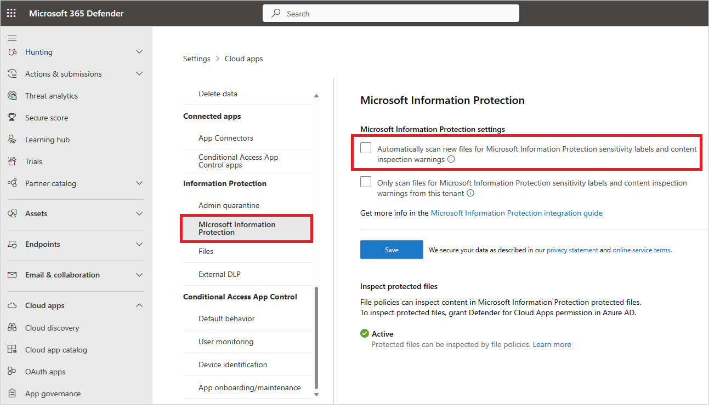
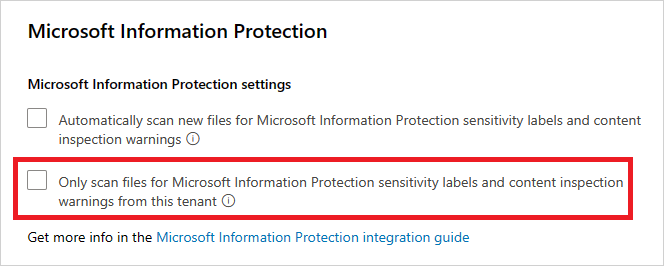
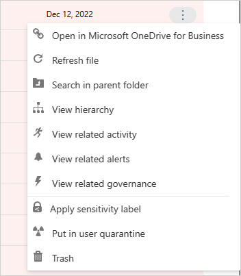
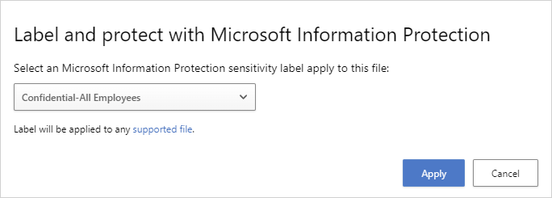
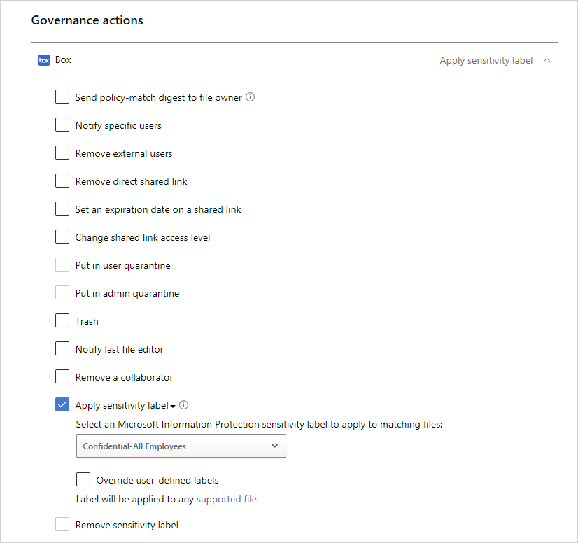
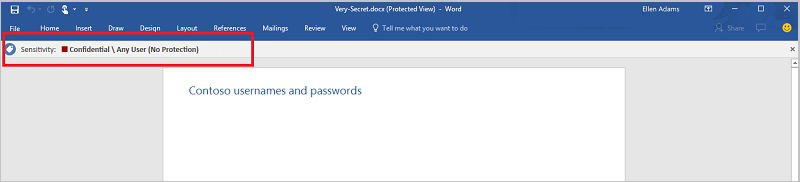
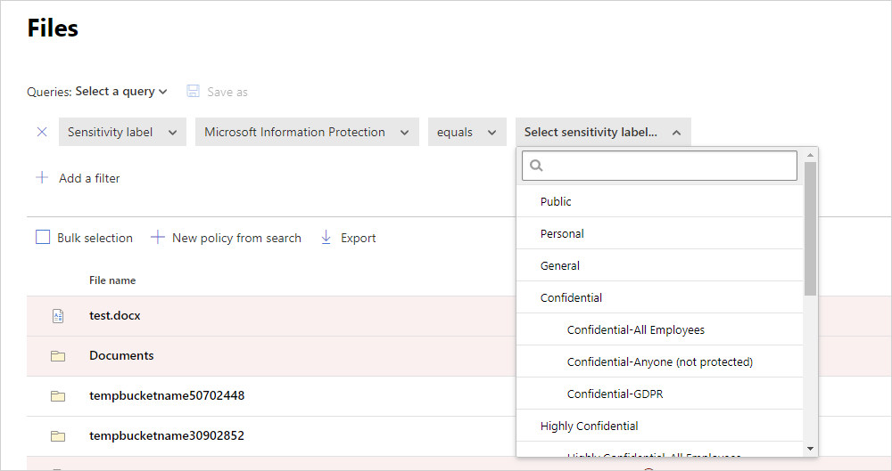
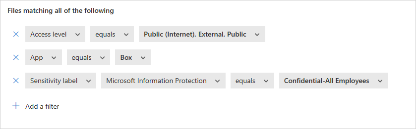
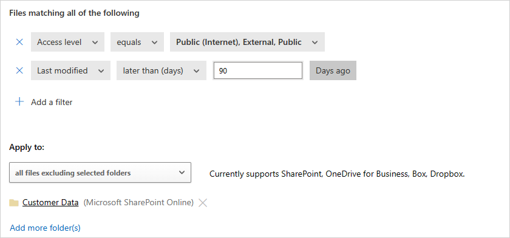

# Integrate with Microsoft Purview for information protection

> [!IMPORTANT]
> File policies retire on January 6, 2027. To maintain file-based data protection, [migrate to Microsoft Purview DLP or auto-labeling policies](migrate-file-policies-to-purview.md).

Microsoft Defender for Cloud Apps lets you automatically apply sensitivity labels from Microsoft Purview. These labels are applied to files as a file policy governance action, and depending on the label configuration, can apply encryption for additional protection. You can also investigate files by filtering for the applied sensitivity label within Defender for Cloud Apps. Using labels enables greater visibility and control of your sensitive data in the cloud. Integrating Microsoft Purview with Defender for Cloud Apps is as easy as selecting a single checkbox.

By integrating Microsoft Purview into Defender for Cloud Apps, you can use the full power of both services and secure files in your cloud, including:

- The ability to apply sensitivity labels as a governance action to files that match specific policies
- The ability to view all classified files in a central location
- The ability to investigate according to classification level, and quantify exposure of sensitive data over your cloud applications
- The ability to create policies to make sure classified files are being handled properly

## Prerequisites

> [!NOTE]
> To enable Microsoft Purview sensitivity label integration, you need both a Defender for Cloud Apps license and a license for Microsoft Purview. As soon as both licenses are in place, Defender for Cloud Apps syncs the organization's labels from Microsoft Purview.

- To work with Microsoft Purview integration, you must enable the [App connector for Microsoft 365](./connect-office-365.md).

For Defender for Cloud Apps to apply sensitivity labels, they must be published as part of a sensitivity label policy in Microsoft Purview.

Defender for Cloud Apps currently supports applying sensitivity labels from Microsoft Purview for the following file types:

- Word: docm, docx, dotm, dotx
- Excel: xlam, xlsm, xlsx, xltx
- PowerPoint: potm, potx, ppsx, ppsm, pptm, pptx
- PDF
  > [!NOTE]
  > For PDF, you must use unified labels.

Applying sensitivity labels from Microsoft Purview is currently available for files stored in Box, Google Workspace, SharePoint Online, and OneDrive. More cloud apps will be supported in future versions.

## How it works

You can see the sensitivity labels from Microsoft Purview in Defender for Cloud Apps. As soon as you integrate Defender for Cloud Apps with Microsoft Purview, Defender for Cloud Apps scans files as follows:

1. Defender for Cloud Apps retrieves the list of all the sensitivity labels used in your tenant. Defender for Cloud Apps performs this retrieval every hour to keep the list up to date.

2. Defender for Cloud Apps then scans the files for sensitivity labels, as follows:

    - If you enabled automatic scan, all new or modified files are added to the scan queue and all existing files and repositories will be scanned.
    - If you set a file policy to search for sensitivity labels, these files are added to the scan queue for sensitivity labels.

3. The sensitivity-label scans described in step 2 cover the sensitivity labels discovered in the initial scan Defender for Cloud Apps does to see which sensitivity labels are used in your tenant. External labels, classification labels set by someone external to your tenant, are added to the list of classification labels. If you don't want to scan for external sensitivity labels, select the **Only scan files for Microsoft Information Protection sensitivity labels and content inspection warnings from this tenant** check box.

4. After you enable Microsoft Purview on Defender for Cloud Apps, all new files that are added to your connected cloud apps will be scanned for sensitivity labels.

5. You can create new policies within Defender for Cloud Apps that apply your sensitivity labels automatically.

### Integration limits

Note the following limits when using Microsoft Purview labels with Defender for Cloud Apps.

| Limit | Description |
|------|--------------|
| **Files with labels or protection applied outside of Defender for Cloud Apps** | Unprotected labels applied outside of Defender for Cloud Apps can be overridden by Defender for Cloud Apps but can’t be removed.    Defender for Cloud Apps can't remove labels with protection from files that were labeled outside of Defender for Cloud Apps.   To scan files with protection applied outside of Defender for Cloud apps, [grant permissions to inspect content for protected files](content-inspection.md#content-inspection-for-protected-files).|
| **Files labeled by Defender for Cloud Apps** | Defender for Cloud Apps doesn't override labels on files that have already been labeled by Defender for Cloud Apps.|
| **Password protected files** |Defender for Cloud Apps can't read labels on password-protected files. |
| **Empty files** | Empty files aren't labeled by Defender for Cloud Apps. |
| **Libraries that require checkout** | Defender for Cloud Apps can't label files located in libraries that are [configured to require checkout](https://support.microsoft.com/office/set-up-a-library-to-require-check-out-of-files-0c73792b-f727-4e19-a1f9-3173899e695b). |
| **Scope requirements** | In order for Defender for Cloud Apps to recognize a sensitivity label, the label scope in Purview must be configured for at least Files and Emails. |

> [!NOTE]
> Microsoft Purview is Microsoft’s principal solution for labeling services. For more information, see the [Microsoft Purview documentation](/purview/apply-sensitivity-label-automatically).

## How to integrate Microsoft Purview with Defender for Cloud Apps

You can enable Microsoft Purview integration, apply sensitivity labels directly to files, and configure automatic labeling policies in Defender for Cloud Apps.

### Enable Microsoft Purview

All you have to do to integrate Microsoft Purview with Defender for Cloud Apps is select a single checkbox. By enabling automatic scan, you enable searching for sensitivity labels from Microsoft Purview on your Microsoft 365 files without the need to create a policy. After you enable automatic scan, if you have files in your cloud environment that are labeled with sensitivity labels from Microsoft Purview, you'll see them in Defender for Cloud Apps.

To enable Defender for Cloud Apps to scan files with content inspection enabled for sensitivity labels:

In the Microsoft Defender Portal, select **Settings**. Then choose **Cloud Apps**. Then go to **Information Protection** -> **Microsoft Information Protection**.

1. Under **Microsoft Information Protection settings**, select **Automatically scan new files for sensitivity labels from Microsoft Information Protection and content inspection warnings**.

    

After enabling Microsoft Purview, you'll be able to see files that have sensitivity labels and filter them per label in Defender for Cloud Apps. After Defender for Cloud Apps is connected to the cloud app, you'll be able to use the Microsoft Purview integration features to apply sensitivity labels from Microsoft Purview (with or without encryption) in the Defender for Cloud Apps, by adding them directly to files or by configuring a file policy to apply sensitivity labels automatically as a governance action.

> [!NOTE]
> Automatic scan does not scan existing files until they are modified again. To scan existing files for sensitivity labels from Microsoft Purview, you must have at least one **File policy** that includes content inspection. If you have none, create a new **File policy**, delete all the preset filters, under **Inspection method** select **Built-in DLP**. In the **Content inspection** field, select **Include files that match a preset expression** and select any predefined value, and save the policy. This enables content inspection, which automatically detects sensitivity labels from Microsoft Purview.

#### Set internal and external labels

By default, Defender for Cloud Apps scans sensitivity labels that were defined in your organization and external ones defined by other organizations.

To ignore sensitivity labels set external to your organization, go to the Microsoft Defender Portal and select **Settings**. Then choose **Cloud Apps**. Under **Information Protection**, select **Microsoft Information Protection**. Then select **Only scan files for Microsoft Information Protection sensitivity labels and content inspection warnings from this tenant**.

### Apply labels directly to files

Use the following steps to apply a sensitivity label directly to a file in Defender for Cloud Apps.

1. In the Microsoft Defender Portal, under **Cloud Apps**, choose **Files**. Then select the file you want to protect. Select the three dots at the end of the file's row and then choose **Apply sensitivity label**.

    

    >[!NOTE]
    > Defender for Cloud Apps can apply Microsoft Purview on files that are up to 30 MB.

2. Choose one of your organization's sensitivity labels to apply to the file, and select **Apply**.

    

3. After you choose a sensitivity label and select **Apply**, Defender for Cloud Apps will apply the sensitivity label to the original file.

4. You can also remove sensitivity labels by choosing the **Remove sensitivity label** option.

   For more information about how Defender for Cloud Apps and Microsoft Purview work together, see [Automatically apply sensitivity labels from Microsoft Purview](use-case-information-protection.md).

### Automatically label files

You can automatically apply sensitivity labels to files by creating a file policy and setting **Apply sensitivity label** as the governance action.

Follow these instructions to create the file policy:

1. Create a file policy.
2. Set the policy to include the type of file you want to detect. For example, select all files where **Access level** doesn't equal **Internal** and where the **Owner OU** equals your finance team.
3. Under governance actions for the relevant app, select **Apply sensitivity label** then select the label type.

    

> [!NOTE]
>
> - The ability to apply a sensitivity label is a powerful capability. To protect customers from mistakenly applying a label to a large number of files, as a safety precaution there is a daily limit of 100 **Apply label** actions per app, per tenant. After the daily limit is reached, the apply label action pauses temporarily and continues automatically the next day (after 12:00 UTC).
> - When a policy is disabled, all pending labeling tasks for that policy are suspended.
> - In the label configuration, permissions must be assigned to any authenticated user, or all users in your organization, for Defender for Cloud Apps to read label information.

### Control file exposure

The following example shows how labeled files can be located and managed in Defender for Cloud Apps.

1. For example, let's say you labeled the following document with a Microsoft Purview sensitivity label:

    

1. You can see this document in Defender for Cloud Apps by filtering on the sensitivity label for Microsoft Purview in the **Files** page.

    

1. You can get more information about these files and their sensitivity labels in the file drawer. Just select the relevant file in the **Files** page and check whether it has a sensitivity label.

    :::image type="content" source="media/file-policies/file-drawer.png" alt-text="Screenshot of the file drawer displaying file details and whether a sensitivity label is applied." lightbox="media/file-policies/file-drawer.png":::

1. Then, you can create file policies in Defender for Cloud Apps to control files that are shared inappropriately and find files that are labeled and were recently modified.

    - You can create a policy that automatically applies a sensitivity label to specific files.
    - You can also trigger alerts on activities related to file classification.

> [!NOTE]
> When sensitivity labels are disabled on a file, the disabled labels appear as disabled in Defender for Cloud Apps. Deleted labels are not displayed.

**Sample policy - confidential data that is externally shared on Box:**

1. Create a file policy.
1. Set the policy's name, severity, and category.
1. Add the following filters to find all confidential data that is externally shared on Box:

    

**Sample policy - restricted data that was recently modified outside the Customer Data folder on SharePoint:**

1. Create a file policy.
1. Set the policy's name, severity, and category.
1. Add the following filters to find all recently modified restricted files while excluding the Customer Data folder in the folder selection option:

    

You can also choose to set alerts, user notification or take immediate action for these policies.
Learn more about [governance actions](governance-actions.md).

Learn more about [Microsoft Purview](/microsoft-365/compliance/information-protection).

## Next steps

> [!div class="nextstepaction"]
> [Control cloud apps with policies](control-cloud-apps-with-policies.md)

[!INCLUDE [Open support ticket](includes/support.md)]
