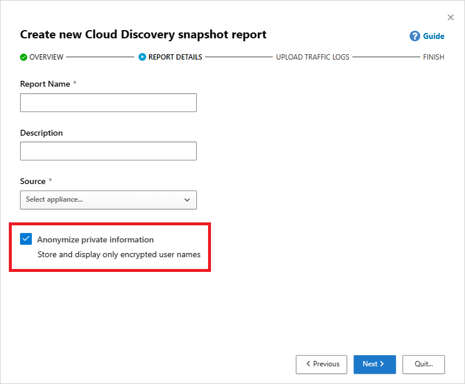
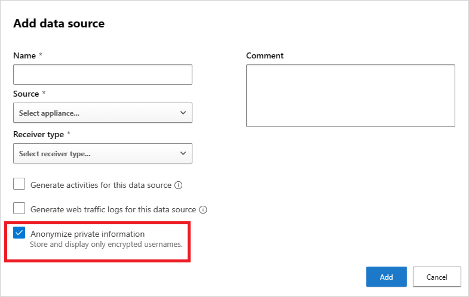
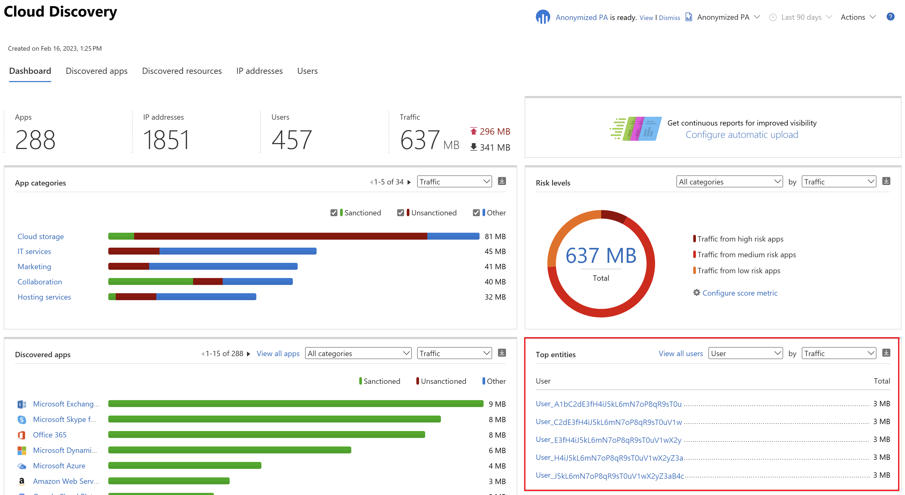
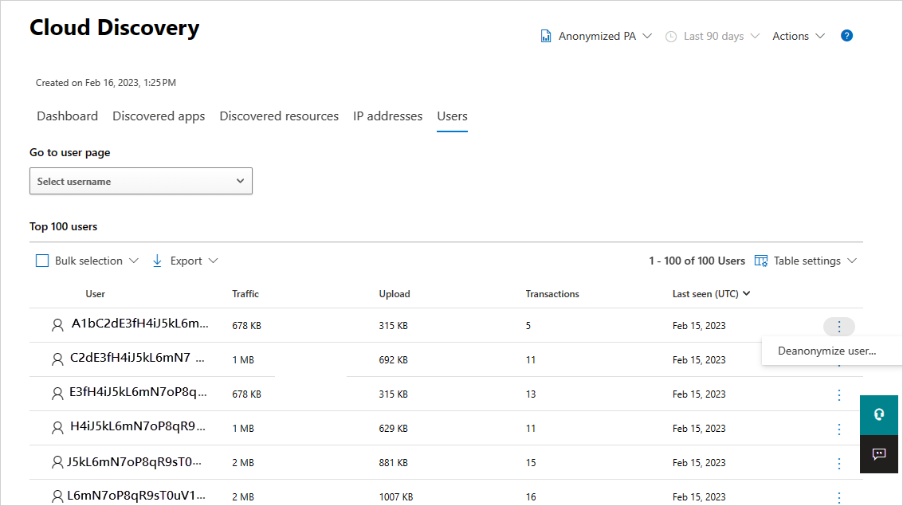
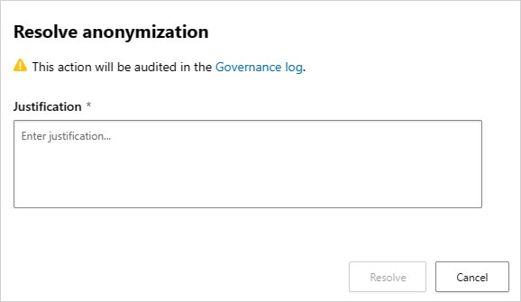
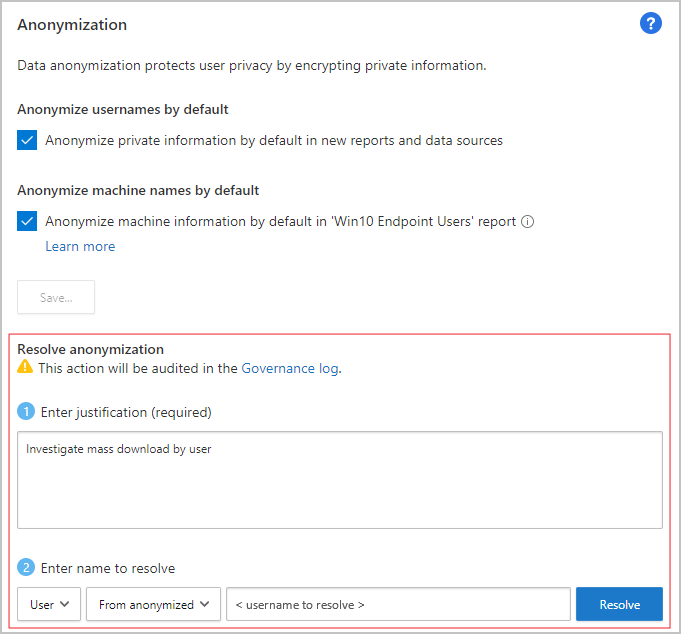
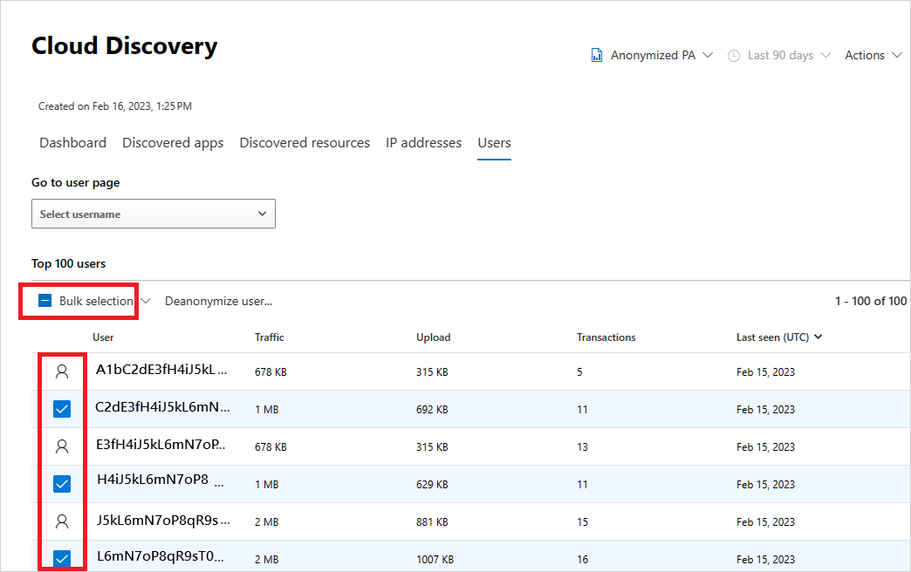

# Cloud discovery data anonymization

Cloud discovery data anonymization enables you to protect user privacy. Once the data log is uploaded to Microsoft Defender for Cloud Apps, the log is sanitized and all username information is replaced with encrypted usernames. By replacing usernames with encrypted values, all cloud activities are kept anonymous. When necessary, for a specific security investigation (for example, a security breach or suspicious user activity), admins can resolve the real username. If an admin has a reason to suspect a specific user, they can also look up the encrypted username of a known username, and then start investigating using the encrypted username. Each username conversion is audited in the portal's **Governance log**.

Key points:

- No private information is stored or displayed. Only encrypted information.
- Private data is encrypted using AES-128 with a dedicated key per tenant.
- Resolving usernames is done ad-hoc, per-username by deciphering a given encrypted username.
- Anonymization capabilities aren't supported when using the "Defender for Cloud Apps Proxy" stream.
- As Microsoft Defender moves toward a fully unified identity platform, some Defender for Cloud Apps data pipelines remain separate. Cloud discovery data anonymization uses a separate data pipeline that isn't yet integrated with the [Identity inventory](/defender-for-identity/identity-inventory). Correlations defined in the Identity inventory don't affect anonymization. For a full list of affected features, see [Enable Identity inventory integration](/defender-cloud-apps/general-setup#enable-identity-inventory-integration).

## Prerequisites

To resolve (deanonymize) usernames in Cloud Discovery data:

- You must have the [Cloud Discovery global admin](manage-admins.md#built-in-admin-roles-in-defender-for-cloud-apps) role with anonymization permissions enabled during role assignment.

> [!NOTE]
> Microsoft recommends that you use roles with the fewest permissions. Using roles with the fewest permissions helps improve security for your organization. Global Administrator is a highly privileged role that should be limited to emergency scenarios when you can't use an existing role.

## How data anonymization works

1. There are three ways to apply data anonymization:

    - You can set the data from a specific log file to be anonymized, by selecting **Anonymize private information** when you [create a snapshot cloud discovery report](create-snapshot-cloud-discovery-reports.md). Select **Anonymize private information**.  
    

    - You can anonymize data from a new data source by selecting **Anonymize private information** when you [set up an automated log upload](discovery-docker.md).  
    

    - You can set the default in Defender for Cloud Apps to anonymize all data from both snapshot reports from uploaded log files and continuous reports from log collectors as follows:

        1. In the Microsoft Defender Portal, select **Settings**. Then choose **Cloud Apps**.

        1. Under **Cloud Discovery**, select **Anonymization**. To anonymize usernames by default, select **Anonymize private information by default in new reports and data sources**. You can also select **Anonymize device information by default in 'Defender-managed endpoints' report**. 

1. When anonymization is selected, Defender for Cloud Apps parses the traffic log and extracts specific data attributes.
1. Defender for Cloud Apps replaces the username with an encrypted username.
1. Defender for Cloud Apps then analyzes cloud usage data and generates cloud discovery reports based on the anonymized data.

    

1. For a specific investigation, such as an investigation of an anomalous usage alert, you can resolve the specific username in the portal and provide a business justification.

    > [!NOTE]
    > The following steps also work for device names on the **Devices** tab.

    **To resolve a single username**:

    1. Select the three dots at the end of the row of the user you want to resolve and select **Deanonymize user**.

        

    1. In the pop-up, enter the justification for resolving the username and then select **Resolve**. In the relevant row, the resolved username is displayed.

        > [!NOTE]
        > Resolving a username is audited.

        

    You can also use the Anonymization settings page to resolve a single username or look up the encrypted username of a known username.

    1. In the Microsoft Defender Portal, select **Settings**. Then choose **Cloud Apps**.

    1. Under **Cloud Discovery**, select **Anonymization**. Then, under **Anonymize and resolve usernames**  enter a justification for why you're doing the resolution.
    1. Under **Enter username to resolve**, select **From anonymized** and enter the anonymized username, or select **To anonymized** and enter the original username to resolve. Select **Resolve**.

        

    **To resolve multiple usernames**:

    1. Either select the checkboxes that appear when you hover over the user icons by the users you want to resolve or, in the top-left, corner select the **Bulk selection** checkbox.

        

    1. Select **Deanonymize user**.
    1. In the pop-up, enter the justification for resolving the username and then select **Resolve**. In the relevant rows, the resolved usernames are displayed.

        > [!NOTE]
        > Bulk username resolution is audited.

        

1. Each username resolution action is audited in the portal's **Audit log**.

> [!NOTE]
> Starting October, 2025 - **Resolve Anonymization** actions are no longer part of **Governance logs**. Instead, they will be audited in the **Activity log** only.

## Next steps

> [!div class="nextstepaction"]
> [Control cloud apps with policies](control-cloud-apps-with-policies.md)

[!INCLUDE [Open support ticket](includes/support.md)]
