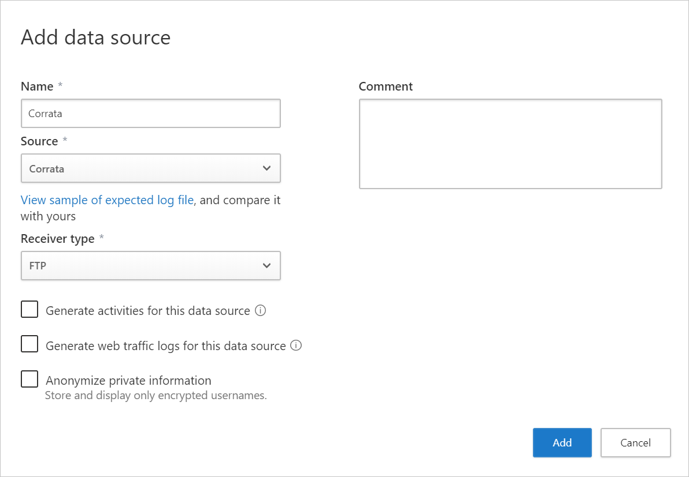

# Integrate Defender for Cloud Apps with Corrata

If you work with both Defender for Cloud Apps and Corrata, you can integrate the two products to enhance your security cloud discovery experience for mobile app use. Corrata, as a local Mobile gateway, monitors your organization's traffic from mobile devices enabling administrators to set policies for blocking transactions. Together, Defender for Cloud Apps and Corrata provide the following capabilities:

- Seamless deployment of cloud discovery - Use Corrata to collect your mobile device traffic and send it to Defender for Cloud Apps. This approach eliminates the need for installation of log collectors on your network endpoints to enable cloud discovery.
- Corrata's block capabilities are automatically applied on apps you set as unsanctioned in Defender for Cloud Apps.
- Enhance your Corrata portal with the Defender for Cloud Apps risk assessment for leading cloud apps, which can be viewed directly in the Corrata portal.

## Prerequisites

Before you begin, make sure you have the following licenses:

- A valid license for Microsoft Defender for Cloud Apps
- A valid license for Corrata Cloud

## Deployment

Perform the following steps to deploy the Corrata integration with Defender for Cloud Apps:

1. In the Corrata portal, integrate Corrata into Defender for Cloud Apps. For instructions, see [Integrating Corrata with Microsoft Defender for Cloud Apps](https://corrata.com/microsoft-mcas-onboarding/).
1. In the [Microsoft Defender Portal](https://security.microsoft.com/), do the following integration steps:
    1. Select **Settings**. Then choose **Cloud Apps**.
    1. Under **Cloud Discovery**, select **Automatic log upload**. Then select **+Add data source**.
    1. In the **Add data source** page, enter the following settings:

        - Name = Corrata
        - Source = Corrata
        - Receiver type = FTP

        

    1. Select **View sample of expected log file**. Then select **Download sample log** to view a sample discovery log, and make sure it matches your logs.

1. Investigate cloud apps discovered on your network. For more information and investigation steps, see [Working with cloud discovery](working-with-cloud-discovery-data.md).

1. Any app that you set as unsanctioned in Defender for Cloud Apps will be pinged by Corrata, and then automatically blocked by Corrata. For more information about unsanctioning apps, see [Sanctioning/unsanctioning an app](governance-discovery.md#sanctioningunsanctioning-an-app).

## Next steps

> [!div class="nextstepaction"]
> [Control cloud apps with policies](control-cloud-apps-with-policies.md)

[!INCLUDE [Open support ticket](includes/support.md)]
