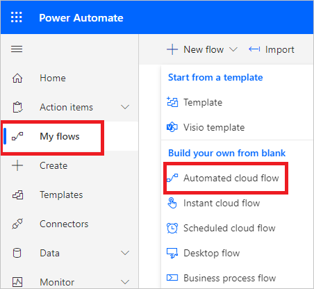
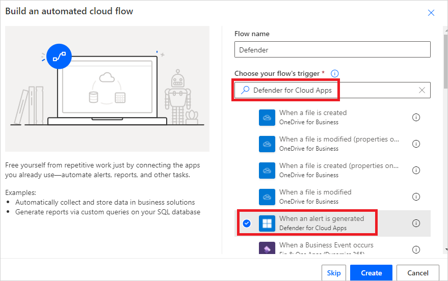
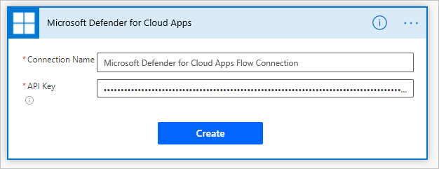
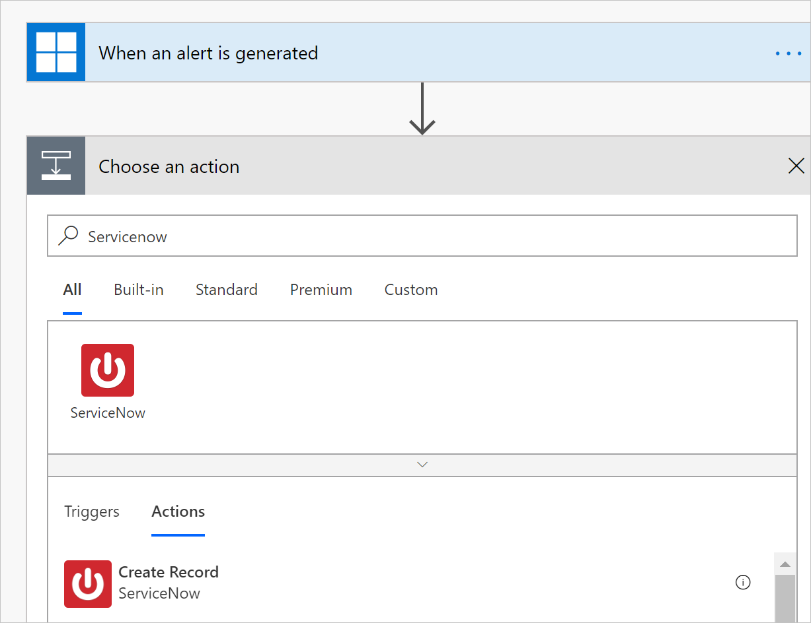
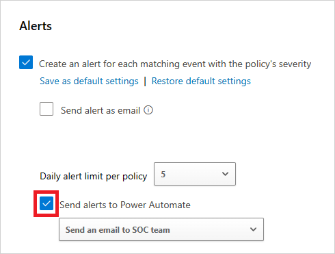
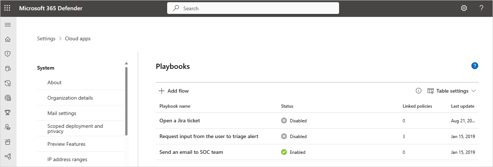

# Integrate with Microsoft Power Automate for custom alert automation

Defender for Cloud Apps integrates with [Microsoft Power Automate](/power-automate/getting-started) to provide custom alert automation and orchestration playbooks. By using the [Power Automate connectors](/connectors/) available in Power Automate, you can automate the triggering of playbooks when Defender for Cloud Apps generates alerts. For example, automatically create an issue in ticketing systems using [ServiceNow connector](/connectors/service-now/) or send an approval email to execute a custom governance action when an alert is triggered in Defender for Cloud Apps. Before you begin, make sure you meet the [prerequisites](#prerequisites).

## Prerequisites

Before you create playbooks, make sure you meet the following prerequisites:

- You must have a valid [Microsoft Power Automate plan](https://flow.microsoft.com/pricing/)
- [Create an API token](api-tokens-legacy.md) in Defender for Cloud Apps.

## How it works

On its own, Defender for Cloud Apps provides predefined governance options such as suspend a user or make a file private when defining policies. By creating a playbook in Power Automate using a Defender for Cloud Apps connector, you can create workflows to enable customized governance options for your policies. After the playbook is created in Power Automate, it will be automatically synchronized to Defender for Cloud Apps. Then associate the playbook with a policy in Defender for Cloud Apps to send alerts to Power Automate. Microsoft Power Automate offers several connectors and conditions to create a customized workflow for your organization.

The [Defender for Cloud Apps connector](/connectors/cloudappsecurity/) in Power Automate supports automated triggers and actions. Power Automate is triggered automatically when Defender for Cloud Apps generates an alert. Actions include changing the alert status in Defender for Cloud Apps.

## Create Power Automate playbooks for Defender for Cloud Apps

Perform the following steps to create a Power Automate playbook for Defender for Cloud Apps:

1. [Create an API token](api-tokens-legacy.md) in Defender for Cloud Apps.

1. Navigate to the [Power Automate portal](https://flow.microsoft.com/), select **My flows**, select **New flow**, and in the drop-down, under **Build your own from blank**, select **Automated cloud flow**.

    

1. Provide a name for the flow, and in **Choose your flow's trigger**, type *Defender for Cloud Apps* and select **When an alert is generated**.

    

1. Under **Authentication settings**, paste the Defender for Cloud Apps API token you created in step 1. Give your connection a name and select **Create**.

    

1. Now create the playbook according to your requirements. Select **+New step** to define the workflow that should be triggered when a policy in Defender for Cloud Apps generates an alert. You can add an action, logical condition, switch case conditions, or loops and save the playbook. In this example, we'll be adding a [ServiceNow connector](/connectors/service-now/).

    

1. Continue to configure your playbook. The playbook will be automatically synchronized with Defender for Cloud Apps. For more information about creating cloud flows in Power Automate, see [Create a cloud flow in Power Automate](/power-automate/get-started-logic-flow).
1. In the Microsoft Defender Portal, under **Cloud Apps**, go to **Policies** -> **Policy management**. In the row of the policy whose alerts you want to forward to Power Automate, select the three dots and then select **Edit Policy**.
1. Under **Alerts**, select **Send Alerts to Power Automate** and choose the name of your Power Automate playbook from the drop-down menu.

    

1. Defender for Cloud Apps playbooks that you've authored or are granted access to can be seen by in the Microsoft Defender Portal, by going to **Settings**, then choosing **Cloud Apps**, and under **System** selecting **Playbooks**.

    

> [!NOTE]
>
> The maximum supported number of Power Platform environments is 80, but there is no limit to the number of playbooks that can be used within each environment.

## Next steps

> [!div class="nextstepaction"]
> [Control cloud apps with policies](control-cloud-apps-with-policies.md)

[!INCLUDE [Open support ticket](includes/support.md)]

## Related content

Use the following resource to learn more about alert automation:

- Try our interactive guide: [Automate alerts management with Microsoft Power Automate and Defender for Cloud Apps](https://mslearn.cloudguides.com/guides/Automate%20alerts%20management%20with%20Microsoft%20Power%20Automate%20and%20Cloud%20App%20Security)
