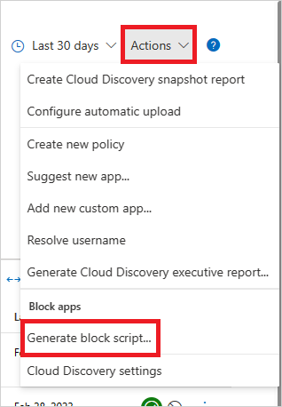
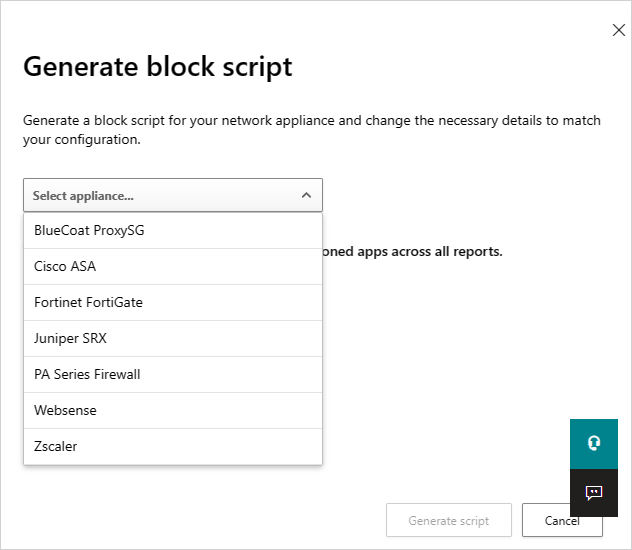
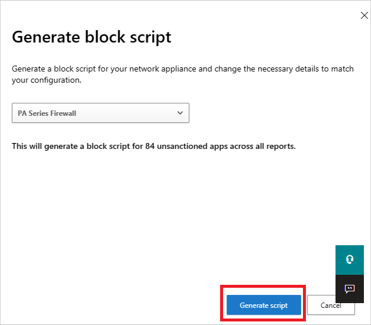

# Govern discovered apps in Microsoft Defender for Cloud Apps

Microsoft Defender for Cloud Apps lets you govern discovered apps by approving safe apps (**Sanctioned**) or prohibiting unwanted apps (**Unsanctioned**). Sanctioned apps are marked as approved for use, while unsanctioned apps can be monitored or blocked. This article covers how to sanction or unsanction apps, block apps by using built-in streams or block scripts, and resolve governance conflicts.

## Prerequisites

Before you block discovered cloud apps, make sure you meet these requirements:

- [Turn on **Cloud Protection** in Microsoft Defender for Endpoint](/defender-endpoint/enable-cloud-protection-microsoft-defender-antivirus)
- [Turn on **Network Protection** in Microsoft Defender for Endpoint](/defender-endpoint/network-protection#required-browser-configuration)
- Install the **Microsoft Defender Browser Protection** add-on in all non-Microsoft browsers in your organization.

## Sanctioning/unsanctioning an app

You can mark a specific risky app as unsanctioned by clicking the three dots at the end of the row. Then select **Unsanctioned**. Unsanctioning an app doesn't block use, but enables you to more easily monitor its use with the cloud discovery filters. You can then notify users of the unsanctioned app and suggest an alternative safe app for their use, or [generate a block script using the Defender for Cloud Apps APIs](api-discovery-script.md) to block all unsanctioned apps.

  :::image type="content" source="media/tag-as-unsanctioned.png" alt-text="Tag as unsanctioned." lightbox="media/tag-as-unsanctioned.png":::

> [!NOTE]
> An app that is onboarded to inline proxy or connected via app connector, all such applications would be auto sanctioned state in Cloud Discovery.
## Blocking apps with built-in streams

If your organization's Microsoft 365 tenant uses Microsoft Defender for Endpoint, apps you mark as unsanctioned are blocked automatically. You can also scope blocking to specific device groups, monitor apps, and use the [warn and educate users when accessing risky apps](mde-govern.md#educate-users-when-accessing-risky-apps) features. For more information, see [Govern discovered apps using Microsoft Defender for Endpoint](mde-govern.md).

If your tenant uses Zscaler NSS, iboss, Corrata, Menlo, or Open Systems, unsanctioned apps are also blocked. However, you can't scope blocking by device groups or use the [warn and educate users when accessing risky apps](mde-govern.md#educate-users-when-accessing-risky-apps) features. For more information, see [Integrate with Zscaler](zscaler-integration.md), [Integrate with iboss](iboss-integration.md), [Integrate with Corrata](Corrata-integration.md), [Integrate with Menlo](menlo-integration.md), and [Integrate with Open Systems](open-systems-integration.md).

## Block apps by exporting a block script

Defender for Cloud Apps enables you to block access to unsanctioned apps by using your existing on-premises security appliances. You can generate a dedicated block script and import it to your appliance. Using a block script doesn't require redirection of all of the organization's web traffic to a proxy.

Before you begin, make sure you have a supported on-premises security appliance configured and available to import the block script.

1. In the cloud discovery dashboard, tag any apps you want to block as **Unsanctioned**.

    :::image type="content" source="media/tag-as-unsanctioned.png" alt-text="Tag as unsanctioned." lightbox="media/tag-as-unsanctioned.png":::

1. In the title bar, select **Actions** and then select **Generate block script...**.

    
   
1. In **Generate block script**, select the appliance you want to generate the block script for.

    
   
1. Then select the **Generate script** button to create a block script for all your unsanctioned apps. By default, the file is named with the date on which it was exported and the appliance type you selected. *2017-02-19_CAS_Fortigate_block_script.txt* would be an example file name.

   
   
5. Import the file created to your appliance.

## Blocking unsupported streams

If your tenant doesn't use Microsoft Defender for Endpoint, Zscaler NSS, iboss, Corrata, Menlo, or Open Systems, you can export all domains for unsanctioned apps. Then configure your third-party appliance to block those domains.

In the **Discovered apps** page, filter all *Unsanctioned* apps and then use the export capability to export all the domains.

## Nonblockable applications

Some services are critical to business operations. To prevent downtime, you can't block these services in Defender for Cloud Apps, whether through the UI or policies:

- Microsoft Defender for Cloud Apps
- Microsoft Defender Security Center
- Microsoft 365 Security Center
- Microsoft Defender for Identity
- Microsoft Purview
- Microsoft Entra Permissions Management
- Microsoft Conditional Access Application Control
- Microsoft Secure Score
- Microsoft Purview
- Microsoft Intune
- Microsoft Support
- Microsoft AD FS Help
- Microsoft Support
- Microsoft Online Services

## Resolve governance conflicts between manual actions and policies

If there's a conflict between a manual sanction or unsanction action and a [governance action set by a cloud discovery policy](cloud-discovery-policies.md), the last operation applied takes precedence.

## Next steps

> [!div class="nextstepaction"]
> [Best practices for protecting your organization](best-practices.md)

[!INCLUDE [Open support ticket](includes/support.md)]
