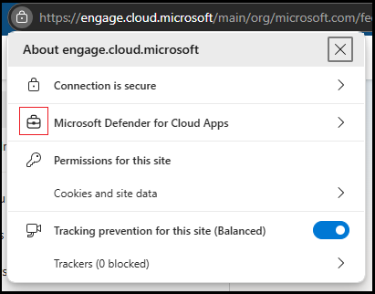

# In-browser protection with Microsoft Edge for Business (Preview)

Defender for Cloud Apps users who use Microsoft Edge for Business or Purview Data Loss Prevention policies for Cloud Apps in Edge and are subject to session policies are protected directly from within the browser. In-browser protection reduces the need for proxies, improving both security and productivity.

Protected users experience a smooth experience with their cloud apps, without latency or app compatibility issues, and with a higher level of security protection.

> [!NOTE]
> In-browser protection with Microsoft Edge is only available to Microsoft Defender for Cloud Apps commercial tenants.

## In-browser protection requirements

To use in-browser protection, users must be in their browser's work profile.

Microsoft Edge profiles allow users to split browsing data into separate profiles, where the data that belongs to each profile is kept separate from the other profiles. For example, when users have different profiles for personal browsing and work, their personal favorites and history aren't synchronized with their work profile.

When users have separate profiles, their work browser (Microsoft Edge for Business) and personal browser (Microsoft Edge) have separate caches and storage locations, and information remains separate.

To use in-browser protection, users must also have the following environmental requirements in place:

|Requirement|Description|
|---|---|
|**Operating systems**|Windows 10 or 11, macOS|
|**Identity platform**|Microsoft Entra ID|
|**Microsoft Edge for Business versions**|The last two stable versions. For example, if the newest Microsoft Edge is 126, in-browser protection works for v126 and v125.   For more information, see [Microsoft Edge releases](/deployedge/microsoft-edge-release-schedule#microsoft-edge-releases).|
|**Supported session policies**|<ul><li>Block\Monitor of file download (all files\\*sensitive files)</li><li>Block\Monitor file upload (all files\\*sensitive files)</li><li>Block\Monitor copy\cut\paste</li><li>Block\Monitor print</li><li>Block\Monitor malware upload</li><li>Block\Monitor malware download</li></ul>   Users that are served by multiple policies, including at least one policy that's *not* supported by Microsoft Edge for Business, their sessions are always served by the reverse proxy.    Policies defined in the Microsoft Entra ID portal are also always served by reverse proxy.  *Sensitive files identified by built-in DLP scanning aren't supported for Microsoft Edge in-browser protection|
|**Supported Purview DLP policies**|See: [Activities you can monitor and take action on in the browser](/purview/dlp-browser-dlp-learn#activities-you-can-monitor-and-take-action-on)  Purview policies are always served by in-browser protection.|

All other scenarios are served automatically with the standard reverse proxy technology, including user sessions from browsers that don't support in-browser protection, or for policies not supported by in-browser protection.

For instance, these scenarios are served by the reverse proxy:

- Google Chrome users.
- Microsoft Edge users who are scoped to a protect file download session policy.
- Microsoft Edge users on Android devices.
- Users in apps that use the OKTA authentication method.
- Microsoft Edge users in InPrivate mode.
- Microsoft Edge users with older browser versions.
- B2B guest users.
- Session is scoped to a Conditional Access policy defined in Microsoft Entra ID portal.

## User experience with in-browser protection

To confirm that in-browser protection is active, users need to select the "lock" icon in the browser's address bar and look for the "suitcase" symbol in the form that appears. The symbol indicates that the session is protected by Defender for Cloud Apps. For example:

Also, the `.mcas.ms` suffix doesn't appear in the browser address bar with in-browser protection, as it does with standard Conditional Access app control, and developer tools are turned off with in-browser protection.

### Work profile enforcement for in-browser protection

To access a work resource in *contoso.com* with in-browser protection, you must sign in with your `username@contoso.com` profile. If you try to access the work resource from outside the work profile, you'll be prompted to switch to the work profile or create one if it doesn't exist. If access from the Microsoft Edge work profile isn't enforced, you can also choose to continue with your current profile, in which case you're served by the [reverse proxy architecture](proxy-intro-aad.md).

If you decide to create a new work profile, you'll see a prompt with the **Allow my organization to manage my device** option. In such cases, you don't need to select this option to create the work profile or benefit from in-browser protection.

For more information, see [Microsoft Edge for Business](/deployedge/microsoft-edge-for-business) and [How to add new profiles to Microsoft Edge](https://www.microsoft.com/edge/learning-center/how-to-add-new-profiles).

## Configure in-browser protection settings

In-browser protection with Microsoft Edge for Business is turned on by default, with **Do not enforce** selected. You can turn the integration off and on, change settings to enforce use of Microsoft Edge for Business, and configure a prompt for non-Microsoft Edge users to switch to Microsoft Edge for enhanced performance and security. 

1. In the Microsoft Defender portal at <https://security.microsoft.com>, go to **System** \> **Settings** \> **Cloud apps** \> **Conditional Access App Control** section \> **Edge for Business protection**. Or, to go directly to the **Edge for Business protection** page, use <https://security.microsoft.com/cloudapps/settings?tabid=edgeIntegration>.

2. On the **Edge for Business protection** page, configure the following settings as needed:
   - **Turn on Edge for Business browser protection**: The default value for **Turn on Edge for Business browser protection** is **On**, but you can toggle the setting to **Off**.
   - **Notify users in non-Edge browsers to use Microsoft Edge for Business for better performance and security**: If you select this check box, select one of the following values that appear:
     - **Use default message** (default)
     - **Customize message**: Enter the custom text in the box that appears.

     Use the **Preview** link to see the non-Edge browser notification message.

   When you're finished on the **Edge for Business protection** page, select **Save**.

## Working with Microsoft Purview Endpoint data loss prevention
Endpoint DLP policies are prioritized and applied if the same context and action are configured for the Endpoint policy and either a Defender for Cloud Apps session policy or a [Purview DLP policy for cloud apps](/purview/dlp-browser-dlp-learn#activities-you-can-monitor-and-take-action-on).

For example, you have an Endpoint DLP policy that blocks a file upload to Salesforce, and you also have a Defender for Cloud Apps session policy that monitors file uploads to Salesforce. In this scenario, the Endpoint DLP policy is applied.

For more information, see [Learn about Endpoint data loss prevention](/purview/endpoint-dlp-learn-about).

## Enforce Microsoft Edge browser protection when accessing business apps

Because the barrier to circumventing session controls using Microsoft Edge is much higher than with reverse proxy technology, administrators can require users to use Microsoft Edge when accessing corporate resources. For Purview DLP policies, these settings are required to be on and enforcing access only from Microsoft Edge for business application when using policies that [help prevent users from sharing sensitive info with Cloud Apps in Edge for Business](/purview/dlp-create-policy-prevent-cloud-sharing-from-edge-biz).

1. In the Microsoft Defender portal at <https://security.microsoft.com>, go to **System** \> **Settings** \> **Cloud apps** \> **Conditional Access App Control** section \> **Edge for Business protection**. Or, to go directly to the **Edge for Business protection** page, use <https://security.microsoft.com/cloudapps/settings?tabid=edgeIntegration>.

2. On the **Edge for Business protection** page, as long as **Turn on Edge for Business browser protection** is on, **Enforce usage of Edge for Business** is available with the following values:
   - **Do not enforce** (default)
   - **Allow access only from Edge**: Access to the business application (scoped to session policies) is available only via the Microsoft Edge browser.
   - **Enforce access from Edge when possible**: Users should use Microsoft Edge to access the application if their context permits. Otherwise, they might use a different browser to access the protected application.

     For example, a user is subject to a policy that doesn't align with in-browser protection capabilities (for example, **Protect file upon download**) OR the operating system is incompatible (for instance, Android).

     In this scenario, because the user lacks control over the context, they might opt to use a different browser.

     If the applicable policies allow it and the operating system is compatible (Windows 10, 11, macOS), the user is required to use Microsoft Edge.

3. If you select **Allow access only from Microsoft Edge** or **Enforce access from Microsoft Edge when possible**, the **Enforce for which devices?** setting is available with the following values:
   - **All devices** (default)
   - **Unmanaged devices only**

4. When you're finished on the **Edge for Business protection** page, select **Save**.

   :::image type="content" source="media/in-browser-protection/edge-for-business-protection-settings.png" alt-text="Screenshot of Microsoft Edge for business protection settings." lightbox="media/in-browser-protection/edge-for-business-protection-settings.png":::

## Related content

For more information, see [Microsoft Defender for Cloud Apps Conditional Access app control](proxy-intro-aad.md).
