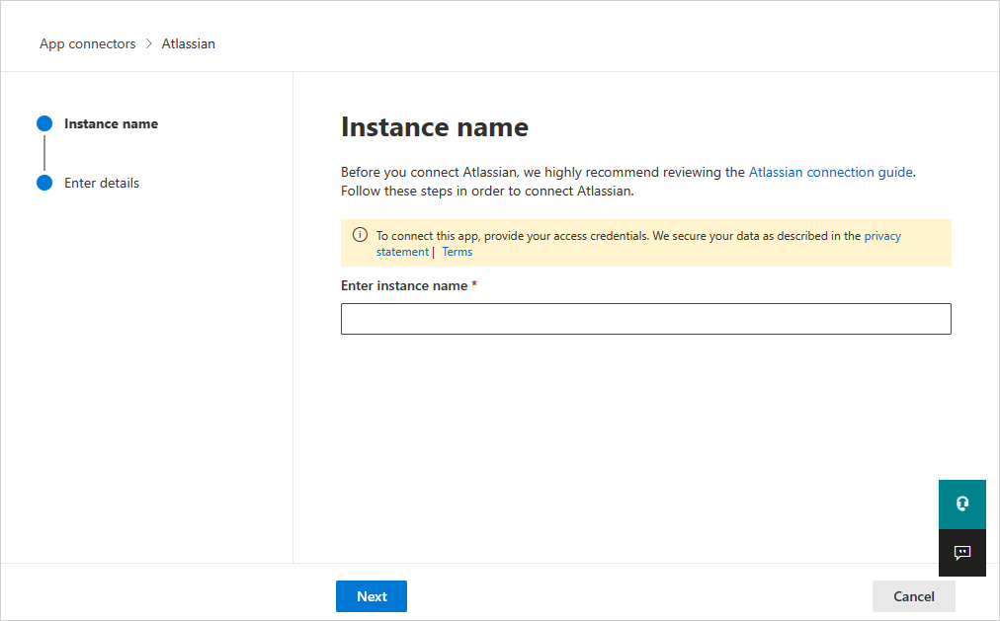

# How Defender for Cloud Apps helps protect your Atlassian environment

This article explains how to connect Atlassian to Microsoft Defender for Cloud Apps, what activities the connector monitors across Confluence, Jira, and Bitbucket, and how to configure the required permissions.

Atlassian is an online platform for collaboration and software development. It includes Confluence, Jira, and Bitbucket. Cloud collaboration has many benefits, but it can also expose your most critical assets to threats. These assets include posts, tasks, and files with sensitive details about partnerships or other topics. You need ongoing monitoring to stop malicious actors or careless insiders from leaking this data.

When you connect Atlassian to Defender for Cloud Apps, you get deeper insight into user activity and alerts for unusual behavior. The connector covers all users in your organization and shows activity from Confluence, Jira, and Bitbucket.

Main threats include:

- Compromised accounts and insider threats

- Insufficient security awareness

- Unmanaged bring your own device (BYOD)

## Control Atlassian with policies

The following table lists the policy types you can use to control Atlassian in Defender for Cloud Apps.

| **Type**                           | **Name**                                                     |
| ---------------------------------- | ------------------------------------------------------------ |
| Built-in  anomaly detection policy | [Activity from   anonymous IP addresses](anomaly-detection-policy.md#activity-from-anonymous-ip-addresses)    [Activity from   infrequent country](anomaly-detection-policy.md#activity-from-infrequent-country)   [Activity from   suspicious IP addresses](anomaly-detection-policy.md#activity-from-suspicious-ip-addresses)    [Impossible travel](anomaly-detection-policy.md#impossible-travel)    [Multiple failed login attempts](anomaly-detection-policy.md#multiple-failed-login-attempts)  [Unusual administrative activities](anomaly-detection-policy.md#unusual-activities-by-user)  [Unusual impersonated activities](anomaly-detection-policy.md#unusual-activities-by-user) |
| Activity  policy                   | Built a customized policy by the Atlassian [audit log activities](https://support.atlassian.com/security-and-access-policies/docs/track-organization-activities-from-the-audit-log/#Auditlogging-Accessauditlogactivities). |

For more information about creating policies, see [Create a policy in Defender for Cloud Apps](control-cloud-apps-with-policies.md#create-a-policy).

## Automate governance controls

You can also automate Atlassian governance actions to respond to threats. The following table lists the actions you can use.

| **Type**        | **Action**                                                   |
| --------------- | ------------------------------------------------------------ |
| User governance | Notify user on  alert (via Microsoft Entra ID)   Require user to sign in again (via Microsoft Entra ID)     Suspend user (via Microsoft Entra ID) |

For more information about fixing threats from apps, see [Governing connected apps](governance-actions.md).

## Protect Atlassian in real time

Review our best practices for [securing and collaborating with external users](best-practices.md#secure-collaboration-with-external-users-by-enforcing-real-time-session-controls) and [blocking and protecting the download of sensitive data to unmanaged or risky devices](best-practices.md#block-and-protect-download-of-sensitive-data-to-unmanaged-or-risky-devices).

## Manage SaaS security posture for Atlassian

SaaS security posture management helps you check and improve how your SaaS apps are set up. It shows helpful tips in Microsoft Secure Score.

After you connect Atlassian using the [App Connector procedure](#connect-atlassian-to-microsoft-defender-for-cloud-apps) in this article, you get security posture tips in Microsoft Secure Score. To view these tips:

1. Refresh your policies by opening and saving each policy in the Atlassian portal.
1. In Microsoft Secure Score, select **Recommended actions** and filter by **Product** = **Atlassian**. 

For example, recommendations for Atlassian include: 

- *Enable multifactor authentication*
- *Enable session timeout for web users*
- *Enhance password requirements*
- *Atlassian mobile app security*
- *App data protection*

For more information, see:

- [Security posture management for SaaS apps](security-saas.md)
- [Microsoft Secure Score](/microsoft-365/security/defender/microsoft-secure-score)

## Connect Atlassian to Microsoft Defender for Cloud Apps

You can connect Microsoft Defender for Cloud Apps to your existing Atlassian products using the App Connector APIs. This connection gives you visibility into and control over your organization's Atlassian use.

> [!NOTE]
> The connector covers all users in your organization that use the Atlassian platform, and shows activities from Confluence, Jira, and specific Bitbucket activities. For more information about Atlassian activities, see [Atlassian audit log activities](https://support.atlassian.com/security-and-access-policies/docs/track-organization-activities-from-the-audit-log/#Auditlogging-Accessauditlogactivities).

### Prerequisites

- The [Atlassian Access](https://www.atlassian.com/software/access#about-atlassian-access) plan is required.
- You must be signed as an Organization admin to Atlassian.

> [!NOTE]
> Microsoft Defender for Cloud Apps monitors the Atlassian organization associated with the Atlassian Access plan. Monitoring doesn't extend to sub-organizations that might exist under the same Atlassian environment.

### Configure Atlassian

Complete the following steps in Atlassian to create an API key and collect the values needed for the connector.

1. Sign in to the Atlassian Admin portal with an admin account.

1. **Create an API key**. The Atlassian App Connector currently supports API keys without scopes only. When creating the Atlassian API key for Microsoft Defender for Cloud Apps, **do not select any scopes**. API keys created with scopes (including read‑only scopes) may fail to authenticate. For more information, see [Manage an organization with the admin APIs](https://support.atlassian.com/organization-administration/docs/manage-an-organization-with-the-admin-apis/).

1. Give the following values to the API key:

    - **Name:** You can give any name. The recommended name is *Microsoft Defender for Cloud Apps* so you can be aware for this integration.
    - **Expires on:** Set the expiration date as one year from the date of creation (this is the Atlassian maximum time for the expiration date).

1. Copy the **Organization ID** and the **API key**. You'll need them later.

    >[!NOTE]
    > In Atlassian, domains are used to determine which user accounts can be managed by your organization. You won't see users and their activities if their domains aren't verified in the Atlassian configuration. 
    > To verify domains in Atlassian, see [Verify a domain to manage accounts](https://support.atlassian.com/user-management/docs/verify-a-domain-to-manage-accounts/).

### Configure Defender for Cloud Apps

Complete the following steps to create the Atlassian connector in Defender for Cloud Apps.

1. In the Microsoft Defender Portal, select **Settings**. Then choose **Cloud Apps**. Under **Connected apps**, select **App Connectors**.

1. In the **App connectors** page, select **+Connect an app**, followed by **Atlassian**.

1. In the next window, give the instance a descriptive name, and select **Next**.

    

1. In the next page, enter the **Organization ID** and **API key** you saved before.

>[!NOTE]
>
> - The first connection can take up to four hours to get all users and their activities.
> - Defender for Cloud Apps displays only activities generated from the moment the connector is connected.
> - Defender for Cloud Apps fetches activities from the Atlassian Access audit log. See [Product Audit Logs](https://support.atlassian.com/security-and-access-policies/docs/track-organization-activities-from-the-audit-log/).
> - After the connector’s **Status** is marked as **Connected**, the connector is live and works.

### Revoke and renew API keys

By default, the API key is valid for 1 year and expires automatically. As a security best practice, Microsoft recommends using short-lived keys or tokens for connecting apps. Refresh the Atlassian API key every 6 months to avoid expiration-related issues.

To revoke and replace the key:

1. Navigate to **admin.atlassian.com** > **Settings** > **API keys**, determine the API key used for the Microsoft Defender for Cloud Apps integration, and select **Revoke**.
1. Recreate an API key in the Atlassian admin portal.
1. In the Microsoft Defender Portal, go to the **App Connectors** page, and edit the connector.
1. Enter the new **API key** and select **Connect Atlassian**.
1. In the Microsoft Defender Portal, select **Settings**. Then choose **Cloud Apps**. Under **Connected apps**, select **App Connectors**. Make sure the status of the connected App Connector is **Connected**.

## Rate limits and limitations

- **Rate limits** include 1,000 requests and 8,000 events per minute (per API key/connector instance).

    For more information about the Atlassian API limitation, see [Atlassian admin REST APIs](https://developer.atlassian.com/cloud/admin/about/#about-the-cloud-admin-rest-apis).

- **Limitations** include:

    - Activities are shown in Defender for Cloud Apps only for users with a verified domain.

    - The API key has a maximum expiration period of one year. After one year, you'll need to create a new API key from the Atlassian Admin portal and replace the old API key with the new one in the Defender for Cloud Apps console.

    - You won't be able to see in Defender for Cloud Apps whether a user is an admin or not.

    - System activities are shown with the **Atlassian Internal System** account name.

## Related articles

- [Secure collaboration with external users by enforcing real-time session controls](best-practices.md#secure-collaboration-with-external-users-by-enforcing-real-time-session-controls)

- [Detect cloud threats, compromised accounts, and malicious insiders](best-practices.md#detect-cloud-threats-compromised-accounts-malicious-insiders-and-ransomware)

- [Use the audit trail of activities for forensic investigations](best-practices.md#use-the-audit-trail-of-activities-for-forensic-investigations)

-  [Control cloud apps with policies](control-cloud-apps-with-policies.md)
