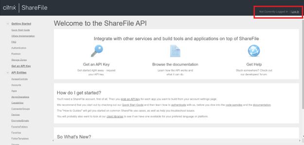
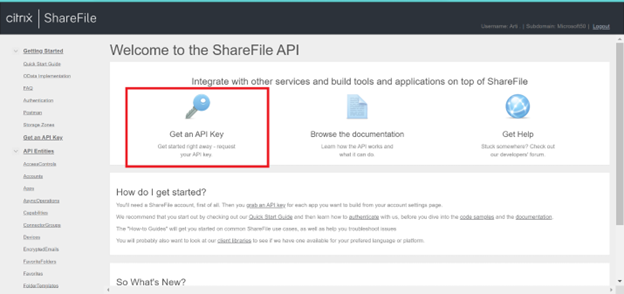
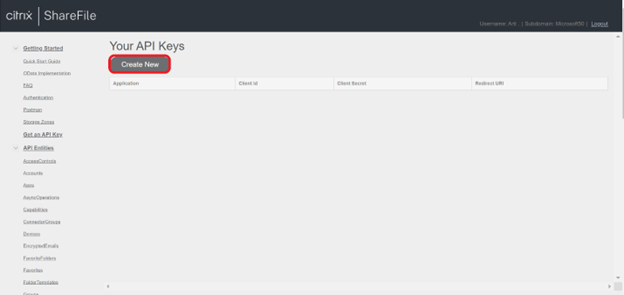
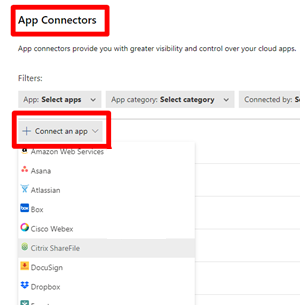
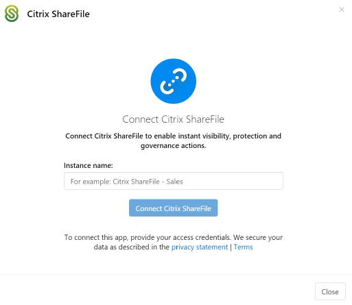

# Connect Citrix ShareFile to Microsoft Defender for Cloud Apps

Citrix ShareFile is a secure content collaboration, file sharing and sync solution that supports all the document-centric tasks and workflow needs of small and large businesses. Citrix ShareFile holds critical data of your organization, and that critical role makes it a target for malicious actors.

Connecting Citrix ShareFile to Defender for Cloud Apps gives you improved insights into your users' activities and provides threat detection using machine learning based anomaly detections. Before you start, make sure you meet the [prerequisites](#prerequisites) described later in this article.

[!INCLUDE [security-posture-management-connector](includes/security-posture-management-connector.md)]

## Main threats to your Citrix ShareFile environment

Connecting Citrix ShareFile to Defender for Cloud Apps helps you address the following threats:

- Compromised accounts and insider threats 
- Data leakage 
- Insufficient security awareness 
- Unmanaged bring your own device (BYOD) 

## How Defender for Cloud Apps helps to protect your environment

Defender for Cloud Apps can help protect your Citrix ShareFile environment in the following ways:

- [Detect cloud threats, compromised accounts, and malicious insiders](best-practices.md#detect-cloud-threats-compromised-accounts-malicious-insiders-and-ransomware)

- [Use the audit trail of activities for forensic investigations](best-practices.md#use-the-audit-trail-of-activities-for-forensic-investigations)
 

## SaaS security posture management for Citrix ShareFile

To see security posture recommendations for Citrix Share File in Microsoft Secure Score, create an API connector via the **Connectors** tab, with **Owner** and **Enterprise** permissions. In Secure Score, select **Recommended actions** and filter by **Product** = **CitrixSF**.

For example, recommendations for Citrix Share File include:

- *Enable multi-factor authentication (MFA)*
- *Enable single sign on (SSO)*
- *Enable session timeout for web users*

If a connector already exists and you don't see Citrix Share File recommendations yet, refresh the connection by disconnecting the API connector, and then reconnecting the API connector with the *Access Company account* permissions.

For more information, see:

- [Security posture management for SaaS apps](security-saas.md)
- [Microsoft Secure Score](/microsoft-365/security/defender/microsoft-secure-score)

## Connect Citrix ShareFile to Defender for Cloud Apps

Complete the following prerequisites and steps to connect Citrix ShareFile to Microsoft Defender for Cloud Apps.

### Prerequisites

The Citrix Share file user used for logging into Citrix Share file must have Access Company account permissions.

### Create API keys

Perform the following steps to create the API keys required for the connector:

1. Go to [ShareFile API Documentation](https://api.sharefile.com/), and sign in to your organization account.

    

1. Select **Get an API Key**.

    

1. To generate API keys (*Client ID* and *Client Secret*), go to **Create New**.

    

1. Fill out the following fields:

    - **Application name**: Microsoft Defender for Cloud Apps (you can also choose another name).
    
    - **Redirect URL**:  `https://portal.cloudappsecurity.com/api/oauth/saga`.
    
      For US Government GCC customers, enter `https://portal.cloudappsecuritygov.com/api/oauth/saga` as the redirect URL.
  
      For US Government GCC High customers, enter `https://portal.cloudappsecurity.us/api/oauth/saga` as the redirect URL.
      
1. Select **Generate API Key**.

1. Copy the *Client ID* and *Client Secret*.

### Configure Defender for Cloud Apps

Use the following steps to configure the Citrix ShareFile connector in Defender for Cloud Apps:

1. In the Microsoft Defender Portal, select **Settings**. Then choose **Cloud Apps**. Under **Connected apps**, select **App Connectors**.

1. In the **App connectors** page, select **+Connect an app**, followed by **Citrix ShareFile**.

    

1. In the pop-up, give the connector a descriptive name, and select **Connect Citrix ShareFile**.  

    

1. In the Citrix ShareFile connector details screen, enter the following fields:

    - The **Client ID** and **Client Secret** that you created in the Citrix ShareFile API portal.
    - **Client Subdomain**: Enter your account's subdomain. For example, if your account's URL is "mycompany.sharefile.com", you would enter "mycompany".

1. Select **Connect** in Citrix ShareFile.

1. In the Microsoft Defender Portal, select **Settings**. Then choose **Cloud Apps**. Under **Connected apps**, select **App Connectors**. Make sure the status of the connected App Connector is **Connected**.

## Rate limits

The default rate limit is 420 requests per minute.  

## Next steps

> [!div class="nextstepaction"]
> [Control cloud apps with policies](control-cloud-apps-with-policies.md)

[!INCLUDE [Open support ticket](includes/support.md)]

