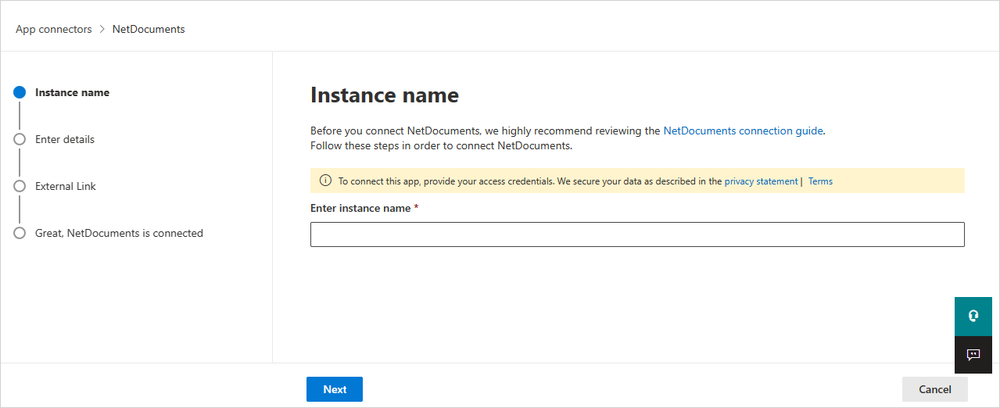

# How Defender for Cloud Apps helps protect your NetDocuments environment

NetDocuments is a cloud solution for productivity and collaboration that stores sensitive data. Misuse by a bad actor or a human error can expose critical assets to attacks.

Connect NetDocuments to Defender for Cloud Apps to get better visibility into user activity and detect unusual behavior.

## Main threats to your NetDocuments environment

NetDocuments environments face the following key security threats:

- Compromised accounts and insider threats

- Data leakage

- Insufficient security awareness

- Unmanaged bring your own device (BYOD)

## How Defender for Cloud Apps helps to protect your environment

Defender for Cloud Apps helps protect your NetDocuments environment with the following best practices:

- [Detect cloud threats, compromised accounts, and malicious insiders](best-practices.md#detect-cloud-threats-compromised-accounts-malicious-insiders-and-ransomware)

- [Use the audit trail of activities for forensic investigations](best-practices.md#use-the-audit-trail-of-activities-for-forensic-investigations)

## Control NetDocuments with policies

The following table lists the policy types you can use to control NetDocuments:

| **Type**                           | **Name**                                                     |
| ---------------------------------- | ------------------------------------------------------------ |
| Built-in  anomaly detection policy | [Activity from   anonymous IP addresses](anomaly-detection-policy.md#activity-from-anonymous-ip-addresses)    [Activity from   infrequent country](anomaly-detection-policy.md#activity-from-infrequent-country)   [Activity from   suspicious IP addresses](anomaly-detection-policy.md#activity-from-suspicious-ip-addresses)    [Impossible travel](anomaly-detection-policy.md#impossible-travel)    [Activity   performed by terminated user](anomaly-detection-policy.md#activity-performed-by-terminated-user) (requires Microsoft Entra ID as the identity provider (IdP))   [Unusual file share activities](anomaly-detection-policy.md#unusual-activities-by-user)    [Unusual file deletion activities](anomaly-detection-policy.md#unusual-activities-by-user)   [Unusual   administrative activities](anomaly-detection-policy.md#unusual-activities-by-user)    [Unusual multiple file download activities](anomaly-detection-policy.md#unusual-activities-by-user)  |
| Activity  policy                   | Built a customized policy by the NetDocuments [Audit Log](https://support.netdocuments.com/hc/en-us/articles/205220260-Consolidated-Activity-Log) activities |

>[!NOTE]
>Login/Logouts activities aren't supported by NetDocuments.

For more information about creating policies, see [Create a policy](control-cloud-apps-with-policies.md#create-a-policy)
.

## Automate governance controls

You can also apply and automate NetDocuments governance actions to fix detected threats:

| **Type**        | **Action**                                                   |
| --------------- | ------------------------------------------------------------ |
| User governance | Notify user on  alert (via Microsoft Entra ID)   Require user to sign in again (via Microsoft Entra ID)     Suspend user (via Microsoft Entra ID) |

To learn more about fixing threats from apps, see [Governing connected apps](governance-actions.md).

## Protect NetDocuments in real time

Review our best practices for [securing and collaborating with external users](best-practices.md#secure-collaboration-with-external-users-by-enforcing-real-time-session-controls) and [blocking and protecting the download of sensitive data to unmanaged or risky devices](best-practices.md#block-and-protect-download-of-sensitive-data-to-unmanaged-or-risky-devices).

## SaaS security posture management (Preview)

After you connect NetDocuments to Defender for Cloud Apps, you automatically get security posture recommendations for NetDocuments in Microsoft Secure Score. In Secure Score, select **Recommended actions** and filter by **Product** = **NetDocument**. NetDocument supports security recommendations to *Adopt SSO (Single sign on) in NetDocument*.

To learn more, see:

- [Security posture management for SaaS apps](security-saas.md)
- [Microsoft Secure Score](/microsoft-365/security/defender/microsoft-secure-score)

## Connect NetDocuments to Microsoft Defender for Cloud Apps

This section provides instructions for connecting Microsoft Defender for Cloud Apps to your existing NetDocuments account using the App Connector APIs. The Defender for Cloud Apps connection to NetDocuments gives administrators visibility into and control over their organization's NetDocuments use.

### Configure NetDocuments

Perform the following steps in NetDocuments to collect the values needed for the connector setup:

1. Sign in to your NetDocuments account with a Full NetDocuments Repository Admin user.

1. Copy your repository ID. You enter the repository ID in the **Repository ID** field when you configure Defender for Cloud Apps.

1. Copy your account URL. You enter the account URL in the **Application URL** field when you configure Defender for Cloud Apps. Make sure that the account URL matches one of the following NetDocuments service URLs.

    | Location       |              URL            |
    | -------------- | --------------------------- |
    | United Kingdom | <https://eu.netdocuments.com> |
    | Australia     | <https://au.netdocuments.com> |
    | Germany        | <https://de.netdocuments.com> |
    | United States or any other location  |   <https://vault.netvoyage.com> |

### Configure Defender for Cloud Apps

Perform the following steps in Defender for Cloud Apps to create the NetDocuments connector:

1. In the Microsoft Defender Portal, select **Settings**. Then choose **Cloud Apps**. Under **Connected apps**, select **App Connectors**.

1. In the **App connectors** page, select **+Connect an app**, followed by **NetDocuments**.

1. In the connector setup window, give the connector a descriptive name, and select **Next**.

    

1. In the **Enter details** screen, enter the **Repository ID** and **Application URL** values:

    - **Repository ID**: the app repository ID that you saved.
    - **Application URL**: the URL that you saved.

1. Select **Next**.
1. Select **Connect NetDocuments**.
1. In the Microsoft Defender Portal, select **Settings**. Then choose **Cloud Apps**. Under **Connected apps**, select **App Connectors**. Make sure the status of the connected App Connector is **Connected**.

## Rate limits and limitations

Be aware of the following rate limits and limitations for the NetDocuments connector:

- The default rate limit is 100,000 requests per minute.
- Login/Logouts activities aren't supported by NetDocuments.

## Next steps

- [Control cloud apps with policies](control-cloud-apps-with-policies.md)
