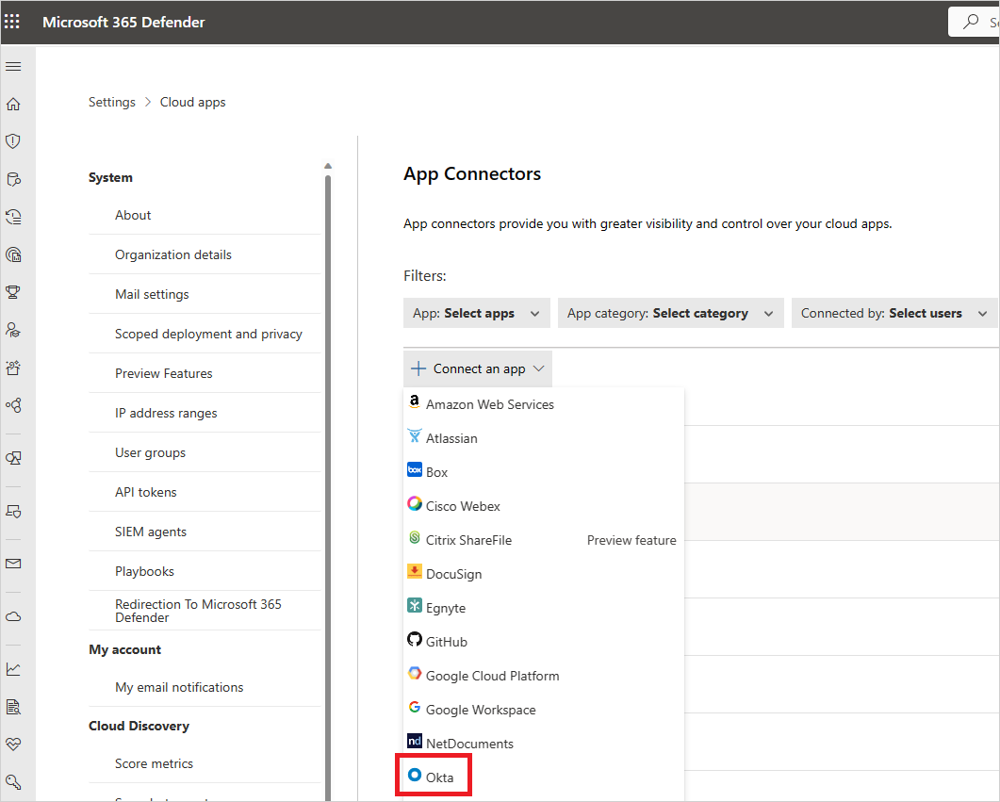

# How Defender for Cloud Apps helps protect your Okta environment

As an identity and access management solution, Okta holds the keys to your organizations most business critical services. Okta manages the authentication and authorization processes for your users and customers. Any abuse of Okta by a malicious actor or any human error might expose your most critical assets and services to potential attacks.

Connecting Okta to Defender for Cloud Apps gives you improved insights into your Okta admin activities, managed users, and customer sign-ins and provides threat detection for anomalous behavior.

[!INCLUDE [security-posture-management-connector](includes/security-posture-management-connector.md)]

## Main threats

- Compromised accounts and insider threats

## How Defender for Cloud Apps helps to protect your environment

- [Detect cloud threats, compromised accounts, and malicious insiders](best-practices.md#detect-cloud-threats-compromised-accounts-malicious-insiders-and-ransomware)
- [Use the audit trail of activities for forensic investigations](best-practices.md#use-the-audit-trail-of-activities-for-forensic-investigations)

## SaaS security posture management

[Connect Okta](#connect-okta-to-microsoft-defender-for-cloud-apps) to automatically get security recommendations for Okta in Microsoft Secure Score.

In Secure Score, select **Recommended actions** and filter by **Product** = **Okta**. For example, recommendations for Okta include:

- *Enable multi-factor authentication*
- *Enable session timeout for web users*
- *Enhance password requirements*

For more information, see:
-	[Security posture management for SaaS apps](security-saas.md)
-	[Microsoft Secure Score](/microsoft-365/security/defender/microsoft-secure-score)

## Control Okta with built-in policies and policy templates

You can use the following built-in policy templates to detect and notify you about potential threats:

| Type | Name |
| ---- | ---- |
| Built-in anomaly detection policy | [Activity from anonymous IP addresses](anomaly-detection-policy.md#activity-from-anonymous-ip-addresses) [Activity from infrequent country](anomaly-detection-policy.md#activity-from-infrequent-country) [Activity from suspicious IP addresses](anomaly-detection-policy.md#activity-from-suspicious-ip-addresses) [Impossible travel](anomaly-detection-policy.md#impossible-travel) [Multiple failed login attempts](anomaly-detection-policy.md#multiple-failed-login-attempts) [Ransomware detection](anomaly-detection-policy.md#ransomware-activity) [Unusual administrative activities](anomaly-detection-policy.md#unusual-activities-by-user) |
| Activity policy template | Logon from a risky IP address |

For more information about creating policies, see [Create a policy](control-cloud-apps-with-policies.md#create-a-policy).

## Automate governance controls

Currently, there are no governance controls available for Okta. If you're interested in having governance actions for this connector, you can [open a support ticket](/defender-xdr/contact-defender-support) with details of the actions you want.

For more information about remediating threats from apps, see [Governing connected apps](governance-actions.md).

## Protect Okta in real time

Review our best practices for [securing and collaborating with external users](best-practices.md#secure-collaboration-with-external-users-by-enforcing-real-time-session-controls) and [blocking and protecting the download of sensitive data to unmanaged or risky devices](best-practices.md#block-and-protect-download-of-sensitive-data-to-unmanaged-or-risky-devices).

## Prerequisites

To connect Okta to Defender for Cloud Apps: 

- Create an admin Service Account in Okta for Defender for Cloud Apps.
- Make sure you use an account with Super Admin permissions.
- Make sure your Okta account is verified.

## Connect Okta to Microsoft Defender for Cloud Apps

This section provides instructions for connecting Microsoft Defender for Cloud Apps to your existing Okta account using the connector APIs. This connection gives you visibility into and control over Okta use. For information about how Defender for Cloud Apps protects Okta, see [Protect Okta](protect-okta.md).

[!INCLUDE [security-posture-management-connector](includes/security-posture-management-connector.md)]

### Configure Okta

In the Okta console, create a token for the API. Copy the token value, you will need it later.

### Configure Defender for Cloud Apps

1. In the Microsoft Defender Portal, select **Settings** > **Cloud Apps**. 
1. Under **Connected apps**, select **App Connectors**.

1. In the **App connectors page**, select **+Connect an app**, and then **Okta**.

    

1. In the next window, give your connection a name and select **Next**.
1. In the **Enter details** window, in the **Domain** field, enter your Okta domain and paste your Token into the **Token** field.

1. Select **Submit** to create the token for Okta in Defender for Cloud Apps.

1. In the Microsoft Defender Portal, select **Settings**. Then choose **Cloud Apps**. Under **Connected apps**, select **App Connectors**. Make sure the status of the connected App Connector is **Connected**.

After connecting Okta, you'll receive events for seven days prior to connection.

## Next steps

- If you have any problems connecting the app, see [Troubleshooting App Connectors](troubleshooting-api-connectors-using-error-messages.md).

- [Control cloud apps with policies](control-cloud-apps-with-policies.md)
