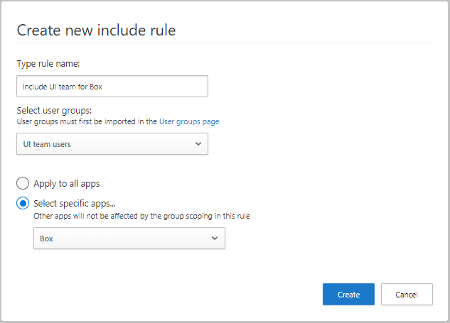
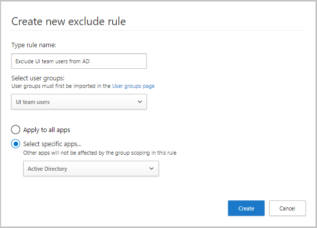

# Scope your deployment to specific users or user groups

Microsoft Defender for Cloud Apps enables you to scope your deployment. Scoping allows you to select certain user groups to be monitored for apps or excluded from monitoring.

> [!NOTE]
> Scoped deployment **doesn't** reduce the number of files, OAuth applications, or user accounts that are scanned. It only reduces the number of **user activities** based on the selected user group.

## Include or exclude user groups

You might not want to use Microsoft Defender for Cloud Apps for all the users in your organization. Scoping is especially useful when you want to limit your deployment because of license restrictions. You might also need to limit because of compliance regulations requiring you not monitor users from certain countries/regions. For example, use scoped deployment to only monitor US-based employees. Alternatively, you can avoid showing any activities for your users based in Germany.

- To scope your deployment, you must first [import user groups](user-groups.md) to Microsoft Defender for Cloud Apps. By default, you'll see the following groups:

    - **Application** user group -  A built-in group that you can use to see activities performed by Microsoft 365 and Microsoft Entra applications.

  - **External users** group - All users who aren't members of any of the managed domains you configured for your organization.

- Setting an include rule will automatically exclude all groups not within the included group. For example, if you set a rule to include all members of the US-office groups, any groups who aren't part of that group won't be monitored.

- Excluded user groups override included user groups. If you include the user group **UK-employees** but exclude **Marketing**, Microsoft Defender for Cloud Apps doesn't monitor marketing members from the UK even if they're members of the **UK-employees** group.

1. In the Microsoft Defender portal, select **Settings**. Then choose **Cloud Apps**. Under **System**, select **Scoped deployment and privacy**.

1. To scope your deployment to include or exclude specific groups, [import user groups](user-groups.md) into Microsoft Defender for Cloud Apps.

1. To set specific groups to be monitored by Microsoft Defender for Cloud Apps, in the **Include** tab, select **+Add rule**.

1. In the **Create new include rule** dialog, complete the following steps:

    1. Under **Type rule name**, enter a descriptive name for the rule.
        1. Under **Select user groups**, select all the groups you want to monitor using Microsoft Defender for Cloud Apps.
    1. Select whether you want to apply this rule to all connected apps or only to **Specific apps**. If you select **Specific apps**, the rule will only affect monitoring of the apps you select. For example, if you select the group **UI team users** and **Box**, Defender for Cloud Apps will only monitor Box activity for users in your UI team users group and for all other apps, Defender for Cloud Apps will monitor all activities for all users.

        

1. To set specific groups to be excluded from monitoring, in the **Exclude** tab, select **+Add rule**.

1. In the **Create new Exclude rule** dialog, set the following parameters:

    1. Under **Type rule name**, enter a descriptive name for the rule.
    1. Under **Select user groups**, select all the groups you don't want Microsoft Defender for Cloud Apps to monitor.
        1. Select whether you want to apply this rule to all connected apps or only to **Specific apps**. If you select **Specific apps**, Microsoft Defender for Cloud Apps stops monitoring the group you selected only for the apps you select. If you select the group **UI team users** and **Active Directory**, Microsoft Defender for Cloud Apps monitors all user activity except Active Directory activities that are performed by UI team users.

       

## Example results for include and exclude rules

The include and exclude rules you create work together to scope the overall monitoring that Microsoft Defender for Cloud Apps performs. Here's an example of include and exclude rules you can create, and the final result of what Microsoft Defender for Cloud Apps monitors after these rules run.

If you create the following rules:

- Exclude user group "Germany all users"
- Include for user group "Global sales" only Microsoft 365 activities
- Include for user group "Sales managers" only Power BI activities
- Salesforce is connected to Microsoft Defender for Cloud Apps and no rules are set for it

The following user activities are monitored:

|User|Group membership|Activities monitored|
|----|----|----|
|Adriana|Germany all users Global sales Sales managers|None|
|Alain|Global sales|Microsoft 365 and all subapps except Power BI|
|Cornel|Global sales Sales managers|Microsoft 365 and all subapps|
|Raymond|Sales managers|Power BI only|

> [!NOTE]
> The group scoping in these rules doesn't affect other apps.
> In the example, for Salesforce, the monitoring includes all activities for all user groups.

## Troubleshooting scoped deployment

After you configure scoped deployment, check for new events in the **Activity log** or the **CloudAppEvents** table.

If no new events appear, the user accounts in the scoped deployment group might not be correlated with the account identifiers used by the application. This can occur when one application uses a UPN as the account ID and another application uses a different account ID format or a non‑UPN value.
To resolve this issue, create an additional scoped deployment group that matches the account identifiers used by the affected application.

## Next steps

> [!div class="nextstepaction"]
> [Set up cloud discovery](set-up-cloud-discovery.md)

