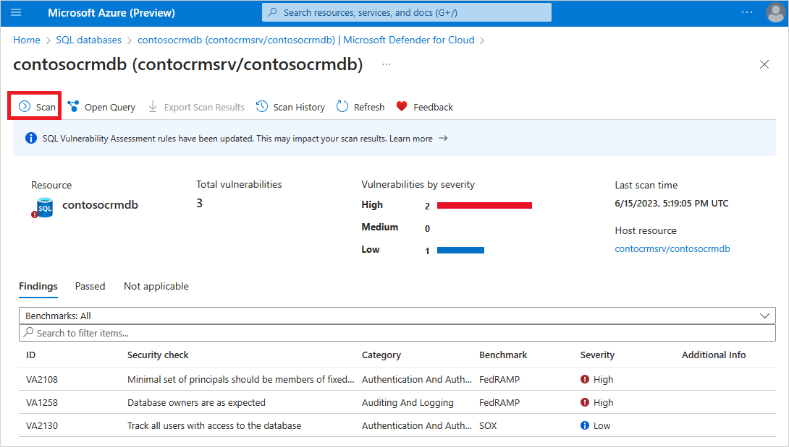

# Review and remediate SQL vulnerability assessment findings

Microsoft Defender for Cloud provides [SQL Vulnerability Assessment](sql-azure-vulnerability-assessment-overview.md) for your Azure SQL databases. SQL Vulnerability Assessment scans your databases for possible vulnerabilities based on database configurations and provides a list of findings. Scan cycles help maintain a high level of security and ensure compliance with organizational security policies.

> [!IMPORTANT]
> Express Configuration is generally available for Azure SQL Managed Instance and Azure Synapse Analytics Workspaces. This extends the generally available Microsoft-managed experience for Azure SQL Database, at no additional cost.
> 
> This release allows you to enable SQL VA without configuring a customer-managed storage account. Express Configuration is the recommended enablement mode and provides the same security value as Classic Configuration with a simplified setup.
> 
> A unified REST API (v2026-04-01-preview) manages SQL VA consistently across Azure SQL Database, SQL Managed Instance, Synapse Workspaces, and SQL on machines (Azure VM and Arc-enabled SQL).

SQL Vulnerability Assessment is available in two configurations: **express** and **classic**. Both configurations use the same logic, remediation guidance and baseline management. For remediation purposes, the only difference is when a baseline setting takes effect. 

## Ways to remediate a finding

A Vulnerability Assessment finding isn't always a definitive security problem. Each rule checks your database against Microsoft security best practices and common regulatory requirements, and the result appears as a recommendation on the scanned database. An unhealthy result flags a *deviation from that best practice*, which might be an unintended misconfiguration or a configuration that's intentional and acceptable for your environment. **Review each finding in the context of your organization before you act.**

You have three ways to remediate a finding:

- **Fix the misconfiguration.** If the finding is an unintended deviation, apply the remediation steps or run the remediation script provided with the finding to bring the resource back to the recommended configuration.
- **Approve it as a baseline.** If the current state is by design and expected for your environment, add the results to the baseline. Baselines are set per rule and per resource, so approving a result affects only that rule on that database. The finding is then reported as passed and stays healthy until a future scan detects a deviation from the approved baseline.
- **Exempt the recommendation.** If the check isn't relevant to your organization, [create an exemption](exempt-resource.md) at the subscription or management group level so the recommendation no longer affects your secure score or compliance for that scope.
> [!NOTE]
> The exemption setup succeeds, but it will not take effect unless the ["Azure CSPM" standard is assigned](assign-regulatory-compliance-standards.md) on the selected scope. 

## Prerequisites

- SQL Vulnerability Assessment is enabled on your Azure SQL resource.

- Review the required permissions and the data residency conditions:
    - [Express configuration](sql-azure-vulnerability-assessment-overview.md#express-configuration)
    - [Classic configuration](sql-azure-vulnerability-assessment-overview.md#classic-configuration)

- The baseline approval timing differs by configuration model.

If you aren't sure which Vulnerability Assessment configuration you're using, use the following steps to check:
    1. Sign into the [Azure portal](https://portal.azure.com).
    1. Open your SQL Database resource.
    1. Under the **Security** heading, select **Microsoft Defender for Cloud**.
    1. In the **Enablement Status**, select **Configure** to open the Microsoft Defender for SQL settings pane for either the entire server or managed instance.

  If the vulnerability settings show the option to configure a storage account, you're using the classic configuration. If not, you're using the express configuration.

## Run an on-demand scan

Run a read-only, on-demand Vulnerability Assessment scan to refresh findings instead of waiting for the next scheduled scan.

To run an on-demand scan:

1. Sign into the [Azure portal](https://portal.azure.com/).
1. Open your SQL server or SQL database resource.
1. Under the **Security** heading, select **Microsoft Defender for Cloud**.
1. Open the database's Vulnerability Assessment page:

   - From a SQL database resource, select **View database vulnerability summary**.
   - From a SQL server resource, select **View server vulnerability summary**, and then select a database.

1. Select **Scan**.

   

Alternatively, from a SQL database resource, select **Open resource health page**. In the **SQL Vulnerability Assessment results** section, select **Scan now**.

:::image type="content" source="media/sql-azure-vulnerability-assessment-find/scan-now-from-resource-health.png" alt-text="Screenshot of the Resource health page with Scan now highlighted in the SQL Vulnerability Assessment results section." lightbox="media/sql-azure-vulnerability-assessment-find/scan-now-from-resource-health.png":::

## Review and remediate Vulnerability Assessment findings

After a scan completes, the **Vulnerability Assessment** page shows a full view of your database security. This includes:

- An overview of your security state
- The number of issues found
- A severity summary of risks
- A list of findings for investigation

## Review findings from the SQL resource's Defender for Cloud page

You can reach SQL Vulnerability Assessment findings directly from the **Microsoft Defender for Cloud** page on a SQL server or SQL database resource. This page shows the Defender for SQL enablement status, a summary of detected vulnerabilities, and the security recommendations and alerts reported on the resource.

To open the page:

1. Sign in to the [Azure portal](https://portal.azure.com/).
1. Open your SQL server or SQL database resource.
1. Under the **Security** heading, select **Microsoft Defender for Cloud**.

From the top of the page you can select **Go to Defender for Cloud Overview** or **Open resource health page**. The **Microsoft Defender for SQL** card shows the current enablement status and a **Settings** link to the Defender for SQL configuration.

# [SQL server](#tab/server)

On a SQL server resource:

1. The **Vulnerabilities on related databases** card summarizes the number of vulnerabilities detected by SQL Vulnerability Assessment on the server's underlying databases and provides two ways to review them:

   - **View server vulnerability summary**: opens the server-level SQL Vulnerability Assessment summary. This is the same summary that the now-deprecated **SQL databases should have vulnerability findings resolved** and **SQL servers on machines should have vulnerability findings resolved** recommendations used to open.
   - **View in recommendations page**: opens the Defender for Cloud **Recommendations** page filtered by the **SQL Vulnerability Assessment** scanner, with the current server set as the **Parent resource**.
1. The **Security findings on this SQL server** section lists the **Recommendations** and **Security Alerts** reported on the server resource. Database-level SQL Vulnerability Assessment recommendations aren't listed here, because they're reported on the individual databases. The deprecated aggregated recommendations might still appear in the **Recommendations** tab until they're fully retired.

:::image type="content" source="media/sql-azure-vulnerability-assessment-find/sql-server-security-findings.png" alt-text="Screenshot of a SQL server's Microsoft Defender for Cloud page showing vulnerabilities on related databases and security findings." lightbox="media/sql-azure-vulnerability-assessment-find/sql-server-security-findings.png":::

# [SQL database](#tab/database)

On a SQL database resource:

1. The **Vulnerabilities on this database** card summarizes the vulnerabilities detected on the database and provides two ways to review them:

   - **View database vulnerability summary**: opens the SQL Vulnerability Assessment page for the database.
   - **View in recommendations page**: opens the Defender for Cloud **Recommendations** page filtered by this database resource and the **SQL Vulnerability Assessment** scanner.
1. The **Security findings** section lists the recommendations reported on the database. SQL Vulnerability Assessment recommendations appear in the **Recommendations** tab and can be identified by the **Scanner** column value **SQL Vulnerability Assessment**.

:::image type="content" source="media/sql-azure-vulnerability-assessment-find/sql-database-security-findings.png" alt-text="Screenshot of a SQL database's Microsoft Defender for Cloud page showing vulnerabilities on the database and security findings." lightbox="media/sql-azure-vulnerability-assessment-find/sql-database-security-findings.png":::

---

## Review and remediate vulnerabilities (Azure portal)

# [Database-level recommendations experience](#tab/database-level)

In this experience:

- SQL Vulnerability Assessment findings follow the same recommendation structure used across Microsoft Defender for Cloud.
- Each SQL Vulnerability Assessment rule corresponds to its own recommendation.
- Recommendations are associated directly with the affected SQL database resource.
- Each rule can be reviewed, remediated, or marked as baseline independently.

1. Sign in to the [Azure portal](https://portal.azure.com/).

1. Go to **Defender for Cloud** > **Recommendations**.

1. Select the **Recommendations by risk** view.

1. Adjust the view:
   - Use the **By Resource** filter to list all instances of the assessment by reported resource.
   :::image type="content" source="media/sql-azure-vulnerability-assessment-find/database-level-recommendations-filter-sql-va.png" alt-text="Screenshot of the Defender for Cloud Recommendations page in the Azure portal, showing View per resource and filtering Scanner to SQL Vulnerability Assessment." lightbox="media/sql-azure-vulnerability-assessment-find/database-level-recommendations-filter-sql-va.png":::
   - Use the **By Title** filter to aggregate all instances of the assessment under one value.

1. Select the **Scanner** filter and from the options, select **SQL Vulnerability Assessment**.

1. Review findings (**By Resource** only):

   1. Select a recommendation.

   1. Review its description.

   1. Select **Manage query results and remediation** to review the query used for evaluating the recommendation, generate a remediation script, or set a baseline.

   1. Select the resource name link for more information and actions.

      :::image type="content" source="media/sql-azure-vulnerability-assessment-find/database-level-recommendation-details-manage-query-results.png" alt-text="Screenshot of a SQL Vulnerability Assessment recommendation details page in the Azure portal, highlighting Manage query results and remediation and the option to add query results as baseline." lightbox="media/sql-azure-vulnerability-assessment-find/database-level-recommendation-details-manage-query-results.png":::

   1. In the database’s **Resource health** page, review the recommendations generated for the resource, trigger a SQL VA scan, or go to the SQL VA scan history page.

      :::image type="content" source="media/sql-azure-vulnerability-assessment-find/database-level-resource-health-sql-va-results.png" alt-text="Screenshot of the Resource health page in the Azure portal showing the SQL Vulnerability Assessment results section with Scan now and Scan history." lightbox="media/sql-azure-vulnerability-assessment-find/database-level-resource-health-sql-va-results.png":::

1. Review findings (**By Title** only):

   1. Select a recommendation.

   1. Select **View remediation scripts** for an aggregated view of the types of remediation operations for all databases in scope.

   1. After reviewing, close the **Remediation scripts** side pane.

   1. Scroll to the right to reach the **Actions** column under **Affected resources**.

   1. Select **Show query and results** for each affected database to set up baselines at scale.

1. Verify that the remediated findings appear as healthy. In the express configuration, baseline approval takes effect immediately. In the classic configuration, baseline approval takes effect the next scan.

> [!TIP]
> You can set baselines at scale by using the **By Title** recommendations view and selecting a SQL Vulnerability Assessment recommendation. On the page that opens, scroll to the right in the **Affected resources** section and select **Show query and results** for each row to view and set baselines where applicable.
> :::image type="content" source="media/sql-azure-vulnerability-assessment-find/show-query-results-for-affected-resources.png" alt-text="Screenshot of an aggregated SQL Vulnerability Assessment recommendation with Affected resources and Show query and results highlighted." lightbox="media/sql-azure-vulnerability-assessment-find/show-query-results-for-affected-resources.png":::

# [Legacy experience](#tab/legacy-experience)

This refers to the proprietary SQL Vulnerability Assessment experiences that are still available without change.

1. Sign in to the [Azure portal](https://portal.azure.com/).

1. Open your SQL Database resource.

1. Under the **Security** heading, select **Microsoft Defender for Cloud**.

1. Select **View database vulnerability summary**.

1. Identify security issues relevant to your environment by reviewing the **Findings** tab.

1. Select an unhealthy finding to review details and remediation guidance.

   :::image type="content" source="media/defender-for-sql-azure-vulnerability-assessment/vulnerability-findings.png" alt-text="Server-level aggregated SQL vulnerability assessment findings." lightbox="media/defender-for-sql-azure-vulnerability-assessment/vulnerability-findings.png":::

   :::image type="content" source="media/defender-for-sql-azure-vulnerability-assessment/examining-vulnerability-findings.png" alt-text="Screenshot of examining the findings from a vulnerability scan." lightbox="media/defender-for-sql-azure-vulnerability-assessment/examining-vulnerability-findings.png":::

1. Apply remediation or mark the finding as baseline.

   :::image type="content" source="media/defender-for-sql-azure-vulnerability-assessment/baseline-approval.png" alt-text="Screenshot of approving a finding as a baseline for future scans." lightbox="media/defender-for-sql-azure-vulnerability-assessment/baseline-approval.png":::

1. View the **Passed** column for baseline-approved findings:
   - **Express:** Appears immediately without a new scan.
   - **Classic:** Requires running another on-demand scan.

   :::image type="content" source="media/defender-for-sql-azure-vulnerability-assessment/passed-per-custom-baseline.png" alt-text="Screenshot of passed assessments indicating they passed per custom baseline." lightbox="media/defender-for-sql-azure-vulnerability-assessment/passed-per-custom-baseline.png":::

---

## Review and remediate vulnerabilities (Defender portal)

In this experience:

- SQL Vulnerability Assessment findings follow the same recommendation structure used across Microsoft Defender for Cloud.
- Each SQL Vulnerability Assessment rule corresponds to its own recommendation.
- Recommendations are associated directly with the affected SQL database resource.
- Script generation and baseline settings are done using the Azure portal.

1. Go to the [Microsoft Defender portal](https://security.microsoft.com).

1. Select **Exposure management** > **Recommendations**.

1. Select the **Cloud** tab.

1. Select **Misconfigurations**.

1. Choose how you would like to view results: 
    - **Recommendation per asset**
    - **Recommendation title**

1. Select the **Scanner** filter and from the options, select **SQL Vulnerability Assessment**.
    
   :::image type="content" source="media/sql-azure-vulnerability-assessment-find/defender-portal-recommendations-filter-sql-va.png" alt-text="Screenshot of the Defender portal Recommendations page showing Cloud > Misconfigurations and filtering Scanner to SQL Vulnerability Assessment." lightbox="media/sql-azure-vulnerability-assessment-find/defender-portal-recommendations-filter-sql-va.png":::

1. Review findings (**Recommendation per asset** view only):

   1. Select a recommendation to see its description and status.

   1. Select **Manage in Azure portal** for SQL VA operations such as baseline settings and triggering SQL VA scans.
    
   :::image type="content" source="media/sql-azure-vulnerability-assessment-find/defender-portal-recommendation-by-asset.png" alt-text="Screenshot of the Defender portal Recommendations page showing SQL Vulnerability Assessment recommendations in the By asset view." lightbox="media/sql-azure-vulnerability-assessment-find/defender-portal-recommendation-by-asset.png":::

1. Review findings (**Recommendation title** view only):

   1. Review the **Status** column for recommendations across all selected resources.
   
   1. Click **Manage in Azure portal** for SQL VA operations such as baseline settings and triggering SQL VA scans.

   :::image type="content" source="media/sql-azure-vulnerability-assessment-find/defender-portal-recommendation-by-title.png" alt-text="Screenshot of the Defender portal Recommendations page showing SQL Vulnerability Assessment recommendations in the By title view." lightbox="media/sql-azure-vulnerability-assessment-find/defender-portal-recommendation-by-title.png":::

1. Verify that the remediated findings appear as healthy. In the express configuration, baseline approval takes effect immediately. In the classic configuration, baseline approval takes effect the next scan.

## Troubleshoot common issues

Use this table to resolve common issues when working with SQL Vulnerability Assessment:

| Issue | Likely cause | Resolution |
|-------|--------------|------------|
| Scan results not visible | Missing viewer role | Ensure Security Admin or Security Reader role is assigned. |
| Can't change settings | Insufficient configuration role | Assign SQL Security Manager (and for classic: Owner + Storage Blob Data Reader on storage account). |
| Baseline not reflected (classic) | New scan not run yet | Run another on-demand scan to apply baseline changes. |
| Baseline not reflected (express) | Expectation mismatch | Baseline applies immediately; refresh the Vulnerability Assessment tab. |
| Access error opening email link (classic) | Storage role missing | Add Storage Blob Data Reader for the storage account containing scan results. |

## Next steps  

- Learn more about [Microsoft Defender for Azure SQL](defender-for-sql-introduction.md).
- Learn more about [data discovery and classification](/azure/azure-sql/database/data-discovery-and-classification-overview).
- Learn more about [storing vulnerability assessment scan results in a storage account accessible behind firewalls and VNets](/azure/azure-sql/database/sql-database-vulnerability-assessment-storage).
