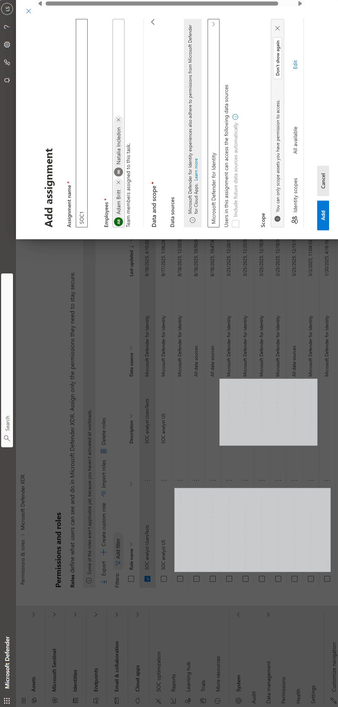
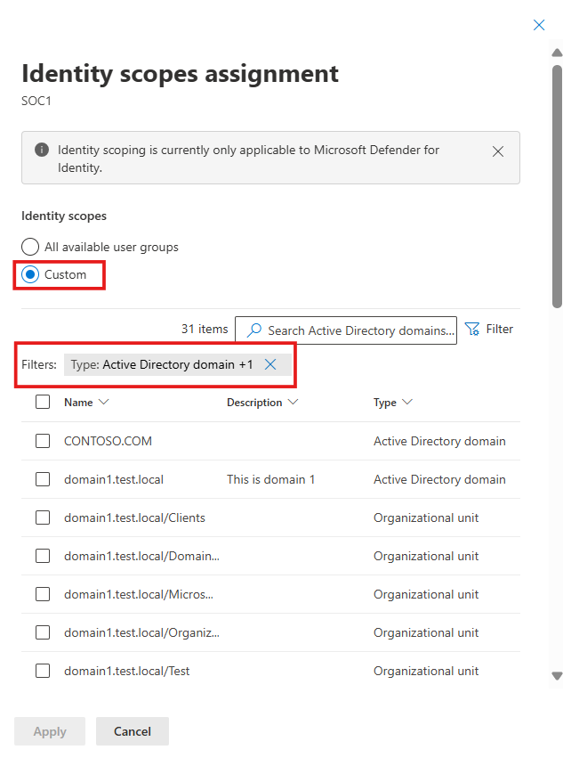

# Configure scoped access for Microsoft Defender for Identity

As organizations grow and their identity environments become more complex, it's important to control who has access to which resources. Microsoft Defender for Identity scoping lets you focus monitoring on specific Active Directory domains or organizational units. This helps improve efficiency by reducing noise from nonessential data and focusing on critical assets. You can also limit visibility to specific entities, so access matches each person's responsibilities.
Scoped access is implemented by [creating a custom role using Microsoft Defender XDR Unified RBAC](/defender-xdr/create-custom-rbac-roles). During the role configuration process, you define which users or Entra ID groups have access to specific Active Directory domains or Organizational units.

## Prerequisites

Before you begin, make sure you meet the following requirements:

- Check that Microsoft Defender for Identity sensor installed. 
- Confirm the [Identity workload for URBAC](/defender-xdr/activate-defender-rbac#activate-from-the-permissions-and-roles-page) is activated. 
- Ensure you have the [Security Administrator](/entra/identity/role-based-access-control/permissions-reference) role in Microsoft Entra ID to create and manage custom roles.

- Make sure Authorization permissions are configured through [URBAC](/defender-xdr/manage-rbac) to manage roles without Security Administrator privileges.

### Configure scoping rules

To enable identity scoping, follow these steps:​

1. Navigate to **Permissions > Microsoft Defender XDR > Roles​**.

    :::image type="content" source="media/custom-roles/permissions-roles.png" alt-text="Screenshot showing the roles page in the Microsoft Defender portal.":::

1. Select **+ Create custom role** and follow the instructions in [Create custom roles with Microsoft Defender XDR Unified RBAC.](/defender-xdr/create-custom-rbac-roles#create-a-custom-role)

    :::image type="content" source="media/custom-roles/create-custom-role.png" alt-text="Screenshot showing the create custom roles button.":::

1. You can edit the role at any time. Select the role from the list of custom roles and choose **Edit**.

    :::image type="content" source="media/custom-roles/edit-custom-role.png" alt-text="Screenshot showing how to edit a custom role.":::

1. Select Add assignments and add the Assignment name.
    1. Under **Assign users and groups**, enter the usernames or Microsoft Entra ID groups you want to assign to the role.
    1. Select Microsoft Defender for Identity as the data source.
   1. Under **Scope**, select the user groups (AD domains or OU's) that will be scoped to the assignment. For an optimal experience, use the filter or search box.
   
   
   
   
   
1. Select **Apply** and **Add**.

### Known limitations

The following table lists the current limitations and supported scenarios for scoped access in Microsoft Defender for Identity.

> [!NOTE]
> - Custom roles apply only to new alerts and activities. Alerts and activities triggered before a custom role was created aren't retroactively tagged or filtered.
> - The Exposure Management section in the Defender Portal is not visible to users with an MDI scope assignment.
> - Microsoft Entra ID IP alerts aren't included within scoped MDI detections.

|Defender for Identity experience |Scoping by OU's|Scoping by AD domain|
|---------| -------- |---------|
|MDI alerts and incidents  |Available| Available|
|Hunting tables: AlertEvidence+Info, IdentityInfo, IdentityDirectoryEvents, IdentityLogonEvents, IdentityQueryEvents     |Available|   Available      |
|User page and user global search  |Available|   Available      |
|MDI alerts based on XDR detection platform (detection source is XDR and service source is MDI)     |Available|   Available      |
|Health issues       |Unavailable|   Available      |
|Identities inventory and service accounts discovery page     |Available|  Available      |
|Identities settings: manual tagging|Available|Available|
|Identities settings: sensors page, health issues notifications  |Unavailable|   Available      |
|Defender XDR Incident email notifications     |Available| Unavailable      |
|ISPMs and exposure management     |Unavailable|   Unavailable      |
|Download scheduled reports and Graph API    |Unavailable|   Unavailable      |
|Device and group global search and entity page     |Available|   Available      |
|Alert tuning and critical asset management   |Unavailable|   Unavailable      |

### Related articles

- [Microsoft Defender for Identity role groups](role-groups.md)
- [Microsoft Defender XDR Unified role-based access control (RBAC)](/defender-xdr/manage-rbac)
- [Create custom roles with Microsoft Defender XDR Unified RBAC](/defender-xdr/create-custom-rbac-roles)
- [Import roles to Microsoft Defender XDR Unified role-based access control (RBAC)](/defender-xdr/import-rbac-roles)
- [Activate Microsoft Defender XDR Unified role-based access control (RBAC)](/defender-xdr/activate-defender-rbac)
