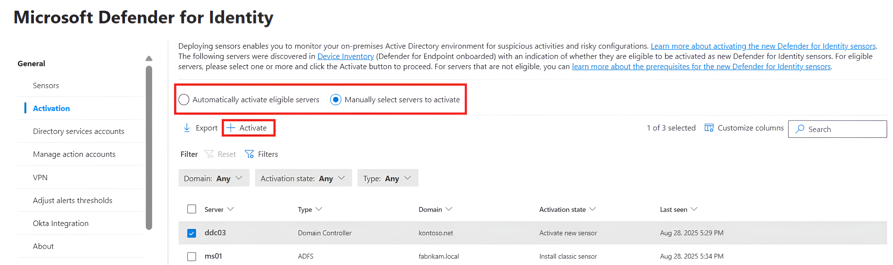
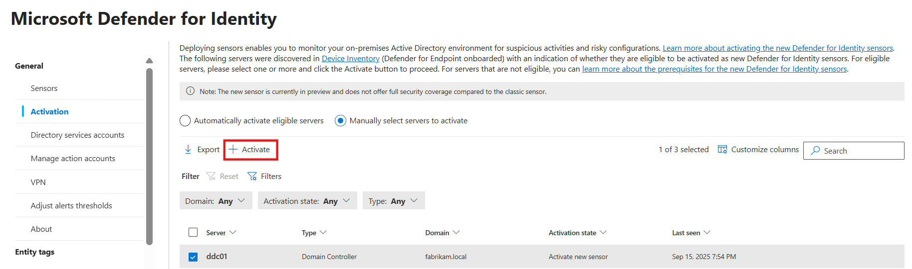
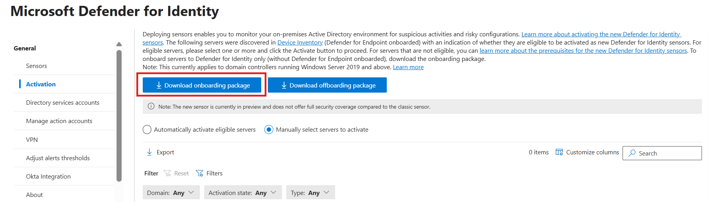
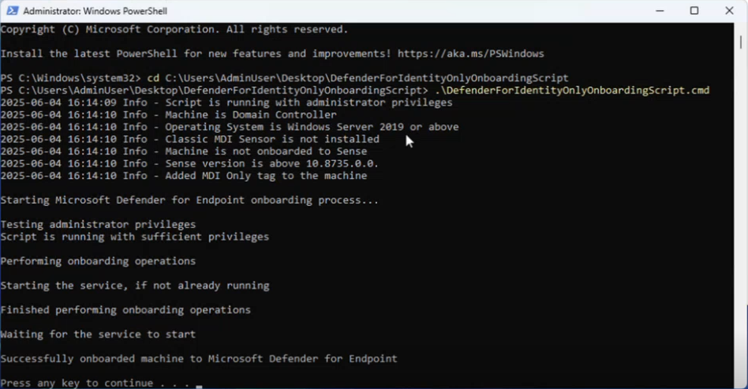

# Activate the Microsoft Defender for Identity sensor v3.x

For complete protection of your on-premises deployment, activate the Defender for Identity sensor v3.x on all eligible servers. Supported server types include domain controllers and AD FS, AD CS, or Microsoft Entra Connect servers that aren't domain controllers. Eligible servers must meet the sensor v3.x prerequisites, including Windows Server 2019 or later. For supported servers running older operating systems, [deploy the Defender for Identity sensor v2.x](install-sensor.md) instead.

> [!NOTE]
> Activating the Defender for Identity sensor v3.x on AD FS, AD CS, and Microsoft Entra Connect servers that aren't domain controllers is in preview.

## Prerequisites

See [Microsoft Defender for Identity sensor v3.x prerequisites](deploy-sensor-v3.md) for system requirements and [Sensor version limitations](deploy-sensor-v3.md#sensor-version-limitations) for supported scenarios before activating the Defender for Identity sensor v3.x on eligible servers.

## Review the Activation page

The **Activation** page displays all servers from your device inventory. Defender for Identity detects your servers and their configuration. Each server's activation state shows whether the server is eligible for the v3.x sensor and what action to take.

You can activate eligible domain controllers automatically or manually. AD FS, AD CS, and Microsoft Entra Connect servers that aren't domain controllers currently support manual activation only. Automatic activation and migration aren't currently supported for these servers and will be added in a future update.

To turn on automatic activation for eligible domain controllers, use the **Automatic sensor v3.x activation** toggle on the **Advanced features** page (**Settings** > **Identities** > **Advanced features**). Automatic activation applies only to eligible servers onboarded to Defender for Endpoint. It doesn't apply to onboarding without Defender for Endpoint deployment or to migration from sensor v2.x to sensor v3.x.
 

|Activation state  |Next steps  |
|---------|---------|
|Install sensor v2.x|[Deploy the Defender for Identity sensor v2.x](install-sensor.md) from the **Sensors page**.|
|OS upgrade is required     |This server is running an unsupported operating system version for the v3.x sensor. Upgrade the server to a supported version. |
|Activate sensor v3.x |The server is already onboarded to Defender for Endpoint. [Activate the v3.x sensor](#activate-the-defender-for-identity-sensor).|

<!--|Download onboarding package     |[Onboard the domain controller to Defender for Endpoint](#onboard-the-domain-controller).|-->

<!--## The Activation process
The process for activating the sensor depends on your configuration.
- If you have a Defender for Endpoint deployment, simply [activate the sensor](#activate-the-defender-for-identity-sensor).
- If the domain controller is not onboarded to Defender for Endpoint, [onboard the domain controller](#onboard-the-domain-controller) by configuring Defender for Endpoint streamlined URLs, and then downloading and running the onboarding package.-->

## Activate the Defender for Identity sensor v3.x

Perform the following steps to activate the Defender for Identity sensor v3.x on an eligible server:

1. In the [Microsoft Defender portal](https://security.microsoft.com), go to **System** > **Settings** > **Identities** > **Activation**.
1. Select the eligible server where you want to activate Defender for Identity, and select **Activate**. Confirm your selection when prompted.

   
   
   
1. When v3.x sensor activation for the selected server is complete, a green success banner appears. In the banner, select **Click here to see the onboarded servers**. The **Sensors** page opens, where you can check the sensor's health.

    :::image type="content" source="media/activated-sensor.png" alt-text="Screenshot that shows successful activation." lightbox="media/activated-sensor.png":::

   
<!--## Onboard the domain controller 

If the domain controller has not been onboarded to Defender for Endpoint for Servers, follow these steps to activate the sensor.

1. [Configure your network environment to ensure connectivity with Defender for Endpoint](/microsoft-365/security/defender-endpoint/configure-environment##enable-access-to-microsoft-defender-for-endpoint-service-urls-in-the-proxy-server) using [streamlined URLs](/microsoft-365/security/defender-endpoint/configure-device-connectivity#option-1-configure-connectivity-using-the-simplified-domain).
1. In the [Microsoft Defender portal](https://security.microsoft.com), go to **System** > **Settings** > **Identities** > **Activation**.
1. Select **Download onboarding package**, and save the file in a location you can access from your domain controller.

   
   
1. From the domain controller, extract the zip file you downloaded from the Microsoft Defender portal.
1. Run the `DefenderForIdentityOnlyOnboardingScript.cmd` script as an administrator.

   

!-->

## Confirm sensor activation 

To confirm that the v3.x sensor is working:

1. In the [Microsoft Defender portal](https://security.microsoft.com), go to **System** > **Settings** > **Identities** > **Sensors**.
1. Check that the activated server is listed.

> [!NOTE]
> The first Defender for Identity sensor v3.x activation in your environment might take up to an hour to show as **Running** on the **Sensors** page. Subsequent activations appear within five minutes. Activation doesn't require a restart.

## Related content

- [Manage and update Microsoft Defender for Identity sensors](../sensor-settings.md)
