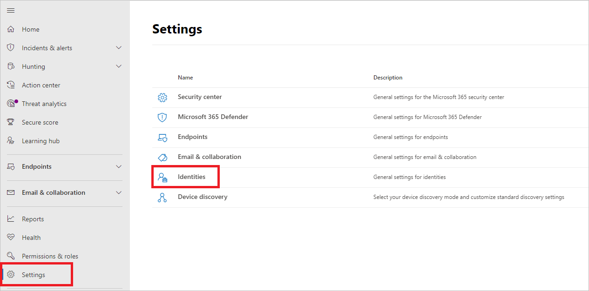
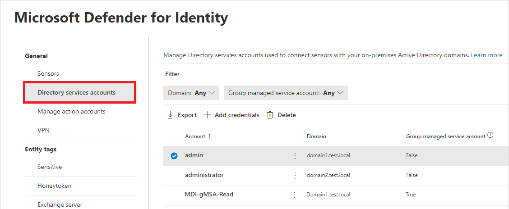
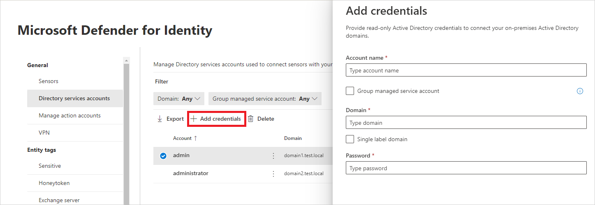
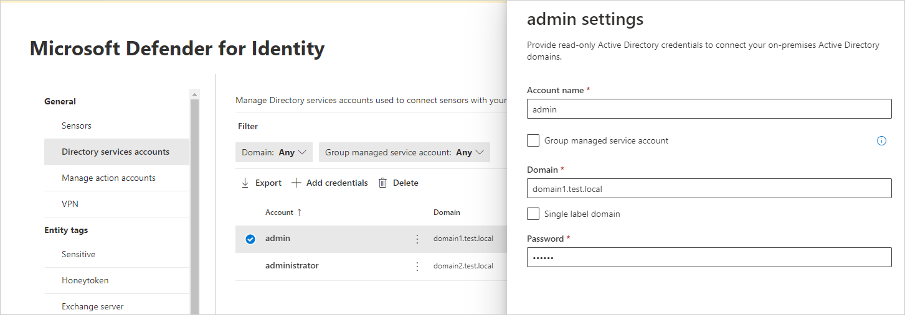

# Configure a Directory Service Account for Defender for Identity with a gMSA

This article describes how to create a [group managed service account (gMSA)](/windows-server/security/group-managed-service-accounts/getting-started-with-group-managed-service-accounts) for use as a Defender for Identity Directory Service Account entry. 

 
>[!NOTE]
>In multi-forest, multi-domain environments, the sensors that need to use the gMSA need to have their computer accounts trusted by the domain where the gMSA was created.
>We recommend creating a universal group in each domain. Include all sensors' computer accounts so that all sensors can retrieve the gMSAs' passwords, and perform the cross-domain authentications.
>We also recommend creating the gMSAs with a unique name for each forest or domain.

## Prerequisites

- Before you create the gMSA account, assign permissions that allow the sensor to retrieve the account password from Active Directory.

-  You can configure password retrieval in one of the following ways:

    - Assign the gMSA account directly to each of the sensors.

    - Use a group that contains all the sensors that need to use the gMSA account.

- Choose the appropriate group based on your deployment

    - **In a single-forest, single-domain deployment**, if you aren't installing the sensor on any Active Directory Federation Services (AD FS) / Active Directory Certificate Services (AD CS) servers, use the built-in Domain Controllers security group.

    - **In a forest with multiple domains**, when using a single Directory Service Account (DSA) account, we recommend creating a universal group and adding each of the domain controllers and AD FS / AD CS servers to the universal group.

## Refresh Kerberos tickets after changing group membership

If you add a computer account to the universal group after the computer received its Kerberos ticket, it won't be able to retrieve the gMSA's password until it receives a new Kerberos ticket. The Kerberos ticket has a list of groups that an entity is a member of when the ticket is issued.

To refresh the Kerberos ticket, you can:

- **Wait for new Kerberos ticket to be issued**. Kerberos tickets are normally valid for 10 hours.

- **Reboot the server**. When the server is rebooted, a new Kerberos ticket is requested with the new group membership.

- **Purge the existing Kerberos tickets** to force the domain controller to request a new Kerberos ticket. Run the following command to purge the tickets, from an administrator command prompt on the domain controller: `klist purge -li 0x3e7`

## Create the gMSA account

This section describes how to create a group that can retrieve the account's password, create a gMSA account, and test that the account is ready to use.

>[!NOTE]
> If you never used a gMSA account before, you might need to generate a new root key for the Microsoft Group Key Distribution Service (KdsSvc) within Active Directory. This step is required only once per forest.
>
> To generate a new root key for immediate use, run the following command:
> ```powershell
> Add-KdsRootKey -EffectiveImmediately
> ```

Update the following code with variable values for your environment, and then run the PowerShell commands as an administrator:

```powershell
# Variables:
# Specify the name of the gMSA you want to create:
$gMSA_AccountName = 'mdiSvc01'
# Specify the name of the group you want to create for the gMSA,
# or enter 'Domain Controllers' to use the built-in group when your environment is a single forest, and will contain only domain controller sensors.
$gMSA_HostsGroupName = 'mdiSvc01Group'
# Specify the computer accounts that will become members of the gMSA group and have permission to use the gMSA. 
# If you are using the 'Domain Controllers' group in the $gMSA_HostsGroupName variable, then this list is ignored
$gMSA_HostNames = 'DC1', 'DC2', 'DC3', 'DC4', 'DC5', 'DC6', 'ADFS1', 'ADFS2'

# Import the required PowerShell module:
Import-Module ActiveDirectory

# Set the group
if ($gMSA_HostsGroupName -eq 'Domain Controllers') {
    $gMSA_HostsGroup = Get-ADGroup -Identity 'Domain Controllers'
} else {
    $gMSA_HostsGroup = New-ADGroup -Name $gMSA_HostsGroupName -GroupScope DomainLocal -PassThru
    $gMSA_HostNames | ForEach-Object { Get-ADComputer -Identity $_ } |
        ForEach-Object { Add-ADGroupMember -Identity $gMSA_HostsGroupName -Members $_ }
}

# Create the gMSA:
New-ADServiceAccount -Name $gMSA_AccountName -DNSHostName "$gMSA_AccountName.$env:USERDNSDOMAIN" `
 -PrincipalsAllowedToRetrieveManagedPassword $gMSA_HostsGroup
```

## Grant required DSA permissions

[!INCLUDE [dsa-permissions](../includes/dsa-permissions.md)]

## Verify that the gMSA account has the required rights

The Defender for Identity sensor service, *Azure Advanced Threat Protection Sensor*, runs as a *LocalService* and performs impersonation of the DSA account. The impersonation fails if the *Log on as a service* policy is configured but the permission wasn't granted to the gMSA account. In that case, you see the following health issue: **Directory services user credentials are incorrect.**

If you see this alert, check to see if the *Log on as a service policy* is configured either in a Group Policy setting or in a Local Security Policy.

- **Check the Local Policy**
    -  Run `secpol.msc` 
    -  Select **Local Policies** > **User Rights Assignment**
    - Open the **Log on as a service policy** setting. 

    :::image type="content" source="../media/log-on-as-a-service.png" alt-text="Screenshot of the log on as a service property.":::

    - If the policy is enabled, add the gMSA account to the list of accounts that can log on as a service.

- **Check the Group Policy setting**
    -  Run `rsop.msc` 
    -  Go to **Computer Configuration -> Windows Settings -> Security Settings -> Local Policies -> User Rights Assignment -> Log on as a service.** 
    
    :::image type="content" source="../media/log-on-as-a-service-gpmc.png" alt-text="Screenshot of the Log on as a service policy in the Group Policy Management Editor." lightbox="../media/log-on-as-a-service-gpmc.png":::

    - If the setting is configured, add the gMSA account to the list of accounts that can log on as a service in the Group Policy Management Editor.

> [!NOTE]
> If you use the Group Policy Management Editor to configure the **Log on as a service** setting, make sure to add both **NT Service\All Services** and the gMSA account you created.

## Configure a Directory Service account in Microsoft Defender XDR

To connect your sensors with your Active Directory domains, configure Directory Service accounts in Microsoft Defender XDR.

1. In [Microsoft Defender XDR](https://security.microsoft.com/), go to **Settings > Identities**.

    [](../media/settings-identities.png#lightbox)

1. Select **Directory Service accounts** to see which accounts are associated with which domains. 

    [](../media/directory-service-accounts.png#lightbox)

1. Select **Add credentials** and enter the **Account name**, **Domain**, and **Password** of the account you created earlier. You can choose if it's a **Group managed service account** (gMSA), or if it belongs to a **Single label domain**. 

    [](../media/new-directory-service-account.png#lightbox)

    |Field|Comments|
    |---|---|
    |**Account name** (required)|Enter the read-only AD username. For example: **DefenderForIdentityUser**. <br><br>- You must use a **standard** AD user or gMSA account. <br>- **Don't** use the UPN format for your username. <br>- When using a gMSA, the user string should end with the `$` sign. For example: `mdisvc$`<br /><br>**NOTE:** We recommend that you avoid using accounts assigned to specific users.|
    |**Password** (required for standard AD user accounts)|For AD user accounts only, generate a strong password for the read-only user. For example: `PePR!BZ&}Y54UpC3aB`.|
    |**Group managed service account** (required for gMSA accounts)|For gMSA accounts only, select **Group managed service account**.|
    |**Domain** (required)|Enter the domain for the read-only user. For example: **contoso.com**. <br><br>It's important that you enter the complete FQDN of the domain where the user is located. For example, if the user's account is in domain corp.contoso.com, you need to enter `corp.contoso.com` not `contoso.com`. <br><br>For more information, see [Microsoft support for Single Label Domains](/troubleshoot/windows-server/networking/single-label-domains-support-policy).|

1. Select **Save**.
1. (Optional) Select an account to open the details pane and view its settings.

    [](../media/account-settings.png#lightbox)

> [!NOTE]
> You can use this same procedure to change the password for standard Active Directory user accounts. There's no password set for gMSA accounts.

## Troubleshooting

For more information, see [Sensor failed to retrieve the gMSA credentials](../troubleshooting-known-issues.md#sensor-failed-to-retrieve-group-managed-service-account-gmsa-credentials).

## Next step

> [!div class="step-by-step"]
> [Configure SAM-R to enable lateral movement path detection in Microsoft Defender for Identity »](remote-calls-sam.md)
