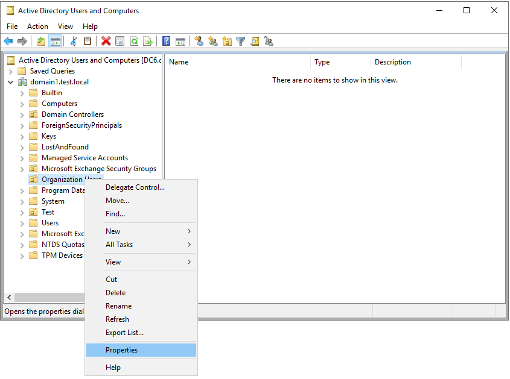
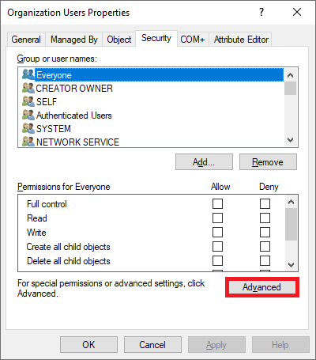
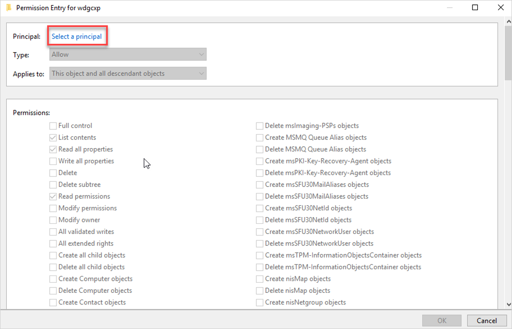
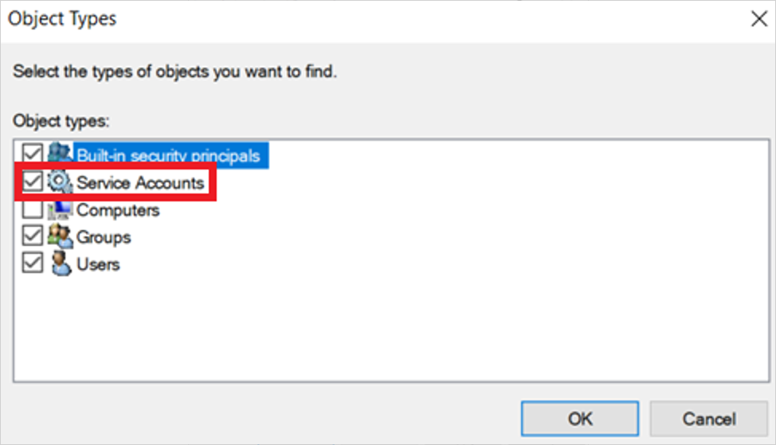
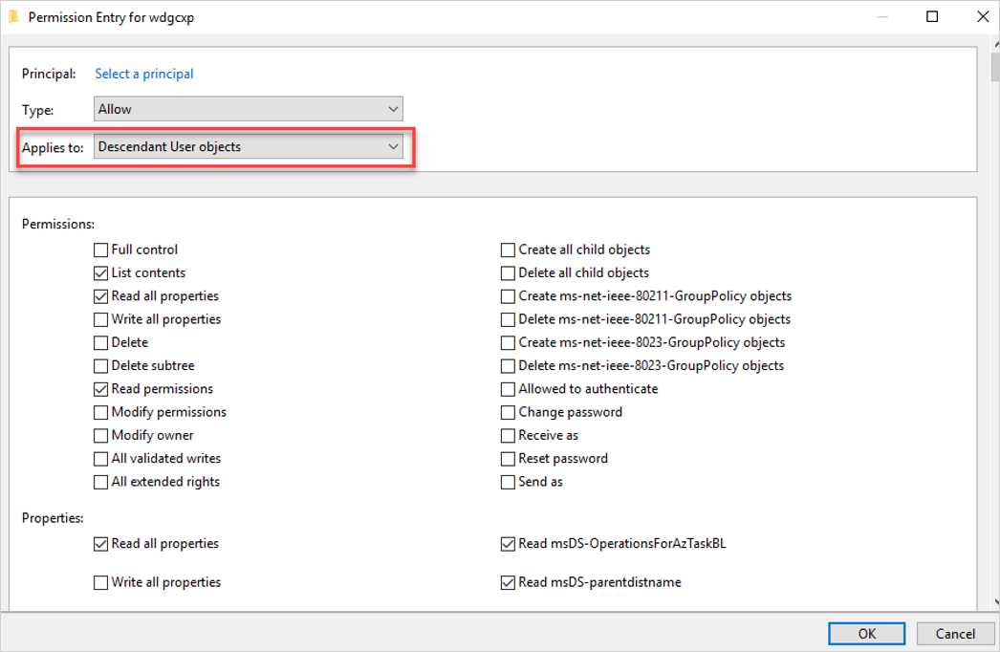
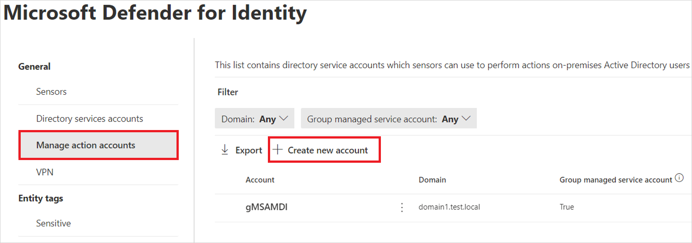

# Configure Microsoft Defender for Identity action accounts

Defender for Identity allows you to take [remediation actions](../remediation-actions.md) targeting on-premises Active Directory accounts in the event that an identity is compromised. To take these actions, Microsoft Defender for Identity needs to have the required permissions to do so. This is separate from the [Directory Service Account](directory-service-accounts.md), which is for reading AD data.

> [!IMPORTANT]
> This configuration applies to the Defender for Identity sensor v2.x on domain controllers only. Remediation actions aren't performed by sensors on AD FS, AD CS, or Microsoft Entra Connect servers that aren't domain controllers. The sensor v3.x always uses the domain controller's local system account for remediation actions. If all your sensors are v3.x, no action account configuration is needed.

By default, the Microsoft Defender for Identity sensor impersonates the `LocalSystem` account of the domain controller and performs the actions, including [attack disrupting scenarios from Microsoft Defender XDR](/microsoft-365/security/defender/automatic-attack-disruption).

If you need to change the default behavior of using the domain controller's `LocalSystem` account for remediation actions, set up a dedicated gMSA and scope the permissions that you need. For example:

> [!WARNING]
> The sensor v3.x does not use gMSA action accounts. It always uses the domain controller's local system account for remediation actions.
>
> If any of your sensors are v3.x, select **Automatically use the sensor's local system account**. The v3.x sensors use the local system account regardless of gMSA configuration. The v3.x sensors don't use gMSA accounts configured for v2.x sensors.
>
> For more information, see [Sensor v3.x service account requirements](deploy-sensor-v3.md#service-account-requirements).

:::image type="content" source="../media/management-accounts.png" alt-text="Screenshot of the Manage action accounts tab." lightbox="../media/management-accounts.png":::

> [!NOTE]
> Using a dedicated gMSA as an action account is optional. We recommend that you use the default settings for the `LocalSystem` account.

## Best practices for action accounts

We recommend that you avoid using the same gMSA account you configured for Defender for Identity managed actions on servers other than domain controllers. If you use the same account and the server is compromised, an attacker could retrieve the password for the account and gain the ability to change passwords and disable accounts.

We also recommend that you avoid using the same account as both the Directory Service account and the Manage Action account. This is because the Directory Service account requires only read-only permissions to Active Directory, and the Manage Action accounts needs write permissions on user accounts.

If you have multiple forests, your gMSA managed action account must be trusted in all of your forests, or create a separate one for each forest. For more information, see [Microsoft Defender for Identity multi-forest support](multi-forest.md).

## Create and configure a specific action account

1. Create a new gMSA account. For more information, see [Getting started with Group Managed Service Accounts](/windows-server/security/group-managed-service-accounts/getting-started-with-group-managed-service-accounts).

1. Assign the **Log on as a service** right to the gMSA account on each domain controller running the Defender for Identity sensor.

1. Grant the required permissions to the gMSA account as follows:

    1. Open **Active Directory Users and Computers**.

    1. Right-click the relevant domain or OU and select **Properties**. For example:

        

    1. Go the **Security** tab and select **Advanced**. For example:

        

    1. Select **Add** > **Select a principal**. For example:

        

    1. Make sure **Service accounts** is marked in **Object types**. For example:

        

    1. In the **Enter the object name to select** box, enter the name of the gMSA account and select **OK**.

    1. In the **Applies to** field, select **Descendant User objects**, leave the existing settings, and add the permissions and properties shown in the following example:

        

        Required permissions include:

        |Action  |Permissions  |Properties  |
        |---------|---------|---------|
        |**Enable force password reset**     |  Reset password       |   - `Read pwdLastSet`  - `Write pwdLastSet`      |
        |**To disable user**     |    -     |                   - `Read userAccountControl`  - `Write userAccountControl`      |

    1. (Optional) In the **Applies to** field, select **Descendant Group objects** and set the following properties:

        - `Read members`
        - `Write members`

    1. Select **OK**.

## Add the gMSA account in the Microsoft Defender portal

Use the Microsoft Defender portal to add the gMSA action account:

1. Go to the [Microsoft Defender portal](https://security.microsoft.com) and select **Settings** -> **Identities** > **Microsoft Defender for Identity** > **Manage action accounts** > **+Create new account**. 

    For example:

    

1. Enter the account name and domain and select **Save**.

Your action account is listed on the **Manage action accounts** page.

## Related content

For more information, see [Remediation actions in Microsoft Defender for Identity](../remediation-actions.md).
