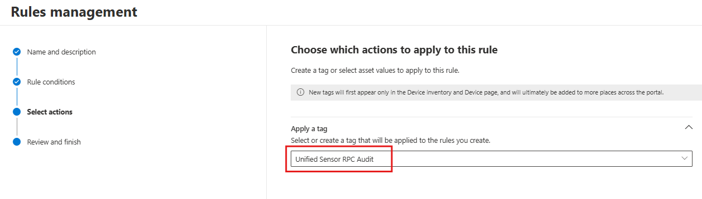

# Microsoft Defender for Identity sensor v3.x prerequisites

This article describes the requirements for installing the Microsoft Defender for Identity sensor v3.x.

## Sensor version limitations

Before you activate the Defender for Identity sensor v3.x, note that v3.x:

- Doesn't support VPN integration.
- Doesn't support [syslog notifications](../notifications.md#configure-syslog-notifications).
- Has limitations working with Azure ExpressRoute. For more information, see [Azure ExpressRoute for Microsoft 365](/microsoft-365/enterprise/azure-expressroute).

## Server requirements

Before activating the Defender for Identity sensor v3.x, make sure that the server on which you're activating the sensor:

- Has Defender for Endpoint deployed. The Microsoft Defender Antivirus component can be in either active or passive mode.
- Doesn't have a Defender for Identity sensor v2.x already deployed.
- Is running Windows Server 2019 or later.
- Includes the [March 2026 or later](https://support.microsoft.com/en-us/topic/march-10-2026-kb5078766-os-build-20348-4893-fa3ee26a-0877-47d7-a4b2-9dd632ea8cea) cumulative update.

### Supported server types

The v3.x sensor supports domain controllers, including domain controllers with these identity roles:

- Active Directory Federation Services (AD FS)
- Active Directory Certificate Services (AD CS)
- Microsoft Entra Connect

Use the [Defender for Identity sensor v2.x](prerequisites-sensor-version-2.md) for standalone servers that run AD FS, AD CS, or Microsoft Entra Connect.

## Licensing requirements

Deploying Defender for Identity requires one of the following Microsoft 365 licenses:

- Enterprise Mobility + Security E5 (EMS E5/A5)
- Microsoft 365 E5 (Microsoft E5/A5/G5)
- Microsoft 365 E5/A5/G5/F5* Security
- Microsoft 365 F5 Security + Compliance*

Both F5 licenses require Microsoft 365 F1/F3 or Office 365 F3 and Enterprise Mobility + Security E3. Purchase licenses in the Microsoft 365 portal or through Cloud Solution Partner (CSP) licensing. For more information, see [Licensing and privacy FAQs](/defender-for-identity/technical-faq#licensing-and-privacy).

## Role and permissions requirements

- To create your Defender for Identity workspace, you need a Microsoft Entra ID tenant.
- You must either be a [Security Administrator](/entra/identity/role-based-access-control/permissions-reference), or have the following [Unified RBAC](../role-groups.md#unified-role-based-access-control-rbac) permissions:

  - `System settings (Read and manage)`
  - `Security settings (All permissions)`

## Networking requirements

The Defender for Identity sensor utilizes the same URIs as Microsoft Defender for Endpoint. Please review the following documents for Defender for Endpoint, based on your systems connectivity, for a complete list of required service endpoints.

- [Microsoft Defender for Endpoint streamlined connectivity URLs](/defender-endpoint/streamlined-device-connectivity-urls-commercial?tabs=Windows)

- [Microsoft Defender for Endpoint standard connectivity URLs](/defender-endpoint/standard-device-connectivity-urls-commercial)

## Memory requirements

The following table describes memory requirements on the server used for the Defender for Identity sensor, depending on the type of virtualization you're using:

| VM running on | Description |
|------------|-------------|
|Hyper-V|Ensure that **Enable Dynamic Memory** isn't enabled for the VM.|
|VMware|Ensure that the amount of memory configured and the reserved memory are the same, or select the **Reserve all guest memory (All locked)** option in the VM settings.|
|Other virtualization host|Refer to the vendor-supplied documentation on how to ensure that memory is always fully allocated to the VMs.|

> [!IMPORTANT]
> When running as a virtual machine, always allocate all memory to the virtual machine.

Version 3 of the sensor prevents the sensor from overusing CPU or memory by limiting CPU utilization at 30%, and memory usage to 1.5 GB. However, if a non-Microsoftr Identity service already uses substantial system resources, the domain controller might still experience performance strain.

Refer to the [Defender for Identity Capacity Planning documentation](/defender-for-identity/deploy/capacity-planning) to determine whether your domain controller servers have enough resources for a Microsoft Defender for Identity sensor. 

## Configure RPC auditing

Applying the **Unified Sensor RPC Audit** tag to a device improves security visibility and unlocks more identity detections. Once applied, the configuration is enforced on all existing and future devices that match the rule criteria. The tag is visible in the Device Inventory for transparency and auditing capabilities.

1. In the **Microsoft Defender portal**, navigate to: **System > Settings > Microsoft Defender XDR > Asset Rule Management**.
1. Select **Create a new rule**.

    :::image type="content" source="media/prerequisites-sensor-version-3/new-rule.png" alt-text="Screenshot that shows how to add a new rule." lightbox="media/prerequisites-sensor-version-3/new-rule.png":::

1. In the side panel:

    1. Enter a **Rule name** and **Description**.   
    1. Set **rule conditions** using `Device name`, `Domain`, or `Device tag` to target the desired machines. Target domain controllers with the sensor v3.x installed.
    1. Make sure that the **Defender for Identity sensor v3.x** is already deployed on the selected devices.

1. Add the **Unified Sensor RPC Audit** tag to the selected devices.

    
   
1. Select **Next** to review and finish creating the rule, and then select **Submit**. The rule might take up to one hour to take effect.

### Remove RPC auditing from a device

To offboard a device from this configuration, delete the asset rule or modify the rule conditions so the device no longer matches.

> [!NOTE]
> It might take up to one hour for changes to be reflected in the portal.

Learn more about [asset management rules](/defender-xdr/configure-asset-rules).

## Configure Windows event auditing

Defender for Identity uses Windows event log entries to detect specific activities. This data is used in various detection scenarios and can be used in advanced hunting queries. For optimal protection and monitoring, make sure that collection of windows events is properly configured.

See [Configure Defender for Identity to collect Windows events automatically](configure-windows-event-collection.md#configure-defender-for-identity-to-collect-windows-events-automatically).

If you don't select automatic Windows auditing configuration, you must [configure Windows event auditing manually](configure-windows-event-collection.md#configure-windows-event-collection-manually) or [using PowerShell](configure-windows-event-collection.md#configure-windows-event-collection-using-powershell).

> [!NOTE]
> **Known issue:** In some v3 sensor environments, auditing health alerts might persist even when Windows auditing is correctly configured. This primarily occurs with manual auditing configuration, such as using Group Policy or PowerShell. The sensor remains healthy and detections aren't affected. To resolve, enable **Automatic Windows auditing configuration** in the Defender for Identity portal under **Settings** > **Advanced features**. 

## Recommended configurations for optimal performance

We recommend that you make sure these items are properly configured for optimal performance.

- Set the **Power Option** of the machine running the Defender for Identity sensor to **High Performance**.
- Synchronize the time on servers and domain controllers where you install the sensor to within five minutes of each other.
- This sensor uses the local system identity of the server for Active Directory and response actions. If you had Group Managed Service Account (gMSA) configured for an earlier version of the sensor, make sure to remove gMSA. If gMSA is enabled, the response actions won't work. In environments that use both v2 and v3 sensors, use local system accounts for all of your sensors.

## Test your prerequisites

We recommend running the [*Test-MdiReadiness.ps1*](https://github.com/microsoft/Microsoft-Defender-for-Identity/tree/main/Test-MdiReadiness) script to test and see if your environment has the necessary prerequisites.

The *Test-MdiReadiness.ps1* script is also available from Microsoft Defender XDR, on the **Identities > Tools** page (Preview).

## Next step

[Activate the Microsoft Defender for Identity sensor](activate-sensor.md)
