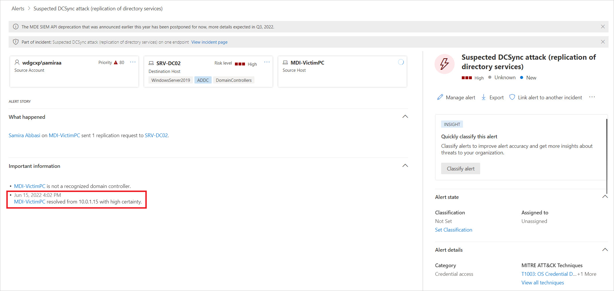

# Network Name Resolution (NNR) in Microsoft Defender for Identity

Network Name Resolution (NNR) is a key component of Microsoft Defender for Identity functionality. Defender for Identity captures activities based on network traffic, Windows events, and ETW. These activities normally contain IP data.

By using NNR, Defender for Identity can correlate raw activities that contain IP addresses with the relevant computers involved in each activity. Based on the raw activities, Defender for Identity profiles entities, including computers, and generates security alerts for suspicious activities.

## NNR with the Defender for Identity sensor v3.x

The Defender for Identity sensor v3.x automatically performs name resolution by using the Defender device inventory and events that the sensor collects, without needing to open extra ports in your environment.

## NNR with the Defender for Identity sensor v2.x

To resolve IP addresses to computer names, Defender for Identity sensors look up the IP addresses by using the following methods:

Primary methods:

- NTLM over RPC (TCP port 135)
- NetBIOS (UDP port 137)
- RDP (TCP port 3389) - only the first packet of **Client hello**

Secondary method:

- Queries the DNS server using reverse DNS lookup of the IP address (UDP 53)

For the best results, we recommend using at least one of the primary methods.
The sensor performs reverse DNS lookup of the IP address only when:

- There's no response from any of the primary methods.
- There's a conflict in the response received from two or more primary methods.

> [!NOTE]
> No authentication is performed on any of the ports.

Defender for Identity evaluates and determines the device operating system based on network traffic. After retrieving the computer name, the Defender for Identity sensor checks Active Directory and uses TCP fingerprints to see if there's a correlated computer object with the same computer name. Using TCP fingerprints helps identify unregistered and non-Windows devices, aiding in your investigation process.
When the Defender for Identity sensor finds the correlation, the sensor associates the IP to the computer object.

In cases where no name is retrieved, an **unresolved computer profile by IP** is created with the IP and the relevant detected activity.

NNR data is crucial for detecting the following threats:

- Suspected identity theft (pass-the-ticket)
- Suspected DCSync attack (replication of directory services)
- Network-mapping reconnaissance (DNS)

To improve your ability to determine if an alert is a **True Positive (TP)** or **False Positive (FP)**, Defender for Identity includes the degree of certainty of computer naming resolving into the evidence of each security alert.

For example, when computer names are resolved with  **high certainty** it increases the confidence in the resulting security alert as a **True Positive** or **TP**.

The evidence includes the time, IP, and computer name the IP was resolved to. When the resolution certainty is **low**, use this information to investigate and verify which device was the true source of the IP at this time.
After confirming the device, you can then determine if the alert is a **False Positive** or **FP**, similar to the following examples:

- Suspected identity theft (pass-the-ticket) – the alert was triggered for the same computer.
- Suspected DCSync attack (replication of directory services) – the alert was triggered from a domain controller.
- Network-mapping reconnaissance (DNS) – the alert was triggered from a DNS Server.

    

## Configuration recommendations

- NTLM over RPC:
  - Check that TCP port 135 is open for inbound communication from Defender for Identity Sensors, on all computers in the environment.
    - Check all network configuration, such as firewalls, as this can prevent communication to the relevant ports.

- NetBIOS:
  - Check that UDP port 137 is open for inbound communication from Defender for Identity Sensors, on all computers in the environment.
    - Check all network configuration, such as firewalls, as this can prevent communication to the relevant ports.
- RDP:
  - Check that TCP port 3389 is open for inbound communication from Defender for Identity Sensors, on all computers in the environment.
    - Check all network configuration, such as firewalls, as this can prevent communication to the relevant ports.
  >[!NOTE]
  >
  > - Only one of these protocols is required, but we recommend using all of them.
  > - Customized RDP ports aren't supported.

- Reverse DNS:
  - Check that the Sensor can reach the DNS server and that Reverse Lookup Zones are enabled.

## Health issues

To ensure Defender for Identity works correctly and the environment is configured properly, Defender for Identity checks the resolution status of each sensor. It generates a health alert for each method and provides a list of the Defender for Identity sensors with a low success rate of active name resolution for each method.

When an observed IP address can't resolve to a computer name, Microsoft Defender for Identity records it as an unresolved computer entity. If these unresolved entities accumulate over time, the sensor’s active name resolution success rate decreases. This might trigger a low success rate of active name resolution health alert. This alert indicates reduced enrichment of network activity with device identity which might lower confidence in some detections. It doesn't indicate a sensor failure.

Each health alert provides specific details of the method, sensors, the problematic policy, and configuration recommendations. For more information about health issues, see [Microsoft Defender for Identity sensor health issues](health-alerts.md).

> [!NOTE]
> To disable an optional NNR method in Defender for Identity to fit the needs of your environment, open a support case.

## See Also
- [Defender for Identity sensor v2.x prerequisites](deploy/prerequisites-sensor-version-2.md) and [Defender for Identity sensor v3.x prerequisites](deploy/prerequisites-sensor-version-3.md)
- [Configure event collection](deploy/configure-event-collection.md)
