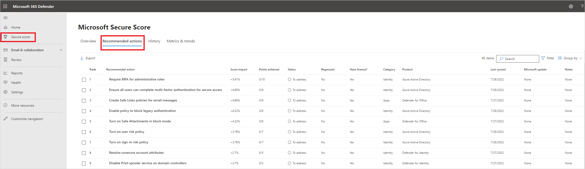
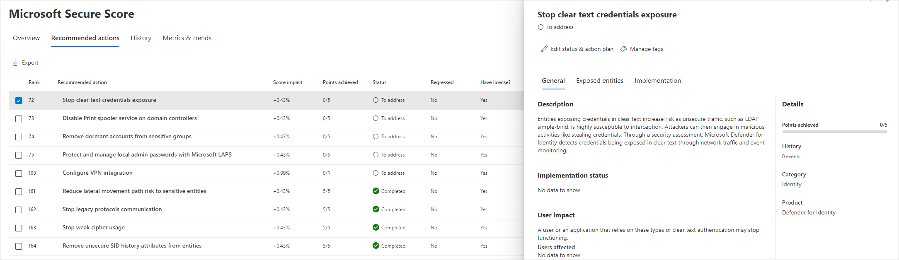

# Microsoft Defender for Identity's security posture assessments

Typically, organizations of all sizes have limited visibility into whether or not their on-premise and cloud apps and services could introduce a security vulnerability to their organization. The problem of limited visibility is especially true regarding use of unsupported or outdated components.

While your company might invest significant time and effort on hardening identities and identity infrastructure (such as Active Directory, Active Directory Connect) as an ongoing project, it's easy to remain unaware of common misconfigurations and use of legacy components that represent one of the greatest threat risks to your organization. 

Microsoft security research reveals that most identity attacks utilize common misconfigurations in Active Directory and continued use of legacy components (such as NTLMv1 protocol) to compromise identities and successfully breach your organization. To combat these misconfigurations and legacy-component risks effectively, Microsoft Defender for Identity now offers proactive identity security posture assessments to detect and recommend actions across your on-premise Active Directory configurations.

## What do Defender for Identity security assessments provide?

Defender for Identity security posture assessments are available in [Microsoft Secure Score](/microsoft-365/security/defender/microsoft-secure-score), and provide:

- **Detections and contextual data** on known exploitable components and misconfigurations, along with relevant paths for remediation.

- **Active monitoring for your on-premise and cloud identities and identity infrastructure**, watching for weak spots with the existing Defender for Identity sensor.

- **Accurate assessment reports** of your current organization security posture, for quick responses and effect monitoring in a continuous cycle.

Microsoft Secure Score is a measurement of an organization's security posture, with a higher number indicating more recommended actions taken. It can be found at <https://security.microsoft.com/securescore> in the [Microsoft Defender portal](/microsoft-365/security/defender/microsoft-365-defender).

### Categorization of Defender for Identity security posture assessments

Defender for Identity security posture assessments have six key categories. Each category addresses specific identity security risks and provides remediation guidance.

- **Hybrid security**: Identifies misconfigurations in environments that integrate on-premises (e.g., Active Directory) and cloud-based identity providers (e.g., Microsoft Entra ID, Okta). Assesses risks related to synchronization, authentication, and authorization across platforms.
- **Identity infrastructure**: Detects misconfigurations and vulnerabilities in core identity components, including domain controllers.
- **Certificates**: Assesses Active Directory Certificate Services (AD CS), Microsoft's certificate infrastructure service, for security gaps, such as misconfigured certificate templates or weak certificate authority settings. Identifying and addressing these issues helps prevent unauthorized access that could arise from certificate-related vulnerabilities.
- **Group policy**: Analyzes Group Policy configurations to identify settings that might allow privilege escalation or unauthorized lateral movement within the network. Ensuring secure Group Policy settings helps maintain proper access controls and system configurations.
- **Accounts**: Reviews users, devices, and groups to pinpoint security risks such as weak passwords, inactive accounts, or improper permissions.
- **Cloud identities**: Evaluates cloud identity configurations in Okta accounts for security gaps, such as missing MFA settings or privileged Okta accounts, and provides remediation guidance.

## Prerequisites

- You must have a Defender for Identity license to view Defender for Identity security posture assessments in Microsoft Secure Score.
- While *certificate template* assessments are available to all customers with AD CS installed in their environment, *certificate authority* assessments are available only to customers who have installed a sensor on an AD CS server.
- Hybrid security recommendations will be available only if Microsoft Defender for Identity sensor is installed on servers running Microsoft Entra Connect services.

For more information, see [Configuring sensors for AD FS, AD CS and Microsoft Entra Connect.](https://aka.ms/DeployMdiSensorOnYourIdentityInfrastructure)

## Access Defender for Identity security posture assessments

You can view Defender for Identity security posture assessments in the Microsoft Secure Score dashboard in the Microsoft Defender portal.

**To access identity security posture assessments**:

1. Open the [Microsoft Secure Score dashboard](https://security.microsoft.com/securescore).
1. Select the **Recommended actions** tab. You can search for a particular recommended action, or filter the results (for example, by the category **Identity**).

    
   
1. For more details, select the assessment.

    
   
[!INCLUDE [secure-score-note](../includes/secure-score-note.md)]

## Related content

- [Microsoft Secure Score overview](/microsoft-365/security/defender/microsoft-secure-score)
- [Microsoft Defender for Identity community forum](https://aka.ms/MDIcommunity)
