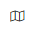
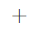

# Hunt for threats using the hunting graph

The **hunting graph** provides visualization capabilities in [advanced hunting](advanced-hunting-overview.md) by rendering threat scenarios as interactive graphs. This feature allows security operations center (SOC) analysts, threat hunters, and security researchers to conduct threat hunting and incident response more easily and intuitively, improving their efficiency and ability to assess possible security issues. 

Analysts often rely on [Kusto Query Language](/azure/kusto/query/) (KQL) queries to uncover relationships between entities. This approach can be both time-consuming and prone to oversights. The hunting graph makes exploration of security data simpler and faster by visualizing these relationships. You can trace paths and possible choke points, as well as surface insights and take various actions based on the results that tabular queries might miss. 

## Get access

To use hunting graph, advanced hunting, or other [Microsoft Defender XDR](microsoft-365-defender.md) capabilities, you need an appropriate role in Microsoft Entra ID. [Read about required roles and permissions for advanced hunting](custom-roles.md).

You must also have the following access or permissions:

- [Microsoft Sentinel data lake](/azure/sentinel/datalake/sentinel-lake-overview)
- At least [read-only](/security-exposure-management/prerequisites) access in Microsoft Security Exposure Management

## Where to find the hunting graph

You can find the **hunting graph** page by going to the left navigation bar in the Microsoft Defender portal and selecting **Investigation & response** > **Hunting** > **Advanced hunting**. 

In the advanced hunting page, select the hunting graph icon  at the top of the page or select the **Create new** icon  and choose **Hunting graph**.

:::image type="content" source="./media/advanced-hunting-graph/hunting-graph-new.png" alt-text="Screenshot of the Create new Hunting graph option in the advanced hunting page." lightbox="./media/advanced-hunting-graph/hunting-graph-new.png":::

A new hunting graph page appears as tab labeled **New hunt** in the advanced hunting page.

## Hunting graph features

The interactive graphs that the hunting graph generates use **nodes** and **edges** to show entities in your environment, such as a device, user account, or IP address, and their relationships or connection properties. [Learn more about graphs and visualizations in Microsoft Defender](understand-graph-icons.md).

The lower right corner of the graph has control buttons that let you **Zoom in** and **Zoom out**, and view the graph's **Layers**.

:::image type="content" source="./media/advanced-hunting-graph/hunting-graph-render.png" alt-text="Screenshot of a rendered graph in the hunting graph page." lightbox="./media/advanced-hunting-graph/hunting-graph-render.png":::

## Get started with hunting graph

### Use predefined scenarios in the hunting graph

The hunting graph lets you search with predefined scenarios. These scenarios are prebuilt advanced hunting queries that help you answer specific and common questions for specific use cases.

To start hunting with a predefined scenario, on a new hunting graph page, select **Search with Predefined scenarios**. A side panel appears where you can then perform the following steps: 

1. [Select a scenario and enter the required inputs](#step-1-select-a-scenario-and-enter-scenario-inputs)
1. [Apply filters on the graph](#step-2-apply-filters)
1. [Render the graph](#step-3-render-the-graph)

:::image type="content" source="./media/advanced-hunting-graph/hunting-graph-predefined-scenarios.png" alt-text="Screenshot of the hunting graph page highlighting the Search with Predefined scenarios button." lightbox="./media/advanced-hunting-graph/hunting-graph-predefined-scenarios.png":::

#### Step 1: Select a scenario and enter scenario inputs

The following table describes the predefined scenarios in the hunting graph and their respective required scenario inputs, if applicable. For scenarios that require inputs, you can type or search and select for them in the search boxes provided.

| **Scenario** | **Description** | **Inputs** |
|---|---|---|
| **Paths between two entities** | Provide two entities (nodes) to view the paths between them.  Use this scenario if you want to discover if there’s a path leading from one entity to another. |<ul><li>Start Entity<li>End Entity</ul>|
| **Entities that have access to a key vault** | Provide a specific key vault to view paths from various entities (devices, virtual machines, containers, servers, and others) that have direct or indirect access to it.  Use this scenario in case of a breach, maintenance work, or assessment of the impact of entities that might have access to a sensitive asset like a key vault. | Target key vault |
| **Users with access to sensitive data** | Provide any sensitive data storage of interest to view users that have access to it.  Use this scenario if you want to know which entities have access to sensitive data, especially in cases when an incident indicates unusual access to confidential files. | Target storage account |
| **Critical users with access to storage accounts containing sensitive data** | This scenario identifies critical users with access to storage resources containing sensitive data.  Use this scenario to prevent, assess, and monitor unauthorized access, exposure risk, and breach impact based on the privileged users. | (None) |
| **Data exfiltration by a device** | Provide a device ID to view paths to storage accounts it has access to; for instance, to check what storage accounts a certain device can access in a bring your own device (BYOD) environment.  Use this scenario when investigating suspicious or unauthorized data transfer from corporate devices and to external sources. | Source device |
| **Paths to a highly critical Kubernetes cluster** | Provide a Kubernetes cluster with high criticality to view users, virtual machines, and containers that have access to it.  Use this scenario to assess, analyze and prioritize handling of attack paths leading to highly critical Kubernetes cluster. | Target Kubernetes cluster |
| **Identities with access to Azure DevOps repositories** | Provide an Azure DevOps (ADO) repository name to view users that have read and/or write access to said repository.  Use this scenario to identify entities with access to ADO repositories, which often contain sensitive assets and therefore valuable targets for threat actors. This scenario gives you visibility and lets you plan your response in case of a breach. | Target ADO repository |
| **Identify nodes in the highest number of paths to SQL data stores** | This scenario identifies the nodes that appear in the highest number of paths leading to SQL data stores. The scenario discovers paths in the graph where users have roles or permissions to access the SQL data stores.  Use this scenario to gain visibility to stores that might contain sensitive information, assess the impact in case of a breach, and prepare your mitigation and response. | (None) |
| **Attack paths to a critical asset** | View the potential routes through various nodes leading towards a target. Use this scenario to examine potential lateral movement that could reach a critical asset through your network. | Target critical asset |
| **Entity connections** | Find the direct connections of a given entity and analyze its relationships. | Source entity  **Note:** You can use any entity as the seeding node for the graph. The graph indicates incoming and outgoing connections. |

:::image type="content" source="./media/advanced-hunting-graph/hunting-graph-select-scenario.png" alt-text="Screenshot of the predefined scenarios side panel highlighting the available options." lightbox="./media/advanced-hunting-graph/hunting-graph-select-scenario.png":::

:::image type="content" source="./media/advanced-hunting-graph/hunting-graph-input.png" alt-text="Screenshot of the predefined scenarios side panel highlighting the required scenario inputs." lightbox="./media/advanced-hunting-graph/hunting-graph-input.png":::

#### Step 2: Apply filters

You can add relevant filters to make the map view of your selected scenario more precise. For example, if you want to **Show only the shortest paths**, select this option.

:::image type="content" source="./media/advanced-hunting-graph/hunting-graph-filter.png" alt-text="Screenshot of the predefined scenarios side panel highlighting the Show only the shortest paths filter." lightbox="./media/advanced-hunting-graph/hunting-graph-filter.png":::

##### Advanced filters

By default, the predefined scenarios automatically apply certain filters, which you can view in the **Advanced Filters** section of the side panel. You can remove these filters or add new ones to further refine the graph you want to generate. 

To remove filters, select the **Remove filter** icon  beside each filter or select **Clear all** to remove them all at once.

To add a filter, select **Add filter** then the select any of the supported node or edge filters. The following table lists these supported operators and filters. Depending on your chosen scenario, some of these filters might not be available as options.  

| **Filter type** | **Operator** | **Filters** |
|---|---|---|
| **Source Node** | equals |<ul><li>Is critical<li>Is vulnerable<li>Is exposed to the internet</ul> |
| **Target Node** | equals |<ul><li>Has sensitive data<li>Has risk score<li>Is vulnerable</ul> |
| **Edge Type** | equals |<ul><li>has permissions to<li>routes traffic to<li>affecting<li>member of<li>defines<li>can impersonate as<li>contains<li>can authenticate as<li>runs on<li>has role on<li>is running<li>used to create<li>maintains<li>frequently logged in by<li>has credentials of<li>defined in<li>can authenticate to<li>pushes<li>provisions</ul>|
| **Edge direction** | equals |<ul><li>Incoming<li>Outgoing<li>Both</ul> |

:::image type="content" source="./media/advanced-hunting-graph/hunting-graph-advanced-filters.png" alt-text="Screenshot of the predefined scenarios side panel highlighting the advanced filter section." lightbox="./media/advanced-hunting-graph/hunting-graph-advanced-filters.png":::

#### Step 3: Render the graph

After selecting a scenario and applying the necessary filters, select **Run** to render the graph. Once the graph is rendered, you can then explore it further by selecting nodes and edges to view more information about entities and relationships, or expand or focus on certain entities.

## See also
- [Proactively hunt for threats with advanced hunting in Microsoft Defender](advanced-hunting-overview.md)
- [Choose between guided and advanced modes to hunt in Microsoft Defender XDR](advanced-hunting-modes.md)