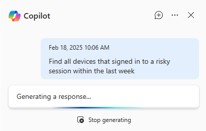
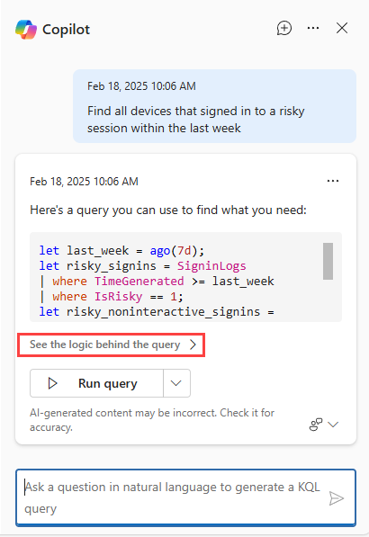
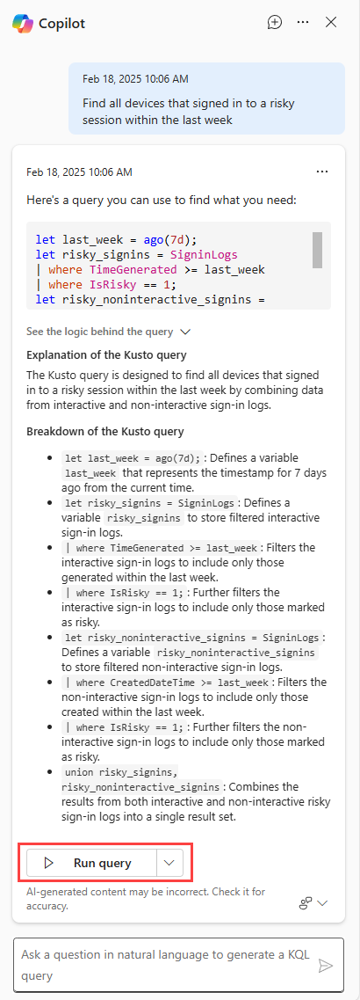
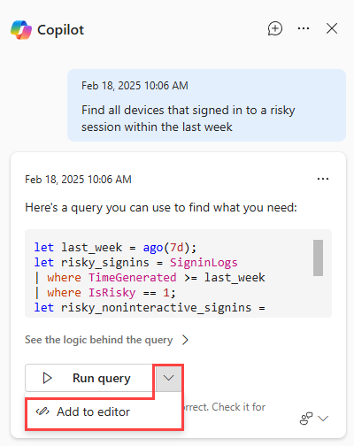
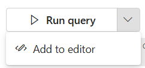

# Microsoft Security Copilot advanced hunting query assistant

[Microsoft Security Copilot in Microsoft Defender](security-copilot-in-microsoft-365-defender.md) includes a query assistant feature for advanced hunting.

Threat hunters or security analysts who aren't familiar with or haven't learned Kusto query language (KQL) can make a request or ask a question in natural language (for example, *Get all alerts involving user admin123*). Security Copilot then generates a KQL query that matches the request by using the advanced hunting data schema.

The query assistant feature reduces the time it takes to write a hunting query from scratch, so threat hunters and security analysts can focus on hunting and investigating threats.

Users with access to Security Copilot can use the query assistant feature in advanced hunting.

> [!NOTE]
> The advanced hunting capability is also available in the Security Copilot standalone experience through the Microsoft Defender XDR plugin. Know more about [preinstalled plugins in Security Copilot](/security-copilot/manage-plugins#preinstalled-plugins).

## Try your first request
To start using the Query assistant, follow these steps:

>[!NOTE]
> Make sure that the Query assistant mode is active. [Get access to Security Copilot in advanced hunting](advanced-hunting-security-copilot.md#get-access)

1. Open the **Advanced hunting** page from the navigation bar in Microsoft Defender portal. The Security Copilot side pane for advanced hunting appears at the right hand side.

    :::image type="content" source="./media/advanced-hunting-security-copilot/advanced-hunting-security-copilot-pane-big.png" alt-text="Screenshot of the Copilot pane in advanced hunting." lightbox="./media/advanced-hunting-security-copilot/advanced-hunting-security-copilot-pane-big.png":::

    You can also reopen Copilot by selecting **Copilot** at the top of the query editor.

 
1. In the Copilot prompt bar, ask any threat hunting query that you want to run and press :::image type="icon" source="./media/advanced-hunting-security-copilot/Send.png" border="false"::: or **Enter**.

    :::image type="content" source="./media/advanced-hunting-security-copilot/advanced-hunting-security-copilot-query-big.png" alt-text="Screenshot that shows prompt bar in the Security Copilot for advanced hunting." lightbox="./media/advanced-hunting-security-copilot/advanced-hunting-security-copilot-query-big.png":::

1. Copilot generates a KQL query from your text instruction or question. While Copilot is generating, you can cancel the query generation by selecting **Stop generating**.

    

1. Review the generated query. To check how Copilot came up with the query, you can select **See the logic behind the query** below the query text to expand the explanation behind the query. Select **See the logic behind the query** again to minimize the explanation.

   

     You can then choose to run the query by selecting **Run query**.

   

    The generated query appears as the last query in the query editor and runs automatically.

    If you need to make further tweaks, select **Add to editor**.

   

    The generated query appears in the query editor as the last query, where you can edit it before running using the regular **Run query** above the query editor.

1. You can provide feedback about the generated response by selecting the feedback icon  and choosing **Looks right**, **Needs improvement**, or **Inappropriate**.

> [!TIP]
> Providing feedback is an important way to let the Security Copilot team know how well the query assistant was able to help in generating a useful KQL query. Feel free to articulate what could make the query better, what adjustments you had to make before running the generated KQL query, or share the KQL query that you eventually used.

## Run or add the generated query

When the Threat Hunting Assistant generates a KQL query, select **Run query** to run it in advanced hunting.

To review or edit the query before running it, select the arrow next to **Run query**, then select **Add to editor**. The query is added to the query editor without running.

   

To see how the query was constructed, select **See the logic behind the query**.
