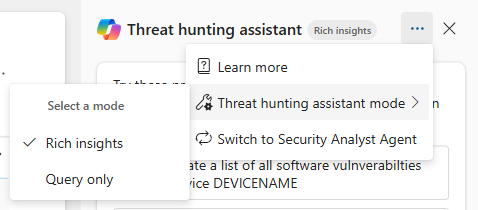

# Microsoft Security Copilot in advanced hunting

[!INCLUDE [Prerelease](../includes/prerelease.md)]

[Microsoft Security Copilot in Microsoft Defender](security-copilot-in-microsoft-365-defender.md) provides the Threat Hunting Assistant in advanced hunting to enhance threat hunting and security analysis. The Threat Hunting Assistant runs in one of two modes, depending on how much help you want.

The following table describes these capabilities, where they're best used, and the expected output:

| Mode | Description |Output |Experience |
| ------------- | ------------- |------------- |------------- |
| **Rich insights** [Threat Hunting Assistant](advanced-hunting-security-copilot-threat-hunting-assistant.md) | AI-powered conversational threat hunting experience that's best used for complete investigations, multistep hunting, exploratory analysis, and getting direct answers |Conversational answers, Kusto query language (KQL) queries, results, insights, and recommendations|Investigation-focused |
| **Query only** [Query assistant](advanced-hunting-security-copilot-query-assistant.md) | Natural language to KQL query generation that's best used for generating queries |KQL query with explanation|Query-focused |

The Threat Hunting Assistant and Query assistant empower you to hunt threats faster, more accurately, and with greater confidence without needing to write KQL queries.

## Get access
Users with access to Security Copilot can use these capabilities in advanced hunting.

You can use one mode at a time. **Rich insights** is the default mode. The active mode appears as a badge next to **Threat hunting assistant** at the top of the Security Copilot side pane.

To change modes, select the three-dot menu (**More actions**) in the Security Copilot side pane, point to **Threat hunting assistant mode**, then select **Rich insights** or **Query only**.

To use the Security Analyst Agent instead, select **Switch to Security Analyst Agent** from the same menu.

>[!NOTE]
>- Mode selection isn't available on non-primary workspaces.
>- Switching modes starts a new chat and clears your current conversation. You're asked to confirm before the switch happens.

## Scope of Security Copilot in advanced hunting

### Use case support
The Threat Hunting Assistant handles questions ranging from simple filters and aggregations to queries that span several tables. When a question needs data from more than one table, the assistant selects the relevant tables and joins them.

As with any AI-generated content, review the generated query and its results before you act on them. Help us improve by [providing feedback on Security Copilot in Microsoft Defender](security-copilot-in-microsoft-365-defender.md#provide-feedback) with incorrect queries or response examples. 

### Best practices
Use the following best practices when prompting the Threat Hunting Assistant or Query assistant:

- **Be unambiguous.** Ask questions with a clear subject. For example, "logins" could mean device logins or cloud logins.
- **Ask one question at a time.** Ask for a single task or type of information at a time. Don't expect the AI model to perform several unrelated tasks at once. You can always ask follow-up questions instead of combining unrelated asks into a single prompt.
- **Be specific.** If you know anything about the data you're looking for, provide that information in your question.

### How the assistant finds your data

The Threat Hunting Assistant discovers the data available in your environment as it works, instead of using a fixed list of tables. For each question, it:

1. Lists the tables you have access to.
1. Inspects the schema of the tables that look relevant.
1. Selects the tables needed to answer the question, and joins them when more than one is required.

This includes custom tables in your Microsoft Sentinel workspace.

Discovery follows your own permissions, so the assistant only reaches data that you can already query in advanced hunting. It runs read-only queries and can't run commands that change data or configuration.
