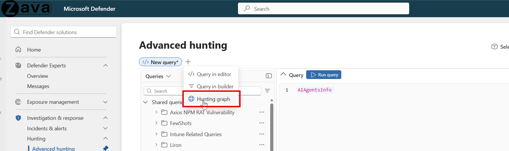

# Identity Explorer in the hunting graph (Preview)

[!INCLUDE [Microsoft Defender XDR rebranding](../includes/microsoft-defender.md)]

Identity Explorer provides identity-focused visualization in [advanced hunting](advanced-hunting-overview.md) by rendering attack paths and exposure scenarios as interactive graphs. Security analysts and threat hunters can use these graphs to discover lateral movement paths, privilege escalation routes, and credential-access risks more easily and intuitively.

:::image type="content" source="./media/identity-explorer/hunting-graph.png" alt-text="Screenshot of an Identity Explorer graph in advanced hunting showing the Paths to domain admins scenario with identity nodes and relationship edges." lightbox="./media/identity-explorer/hunting-graph.png":::

## Understand the Identity Explorer scenarios

Identity-based attacks such as lateral movement, privilege escalation, and credential theft are among the most common techniques attackers use to move through an environment after gaining initial access. These attacks exploit relationships between identities — for example, group memberships, delegated permissions, or cached credentials on devices — to reach higher-value targets.

Identity Explorer scenarios are predefined hunting graph queries that visualize these identity relationships and attack paths. Each scenario maps to one or more [MITRE ATT&CK](https://attack.mitre.org/) techniques and focuses on a specific type of identity risk:

- **Lateral movement** scenarios show how an attacker could move between identities, devices, or cloud resources by exploiting existing permissions and trust relationships.
- **Privilege escalation** scenarios reveal paths where a non-privileged user could gain elevated access — for example, by reaching a Domain Admins group or a sensitive service principal.
- **Credential access** scenarios identify accounts that are vulnerable to offline password attacks, such as Kerberoasting or AS-REP roasting, and show whether those accounts have paths to critical assets.

By rendering these relationships as interactive graphs, Identity Explorer helps you spot risky configurations — such as overly broad permissions, exposed service accounts, or short paths to domain compromise — that tabular data alone might not reveal.

## Prerequisites

To use Identity Explorer, you need:

- A user role with at least [Security Reader](/azure/active-directory/roles/permissions-reference#security-reader) permissions in Microsoft Entra ID. [Read about required roles and permissions for advanced hunting](custom-roles.md).
- [Microsoft Sentinel data lake](/azure/sentinel/datalake/sentinel-lake-overview) access.
- At least [read-only](/security-exposure-management/prerequisites) access in Microsoft Security Exposure Management.

## Access Identity Explorer scenarios

1. In the [Microsoft Defender portal](https://security.microsoft.com), select **Investigation & response** > **Hunting** > **Advanced hunting**.
1. Open the hunting graph by selecting the graph icon at the top of the page or by selecting **Create new** > **Hunting graph**.

   

1. In the new hunting graph page, select **Search with Predefined scenarios**.
1. Browse the identity-specific scenarios listed in the side panel.

   :::image type="content" source="./media/identity-explorer/hunting-graph-scenario.png" alt-text="Screenshot of the Select a scenario panel in the hunting graph showing predefined identity scenarios." lightbox="./media/identity-explorer/hunting-graph-scenario.png":::

Identity Explorer scenarios are also accessible from the [Domain page](/defender-for-identity/investigate-domain) and [User page](investigate-users.md) in Microsoft Defender for Identity, which link directly into the relevant predefined graph queries.

## Scenario reference

The following table describes the Identity Explorer scenarios. All scenarios are available in the hunting graph. The **Also available from** column indicates additional entry points in the Defender portal.

| Scenario | Description | MITRE Technique | Also available from |
|---|---|---|---|
| **Synced Entra users with permissions on OAuth application, allowing authentication as privileged Service Principal** | OAuth applications with privileged access. OAuth applications acting as privileged service principals. These can access resources without user interaction and represent elevated risk. | Privilege Escalation, Lateral Movement | Identity page |
| **Non-privileged users have a path leading to sensitive user/group (On-Prem/Cloud)** | Paths to sensitive identities. Non-privileged users who have paths to sensitive identities. Shows potential ways to escalate privileges. | Privilege Escalation, Lateral Movement | Identity page |
| **Service accounts with RDP access to critical device** | Service accounts with RDP to critical devices. Service accounts that can remotely access critical devices via RDP. If compromised, these create persistent access risks. | Lateral Movement | - |
| **Kerberoastable users with a path to a critical asset** | Kerberoast paths to critical assets. Kerberoastable users with attack paths to critical assets. These accounts allow offline password attacks that can lead to an escalation of privileges. | Privilege Escalation, Credential Access | Domain page, Identity page |
| **Synced Entra users with direct permissions to cloud resources** | Least privilege access. Microsoft Entra users with hybrid permissions on multiple cloud resources. Breaks the security boundaries between environments, violating least privilege rules and increasing the attack surface. | Lateral Movement | Identity page |
| **External Entra users with direct permissions to cloud resources** | External users with cloud resource access. External identities with direct access to cloud resources. This represents third-party risk and possible data exposure. | Lateral Movement | Identity page |
| **Non-privileged users with a path to own AD domain (DCSync)** | Paths to domain compromise (DCSync). Non-privileged users with paths that enable full Active Directory domain compromise via DCSync. Attackers can use this to extract all domain credentials. | Privilege Escalation, Credential Access | Domain page, Identity page |
| **Non-privileged users that can reach Domain Admins group (<5 hops)** | Paths to domain admins. Non-privileged users who can reach the Domain Admins group in fewer than five steps. This shows high-risk ways to gain more privileges. | Privilege Escalation, Lateral Movement | Domain page, Identity page |
| **ASREPRoastable users with a path to a critical asset** | AS-REP roast paths to critical assets. AS-REP roastable accounts with paths to critical assets. These accounts lack Kerberos preauthentication and can be attacked through offline password cracking. | Privilege Escalation, Credential Access | Domain page, Identity page |
| **Non-privileged user account which is exposed on multiple devices have RDP login permissions to critical assets (On-Prem/Cloud)** | Exposed users with RDP to critical assets. Non-privileged users exposed on multiple devices who can remotely access critical assets via RDP. This combines credential exposure with privileged access. | Credential Access | Identity page |

## See also

- [Hunt for threats using the hunting graph](advanced-hunting-graph.md)
- [Proactively hunt for threats with advanced hunting in Microsoft Defender](advanced-hunting-overview.md)
- [Choose between guided and advanced modes to hunt in Microsoft Defender XDR](advanced-hunting-modes.md)
- [What is Microsoft Defender for Identity?](/defender-for-identity/what-is)
