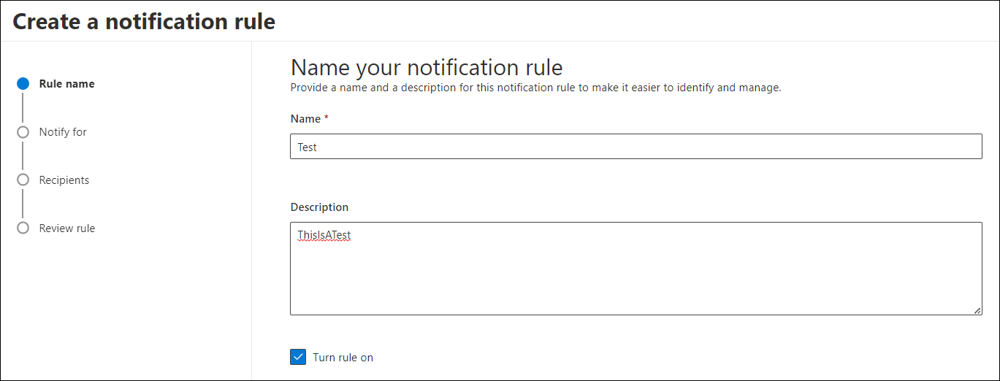
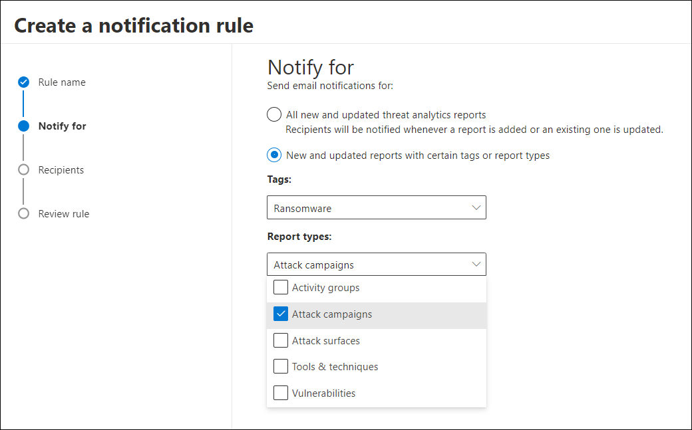
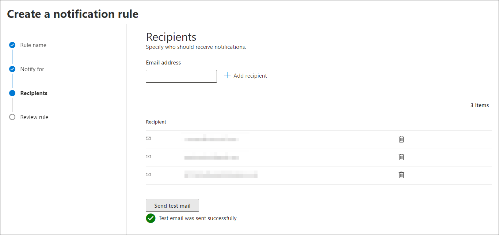
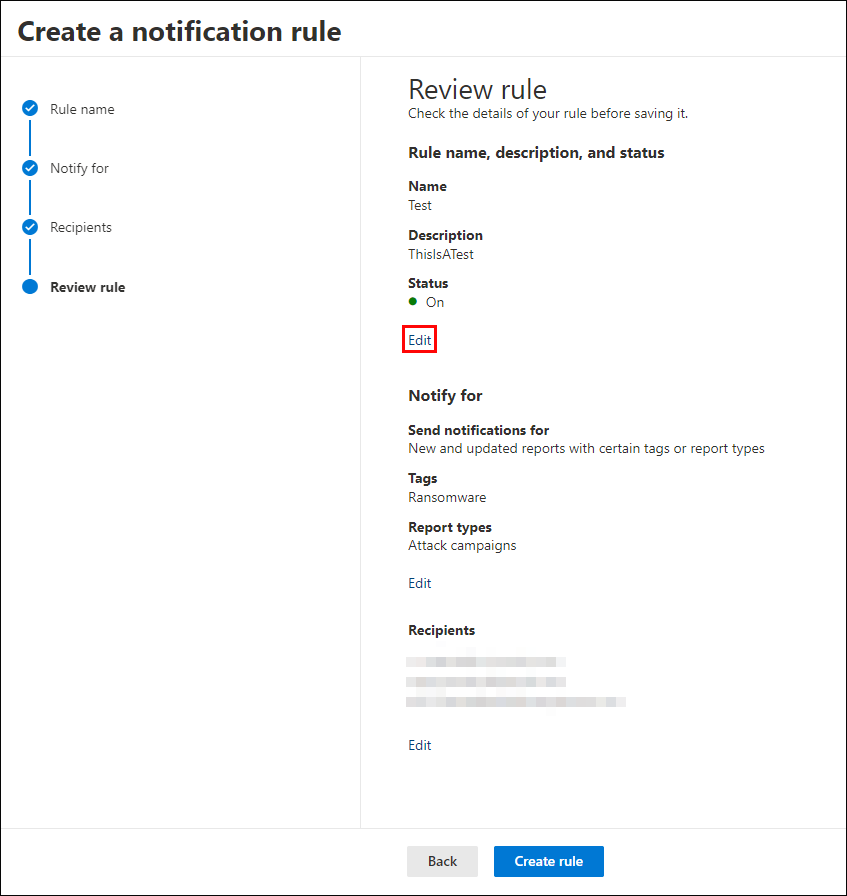
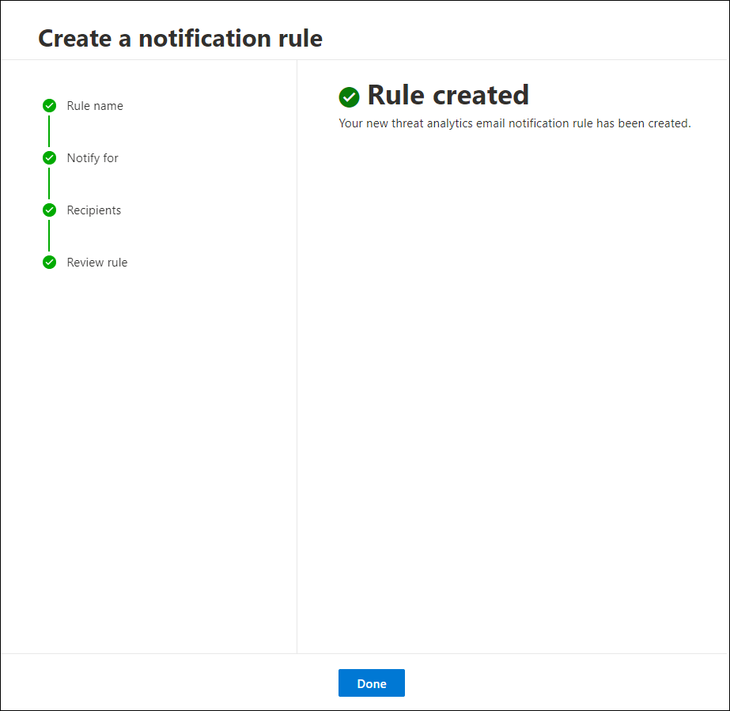

# Get email notifications for Threat analytics updates in Microsoft Defender XDR

[!INCLUDE [Microsoft Defender XDR rebranding](../includes/microsoft-defender.md)]

You can set up email notifications that send you updates on [threat analytics](threat-analytics.md) reports. These notifications alert security administrators and analysts when new threat analytics reports are published or existing reports are updated in Microsoft Defender XDR. This article walks you through creating a notification rule, choosing which report types or tags to track, and adding recipients.

## Set up email notifications for report updates

To set up email notifications for threat analytics reports, perform the following steps:

1. In the navigation pane of the Microsoft Defender portal, select **Settings > Microsoft Defender XDR**. Under **General**, select **Email notifications**.

2. In the **Threat analytics** tab, select **+ Create a notification rule**. A flyout appears.

3. Follow the steps listed in the flyout. First, give your new rule a name. The description field is optional, but a name is required. You can toggle the rule on or off using the checkbox under the description field.

   > [!NOTE]
   > The name and description fields for a new notification rule only accept English letters and numbers. Punctuations like spaces, dashes, underscores, aren't supported.

   

4. Choose the reports you want to be notified about. You can choose to be updated about all newly published or updated reports or only those reports of a certain type or with a specific tag.

   

5. Add at least one recipient to receive the notification emails. You can also use this screen to send a test email to check the notification settings.

   

6. Review your new rule. Select **Edit** at the end of each subsection to change any of the settings. Once your review is complete, select **Create rule**.

   

7. Select **Done** to complete the process and close the flyout. 

   

Your new rule now appears in the list of Threat analytics email notifications.

## Next steps

- [Get email notifications on incidents](m365d-notifications-incidents.md)
- [Get email notifications on response actions](m365d-response-actions-notifications.md)

[!INCLUDE [Microsoft Defender XDR rebranding](../includes/defender-m3d-techcommunity.md)]
