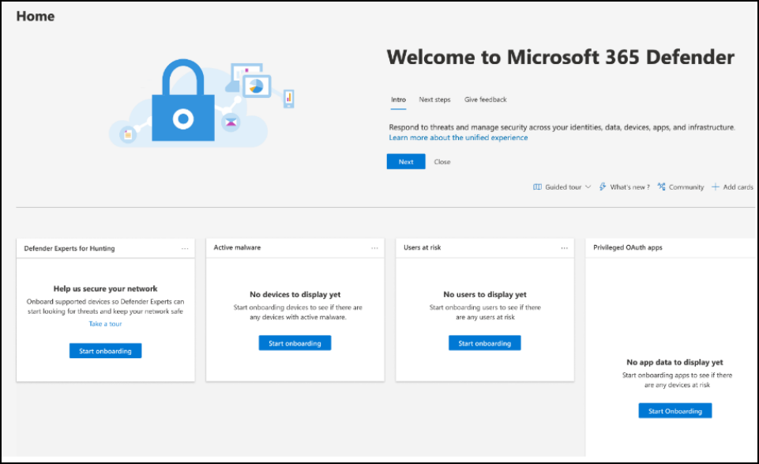
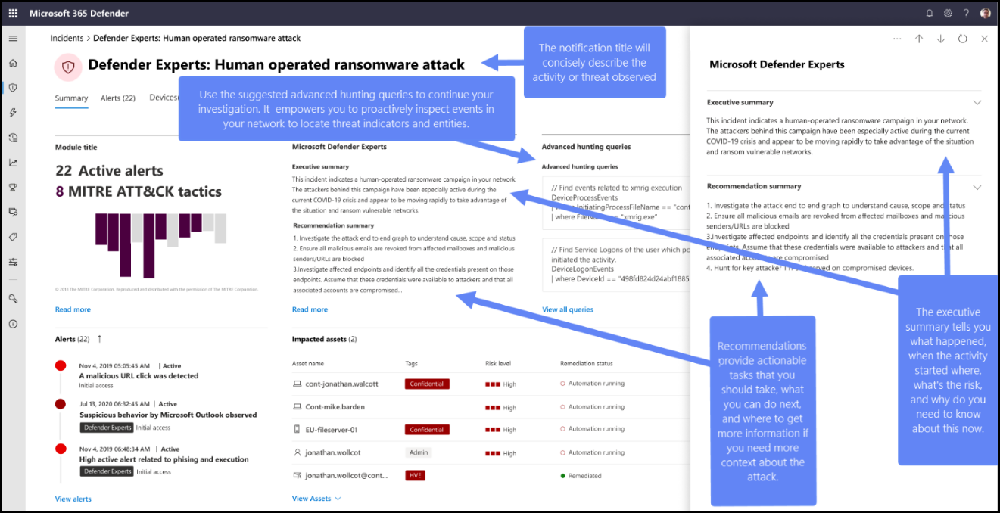

# Start using Microsoft Defender Experts for Hunting

[!INCLUDE [Microsoft Defender XDR rebranding](../includes/microsoft-defender.md)]

**Applies to:**

- [Microsoft Defender XDR](microsoft-365-defender.md)

This article shows you how to onboard to the Microsoft Defender Experts for Hunting service, set up notification contacts, and set up Defender Experts Notifications.

## Onboard to Defender Experts for Hunting

If you're new to Microsoft Defender XDR and Defender Experts for Hunting:

1. When you receive your welcome email, select **Log into Microsoft Defender XDR**.
1. Sign in if you already have a Microsoft account. If you don't have a Microsoft account, create one.
1. The Microsoft Defender XDR quick tour introduces you to the security suite, where the capabilities are, and how important they are. Select **Take a quick tour**.
1. Read the short descriptions about what the Microsoft Defender Experts service is and the capabilities it provides. Select **Next**. You see the welcome page:

    

## Tell us who to contact for important matters

Defender Experts for Hunting lets you set up **Notification contacts**. These contacts are the individuals or groups within your organization that Microsoft needs to notify if there are critical incidents or service updates:

- **Incident notification contacts** – These contacts are persons or teams that Microsoft can notify for any critical incidents or hunting clarifications that require immediate response.

    You can designate the call priority of your incident notification contacts. In an event of a critical incident, Microsoft reaches out to the primary contact first by using the phone number you provided, and then the backup contact if needed. 
- **Service review notification contacts** – These contacts are persons or teams that Microsoft can engage with for service updates, reports, and opportunities for feedback.

Set up your notification contacts in the setup wizard when you first onboard to the service, or from the Microsoft Defender portal navigation menu by going to **System** > **Settings** > **Defender Experts** > **Notification contacts**.

## Receive Defender Experts Notifications

The Defender Experts Notifications service includes:

- Threat monitoring and analysis, reducing dwell time and the risk to your business
- Hunter-trained artificial intelligence to discover and target both known attacks and emerging threats
- Identification of the most pertinent risks, helping SOCs maximize their effectiveness
- Help in scoping compromises and as much context as can be quickly delivered to enable a swift SOC response

Refer to the following screenshot to see a sample Defender Experts Notification:

### Where to find Defender Experts Notifications

You can receive Defender Experts Notifications from Defender Experts through the following mediums:

- The Defender portal's [Incidents](https://security.microsoft.com/incidents) page
- The Defender portal's [Alerts](https://security.microsoft.com/alerts) page
- OData alerting [API](/defender-endpoint/api/get-alerts) and [REST API](/defender-endpoint/configure-siem)
- [DeviceAlertEvents](advanced-hunting-migrate-from-mde.md#map-devicealertevents-table) table in Advanced hunting
- Your email if you [configure an email notifications rule](onboarding-defender-experts-for-hunting.md#set-up-defender-experts-email-notifications)

### Filter to view just the Defender Experts Notifications

You can filter your incidents and alerts if you want to only see the Defender Experts Notifications among the many alerts. To do this filter:

1. On the navigation menu, go to **Incidents & alerts** > **Incidents** > select the  icon.
1. Scroll down to **Service/detection sources** then select the **Microsoft Defender Experts** checkboxes under *Microsoft Defender for Endpoint* and *Microsoft Defender XDR*.
1. Select **Apply**.

### Set up Defender Experts email notifications

You can set up Microsoft Defender XDR to notify you or your staff by using an email about new incidents or updates to existing incidents, including those observed by Microsoft Defender Experts. [Learn more about getting incident notifications by email](m365d-notifications-incidents.md).

1. In the Microsoft Defender XDR navigation pane, select **Settings** > **Microsoft Defender XDR** > **Email notifications** > **Incidents**.
1. Update your existing email notification rules or create a new one. For more information, see [Auditing](auditing.md).
1. On the rule's **Notification settings** page, make sure to configure the following values:
    - **Source** – Choose **Microsoft Defender Experts** under **Microsoft Defender XDR** and **Microsoft Defender for Endpoint**.
    - **Alert severity** – Choose the alert severities that trigger an incident notification. For example, if you only want to be informed about high-severity incidents, select High.

### Generate sample Defender Experts Notifications

You can generate a sample Defender Experts Notification to start experiencing the Defender Experts for Hunting service without waiting for an actual critical activity in your environment. By generating a sample notification, you can also test the [email notifications](#set-up-defender-experts-email-notifications) you previously configured in the Microsoft Defender portal for this service. You can also test the configuration of playbooks (if configured for such notifications) and rules in your Security Information and Event Management (SIEM) environment.

A sample Defender Experts Notification appears in your **Incidents** page with the title _Defender Experts: Test Notification from Microsoft Defender Experts_. The [contents](#receive-defender-experts-notifications) of the notification are placeholder text, while the other elements such as alerts are randomly generated from events present in your tenant and aren't actually impacted.

:::image type="content" source="./media/onboarding-defender-experts-for-hunting/sample-den-dexh.png" alt-text="Screenshot of Sample DEN in Defender Experts for Hunting." lightbox="./media/onboarding-defender-experts-for-hunting/sample-den-dexh.png":::

**To generate a sample notification:**

1. In your Microsoft Defender XDR navigation pane, go to **Settings** > **Defender Experts** and then select **Sample notifications**.
1. Select **Generate a sample notification**. A green status message appears, confirming that your sample notification is ready for review.
1. Under **Recently generated Defender Experts Notification**, select a link from the list to view its corresponding generated sample notification. The most recent sample appears at the top of the list. Selecting a link redirects you to the **Incidents** page.

    :::image type="content" source="./media/onboarding-defender-experts-for-hunting/sample-den-links-dexh.png" alt-text="Screenshot of Sample DEN links." lightbox="./media/onboarding-defender-experts-for-hunting/sample-den-links-dexh.png":::

### Next step

- [Access Defender Experts Notifications using Microsoft Graph security API](access-den-graph-api.md)
[!INCLUDE [Microsoft Defender XDR rebranding](../includes/defender-m3d-techcommunity.md)]
