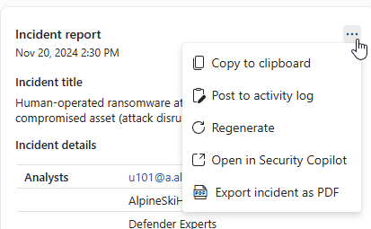

# Create an incident report with Microsoft Copilot in Microsoft Defender

[!INCLUDE [Microsoft Defender XDR rebranding](../includes/microsoft-defender.md)]

[Microsoft Security Copilot](/security-copilot/microsoft-security-copilot) in the Microsoft Defender portal helps security teams write incident reports quickly. With Security Copilot, you can create an incident report in just a few clicks.

This guide covers the data in incident reports and shows how to use the **Generate incident report** feature in the Microsoft Defender portal. It also explains how to give feedback on the incident report generated by Copilot.

## Before you begin

Incident report generation requires provisioned access to Security Copilot.

If you're new to Security Copilot, you should familiarize yourself with it by reading the following articles:

- [What is Security Copilot?](/security-copilot/microsoft-security-copilot)
- [Security Copilot experiences](/security-copilot/experiences-security-copilot)
- [Get started with Security Copilot](/security-copilot/get-started-security-copilot)
- [Understand authentication in Security Copilot](/security-copilot/authentication)
- [Prompting in Security Copilot](/security-copilot/prompting-security-copilot)

A clear incident report is a key reference for security teams and their managers. However, writing a detailed report takes time. Teams must collect, organize, and summarize data from many sources. With Copilot in Defender, you can create a full incident report in the portal right away.

While an [incident summary](security-copilot-m365d-incident-summary.md) provides an overview of an incident and how it happened, an incident report consolidates incident information from various data sources available in Microsoft Sentinel and Defender. The Copilot-generated incident report also includes all analyst-driven steps and automated actions, the analysts involved in incident response, and the comments from the analysts. Whether security teams are using Microsoft Sentinel, Defender, or both, all relevant incident data are added into the generated incident report.

Copilot builds the report from automatic and manual actions, plus analyst comments and notes. To get the best results, follow the [recommendations for incident report creation](security-copilot-m365d-create-incident-report.md#recommendations-for-incident-report-creation).

## Security Copilot integration in Microsoft Defender

You can generate incident reports in Microsoft Defender if you have access to Security Copilot.

You can also generate incident reports in the Security Copilot standalone portal. Use the Microsoft Defender XDR plugin, which is preinstalled and connects Copilot to Defender incident data. Learn more about [preinstalled plugins in Security Copilot](/security-copilot/manage-plugins#preinstalled-plugins).

## Key incident report features

Copilot in Defender creates an incident report containing the following information:

- The main incident management actions' timestamps, including:
  - Incident creation and closure
  - First and last logs, whether the log was analyst-driven or automated, captured in the incident
- The analysts involved in incident response
- [Incident classification](manage-incidents.md#specify-the-incidents-classification), including the analyst's reason for classification that Copilot summarizes
- Investigation and remediation actions
- Follow up actions like recommendations, open issues, or next steps noted by the analysts in the incident logs

The report includes actions like device isolation, disabling a user, and soft delete of emails. For a full list, see the [Microsoft Defender Action center](m365d-action-center.md). The Copilot-generated incident report also includes [Microsoft Sentinel playbooks](/azure/sentinel/automate-responses-with-playbooks) that ran. [Live response commands](/defender-endpoint/live-response) and actions from public API sources or custom detections aren't yet supported.

Resolve the incident before you generate the report to capture all actions. If the incident isn't resolved, the report might only show some of the actions.

### Create an incident report

To create an incident report with Copilot in Defender, perform the following steps:

1. Open an incident page. In the incident page, navigate to the **More actions** ellipsis (...) and then select **Generate incident report**. Alternately, you can select the report icon found in the Copilot side panel.

   :::image type="content" source="media/security-copilot-m365d-create-incident-report/incident-report-create-small.png" alt-text="Screenshot highlighting the generated incident report and report icon buttons in the incident page." lightbox="media/security-copilot-m365d-create-incident-report/incident-report-create.png":::

2. Copilot creates the incident report. You can stop the report creation by selecting **Cancel** and restart report creation by selecting **Regenerate**. Additionally, you can restart report creation if you encounter an error.

3. The incident report card appears on the Copilot pane. The generated report depends on the incident information available from Microsoft Defender XDR and Microsoft Sentinel. Refer to the [recommendations for incident report creation](security-copilot-m365d-create-incident-report.md#recommendations-for-incident-report-creation) to ensure a comprehensive incident report.

   :::image type="content" source="media/copilot-in-defender/create-report/incident-report-main1-small.png" alt-text="Screenshot of the incident report card in the incident page showing the top half of the card." lightbox="media/copilot-in-defender/create-report/incident-report-main1.png":::

   :::image type="content" source="media/security-copilot-m365d-create-incident-report/incident-report-main2-small.png" alt-text="Screenshot of the incident report card in the incident page showing the lower bottom of the card." lightbox="media/security-copilot-m365d-create-incident-report/incident-report-main2.png":::

4. Select the More actions ellipsis (...) located on the upper right of the incident report card. To copy the report, select **Copy to clipboard** and paste the report to your preferred system, **Post to activity log** to add the report to the activity log in the Microsoft Defender portal, or **Export incident as PDF** to [export the incident data to PDF](manage-incidents.md#export-incident-data-to-pdf). Select **Regenerate** to restart report creation. You can also **Open in Security Copilot** to view the results and continue accessing other plugins available in the Security Copilot standalone portal.

   

5. Review the generated incident report. You can provide feedback on the report by selecting the feedback icon found on the bottom of the results  .

### Export incident data to PDF

You can export the incident data to PDF to create a report that you can easily share with stakeholders. The exported incident data contains relevant information like the attack story, impacted assets, relevant alerts, and AI-generated content from Copilot, like the incident summary and incident report. With incident data export to PDF, security teams can quickly share incident information for post-incident discussions with team members or other stakeholders.

You can follow the steps in [export incident data to PDF](manage-incidents.md#export-incident-data-to-pdf) to generate the PDF.

### Recommendations for incident report creation

Here are some recommendations to consider to ensure that Copilot generates a comprehensive and complete incident report:

- Classify and resolve the incident before generating the incident report.
- Ensure that you write and save comments in the Microsoft Sentinel activity log or in the [Microsoft Defender incident activity log](manage-incidents.md#view-the-activity-log-of-an-incident) to include the comments in the incident report.
- Write comments using comprehensive and clear language. In-depth and clear comments provide better context about the response actions. See the following steps to know how to access the comments field:
  - [Add comments to incidents in the Microsoft Defender portal](manage-incidents.md#add-comments-to-an-incident)
  - Add comments to incidents in Microsoft Sentinel
- For ServiceNow users, enable the [Microsoft Sentinel and ServiceNow bi-directional sync](https://techcommunity.microsoft.com/t5/microsoft-sentinel-blog/what-s-new-introducing-microsoft-sentinel-solution-for/ba-p/3692840) to get more robust incident data.
- Copy the generated incident report and post it to the activity log in the Microsoft Defender portal to ensure that the incident report is saved in the incident page.

## Sample prompt for incident report creation

In the Security Copilot standalone portal, use this prompt to create an incident report:

- *Generate the incident report for Defender incident {incident ID}.*

> [!TIP]
> Include the word ***Defender*** in your prompts. This helps Security Copilot use the right capability and return the correct results.

## Provide feedback

Your feedback helps improve Copilot. To share feedback, go to the bottom of the Copilot side panel and select the feedback icon .

## Related content

- [Learn about other Security Copilot embedded experiences](/security-copilot/experiences-security-copilot)
- [Privacy and data security in Security Copilot](/copilot/security/privacy-data-security)

[!INCLUDE [Microsoft Defender XDR rebranding](../includes/defender-m3d-techcommunity.md)]
