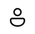
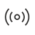

# Understanding graphs and visualizations in Microsoft Defender

Microsoft Defender use interactive graphs to visualize attack paths, [blast radius](investigate-incidents.md#view-blast-radius-graphs), and relationships between entities in your environment. These visualizations provide a bird’s eye view of a possible threat or attack, letting you and your security operations (SOC) team to investigate and [hunt](advanced-hunting-graph.md) them quickly.

The graphs generated in the Defender portal are composed of [nodes](#nodes) and [edges](#edges). This article enumerates and defines the commonly used icons for graph these elements.

## Nodes

A **node** pertains to an entity in your environment (for example, a device, user account, or IP address, among others). Defender portal graphs usually depict nodes as any of the following circular icons:

| **Icon** | **Node type** | **Entity type examples** |
|---|---|---|
| | General | App service plan |
| | Compute | Device, virtual machine, Microsoft Azure Logic App |
| | Networking | Interface, public IP address, network security group |
| | Data | SQL data store, Azure Monitor Log Analytics workspace, storage account, Azure Event Hubs |
| | Containers | Kubernetes cluster |
| | Keys & secrets | Key vault |
| | DevOps | Azure DevOps repositories |
| | APIs | Cloud applications |
| | Identity & access | User account, Microsoft Entra ID service principal |
| | IoT | |
| | Certificate | |
| | IP address | |
| | Subscriptions | |

Selecting a node opens a side panel that provides more details about the chosen entity, such as entity name, type, last updated date, and discovery source. This panel might also display additional information such as attack paths and blast radius, depending on the selected node and its relationship to other nodes in the graph.

:::image type="content" source="./media/understand-graph-icons/hunting-graph-node-details.png" alt-text="Screenshot of the side panel in the hunting graph containing node details." lightbox="./media/understand-graph-icons/hunting-graph-node-details.png":::

Entities and might also appear as **grouped nodes**, which have numerical indicators (for example, to indicate the total number of user accounts). To expand and view all nodes in a grouped node, use the **ungroup** toggle.

A node might also have any of the following indicators around it:

* **Critical asset** - Indicates that an entity is classified as business-critical or valuable, as identified in the [critical asset management](/security-exposure-management/critical-asset-management) in Microsoft Security Exposure Management. This indicator appears as a golden crown . The nodes representing critical assets also have a golden halo surrounding them. 
* **Vulnerability** - Indicates that at least one vulnerability was detected on the entity. This indicator appears as a red bug .
* **Explore connected assets** - Indicates that the node can expand the hunting graph further beyond the initial results. Expanding the graph lets you explore other relationships the selected entity has with the other ones. This indicator appears as a blue plus sign . 
* **Discovery source** - Indicates the entity's data source. This indicator appears as the icon of the Defender product protecting the entity in blue (for example,  for Microsoft Defender for Endpoint, or  for Microsoft Defender for Cloud).

  >[!TIP]
  > You can turn this indicator on and off a graph by toggling the **Discovery Source** switch in the graph's **Layers**.

## Edges

An **edge**  indicates the relationship or connection properties between two nodes. The Defender portal graphs depicts an edge as lines or directional arrows that might have the following icons:  

| **Icon** | **Edge type** |
|---|---|
| | Contains |
| | Routes traffic to |
| | Has permission to / Has role on |
| | Can authenticate as / Can authenticate to |
| | Pushes |
| | Maintains |
| | Application |
| | Moves data to |
| | Exposed to internet |
| | Can interactive logon to / Can logon over the network to / Can remote interactive logon to |
| | Runs on |
| | Provisions |
| | Identified as owner of |
| | Member of |
| | Is running |
| | Generic / Affects |
| | Created from / Used to create |

Selecting an edge opens a side panel that provides more details about the connection properties. If two nodes have more than one relationship, a number appears on the edge, in place of an icon. You can find more information about these nodes’ relationships by hovering over the number or opening the side panel.

:::image type="content" source="./media/understand-graph-icons/hunting-graph-edge-details.png" alt-text="Screenshot of the side panel in the hunting graph containing edge details." lightbox="./media/understand-graph-icons/hunting-graph-edge-details.png":::

## See also
- [Hunt for threats using the hunting graph](advanced-hunting-graph.md)
- [Investigate incidents in the Microsoft Defender portal](investigate-incidents.md)