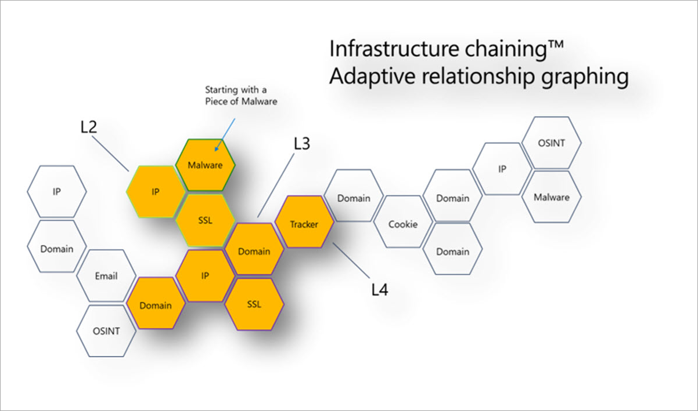

# Tutorial: Gathering threat intelligence and infrastructure chaining

>[!IMPORTANT]
> On June 30, 2024, The Microsoft Defender Threat Intelligence (Defender TI) standalone portal (https://ti.defender.microsoft.com) will be retired and will no longer be accessible. Customers can continue using Defender TI in the [Microsoft Defender portal](https://aka.ms/mdti-intel-explorer) or with [Microsoft Copilot for Security](security-copilot-and-defender-threat-intelligence.md). [Learn more](https://aka.ms/mdti-standaloneportal)

This tutorial walks you through how to perform several types of indicator searches and gather threat and adversary intelligence using Microsoft Defender Threat Intelligence (Defender TI) in the Microsoft Defender portal.

## Prerequisites

- A Microsoft Entra ID or personal Microsoft account. [Sign in or create an account](https://signup.microsoft.com/)
- A Defender TI Premium license.

    > [!NOTE]
    > Users without a Defender TI Premium license can still access our free Defender TI offering.

## Disclaimer

Defender TI might include live, real-time observations and threat indicators, including malicious infrastructure and adversary-threat tooling. Any IP address and domain searches within Defender TI are safe to search. Microsoft shares online resources (for example, IP addresses, domain names) that are considered real threats posing a clear and present danger. We ask that you use their best judgment and minimize unnecessary risk while interacting with malicious systems when performing the following tutorial. Microsoft minimizes risks by defanging malicious IP addresses, hosts, and domains.

## Before you begin

As the disclaimer states previously, suspicious and malicious indicators are defanged for your safety. Remove any brackets from IP addresses, domains, and hosts when searching in Defender TI. Don't search these indicators directly in your browser.

## Perform indicator searches and gather threat and adversary intelligence

This tutorial lets you perform a series of steps to [infrastructure chain](infrastructure-chaining.md) together indicators of compromise (IOCs) related to a Magecart breach and gather threat and adversary intelligence along the way.

Infrastructure chaining uses the highly connected nature of the internet to expand one IOC into many based on overlapping details or shared characteristics. Building infrastructure chains lets threat hunters or incident responders profile an adversary's digital presence and quickly pivot across these sets of data to create context around an incident or investigation. Infrastructure chains also allow for more effective incident triaging, alerting, and actioning within an organization.

**Relevant personas:** Threat intelligence analyst, threat hunter, incident responder, security operations analyst

### Background on Magecart Breach

Microsoft has been profiling and following the activities of Magecart, a syndicate of cybercriminal groups behind hundreds of breaches of online retail platforms. Magecart injects scripts, which steal the sensitive data consumers enter into online payment forms, on e-commerce websites directly or through their compromised suppliers.

Back in October 2018, Magecart infiltrated MyPillow's online website, *mypillow[.]com*, to steal payment information by injecting a script into their web store. The script was hosted on a typosquatted domain *mypiltow[.]com*.

The MyPillow breach was a two-stage attack, with the first skimmer only active for a brief time before being identified as illicit and removed. However, the attackers still had access to MyPillow's network and on October 26, 2018, Microsoft observed that they registered a new domain, *livechatinc[.]org*.

Magecart actors typically register a domain that looks as similar as possible to the legitimate one. Thus, if an analyst looks at the JavaScript code, they might miss Magecart's injected script that's capturing the credit card payment information and pushing it to Magecart's own infrastructure. However, Microsoft's virtual users capture the document object model (DOM) and find all the dynamic links and changes made by the JavaScript from the crawls on the backend. We can detect that activity and pinpoint that fake domain that was hosting the injected script into the MyPillow webstore.

### Gathering Magecart breach threat intelligence

Perform the following steps in the **Intel explorer** page in the Defender portal to do infrastructure chaining on *mypillow[.]com*.

1. Access the [Defender portal](https://security.microsoft.com/) and complete the Microsoft authentication process. [Learn more about the Defender portal](/defender-xdr/microsoft-365-defender-portal)
2. Navigate to **Threat intelligence** > **Intel explorer**.
3. Search *mypillow[.]com* on the **Intel explorer** search bar. You should see the article *Consumers May Lose Sleep Over These Two Magecart Breaches* associated with this domain.

      :::image type="content" source="/defender/threat-intelligence/media/tutorial-infra-chain-mypillow-article.png" alt-text="Tutorial infrastructure chain MyPillow.com article." lightbox="/defender/threat-intelligence/media/tutorial-infra-chain-mypillow-article.png":::

4. Select the article. The following information should be available about this related campaign:
   - This article was published on March 20, 2019.
   - It provides insights as to how the Magecart threat actor group breached MyPillow in October 2018.
5. Select the **Public indicators** tab in the article. It should list the following IOCs:
   - *amerisleep.github[.]io*
   - *cmytuok[.]top*
   - *livechatinc[.]org*
   - *mypiltow[.]com*
6. Go back to the **Intel explorer** search bar, select **All** in the dropdown, and query *mypillow[.]com* again.
7. Select the **Host pairs** tab of the search results.
Host pairs reveal connections between websites that traditional data sources, such as passive domain name system (pDNS) and WHOIS, wouldn't surface. They also let you see where your resources are being used and vice-versa.
8. Sort the host pairs by **First seen**, and filter by *script.src* as the **Cause**. Page over until you find host pair relationships that took place in October 2018. Notice that *mypillow[.]com* is pulling content from the typosquatted domain, *mypiltow[.]com* on October 3-5, 2018 through a script.

    :::image type="content" source="/defender/threat-intelligence/media/tutorial-infra-chain-mypillow-host-pair.png" alt-text="Tutorial InfraChain My Piltowcom Reputation." lightbox="/defender/threat-intelligence/media/tutorial-infra-chain-mypillow-host-pair.png":::

9. Select the **Resolutions** tab and pivot off the IP address that *mypiltow[.]com* resolved to in October 2018.

   :::image type="content" source="/defender/threat-intelligence/media/tutorial-infra-chain-mypiltow-oct-ip.png" alt-text="Tutorial Infra Chain My Piltow Ip Summary." lightbox="/defender/threat-intelligence/media/tutorial-infra-chain-mypiltow-oct-ip.png":::

    Repeat this step for *mypillow[.]com*. You should notice the following differences  between the two domains' IP addresses in October 2018:
   - The IP address *mypiltow[.]com* resolved to, 195.161.41[.]65, was hosted in Russia.

     :::image type="content" source="media/tutorial-infra-chain-mypiltow-IP-RU.png" alt-text="Tutorial infrastructure chain mypiltow RU ASN." lightbox="media/tutorial-infra-chain-mypiltow-IP-RU.png":::

   - The two IP addresses used different autonomous system number (ASNs).

     :::image type="content" source="media/tutorial-infra-chain-mypillow-IP-US.png" alt-text="Tutorial infrastructure chain mypillow US ASN." lightbox="media/tutorial-infra-chain-mypillow-IP-US.png":::

10. Select the **Summary** tab and scroll down to the **Articles** section. You should see the following published articles related to *mypiltow[.]com*:
    - *RiskIQ: Magecart Injected URLs and C2 Domains, June 3-14, 2022*
    - *RiskIQ: Magecart injected URLs and C2 Domains, May 20-27, 2022*
    - *Commodity Skimming & Magecart Trends in First Quarter of 2022*
    - *RiskIQ: Magecart Group 8 Activity in Early 2022*
    - *Magecart Group 8 Real Estate: Hosting Patterns Associated with the Skimming Group*
    - *Inter Skimming Kit Used in Homoglyph Attacks*
    - *Magecart Group 8 Blends into NutriBullet.com Adding To Their Growing List of Victims*

    :::image type="content" source="/defender/threat-intelligence/media/tutorial-infra-chain-mypiltow-articles.png" alt-text="Tutorial Infra Chain My Piltowcom Articles." lightbox="/defender/threat-intelligence/media/tutorial-infra-chain-mypiltow-articles.png":::

    Review each of these articles and take note of additional information--such as targets; tactics, techniques, and procedures (TTPs); and other IOCs--you can find about the Magecart threat actor group.
11. Select the **WHOIS** tab and compare the WHOIS information between *mypillow[.]com* and *mypiltow[.]com*. Take note of the following details:
      - The WHOIS record of *mypillow[.]com* from October 2011 indicates that My Pillow Inc. clearly owns the domain.
      - The WHOIS record of mypiltow[.]com from October 2018 indicates that the domain was registered in Hong Kong SAR and is privacy protected by Domain ID Shield Service CO.
      - The registrar of mypiltow[.]com is OnlineNIC, Inc.

        :::image type="content" source="/defender/threat-intelligence/media/tutorial-infra-chain-mypiltow-nameservers.png" alt-text="Tutorial Infra Chain My Piltowcom 2 Whois." lightbox="/defender/threat-intelligence/media/tutorial-infra-chain-mypiltow-nameservers.png":::

    Given the address records and WHOIS details analyzed so far, an analyst should find it odd that a Chinese privacy service primarily guards a Russian IP address for a US-based company.
12. Navigate back to the **Intel explorer** search bar and search *livechatinc[.]org*. The article *Magecart Group 8 Blends into NutriBullet.com Adding To Their Growing List of Victims* should now appear in the search results.
13. Select the article. The following information should be available about this related campaign:
    -	The article was published on March 18, 2020.
    - The article indicates that Nutribullet, Amerisleep, and ABS-CBN were also victims of the Magecart threat actor group.
14. Select the **Public indicators** tab. It should list the following IOCs:
    - **URLs:** hxxps://coffemokko[.]com/tr/, hxxps://freshdepor[.]com/tr/, hxxps://prodealscenter[.]c4m/tr/, hxxps://scriptoscript[.]com/tr/, hxxps://swappastore[.]com/tr/
    - **Domains:** 3lift[.]org, abtasty[.]net, adaptivecss[.]org, adorebeauty[.]org, all-about-sneakers[.]org, amerisleep.github[.]io, ar500arnor[.]com, authorizecdn[.]com, bannerbuzz[.]info, battery-force[.]org, batterynart[.]com, blackriverimaging[.]org, braincdn[.]org, btosports[.]net, cdnassels[.]com, cdnmage[.]com, chicksaddlery[.]net, childsplayclothing[.]org, christohperward[.]org, citywlnery[.]org, closetlondon[.]org, cmytuok[.]top, coffemokko[.]com, coffetea[.]org, configsysrc[.]info, dahlie[.]org, davidsfootwear[.]org, dobell[.]su, elegrina[.]com, energycoffe[.]org, energytea[.]org, etradesupply[.]org, exrpesso[.]org, foodandcot[.]com, freshchat[.]info, freshdepor[.]com, greatfurnituretradingco[.]org, info-js[.]link, jewsondirect[.]com, js-cloud[.]com, kandypens[.]net, kikvape[.]org, labbe[.]biz, lamoodbighats[.]net, link js[.]link, livechatinc[.]org, londontea[.]net, mage-checkout[.]org, magejavascripts[.]com, magescripts[.]pw, magesecuritys[.]com, majsurplus[.]com, map-js[.]link, mcloudjs[.]com, mechat[.]info, melbounestorm[.]com, misshaus[.]org, mylrendyphone[.]com, mypiltow[.]com, nililotan[.]org, oakandfort[.]org, ottocap[.]org, parks[.]su, paypaypay[.]org, pmtonline[.]su, prodealscenter[.]com, replacemyremote[.]org, sagecdn[.]org, scriptoscript[.]com, security-payment[.]su, shop-rnib[.]org, slickjs[.]org, slickmin[.]com, smart-js[.]link, swappastore[.]com, teacoffe[.]net, top5value[.]com, track-js[.]link, ukcoffe[.]com, verywellfitnesse[.]com, walletgear[.]org, webanalyzer[.]net, zapaljs[.]com, zoplm[.]com
15. Navigate back to the **Intel explorer** search bar and search *mypillow[.]com*. Then, go to the **Host pairs** tab, sort the host pairs by **First seen**, and look for host pair relationships that occurred in October 2018.

    Notice how *www.mypillow[.]com* was first observed reaching out to *secure.livechatinc[.]org* on October 26, 2018, because a script GET request was observed from *www.mypillow[.]com* to *secure.livechatinc[.]org*. That relationship lasted until November 19, 2018.

    :::image type="content" source="/defender/threat-intelligence/media/tutorial-infra-chain-mypillow-livechat.png" alt-text="Tutorial Infra Chain My Pillowcom Host Pairs Live Chat ScriptSrc." lightbox="/defender/threat-intelligence/media/tutorial-infra-chain-mypillow-livechat.png":::

    In addition, *secure.livechatinc[.]org* reached out to *www.mypillow[.]com* to access the latter's server (*xmlhttprequest*).
16. Review *mypillow[.]com*'s host pair relationships further. Notice how *mypillow[.]com* has host pair relationships with the following domains, which is similar to the domain name *secure.livechatinc[.]org*:
      - *cdn.livechatinc[.]com*
      - *secure.livechatinc[.]com*
      - *api.livechatinc[.]com*

    The relationship causes include:
      - script.src
      - iframe.src
      - unknown
      - topLevelRedirect
      - img.src
      - xmlhttprequest

      Livechat is a live support chat service that online retailers can add to their websites as a partner resource. Several e-commerce platforms, including MyPillow, use it. This fake domain is interesting because the  Livechat's official site is actually *livechatinc[.]com*. Therefore, in this case, the threat actor used a top-level-domain typosquat to hide the fact they placed a second skimmer on the MyPillow website.
17. Go back and find a host pair relationship with *secure.livechatinc[.]org* and pivot off that hostname. The **Resolutions** tab should indicate that this host resolved to 212.109.222[.]230 in October 2018.

       :::image type="content" source="/defender/threat-intelligence/media/tutorial-infra-chain-livechatinc-org.png" alt-text="Tutorial Infra Chain Secure Live Chat Inc Org Resolutions." lightbox="/defender/threat-intelligence/media/tutorial-infra-chain-livechatinc-org.png":::

    Notice that this IP address is also hosted in Russia and the ASN organization is JSC IOT.

    :::image type="content" source="/defender/threat-intelligence/media/tutorial-infra-chain-livechatinc-org-asn.png" alt-text="Tutorial Infra Chain Secure Live Chat Inc Org ASN." lightbox="/defender/threat-intelligence/media/tutorial-infra-chain-livechatinc-org-asn.png":::
18. Navigate back to the **Intel explorer** search bar and search *secure.livechatinc[.]org*. Then, go to the **WHOIS** tab and select the record from December 25, 2018.

    The registrar used for this record is OnlineNIC Inc., which is the same one used to register *mypiltow[.]com* during the same campaign. Based on the record from December 25, 2018, notice that the domain also used the same Chinese privacy guarding service, Domain ID Shield Service, as *mypiltow[.]com*.

    The December record used the following name servers, which were the same one used in the October 1, 2018 record for mypiltow[.]com.
    - ns1.jino.ru
    - ns2.jino.ru
    - ns3.jino.ru
    - ns4.jino.ru

    :::image type="content" source="/defender/threat-intelligence/media/tutorial-infra-chain-livechatinc-org-whois.png" alt-text="Tutorial Infra Chain Secure Live Chat Inc Org Whois." lightbox="/defender/threat-intelligence/media/tutorial-infra-chain-livechatinc-org-whois.png":::
19. Select the **Host pairs** tab. You should see the following host pair relationships from October to November 2018:
      - *secure.livechatinc[.]org* redirected users to *secure.livechatinc.com* on November 19, 2022. This redirection is more than likely an obfuscation technique to evade detection.
      - *www.mypillow[.]com* was pulling a script hosted on *secure.livechatinc[.]org* (the fake LiveChat site) from October 26, 2018 through November 19, 2022. During this timeframe, *www.mypillow[.]com*'s user purchases were potentially compromised.
      - *secure.livechatinc[.]org* was requesting data (*xmlhttprequest*) from the server *www.mypillow[.]com*, which hosts the real MyPillow website, from October 27 to 29, 2018.

    :::image type="content" source="/defender/threat-intelligence/media/tutorial-infra-chain-livechatinc-org-hostpairs.png" alt-text="Tutorial Infra Chain Secure Live Chat Inc Org Host Pairs." lightbox="/defender/threat-intelligence/media/tutorial-infra-chain-livechatinc-org-hostpairs.png":::

## Clean up resources
There are no resources to clean up in this section.

### See also
- [Tutorial: Gathering vulnerability intelligence](gathering-vulnerability-intelligence.md)