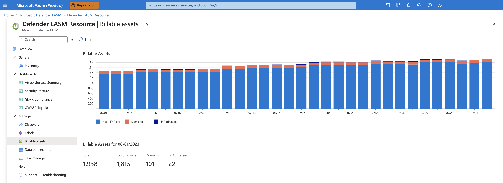
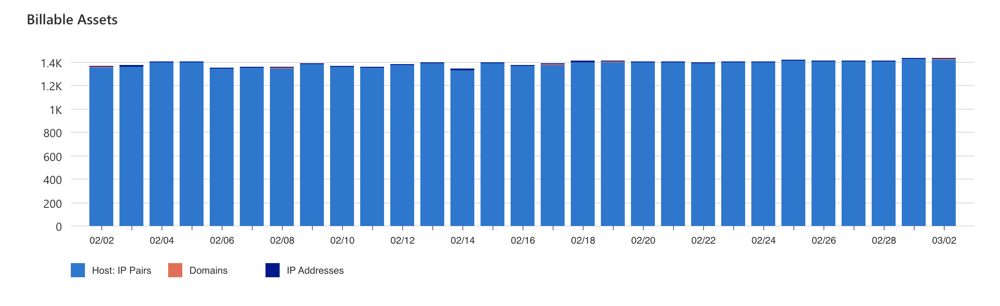
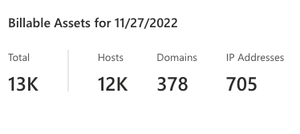

# Understand billable assets in Microsoft Defender External Attack Surface Management

When customers create their first Microsoft Defender External Attack Surface Management (Defender EASM) resource, they're automatically granted a 30-day free trial. Once the trial completes, customers are automatically charged based on their count of billable assets. The charged amount appears on their core Azure billing, with *Defender EASM* appearing as separate line item on their invoice.

## What is a billable asset?

The following kinds of assets are considered billable:

- Approved host:IP combinations
- Approved domains
- Approved IP addresses
  
Assets are only categorized as billable if they're placed in the Approved Inventory state. We don't charge for any other state. Additionally, duplicative host assets are NOT included in the billable asset count.

## Calculate billable assets

The following criteria determine when approved host:IP combinations, IP addresses, and domains are billable. The sum of these billable asset counts comprises your total number of billable assets and thus determines the cost of your subscription.

### Approved host:IP combinations

The Approved Inventory state is the inventory label that marks an asset as owned by your organization and therefore eligible for billing. Hosts in the Approved Inventory state are considered billable if the Defender EASM system observed resolutions within the last 30 days, and each host:IP combination is identified as a billable asset. All hosts in the Approved Inventory state are considered billable, regardless of the state of the coinciding IP address. The IP address doesn't need to be in the Approved Inventory state for the host:IP combination to be included in your billable asset count.

For example: if www.contoso.com resolved to 1.2.3.4 and 5.6.7.8 in the past 30 days, both combinations are added to the host count list:

- www.contoso.com / 1.2.3.4
- www.contoso.com / 5.6.7.8

The host:IP combination list is then analyzed to identify duplicate entries and eliminate duplicate hosts. If a host is a subdomain of a parent host that resolves to the same IP address, we exclude the child from the billable host count. For example, if both www.contoso.com and contoso.com resolve to 1.2.3.4, then we exclude www.contoso.com 1.2.3.4 from our Host Count list.

### Approved IP addresses

A *billable resolving host* is any host already counted as a billable host:IP combination. IP addresses that resolve to a billable resolving host are excluded from the billable IP address count. All other active IP addresses in the Approved Inventory state are part of the billable IP address count.

For an IP address to be considered active and therefore billable, it must have one of the following:

- A recent detected open port
- A recent detected SSL certificate

An open port or SSL certificate is considered *recent* if observed within the last 30 days.

### Approved domains

Hosts already counted as billable host:IP combinations are considered *billable resolving hosts*. Domains associated with those hosts are excluded from the billable domain count. All other domains in the Approved Inventory state are part of the billable domain count. If a billable host is registered to the domain in question, the domain isn't included in the billable asset count.

For example: if server1.contoso.com recently resolved to an IP address and is therefore included in your billable asset count, then contoso.com isn't added to the billable domain count.

## View billable asset data

Users can view their billable assets count within their Defender EASM resource to better understand how Microsoft determines their pricing. This dashboard displays the total number of assets that are billable and therefore comprise your total spend. Users should expect to see counts from the last 30 days when applicable, excluding the most recent couple days that haven't yet processed.

Prospective customers accessing Defender EASM with a 30-day trial can also see these billable asset counts. Although these users aren't charged until the trial expires, they can view the billable asset dashboard to better understand how they would be billed according to the size of their attack surface.

1. From the Defender EASM resource, select **Billable assets** from the **Manage** section of the left-hand navigation menu.

 

2. The chart displays billable asset counts over the past 30 days (if we have 30 days of data). The individual bars are segmented by asset type so users can quickly understand how their billable assets are distributed across their attack surface. Users can view the daily counts for each kind of asset by hovering their mouse over the chart.

 

3. Beneath the chart, users can view their current billable asset counts. These numbers are useful when approximating your monthly spend to best protect your organization’s attack surface.

 

## Related content

- [Microsoft Defender External Attack Surface Management (Defender EASM) overview](overview.md) 
