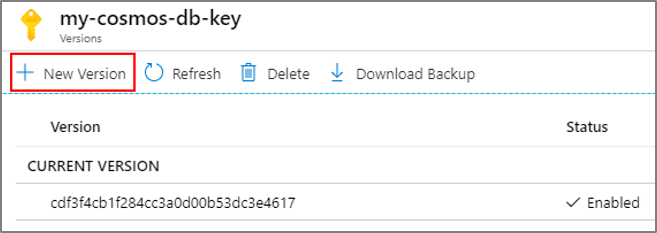

# Set up Microsoft Sentinel customer-managed key

This article provides background information and steps to configure a [customer-managed key (CMK)](/azure/azure-monitor/logs/customer-managed-keys) for Microsoft Sentinel. All the data stored in Microsoft Sentinel is already encrypted by Microsoft in all relevant storage resources. CMK provides an extra layer of protection with an encryption key created and owned by you and stored in your [Azure Key Vault](/azure/key-vault/general/overview). Before you begin, review the [prerequisites](#prerequisites), including the requirement for a Log Analytics dedicated cluster.

## Prerequisites

Before you enable CMK for Microsoft Sentinel, complete the following prerequisites:

1. Configure a Log Analytics dedicated cluster with at least a 100 GB/day commitment tier. When multiple workspaces are linked to the same dedicated cluster, they share the same customer-managed key. Learn about [Log Analytics Dedicated Cluster Pricing](/azure/azure-monitor/logs/logs-dedicated-clusters#cluster-pricing-model).
1. Configure CMK on the dedicated cluster and link your workspace to that cluster. Learn about the [CMK provisioning steps in Azure Monitor](/azure/azure-monitor/logs/customer-managed-keys?tabs=portal#customer-managed-key-provisioning-steps).

## Data protected by CMK

Once CMK is enabled, the following data is protected:

- Log Analytics tables in workspaces linked to the dedicated cluster
- Certain Microsoft Sentinel resources stored in the linked workspaces:
  - Analytics rules
  - Threat intelligence
  - Summary rules
  - Watchlists

> [!NOTE]
> UEBA outputs data and insights into your Log Analytics workspace, which can be protected using customer-managed keys (CMK). However, UEBA processing also involves storage of derived data outside of your Log Analytics workspace, which currently can't be protected with CMK.

All other data uses a Microsoft-managed key (MMK) instead and isn't protected by CMK. For example, this includes but is not limited to:

- Operational data within Microsoft Sentinel such as alerts, incidents, and behaviors and the data included in them.
- Data stored in products/services outside of Microsoft Sentinel, such as Security Copilot and Entra, or resources stored outside of the workspace such as workbooks, playbooks.

If you have specific needs that require increased CMK coverage, contact your account team.

## Onboarding considerations

Review the following limitations and considerations before enabling CMK for Microsoft Sentinel:

- Onboarding a CMK workspace to Microsoft Sentinel is supported only via REST API and the [Azure CLI](/cli/azure/sentinel/onboarding-state#az-sentinel-onboarding-state-create), and not via the Azure portal. Azure Resource Manager templates (ARM templates) currently aren't supported for CMK onboarding.

- In the following cases, only ingested data in Log Analytics tables are encrypted with CMK, while all other data is encrypted with Microsoft-managed keys: 
  - Enabling CMK on a workspace that's already onboarded to Microsoft Sentinel.
  - Enabling CMK on a cluster that contains Microsoft Sentinel-enabled workspaces.
  - Linking a Microsoft Sentinel-enabled, non-CMK workspace to a CMK-enabled cluster.

- The following CMK-related changes *are not supported* because they may lead to undefined and problematic behavior:

  - Disabling CMK on a workspace already onboarded to Microsoft Sentinel.
  - Setting a Sentinel-onboarded, CMK-enabled workspace as a non-CMK workspace by unlinking it from its CMK-enabled dedicated cluster.
  - Disabling CMK on a CMK-enabled Log Analytics dedicated cluster.

- Microsoft Sentinel supports System Assigned Identities in CMK configuration. Therefore, the dedicated Log Analytics cluster's identity should be a **System Assigned** identity. We recommend that you use the identity that's automatically assigned to the Log Analytics cluster when it's created.

- Changing the customer-managed key to another key (with another URI) currently *isn't supported*. Change the key by using [key rotation](#customer-managed-key-rotation).

- Before you make any CMK changes to a production workspace or to a Log Analytics cluster, contact the [Microsoft Sentinel Product Group](mailto:onboardrecoeng@microsoft.com).

<a name="how-cmk-works"></a>
## How customer-managed keys work in Microsoft Sentinel

The Microsoft Sentinel solution uses a dedicated Log Analytics cluster for log collection and features. As part of the Microsoft Sentinel CMK configuration, you must configure the CMK settings on the related Log Analytics dedicated cluster. 

For more information, see:

- [Azure Monitor customer-managed keys (CMK)](/azure/azure-monitor/logs/customer-managed-keys).
- [Azure Key Vault](/azure/key-vault/general/overview).
- [Log Analytics dedicated clusters](/azure/azure-monitor/logs/logs-dedicated-clusters).

> [!NOTE]
> If you enable CMK on Microsoft Sentinel, any Public Preview features that don't support CMK aren't enabled.

## Enable CMK

To provision CMK, follow these steps:

1. Configure CMK on a Log Analytics workspace on a dedicated cluster. See [Prerequisites](#prerequisites).
1. Register the Azure Cosmos DB Resource Provider.
1. Add an access policy to your Azure Key Vault instance.
1. Onboard the workspace to Microsoft Sentinel via the [Onboarding API](/rest/api/securityinsights/preview/sentinel-onboarding-states/create).
1. Wait for the onboarding process to complete.

### Step 1: Configure CMK on a Log Analytics workspace on a dedicated cluster

To onboard a Log Analytics workspace with CMK to Microsoft Sentinel, the workspace must first be linked to a dedicated Log Analytics cluster with at least a 100 GB/day commitment tier and CMK enabled on the cluster.
Microsoft Sentinel will use the same key used by the dedicated cluster.
Follow the instructions in [Azure Monitor customer-managed key configuration](/azure/azure-monitor/logs/customer-managed-keys) in order to create a CMK workspace that is used as the Microsoft Sentinel workspace in the following steps.

### Step 2: Register the Azure Cosmos DB Resource Provider

Microsoft Sentinel works with Azure Cosmos DB as an additional storage resource. Make sure to register to the Azure Cosmos DB Resource Provider before onboarding a CMK workspace to Microsoft Sentinel.

Follow the instructions to [Register the Azure Cosmos DB Resource Provider](/azure/cosmos-db/how-to-setup-cmk#register-resource-provider) for your Azure subscription.

### Step 3: Add an access policy to your Azure Key Vault instance

Add an access policy that allows Azure Cosmos DB to access the Azure Key Vault instance that is linked to your dedicated Log Analytics cluster (the same key will be used by Microsoft Sentinel). 

Follow the instructions to [add an access policy to your Azure Key Vault instance](/azure/cosmos-db/how-to-setup-cmk#add-access-policy) with an Azure Cosmos DB principal. 

:::image type="content" source="./media/customer-managed-keys/add-access-policy-principal.png" lightbox="./media/customer-managed-keys/add-access-policy-principal.png" alt-text="Screenshot of the Select principal option on the Add access policy page.":::

### Step 4: Onboard the workspace to Microsoft Sentinel via the onboarding API

Onboard the CMK enabled workspace to Microsoft Sentinel via the [onboarding API](/rest/api/securityinsights/preview/sentinel-onboarding-states/create) using the `customerManagedKey` property as `true`. For more context on the onboarding API, see the [Microsoft Sentinel management documentation](https://github.com/Azure/Azure-Sentinel/raw/master/docs/Azure%20Sentinel%20management.docx) in the Microsoft Sentinel GitHub repo.

For example, the following URI and request body is a valid call to onboard a workspace to Microsoft Sentinel when the proper URI parameters and authorization token are sent.

The following PUT request creates or updates the Microsoft Sentinel onboarding state for the workspace with customer-managed key support enabled.

#### URI

```http
PUT https://management.azure.com/subscriptions/{subscriptionId}/resourceGroups/{resourceGroupName}/providers/Microsoft.OperationalInsights/workspaces/{workspaceName}/providers/Microsoft.SecurityInsights/onboardingStates/{sentinelOnboardingStateName}?api-version=2021-03-01-preview
```

The following request body sets the `customerManagedKey` property to `true`, which enables customer-managed key support for the onboarding state.

#### Request body

```json
{ 
"properties": { 
    "customerManagedKey": true 
    }  
} 
```

### Step 5: Wait for onboarding to complete

After the onboarding API request completes, no additional action is required. The onboarding process continues asynchronously.

You might see a message in the Azure portal indicating that onboarding is still in progress. Once onboarding completes, the Sentinel Overview page becomes available in the Azure portal.

## Key Encryption Key revocation or deletion

If a user revokes the key encryption key (the CMK), either by deleting it or removing access for the dedicated cluster and Azure Cosmos DB Resource Provider, Microsoft Sentinel honors the change and behave as if the data is no longer available, within one hour. At this point, any operation that uses persistent storage resources such as data ingestion, persistent configuration changes, and incident creation, is prevented. Previously stored data isn't deleted but remains inaccessible. Inaccessible data is governed by the data-retention policy and is purged in accordance with that policy.

The only operation possible after the encryption key is revoked or deleted is account deletion.

If access is restored after revocation, Microsoft Sentinel restores access to the data within an hour.

Access to the data can be revoked by disabling the customer-managed key in the key vault, or deleting the access policy to the key, for both the dedicated Log Analytics cluster and Azure Cosmos DB. Revoking access by removing the key from the dedicated Log Analytics cluster, or by removing the identity associated with the dedicated Log Analytics cluster isn't supported.

To understand more about how key revocation works in Azure Monitor, see [Azure Monitor CMK revocation](/azure/azure-monitor/logs/customer-managed-keys#key-revocation).

## Customer-managed key rotation

Microsoft Sentinel and Log Analytics support key rotation. When a user performs key rotation in Key Vault, Microsoft Sentinel supports the new key within an hour.

In Azure Key Vault, perform key rotation by creating a new version of the key:



Disable the previous version of the key after 24 hours, or after the Azure Key Vault audit logs no longer show any activity that uses the previous version.

After rotating a key, you must explicitly update the dedicated Log Analytics cluster resource in Log Analytics with the new Azure Key Vault key version. For more information, see [Azure Monitor CMK rotation](/azure/azure-monitor/logs/customer-managed-keys#key-rotation).

## Replacing a customer-managed key

Microsoft Sentinel doesn't support replacing a customer-managed key. You should use the [key rotation capability](#customer-managed-key-rotation) instead.

## Related content

- [Visualize collected data on the Overview page](get-visibility.md)
- [Threat detection in Microsoft Sentinel](threat-detection.md)
- [Visualize and monitor your data by using workbooks in Microsoft Sentinel](monitor-your-data.md)
