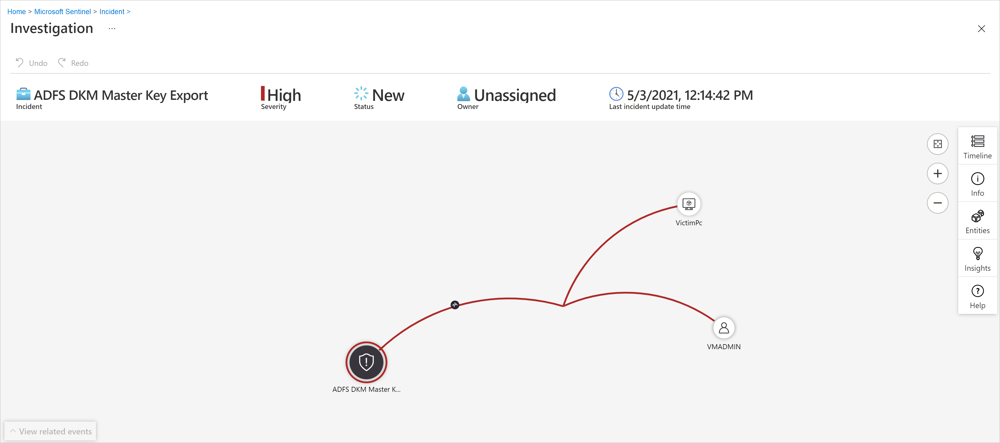
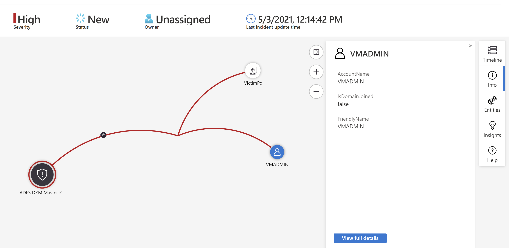
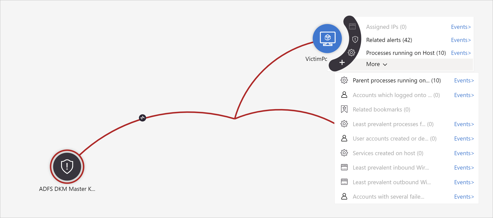

# Investigate incidents with Microsoft Sentinel (legacy)

This article helps you use Microsoft Sentinel's legacy incident investigation experience. If you're using the newer version of the interface, see [Navigate and investigate incidents in Microsoft Sentinel](investigate-incidents.md) for instructions that match that experience.

After connecting your data sources to Microsoft Sentinel, you want to be notified when something suspicious happens. To enable you to do this, Microsoft Sentinel lets you create advanced analytics rules that generate incidents that you can assign and investigate.

An incident can include multiple alerts. It's an aggregation of all the relevant evidence for a specific investigation. An incident is created based on analytics rules that you created in the **Analytics** page. The properties related to the alerts, such as severity and status, are set at the incident level. After you let Microsoft Sentinel know what kinds of threats you're looking for and how to find them, you can monitor detected threats by investigating incidents.

> [!IMPORTANT]
> Noted features are currently in PREVIEW. The [Azure Preview Supplemental Terms](https://azure.microsoft.com/support/legal/preview-supplemental-terms/) include additional legal terms that apply to Azure features that are in beta, preview, or otherwise not yet released into general availability.
>

## Prerequisites

Before you investigate or assign incidents, make sure the following prerequisites are met:

- You'll only be able to investigate the incident if you used the entity mapping fields when you set up your analytics rule. The investigation graph requires that your original incident includes entities.

- If you have a guest user that needs to assign incidents, the user must be assigned the [Directory Reader](/azure/active-directory/roles/permissions-reference#directory-readers) role in your Microsoft Entra tenant. Regular (nonguest) users have this role assigned by default.

## How to investigate incidents

Perform the following steps to review and investigate incidents:

1. Select **Incidents**. The **Incidents** page lets you know how many incidents you have and whether they're new, **Active**, or closed. For each incident, you can see the time it occurred and the status of the incident. Look at the severity to decide which incidents to handle first.

    :::image type="content" source="media/investigate-cases/incident-severity.png" alt-text="Screenshot of view of incident severity." lightbox="media/investigate-cases/incident-severity.png":::

1. You can filter the incidents as needed, for example by status or severity. For more information, see [Search for incidents](#search-for-incidents).

1. To begin an investigation, select a specific incident. On the right, you can see detailed information for the incident including its severity, summary of the number of entities involved, the raw events that triggered this incident, the incident’s unique ID, and any mapped MITRE ATT&CK tactics or techniques.

1. To view more details about the alerts and entities in the incident, select **View full details** in the incident page and review the relevant tabs that summarize the incident information.

    :::image type="content" source="media/investigate-cases/incident-timeline.png" alt-text="Screenshot of view of alert details." lightbox="media/investigate-cases/incident-timeline.png":::

    - If you're currently using the new experience, toggle it off at the top right of the incident details page to use the legacy experience instead.

    - In the **Timeline** tab, review the timeline of alerts and bookmarks in the incident, which can help you reconstruct the timeline of attacker activity.

    - In the **Similar incidents (Preview)** tab, you see a collection of up to 20 other incidents that most closely resemble the current incident. Viewing similar incidents allows you to understand the incident in a larger context and helps direct your investigation. For more information, see [Similar incidents (preview)](#similar-incidents-preview).

    - In the **Alerts** tab, review the alerts included in this incident. You see all relevant information about the alerts – the analytics rules that produced them, the number of results returned per alert, and the ability to run playbooks on the alerts. To drill down even further into the incident, select the number of **Events**. This opens the query that generated the results and the events that triggered the alert in Log Analytics. 

    - In the **Bookmarks** tab, you see any bookmarks you or other investigators have linked to this incident. For more information, see [Bookmarks in Microsoft Sentinel](./bookmarks.md).

    - In the **Entities** tab, you can see all the [entities](entities.md) that you [mapped to data fields](./map-data-fields-to-entities.md) as part of the alert rule definition. These are the objects that played a role in the incident, whether they be users, devices, addresses, files, or [other supported entity types](./entities-reference.md).

    - Finally, in the **Comments** tab, you can add your comments on the investigation and view any comments made by other analysts and investigators. For more information, see [Comment on incidents](#comment-on-incidents).

1. If you're actively investigating an incident, it's a good idea to set the incident's status to **Active** until you close it.

1. Incidents can be assigned to a specific user or to a group. For each incident you can assign an owner, by setting the **Owner** field. All incidents start as unassigned. You can also add comments so that other analysts are able to understand what you investigated and what your concerns are around the incident.

    :::image type="content" source="media/investigate-cases/assign-incident-to-user.png" alt-text="Screenshot of assigning incident to user.":::

    Recently selected users and groups appear at the top of the pictured drop-down list.

1. Select **Investigate** to view the investigation map.

## Use the investigation graph to deep dive

The investigation graph enables analysts to ask the right questions for each investigation. The investigation graph helps you understand the scope, and identify the root cause, of a potential security threat by correlating relevant data with any involved entity. You can dive deeper and investigate any entity presented in the graph by selecting it and choosing between different expansion options.  
  
The investigation graph provides you with:

- **Visual context from raw data**: The live, visual graph displays entity relationships extracted automatically from the raw data. This enables you to easily see connections across different data sources.

- **Full investigation scope discovery**: Expand your investigation scope using built-in exploration queries to surface the full scope of a breach.

- **Built-in investigation steps**: Use predefined exploration options to make sure you're asking the right questions in the face of a threat.

To use the investigation graph:

1. Select an incident, then select **Investigate**. This takes you to the investigation graph. The graph provides an illustrative map of the entities directly connected to the alert and each resource connected further.

    

   > [!IMPORTANT] 
   > - You'll only be able to investigate the incident if you used the entity mapping fields when you set up your analytics rule. The investigation graph requires that your original incident includes entities.
   >
   > - Microsoft Sentinel currently supports investigation of **incidents up to 30 days old**.

1. Select an entity to open the **Entities** pane so you can review information on that entity.

    
  
1. Expand your investigation by hovering over each entity to reveal a list of questions that was designed by our security experts and analysts per entity type to deepen your investigation. We call these options **exploration queries**.

    

    For example, you can request related alerts. If you select an exploration query, the resulting entitles are added back to the graph. In this example, selecting **Related alerts** returned the following alerts into the graph:

    :::image type="content" source="media/investigate-cases/related-alerts.png" alt-text="Screenshot of the investigation graph showing related alerts connected to an entity by dotted lines." lightbox="media/investigate-cases/related-alerts.png":::

    In the graph, related alerts appear connected to the entity by dotted lines.

1. For each exploration query, you can select the option to open the raw event results and the query used in Log Analytics, by selecting **Events\>**.

1. In order to understand the incident, the graph gives you a parallel timeline.

    :::image type="content" source="media/investigate-cases/map-timeline.png" alt-text="Screenshot of the investigation map timeline showing incident events in parallel over time." lightbox="media/investigate-cases/map-timeline.png":::

1. Hover over the timeline to see which things on the graph occurred at what point in time.

    :::image type="content" source="media/investigate-cases/use-timeline.png" alt-text="Screenshot of the investigation map timeline highlighting when specific events and alerts occurred." lightbox="media/investigate-cases/use-timeline.png":::

## Focus your investigation

Learn how you can broaden or narrow the scope of your investigation by either [adding alerts to your incidents or removing alerts from incidents](relate-alerts-to-incidents.md).

## Similar incidents (preview)

As a security operations analyst, when investigating an incident you want to pay attention to its larger context. For example, you'll want to see if other incidents like this have happened before or are happening now.

- You might want to identify concurrent incidents that might be part of the same larger attack strategy.

- You might want to identify similar incidents in the past, to use them as reference points for your current investigation.

- You might want to identify the owners of past similar incidents, to find the people in your SOC who can provide more context, or to whom you can escalate the investigation.

The **similar incidents** tab in the incident details page, now in preview, presents up to 20 other incidents that are the most similar to the current one. Similarity is calculated by internal Microsoft Sentinel algorithms, and the incidents are sorted and displayed in descending order of similarity.

:::image type="content" source="media/investigate-cases/similar-incidents.png" alt-text="Screenshot of the Similar incidents tab listing related incidents ranked by similarity to the current incident." lightbox="media/investigate-cases/similar-incidents.png":::

### Similarity calculation

There are three criteria by which similarity is determined:

- **Similar entities:** An incident is considered similar to another incident if they both include the same [entities](entities.md). The more entities two incidents have in common, the more similar they're considered to be.

- **Similar rule:** An incident is considered similar to another incident if they were both created by the same [analytics rule](detect-threats-built-in.md).

- **Similar alert details:** An incident is considered similar to another incident if they share the same title, product name, and/or [custom details](surface-custom-details-in-alerts.md).

The reasons an incident appears in the similar incidents list are displayed in the **Similarity reason** column. Hover over the info icon to show the common items (entities, rule name, or details).

:::image type="content" source="media/investigate-cases/similarity-popup.png" alt-text="Screenshot of pop-up display of similar incident details.":::

#### Similarity time frame

Incident similarity is calculated based on data from the 14 days before the incident's last activity, defined as the end time of the most recent alert in the incident.

Incident similarity is recalculated every time you enter the incident details page, so the results might vary between sessions if new incidents were created or updated.

## Comment on incidents

As a security operations analyst, when investigating an incident you'll want to thoroughly document the steps you take, both to ensure accurate reporting to management and to enable seamless cooperation and collaboration among coworkers. Microsoft Sentinel gives you a rich commenting environment to help you accomplish this.

Another important thing that you can do with comments is enrich your incidents automatically. When you run a playbook on an incident that fetches relevant information from external sources (say, checking a file for malware at VirusTotal), you can have the playbook place the external source's response - along with any other information you define - in the incident's comments.

Comments are simple to use. You access them through the **Comments** tab on the incident details page.

:::image type="content" source="media/investigate-cases/comments-screen.png" alt-text="Screenshot of viewing and entering comments.":::

### Frequently asked questions about incident comments

The following frequently asked questions describe key considerations for using incident comments.

#### What kinds of input are supported?

Comments support the following types of input:

- **Text:** Comments in Microsoft Sentinel support text inputs in plain text, basic HTML, and Markdown. You can also paste copied text, HTML, and Markdown into the comment window.

- **Images:** You can insert links to images in comments and the images are displayed inline, but the images must already be hosted in a publicly accessible location such as Dropbox, OneDrive, Google Drive and the like. Images can't be uploaded directly to comments.

#### Is there a size limit on comments?

Yes. The following limits apply to incident comments:

- **Per comment:** A single comment can contain up to **30,000 characters**. 

- **Per incident:** A single incident can contain up to **100 comments**.  

    > [!NOTE]
    > The size limit of a single incident record in the *SecurityIncident* table in Log Analytics is 64 KB. If this limit is exceeded, comments (starting with the earliest) will be truncated, which may affect the comments that will appear in [advanced incident search](#search-for-incidents) results.
    >
    > The actual incident records in the incidents database will not be affected.

#### Who can edit or delete comments?

The following permissions apply to editing and deleting comments:

- **Editing:** Only the author of a comment has permission to edit it.

- **Deleting:** Only users with the [Microsoft Sentinel Contributor](roles.md) role have permission to delete comments. Even the comment's author must have this role in order to delete it.

## Close an incident

Once you resolve a particular incident (for example, when your investigation has reached its conclusion), you should set the incident’s status to **Closed**. When you do so, you'll be asked to classify the incident by specifying the reason you're closing it. This step is mandatory. Select **Select classification** and choose one of the following from the drop-down list:

- True Positive - suspicious activity
- Benign Positive - suspicious but expected
- False Positive - incorrect alert logic
- False Positive - incorrect data
- Undetermined

:::image type="content" source="media/investigate-cases/closing-reasons-dropdown.png" alt-text="Screenshot that highlights the classifications available in the Select classification list.":::

For more information about false positives and benign positives, see [Handle false positives in Microsoft Sentinel](false-positives.md).

After choosing the appropriate classification, add some descriptive text in the **Comment** field. Adding a descriptive comment is useful in the event you need to refer back to this incident. Select **Apply** when you’re done, and the incident is closed.

:::image type="content" source="media/investigate-cases/closing-reasons-comment-apply.png" alt-text="Screenshot of the incident closing dialog with a classification selected and a descriptive comment added.":::

## Search for incidents

To find a specific incident quickly, enter a search string in the search box above the incidents grid and press **Enter** to modify the list of incidents shown accordingly. If your incident isn't included in the results, you might want to narrow your search by using **Advanced search** options.

To modify the search parameters, select the **Search** button and then select the parameters where you want to run your search.

For example:

:::image type="content" source="media/investigate-cases/advanced-search.png" alt-text="Screenshot of the incident search box and button to select basic and/or advanced search options.":::

By default, incident searches run across the **Incident ID**, **Title**, **Tags**, **Owner**, and **Product name** values only. In the search pane, scroll down the list to select one or more other parameters to search, and select **Apply** to update the search parameters. Select **Set to default** reset the selected parameters to the default option.

> [!NOTE]
> Searches in the **Owner** field support both names and email addresses.
>

Using advanced search options changes the search behavior as follows:

| Search behavior  | Description  |
|---------|---------|
| **Search button color**     | The color of the search button changes, depending on the types of parameters currently being used in the search. <ul><li>As long as only the default parameters are selected, the button is grey. <li>As soon as different parameters are selected, such as advanced search parameters, the button turns blue.         |
| **Auto-refresh**     | Using advanced search parameters prevents you from selecting to automatically refresh your results.        |
| **Entity parameters**     | All entity parameters are supported for advanced searches. When searching in any entity parameter, the search runs in all entity parameters.         |
| **Search strings**     | Searching for a string of words includes all of the words in the search query. Search strings are case sensitive.     |
| **Cross workspace support**     | Advanced searches aren't supported for cross-workspace views.     |
| **Number of search results displayed** | When you're using advanced search parameters, only 50 results are shown at a time. |

> [!TIP]
>  If you're unable to find the incident you're looking for, remove search parameters to expand your search. If your search results in too many items, add more filters to narrow down your results.
>

## Related content

In this article, you learned how to get started investigating incidents using Microsoft Sentinel. For more information, see:

- [Investigate incidents with UEBA data](investigate-with-ueba.md)
- [Automation in Microsoft Sentinel: Security orchestration, automation, and response (SOAR)](automation.md)
