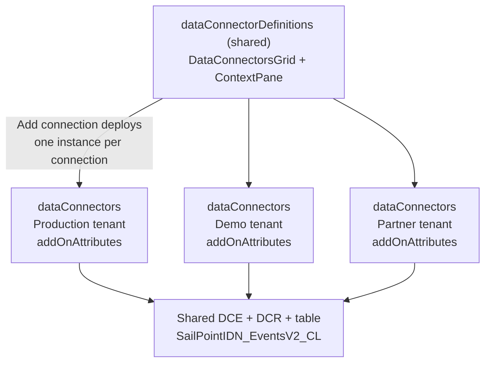

# Support multiple connections in a codeless connector

Some data sources must connect to Microsoft Sentinel more than once in the same workspace. A customer might run separate production, staging, and partner accounts with the same vendor. A large enterprise might have regionally or organizationally segmented accounts. A managed security service provider (MSSP) might consolidate several end-customer sources into one workspace. The *multiaccount* pattern in the [Codeless Connector Framework (CCF)](/azure/sentinel/isv/create-codeless-connector) lets a single connector support many of these connections side by side. Each connection is deployed and managed independently, and all of them appear in one list in the connector UI.

This pattern became possible in the current version of the CCF, which separates the connector's UI from its connection configuration. As the CCF documentation notes, this separation "allows the creation of connectors with multiple connections, which wasn't possible previously."

This article explains the multiaccount pattern and walks through the production **SailPoint IdentityNow** connector as a reference implementation.

> [!NOTE]
> This article uses *multiaccount* to mean multiple source-side accounts, environments, or customers connected to one Microsoft Sentinel workspace. Avoid the term *multi-tenant* for this scenario, because it's easily misread as Azure or Microsoft Entra tenant isolation, which isn't what this pattern provides.

## Prerequisites

- Familiarity with authoring a CCF connector. If you're new to CCF, start with [Create a codeless connector for Microsoft Sentinel](/azure/sentinel/isv/create-codeless-connector).
- A connector built on the `RestApiPoller` data connector kind (a pull connector). The multiaccount UI elements are defined in the connector's `dataConnectorDefinitions` resource.
- Permissions to deploy the solution and to add or remove connections in the target workspace. See [Permissions](#permissions).
- For the SailPoint example: a SailPoint Identity Security Cloud (IdentityNow) tenant, its domain, and an OAuth 2.0 client ID and secret with the `sp:search:read` scope.

## When to use the multiaccount pattern

Use the multiaccount pattern when a customer legitimately needs *multiple simultaneous connections for the same connector in one workspace*.

A simple test: if deploying a second connection would overwrite the first, the connector is a candidate for the multiaccount pattern.

Common drivers:

| Scenario | Example |
|---|---|
| Multiple environments | Production, staging, and development accounts of the same product, all sending to one workspace. |
| Regional or segmented accounts | Separate regional, business-unit, or network-segmented accounts within one enterprise. |
| MSSP or shared workspace | One operator manages several end-customer sources in a single workspace. |
| Multiple vendor instances | Customers who run more than one account of the same product, such as multiple identity, network, or SaaS tenants. |

Production connectors that already use this pattern include SailPoint IdentityNow (the reference in this article), Alibaba Cloud Networking, Okta Single Sign-On, Salesforce Service Cloud, Slack Audit, GitHub, OpenAI, and SAP BTP.

## How multiaccount works

A multiaccount connector is built from three parts. Two are shared across every connection; one is created for each connection.

| Layer | Resource type | Cardinality | Role |
|---|---|---|---|
| Connector definition (UI) | `Microsoft.SecurityInsights/dataConnectorDefinitions` | One (shared) | Renders the connections grid and the **Add connection** form. |
| Data connector (instance) | `Microsoft.SecurityInsights/dataConnectors` | One per connection | A single deployed connection. Polls the source and labels itself with per-connection metadata. |
| Ingestion resources | `Microsoft.Insights/dataCollectionRules`, a data collection endpoint, and the custom table | One (shared) | All connections ingest through the same data collection rule (DCR), data collection endpoint (DCE), and destination table. |

The pattern relies on four mechanisms that work together:

1. **`DataConnectorsGrid`**: A UI element in the connector definition that lists every deployed `dataConnectors` instance for the workspace, one row per connection.
1. **`ContextPane`**: A UI element that opens an **Add connection** form so a user can deploy another instance without removing the existing ones.
1. **A unique resource name per instance**: Each connection is a separate `dataConnectors` Azure Resource Manager (ARM) resource whose name is made unique. In the SailPoint connector, the name includes `uniqueString(parameters('tenantId'))`. The unique name is what prevents a second connection from overwriting the first.
1. **`addOnAttributes`**: Per-connection metadata stored on each `dataConnectors` resource. The grid reads these values to give each row a meaningful label.

> [!IMPORTANT]
> The unique resource name is the mechanism that makes independent, nondestructive deployments possible. `DataConnectorsGrid`, `ContextPane`, and `addOnAttributes` provide the experience of multiple connections, but without a unique name, every **Add connection** deploys to the same resource ID and overwrites the previous connection.

## Artifact map and deployment flow

Before the walkthrough, it helps to see how the artifacts fit into a Microsoft Sentinel solution and when each one is deployed.

| Artifact | Becomes | Deployed | Cardinality |
|---|---|---|---|
| `SailPointIdentityNow_ConnectorDefinition.json` | `dataConnectorDefinitions` (the connector UI) | At solution install | One |
| `table_SailPointIDN_EventsV2.json` | The custom Log Analytics table | At solution install | One |
| `SailPointIdentityNow_DCR.json` | The shared DCR | At solution install | One |
| `SailPointIdentityNow_PollerConfig.json` | A `dataConnectors` instance (`RestApiPoller`) | Each time a user selects **Add connection** | One per connection |

The lifecycle is:

1. *Solution install* deploys the connector definition, the custom table, and the DCR. The DCR uses the workspace's data collection endpoint (DCE); a DCE is created once per workspace and shared by every DCR, so the solution reuses an existing DCE rather than creating one per connector. After this step, the connector appears in the workspace with an empty connections grid.
1. The user selects **Add connection** and completes the `ContextPane` form. This deploys one `dataConnectors` instance, parameterized with the values from the form.
1. The instance binds to the shared ingestion resources. The deployment passes the DCE endpoint and the DCR immutable ID to the instance through a `dcrConfig` parameter, so the instance's `dcrConfig` resolves to the shared DCR and DCE.

In the per-connection data connector template, `{{dataCollectionEndpoint}}` and `{{dataCollectionRuleImmutableId}}` are placeholders for those shared values. In the packaged solution they become parameter references — for example, `[[parameters('dcrConfig').dataCollectionEndpoint]` — so every connection receives the resolved DCE and DCR at connect time. (These placeholders and `[[...` escaping live in the `dataConnectors`/`RestApiPoller` template, not the `dataConnectorDefinitions` UI resource.) For the full packaging and deployment model, see [Create a codeless connector for Microsoft Sentinel](/azure/sentinel/isv/create-codeless-connector).

## Reference walkthrough: SailPoint IdentityNow

The SailPoint IdentityNow connector lets a customer connect multiple SailPoint tenants — for example, production, demo, and partner — to one Microsoft Sentinel workspace. Each connection is identified by its tenant ID and IdentityNow domain.

The JSON in the following sections is excerpted to show the properties relevant to multiaccount. Each excerpt omits other required fields. Use the complete files in the [SailPoint IdentityNow solution](https://github.com/Azure/Azure-Sentinel/tree/master/Solutions/SailPointIdentityNow) as the source of truth when you author your own connector.

### Step 1: Define the connections grid and the Add connection form

In the `dataConnectorDefinitions` resource (`kind: Customizable`), the multiaccount experience is defined by two instruction types inside `instructionSteps`: `DataConnectorsGrid` and `ContextPane`.

#### The connections grid

`DataConnectorsGrid` renders one row per deployed connection. The `mapping` array binds each grid column to a field on the `dataConnectors` resource. The tenant ID and domain are read from `properties.addOnAttributes`:

```json
{
  "type": "DataConnectorsGrid",
  "parameters": {
    "mapping": [
      { "columnName": "Tenant ID", "columnValue": "properties.addOnAttributes.tenantId" },
      { "columnName": "Domain", "columnValue": "properties.addOnAttributes.identityNowDomain" },
      { "columnName": "Data Type", "columnValue": "properties.dataType" }
    ],
    "menuItems": [ "DeleteConnector" ]
  }
}
```

The `mapping` array defines the grid columns, and each `columnValue` is a path into a deployed `dataConnectors` resource. Per-connection labels come from `properties.addOnAttributes`. The `menuItems` array adds a **Delete** action to each row, so a single connection can be removed without affecting the others.

#### The Add connection form

`ContextPane` defines the form that opens when the user selects **Add connection**. Each `Textbox` becomes a deployment parameter (`name`) that the poller template consumes:

```json
{
  "type": "ContextPane",
  "parameters": {
    "label": "Add Connection",
    "title": "Add SailPoint IdentityNow Connection",
    "subtitle": "Connect a SailPoint IdentityNow tenant to Microsoft Sentinel",
    "contextPaneType": "DataConnectorsContextPane",
    "instructionSteps": [
      {
        "instructions": [
          { "type": "Textbox", "parameters": { "label": "Tenant ID", "placeholder": "e.g. acme or ta-partner19947", "name": "tenantId", "type": "text", "validations": { "required": true } } },
          { "type": "Textbox", "parameters": { "label": "IdentityNow Domain", "placeholder": "e.g. identitynow.com or identitynow-demo.com", "name": "identityNowDomain", "type": "text", "validations": { "required": true } } },
          { "type": "Textbox", "parameters": { "label": "Client ID", "placeholder": "Enter your OAuth2 Client ID", "name": "clientId", "type": "text", "validations": { "required": true } } },
          { "type": "Textbox", "parameters": { "label": "Client Secret", "placeholder": "Enter your OAuth2 Client Secret", "name": "clientSecret", "type": "password", "validations": { "required": true } } }
        ]
      }
    ]
  }
}
```

Each `name` value (`tenantId`, `identityNowDomain`, `clientId`, `clientSecret`) is referenced as `parameters('<name>')` in the poller config in Step 2. The two identifying values — `tenantId` and `identityNowDomain` — are stored in `addOnAttributes` and shown in the grid.

The connector definition also sets `"connectivityCriteria": [{ "type": "HasDataConnectors" }]`. This criterion makes the connector show as connected when at least one `dataConnectors` instance exists. The `DataConnectorsGrid` element, not the connectivity criterion, is what renders the individual connection rows.

### Step 2: Make each connection a unique, self-describing resource

The `dataConnectors` resource (`kind: RestApiPoller`) is deployed once per connection. The following excerpt highlights the properties that make multiaccount work — the unique name, `connectorDefinitionName`, `addOnAttributes`, and the parameterized endpoints:

```json
{
  "type": "Microsoft.SecurityInsights/dataConnectors",
  "apiVersion": "2024-09-01",
  "name": "[[concat(parameters('workspace'), '/Microsoft.SecurityInsights/', 'SailPointIDN_EventsV2', uniqueString(parameters('tenantId')))]",
  "kind": "RestApiPoller",
  "properties": {
    "connectorDefinitionName": "SailPointIdentityNowConnector",
    "auth": {
      "type": "OAuth2",
      "ClientId": "[[parameters('clientId')]",
      "ClientSecret": "[[parameters('clientSecret')]",
      "GrantType": "client_credentials",
      "TokenEndpoint": "[[concat('https://', parameters('tenantId'), '.api.', parameters('identityNowDomain'), '/oauth/token')]",
      "Scope": "sp:search:read"
    },
    "request": {
      "apiEndpoint": "[[concat('https://', parameters('tenantId'), '.api.', parameters('identityNowDomain'), '/v2025/search/events')]",
      "httpMethod": "POST"
    },
    "dataType": "SailPointIDN_EventsV2",
    "dcrConfig": {
      "streamName": "Custom-SailPointIDN_EventsV2_CL",
      "dataCollectionEndpoint": "{{dataCollectionEndpoint}}",
      "dataCollectionRuleImmutableId": "{{dataCollectionRuleImmutableId}}"
    },
    "addOnAttributes": {
      "tenantId": "[[parameters('tenantId')]",
      "identityNowDomain": "[[parameters('identityNowDomain')]"
    }
  }
}
```

The properties that matter:

- **Unique resource name**: The name is built with `concat(..., 'SailPointIDN_EventsV2', uniqueString(parameters('tenantId')))`. The `uniqueString()` function produces a deterministic hash from its inputs, so each value of `tenantId` deploys to a different `dataConnectors` resource ID. Adding a connection with a new tenant ID creates a new resource instead of replacing an existing one.
- **`connectorDefinitionName`**: This value must match the `id` of the connector definition from Step 1 (`SailPointIdentityNowConnector`). It's what associates the deployed instance with the connector UI and the connections grid.
- **`addOnAttributes`.** The `tenantId` and `identityNowDomain` values are stored on the resource and read back by the `DataConnectorsGrid` mapping in Step 1, so each grid row shows which tenant and domain it represents.
- **Parameterized endpoints and credentials**: The token endpoint, data endpoint, and credentials are all built from the form parameters, so each connection targets its own SailPoint tenant.

About ARM escaping: in a connector definition, prefix an ARM expression with an extra `[` so the expression is written into the generated per-connection template instead of being evaluated when the definition deploys. For example, `[[parameters('clientId')]` becomes `[parameters('clientId')]` in the deployed template. The `{{...}}` placeholders, such as `{{dataCollectionEndpoint}}`, resolve to the shared ingestion values at connect time, as described in [Artifact map and deployment flow](#artifact-map-and-deployment-flow).

> [!IMPORTANT]
> The `uniqueString()` seed must include every value that makes a connection distinct. The SailPoint source hashes only `tenantId`, so two connections that share a tenant ID but differ by domain would collide and overwrite each other. When you author a new connector, seed `uniqueString()` with the full connection identity — for example, `uniqueString(parameters('tenantId'), parameters('identityNowDomain'))`.

### Step 3: Share the data collection rule, endpoint, and table

Although each connection is its own `dataConnectors` resource, all connections share one ingestion pipeline. The poller's `dcrConfig` points every instance at the same stream, DCE, and DCR immutable ID:

```json
{
  "dcrConfig": {
    "streamName": "Custom-SailPointIDN_EventsV2_CL",
    "dataCollectionEndpoint": "{{dataCollectionEndpoint}}",
    "dataCollectionRuleImmutableId": "{{dataCollectionRuleImmutableId}}"
  }
}
```

The shared DCR declares a single input stream and transforms incoming records into the destination table. The following excerpt shows the stream declaration and data flow; the full DCR includes the complete column list, destinations, and the exact transform:

```json
{
  "streamDeclarations": {
    "Custom-SailPointIDN_EventsV2_CL": {
      "columns": [
        { "name": "id", "type": "string" },
        { "name": "created", "type": "datetime" },
        { "name": "type", "type": "string" },
        { "name": "status", "type": "string" },
        { "name": "org", "type": "string" },
        { "name": "pod", "type": "string" }
      ]
    }
  },
  "dataFlows": [
    {
      "streams": [ "Custom-SailPointIDN_EventsV2_CL" ],
      "destinations": [ "clv2ws1" ],
      "outputStream": "Custom-SailPointIDN_EventsV2_CL",
      "transformKql": "source | project TimeGenerated=iff(isnull(created),now(),todatetime(created)), Id=tostring(id), EventType=tostring(type), Status=tostring(status), Org=tostring(org), Pod=tostring(pod), SourceSystem='RestAPI'"
    }
  ]
}
```

All connections write to the single custom table `SailPointIDN_EventsV2_CL`. This shared-ingestion design keeps the deployment efficient: adding a connection adds one lightweight `dataConnectors` resource and reuses the existing table and DCR.

Because rows from every connection land in the same table, plan how analysts will tell them apart:

- The configured `tenantId` and `identityNowDomain` values are stored only in the connection's `addOnAttributes` (resource metadata). They are **not** ingested into the table.
- The `Org` and `Pod` columns come from the SailPoint event payload through the DCR transform. `Pod` is SailPoint infrastructure metadata, and `Org` reflects the source organization but isn't guaranteed to equal the configured tenant ID for every event.
- If analysts must filter reliably by the configured connection identity, add explicit columns to the stream and table and populate them from the source payload (or another supported enrichment), rather than relying on `Org` or `Pod`.

### Name reference

These similar-looking names serve different purposes. Keep them consistent across your artifacts:

| Concept | SailPoint value | Used in |
|---|---|---|
| Data type | `SailPointIDN_EventsV2` | `dataConnectors.properties.dataType` |
| DCR stream | `Custom-SailPointIDN_EventsV2_CL` | `dcrConfig.streamName` and the DCR stream declaration |
| Destination table | `SailPointIDN_EventsV2_CL` | Log Analytics and KQL queries |
| Connection labels | `tenantId`, `identityNowDomain` | `addOnAttributes` and the grid `mapping` |
| Connector definition ID | `SailPointIdentityNowConnector` | `connectorDefinitionName` and the definition `id` |

## Architecture summary



Each `dataConnectors` instance has a unique resource name (from `uniqueString()`), so connections don't overwrite each other. All instances write through the shared DCE, DCR, and table.

## Secure each connection

Each connection collects credentials for a different source account, so apply these practices:

- **Use a secure parameter for the secret**: In the form, `type: "password"` only masks the UI field. In the generated per-connection template, define the secret parameter as a secure string so it isn't logged or returned in deployment history:

  ```json
  { "clientSecret": { "type": "securestring", "minLength": 1 } }
  ```

- **Never place secrets in visible metadata**: Don't put a secret in `addOnAttributes`, the resource name, a table column, or any logged field. `addOnAttributes` values are visible in the connector UI and resource properties.
- **Use least-privilege scopes**: Request only the scopes the connector needs. The SailPoint connector uses `sp:search:read`.
- **Plan for rotation**: A customer rotates a secret for one connection by editing or recreating that connection. Because each connection is its own resource, rotating one doesn't affect the others.

> [!CAUTION]
> Don't include connection secrets in any field that's stored as plain text or shown in the UI, including `addOnAttributes` and the resource name. Use a secure-string parameter for the secret and keep it in the `auth` block only.

## Permissions

Different steps require different Azure permissions:

| Action | Permission |
|---|---|
| Install the solution and create shared resources (definition, table, DCR, DCE) | Ability to deploy ARM resources in the resource group, plus Microsoft Sentinel Contributor on the workspace |
| Add a connection | `Microsoft.SecurityInsights/dataConnectors/write` |
| Delete a connection | `Microsoft.SecurityInsights/dataConnectors/delete` |

The Microsoft Sentinel Contributor role grants the data connector permissions. For more information, see [Roles and permissions in Microsoft Sentinel](/azure/sentinel/roles).

## Migrate an existing single-instance connector

If you're converting an existing single-instance CCF connector to multiaccount, plan for connections that customers already deployed:

1. Identify the existing resource name. A single-instance connector typically uses a fixed `dataConnectors` name, so it doesn't appear in the new grid and lacks `addOnAttributes`.
1. Change the name to a unique, per-connection name using `uniqueString()` seeded with the full connection identity.
1. Add `connectorDefinitionName` and `addOnAttributes` so the instance binds to the new UI and shows a meaningful grid label.
1. Avoid breaking changes to the table and DCR. Keep the stream name, table name, and column types stable, or ship a versioned (V2) connector and table instead.
1. Document the required customer action. Decide whether existing connections are preserved, updated in place, or must be recreated after the upgrade, and state it in your release notes.

## Limits and scale considerations

- There's no connector-specific cap on the number of connections in the platform, but validate the count you intend to support and document it.
- Each connection polls its source independently, so total ingestion volume — and therefore Microsoft Sentinel cost — increases with each connection.
- Many connections against the same vendor can reach the source API's rate limits sooner. Confirm the source's limits and the connector's `rateLimitQPS` and query-window settings.
- All connections write to one table, so detections and queries should filter by a source identifier to avoid cross-connection noise.

## Validate multiple connections

After installing the solution:

1. Open the connector in Microsoft Sentinel. The connections grid is empty initially.
1. Select **Add connection**, complete the form (for SailPoint: tenant ID, IdentityNow domain, client ID, client secret), and connect.
1. Confirm a new row appears in the grid, labeled with the `addOnAttributes` values (tenant ID and domain).
1. Select **Add connection** again with a *different* tenant. Confirm a second row appears and the first row is unchanged. This verifies the unique-name mechanism.
1. Confirm the underlying resources are correct:
   - Two distinct `dataConnectors` resources exist, with different names.
   - Each has the expected `addOnAttributes`.
   - Both reference the same DCR immutable ID and DCE in `dcrConfig`.
1. Confirm both connections write to the shared table. Data can take several minutes to appear after the first poll:

   ```kusto
   SailPointIDN_EventsV2_CL
   | summarize Events = count() by Org, Pod
   | order by Events desc
   ```

1. Use the per-row **Delete** action to remove one connection, and confirm the other connection and its data are unaffected.

### Troubleshoot

- **A grid row exists but no data arrives**: The row only proves the `dataConnectors` resource exists. Check the connection's credentials, the `dcrConfig.streamName`, the DCR transform, and the source API health.
- **Adding a second connection replaced the first**: The resource name isn't unique for the values you entered. Confirm the `uniqueString()` seed includes every field that distinguishes the connection.
- **A connection doesn't appear in the grid**: Confirm `connectorDefinitionName` on the instance matches the connector definition `id`, and that `addOnAttributes` are present.

## Authoring checklist

- [ ] The connector is `kind: RestApiPoller`, and the definition is `kind: Customizable`.
- [ ] `instructionSteps` includes a `DataConnectorsGrid` with a `mapping` that reads per-connection labels from `properties.addOnAttributes`.
- [ ] `instructionSteps` includes a `ContextPane` whose `Textbox` `name` values match the `parameters('...')` used by the poller.
- [ ] `menuItems` includes `DeleteConnector` so individual connections can be removed.
- [ ] The `dataConnectors` resource name is made unique per connection, seeded with every field that defines the connection identity.
- [ ] `connectorDefinitionName` matches the connector definition `id`.
- [ ] `addOnAttributes` stores the identifying values shown in the grid, and contains no secrets.
- [ ] All connection-specific endpoints and credentials are parameterized from the form, and the secret uses a secure-string parameter.
- [ ] `dcrConfig` points every instance at the same stream, DCE, and DCR, and those values are resolved in the packaged solution.
- [ ] The shared DCR, DCE, and table are deployed before any connection is created.
- [ ] The destination table retains a source identifier so data can be filtered by connection.
- [ ] `connectivityCriteria` uses `HasDataConnectors`.
- [ ] A migration path is documented if you're updating an existing single-instance connector.

## Related content

- [Create a pull codeless connector for Microsoft Sentinel](create-codeless-connector.md)
- [Data collection rules (DCRs) in Azure Monitor](/azure/azure-monitor/essentials/data-collection-rule-overview)
- [RestApiPoller data connector reference for the Codeless Connector Framework](/azure/sentinel/data-connector-connection-rules-reference)
- [Roles and permissions in the Microsoft Sentinel platform](/azure/sentinel/roles)
- [String functions for ARM templates: uniqueString](/azure/azure-resource-manager/templates/template-functions-string#uniquestring)
- [SailPoint IdentityNow solution](https://github.com/Azure/Azure-Sentinel/tree/master/Solutions/SailPointIdentityNow)